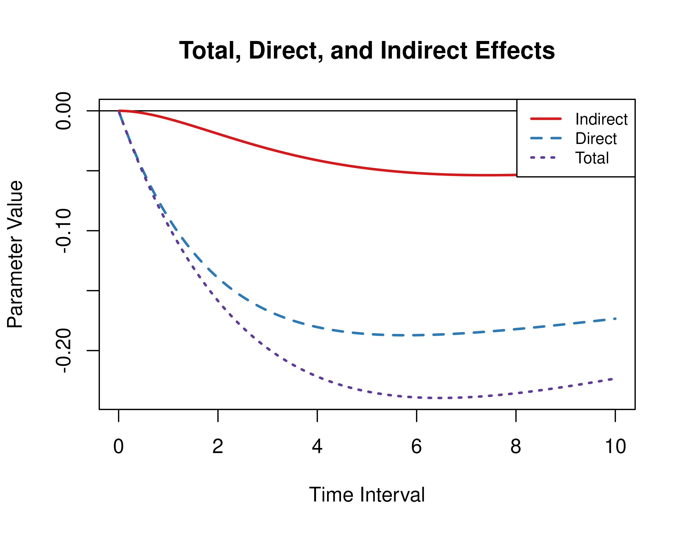

# Illustration 1 - Direct, Indirect, and Total Effects

This vignette accompanies Illustration 1. The goal of the illustration
is to calculate the direct, indirect, and total effects from the
continuous-time vector autoregressive model drift matrix
$`\boldsymbol{\Phi}`$ and process noise covariance matrix
$`\boldsymbol{\Sigma}`$ for a specific time interval or a range of time
intervals. This example features the `Med` and `MedStd` functions from
the `cTMed` package.

``` r

library(cTMed)
```

## Continuous-Time Vector Autoregressive Model Estimates

The object `fit` contains the fitted `dynr` model. Data is generated
using the
[`manCTMed::IllustrationGenData`](https://github.com/jeksterslab/manCTMed/reference/IllustrationGenData.md)
function. The model was fitted using the
[`manCTMed::IllustrationFitDynr`](https://github.com/jeksterslab/manCTMed/reference/IllustrationFitDynr.md).

``` r

summary(fit)
#> Coefficients:
#>             Estimate Std. Error t value   ci.lower   ci.upper Pr(>|t|)    
#> phi_11    -0.1157754  0.0174197  -6.646 -0.1499173 -0.0816334   <2e-16 ***
#> phi_12     0.0203747  0.0550571   0.370 -0.0875352  0.1282846   0.3557    
#> phi_13    -0.0070992  0.0535302  -0.133 -0.1120165  0.0978181   0.4472    
#> phi_21    -0.1226909  0.0187426  -6.546 -0.1594258 -0.0859560   <2e-16 ***
#> phi_22    -0.8819998  0.0653717 -13.492 -1.0101259 -0.7538737   <2e-16 ***
#> phi_23     0.4737224  0.0594135   7.973  0.3572740  0.5901708   <2e-16 ***
#> phi_31    -0.0877980  0.0178492  -4.919 -0.1227817 -0.0528143   <2e-16 ***
#> phi_32     0.0595814  0.0586861   1.015 -0.0554414  0.1746041   0.1550    
#> phi_33    -0.6636176  0.0616495 -10.764 -0.7844485 -0.5427867   <2e-16 ***
#> sigma_11   0.0954899  0.0049239  19.393  0.0858393  0.1051405   <2e-16 ***
#> sigma_12   0.0009624  0.0040987   0.235 -0.0070710  0.0089957   0.4072    
#> sigma_13   0.0070297  0.0040069   1.754 -0.0008237  0.0148830   0.0397 *  
#> sigma_22   0.1027182  0.0078961  13.009  0.0872422  0.1181942   <2e-16 ***
#> sigma_23   0.0009240  0.0049248   0.188 -0.0087285  0.0105764   0.4256    
#> sigma_33   0.0991956  0.0074695  13.280  0.0845558  0.1138355   <2e-16 ***
#> theta_11   0.1016133  0.0014901  68.194  0.0986928  0.1045338   <2e-16 ***
#> theta_22   0.0996380  0.0015668  63.592  0.0965671  0.1027089   <2e-16 ***
#> theta_33   0.0992561  0.0015460  64.202  0.0962260  0.1022862   <2e-16 ***
#> mu0_1     -0.1217526  0.0521444  -2.335 -0.2239538 -0.0195514   0.0098 ** 
#> mu0_2      0.0160785  0.0279075   0.576 -0.0386192  0.0707762   0.2823    
#> mu0_3      0.0204163  0.0288928   0.707 -0.0362125  0.0770451   0.2399    
#> sigma0_11  0.3346315  0.0446548   7.494  0.2471097  0.4221533   <2e-16 ***
#> sigma0_12 -0.0644525  0.0177503  -3.631 -0.0992424 -0.0296626   0.0001 ***
#> sigma0_13 -0.0519690  0.0179974  -2.888 -0.0872433 -0.0166946   0.0019 ** 
#> sigma0_22  0.0691741  0.0127707   5.417  0.0441439  0.0942043   <2e-16 ***
#> sigma0_23  0.0364469  0.0098132   3.714  0.0172134  0.0556805   0.0001 ***
#> sigma0_33  0.0792446  0.0137057   5.782  0.0523819  0.1061072   <2e-16 ***
#> ---
#> Signif. codes:  0 '***' 0.001 '**' 0.01 '*' 0.05 '.' 0.1 ' ' 1
#> 
#> -2 log-likelihood value at convergence = 32662.46
#> AIC = 32716.46
#> BIC = 32919.11
```

## Extract Elements of the Drift Matrix and the Process Noise Covariance Matrix

We extract the elements of the drift matrix and the process noise
covariance matrix from the `fit` object.

``` r

# drift matrix
phi <- matrix(
  data = coef(fit)[
    c(
      "phi_11",
      "phi_21",
      "phi_31",
      "phi_12",
      "phi_22",
      "phi_32",
      "phi_13",
      "phi_23",
      "phi_33"
    )
  ],
  nrow = 3
)
# column names and row names are needed to define the indirect effects
colnames(phi) <- rownames(phi) <- c(
  "conflict",
  "knowledge",
  "competence"
)
```

``` r

# process noise covariance matrix
sigma <- matrix(
  data = coef(fit)[
    c(
      "sigma_11",
      "sigma_12",
      "sigma_13",
      "sigma_12",
      "sigma_22",
      "sigma_23",
      "sigma_13",
      "sigma_23",
      "sigma_33"
    )
  ],
  nrow = 3
)
```

## Direct, Indirect, and Total Effects of a Time Interval of Three

Using the `Med` function from the `cTMed` package, the direct, indirect,
and total effects for a time interval of three are given below.

``` r

Med(
  phi = phi,
  from = "conflict",
  to = "competence",
  med = "knowledge",
  delta_t = 3
)
#> 
#> Total, Direct, and Indirect Effects
#> 
#>      interval   total  direct indirect
#> [1,]        3 -0.1004 -0.0914  -0.0089
```

## Direct, Indirect, and Total Effects of a Time Interval of Zero to Ten

Using the `Med` function from the `cTMed` package, the direct, indirect,
and total effects for a range of time interval values from 0 to 10 are
plotted below.

``` r

med <- Med(
  phi = phi,
  from = "conflict",
  to = "competence",
  med = "knowledge",
  delta_t = seq(from = 0, to = 10, length.out = 1000)
)
plot(med, legend_pos = "bottomright")
```



## Standardized Direct, Indirect, and Total Effects of a Time Interval of Three

Using the `MedStd` function from the `cTMed` package, the standardized
direct, indirect, and total effects for a time interval of three are
given below.

``` r

MedStd(
  phi = phi,
  sigma = sigma,
  from = "conflict",
  to = "competence",
  med = "knowledge",
  delta_t = 3
)
#> 
#> Total, Direct, and Indirect Effects
#> 
#>      interval   total  direct indirect
#> [1,]        3 -0.2206 -0.2009  -0.0196
```

## Standardized Direct, Indirect, and Total Effects of a Time Interval of Zero to Ten

Using the `Med` function from the `cTMed` package, the standardized
direct, indirect, and total effects for a range of time interval values
from 0 to 10 are plotted below.

``` r

med_std <- MedStd(
  phi = phi,
  sigma = sigma,
  from = "conflict",
  to = "competence",
  med = "knowledge",
  delta_t = seq(from = 0, to = 10, length.out = 1000)
)
plot(med_std, legend_pos = "bottomright")
```


