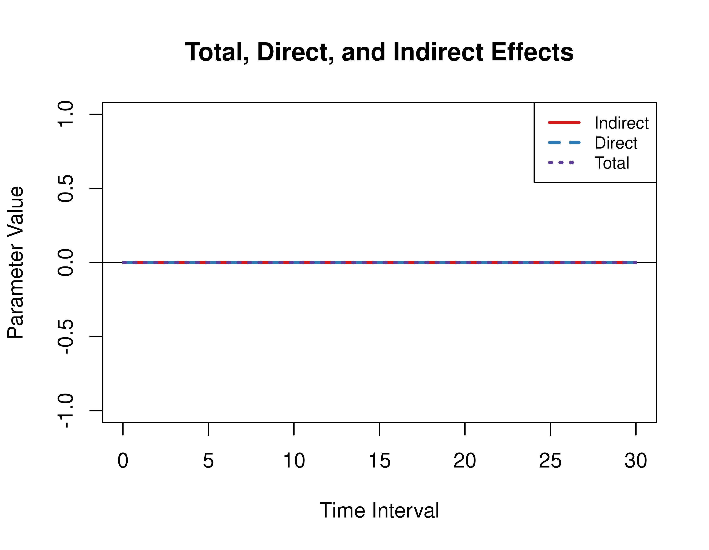
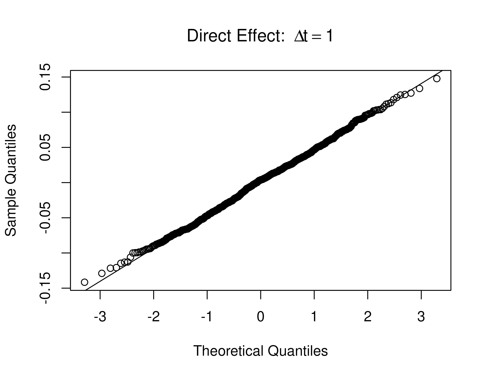
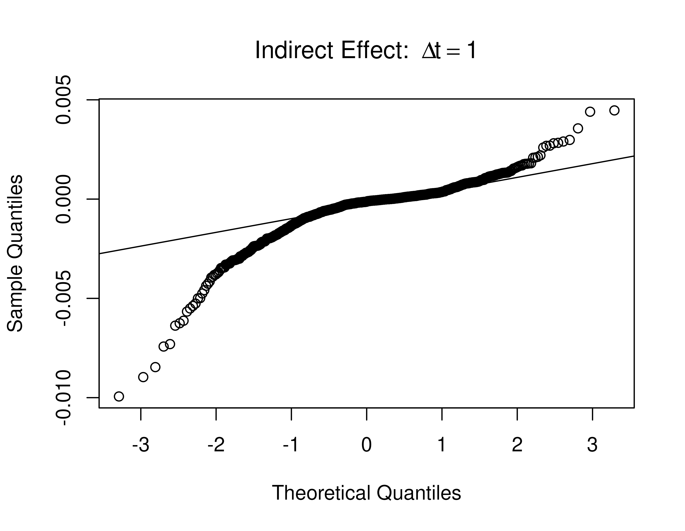
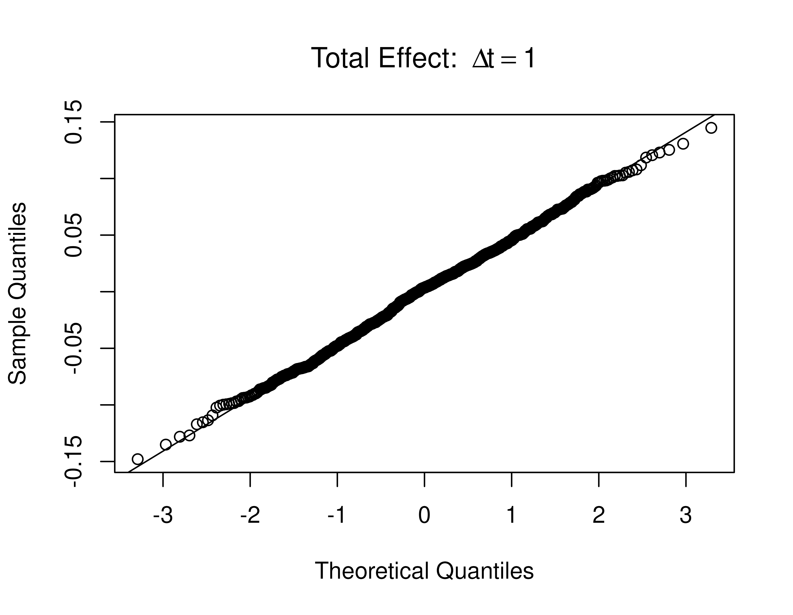
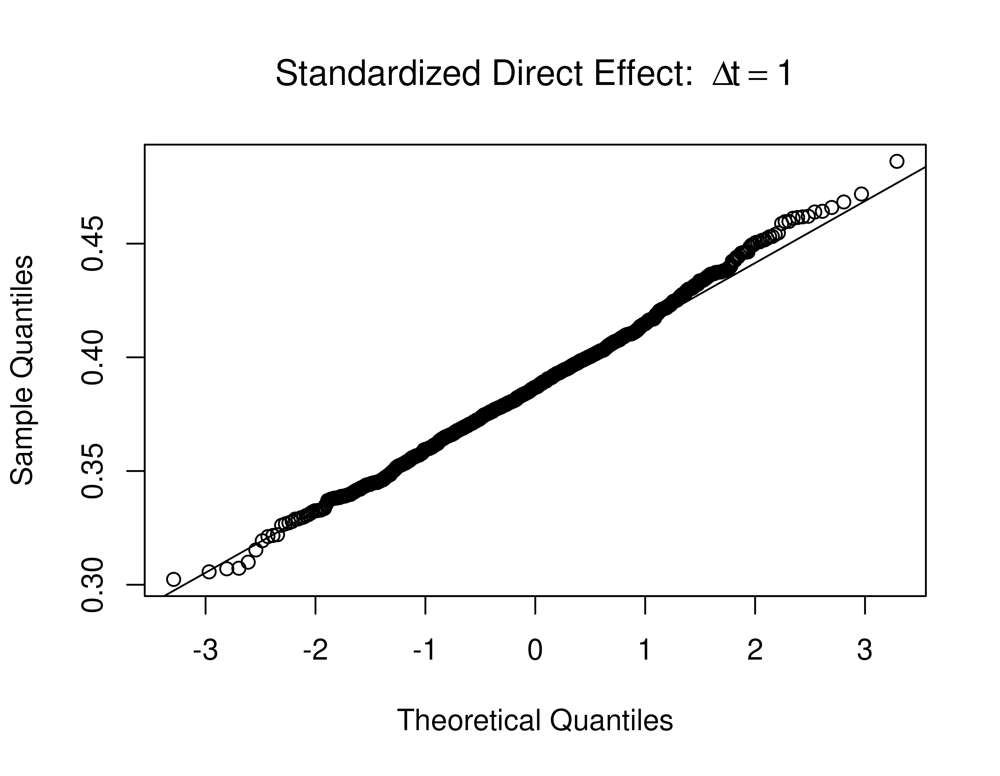
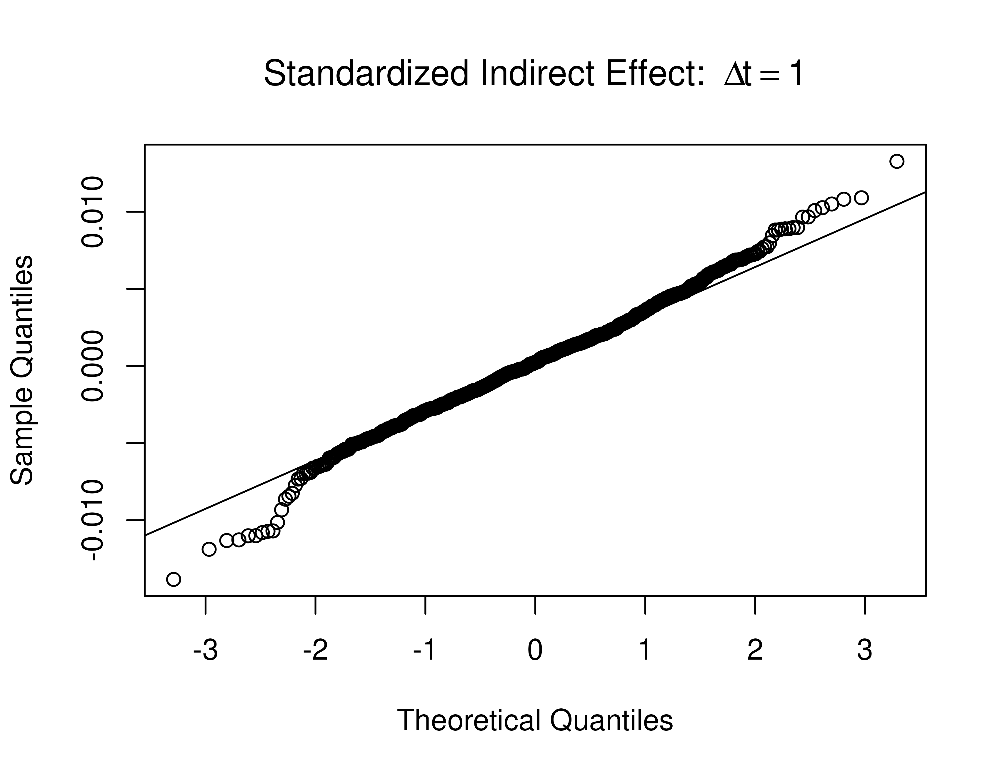
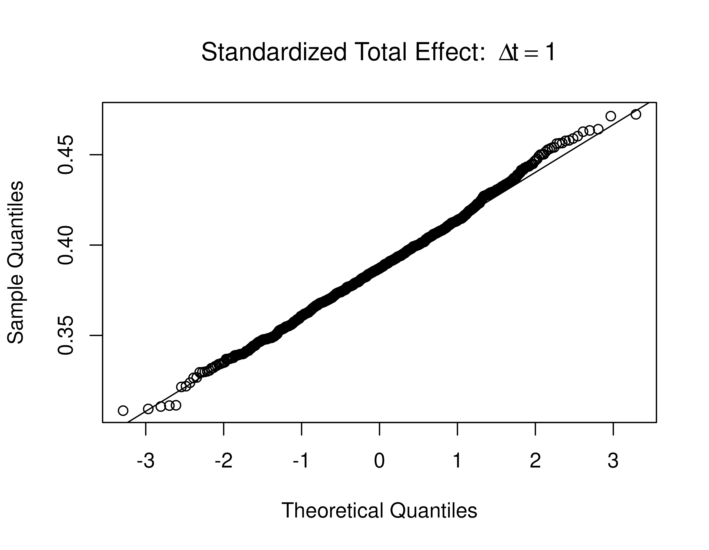

# Sampling Distribution of Direct, Indirect, and Total Effects

``` r

library(manCTMed)
```

## Population Total, Direct, and Indirect Effects

Total, direct, and indirect effects for the drift matrix

``` math
\begin{equation}
    \left(
    \begin{array}{ccc}
         -0.357 & 0 & 0 \\
         0.771 & -0.511 & 0 \\
         -0.450 & 0.729 & -0.693 \\
    \end{array}
    \right)
\end{equation}
```

Presented below are the effects for the
$`\eta_{Y} \to \eta_{M} \to \eta_{X}`$ model.

``` r

FigPlotEffects(dynamics = 0, xmy = FALSE)
#> 
#> phi:
#>        x      m      y
#> x -0.357  0.000  0.000
#> m  0.771 -0.511  0.000
#> y -0.450  0.729 -0.693
```



Standardized total, direct, and indirect effects for the drift matrix
``` math
\begin{equation}
    \left(
    \begin{array}{ccc}
         -0.357 & 0 & 0 \\
         0.771 & -0.511 & 0 \\
         -0.450 & 0.729 & -0.693 \\
    \end{array}
    \right)
\end{equation}
```
and process noise covariance matrix
``` math
\begin{equation}
    \left(
    \begin{array}{ccc}
         0.24455556 & 0.02201587 & -0.05004762 \\
         0.02201587 & 0.07067800 & 0.01539456 \\
         -0.05004762 & 0.01539456 & 0.07553061 \\
    \end{array}
    \right)
\end{equation}
```

Presented below are the standardized effects for the
$`\eta_{Y} \to \eta_{M} \to \eta_{X}`$ model.

``` r

FigPlotEffects(dynamics = 0, std = TRUE, xmy = FALSE)
#> 
#> phi:
#>        x      m      y
#> x -0.357  0.000  0.000
#> m  0.771 -0.511  0.000
#> y -0.450  0.729 -0.693
#> 
#> sigma:
#>             [,1]       [,2]        [,3]
#> [1,]  0.24455556 0.02201587 -0.05004762
#> [2,]  0.02201587 0.07067800  0.01539456
#> [3,] -0.05004762 0.01539456  0.07553061
```


## Visualizing Normality of the Direct, Indirect, and Total Effects

The sampling distribution of the direct, indirect, and total effects
were generated using 1000 samples.







## Visualizing Normality of the Standardized Direct, Indirect, and Total Effects

The sampling distribution of the standardized direct, indirect, and
total effects were generated using 1000 samples.






