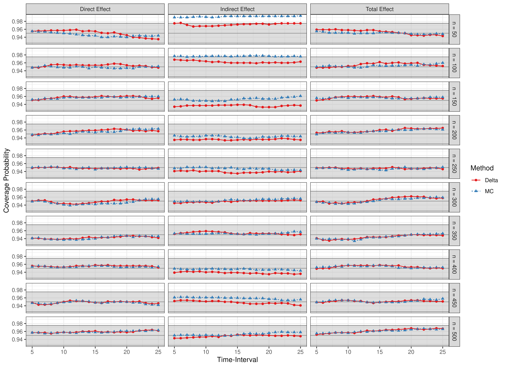
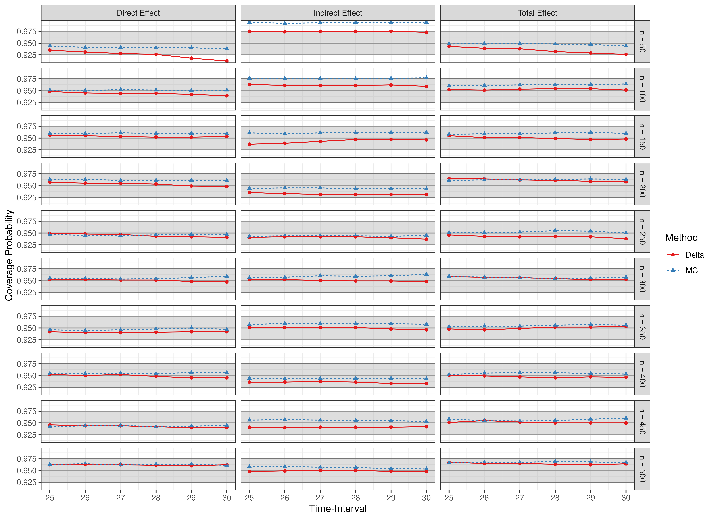
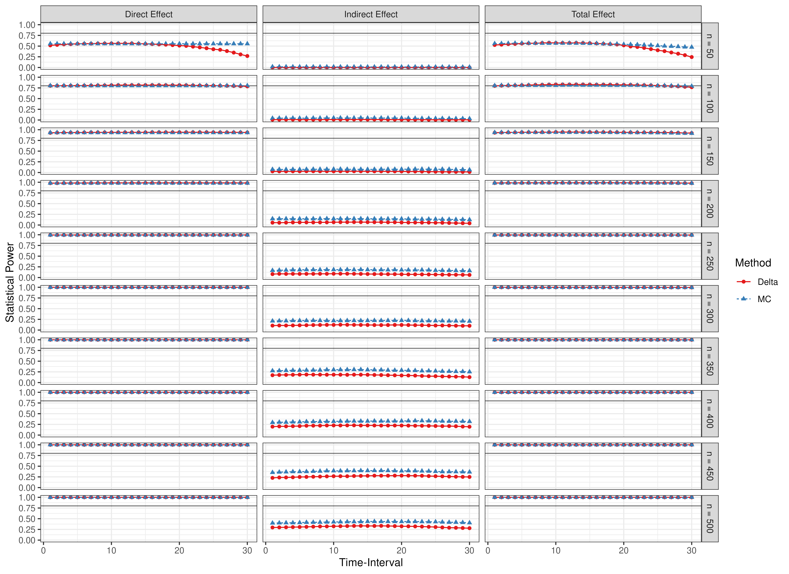
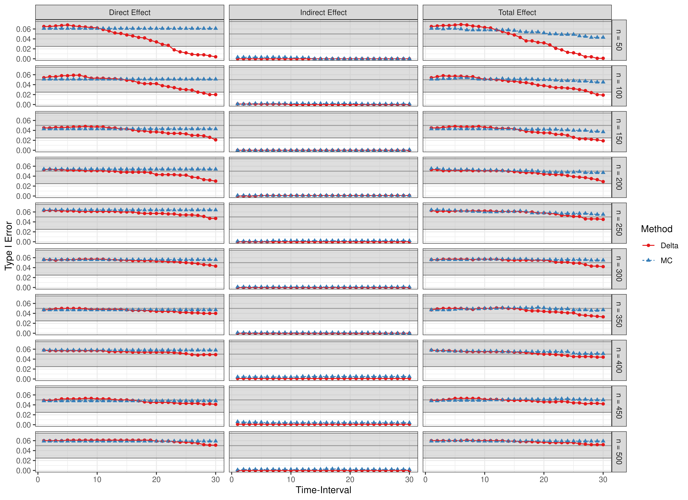
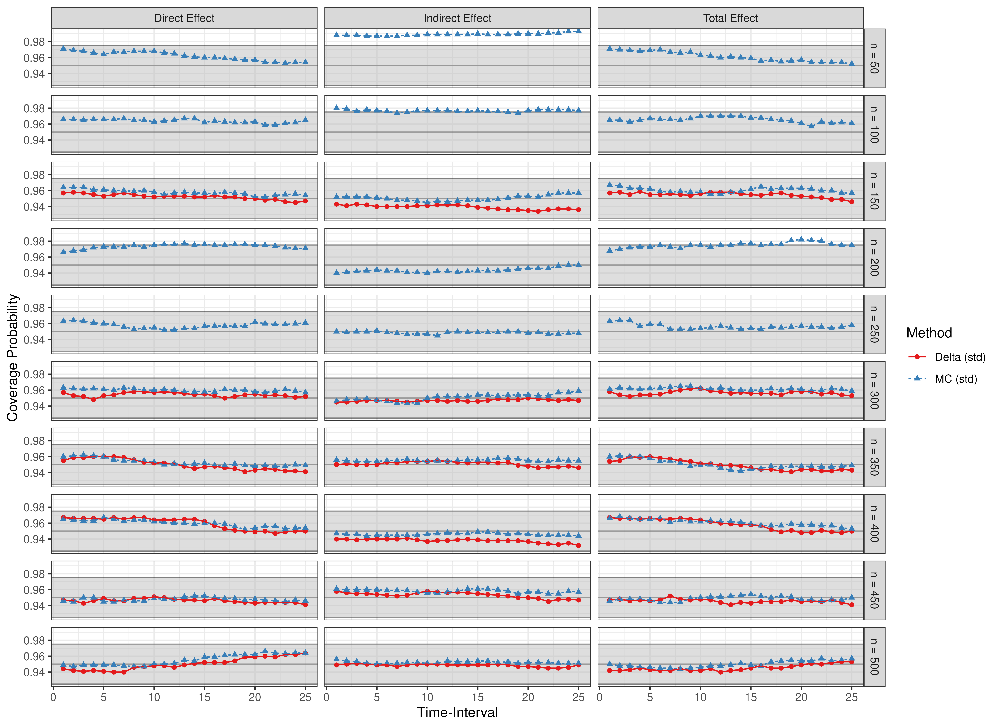
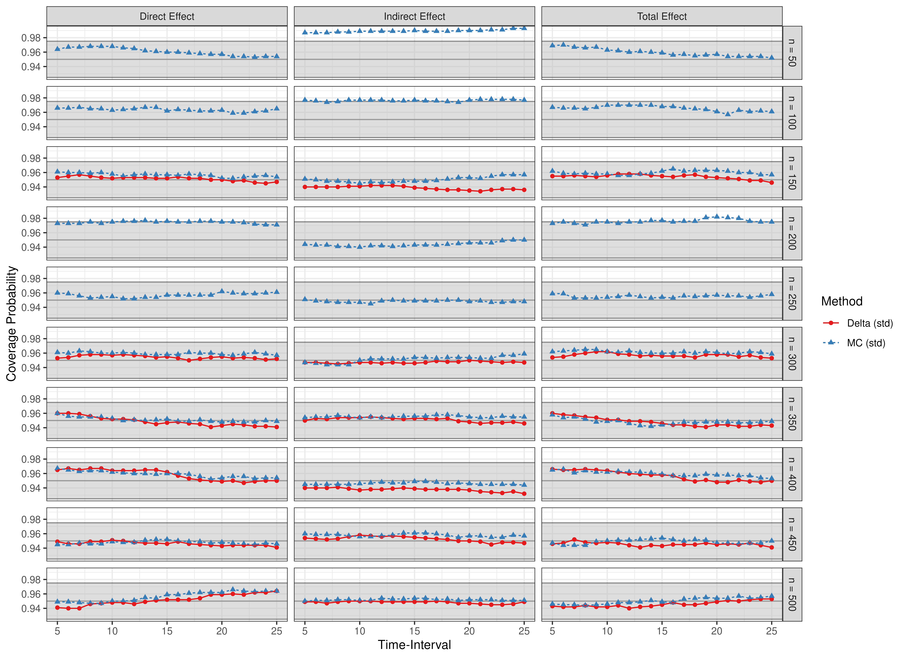
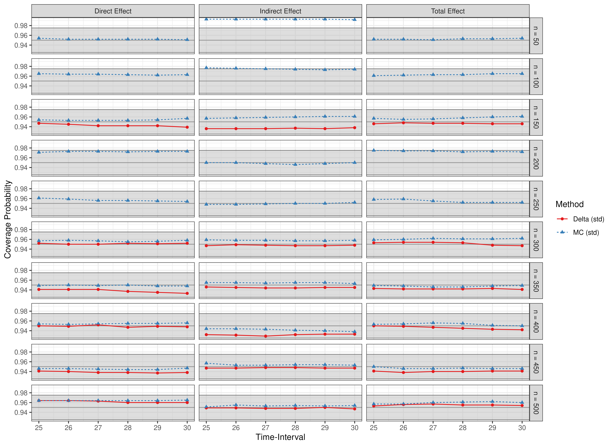
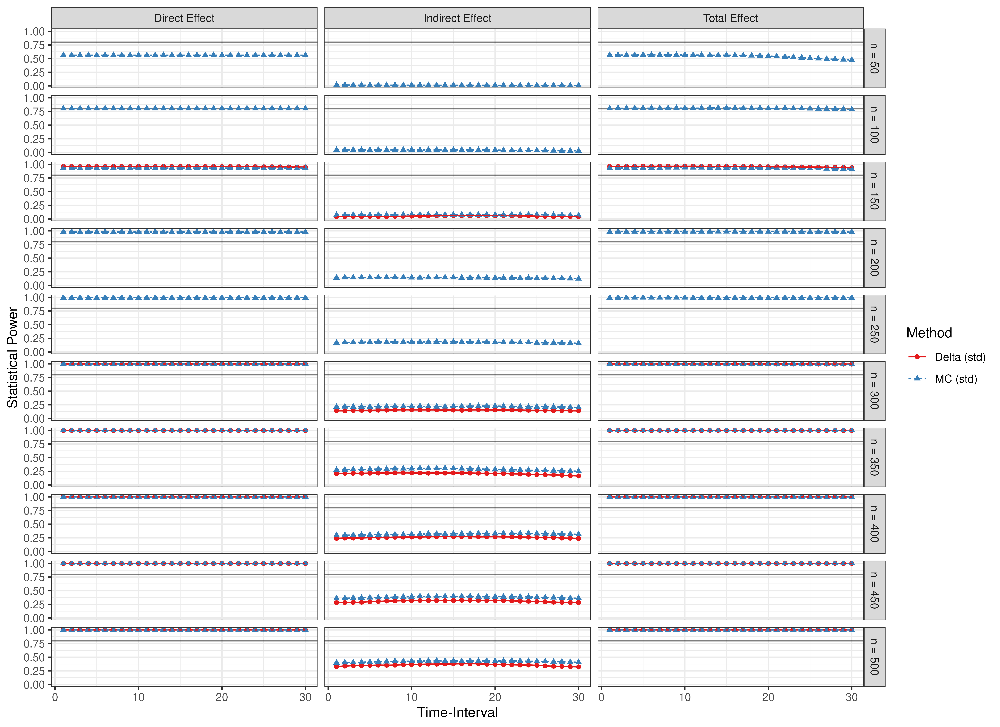
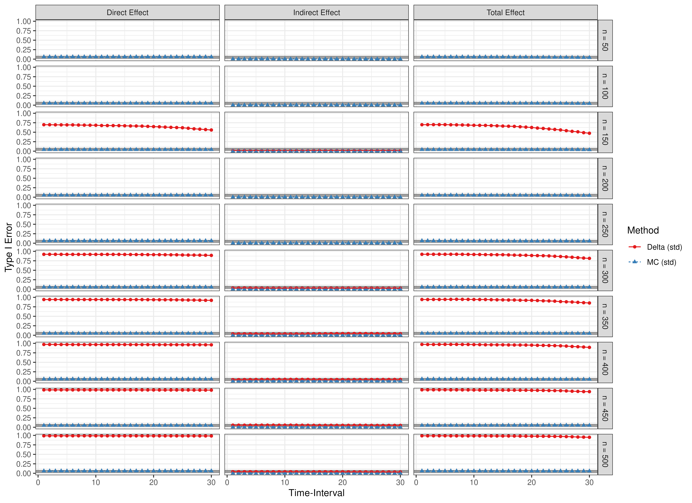

# Scatter Plots - Weak Coupling

``` r

library(manCTMed)
```

## Population Total, Direct, and Indirect Effects

Total, direct, and indirect effects for the drift matrix

``` math
\begin{equation}
    \left(
    \begin{array}{ccc}
         −0.050 & 0 & 0 \\
         −0.020 & −0.050 & 0 \\
         0.030 & −0.010 & −0.050 \\
    \end{array}
    \right)
\end{equation}
```

``` r

FigPlotEffects(dynamics = -1)
#> 
#> phi:
#>       x     m     y
#> x -0.05  0.00  0.00
#> m -0.02 -0.05  0.00
#> y  0.03 -0.01 -0.05
```


Standardized total, direct, and indirect effects for the drift matrix
``` math
\begin{equation}
    \left(
    \begin{array}{ccc}
         −0.050 & 0 & 0 \\
         −0.020 & −0.050 & 0 \\
         0.030 & −0.010 & −0.050 \\
    \end{array}
    \right)
\end{equation}
```
and process noise covariance matrix
``` math
\begin{equation}
    \left(
    \begin{array}{ccc}
         0.0343 & 0.0398 & -0.0035 \\
         0.0398 & 0.0698 & 0.0219 \\
         -0.0035 & 0.0219 & 0.0330 \\
    \end{array}
    \right)
\end{equation}
```

``` r

FigPlotEffects(dynamics = -1, std = TRUE)
#> 
#> phi:
#>       x     m     y
#> x -0.05  0.00  0.00
#> m -0.02 -0.05  0.00
#> y  0.03 -0.01 -0.05
#> 
#> sigma:
#>             [,1]       [,2]        [,3]
#> [1,]  0.24455556 0.02201587 -0.05004762
#> [2,]  0.02201587 0.07067800  0.01539456
#> [3,] -0.05004762 0.01539456  0.07553061
```


## Evaluation of Confidence Intervals

Presented below are scatter plots of coverage probabilities and power
for the $`\eta_X \to \eta_M \ to \eta_Y`$ model and type I error rates
for the $`\eta_Y \to \eta_M \to \eta_X`$ model.

``` r

data(results, package = "manCTMed")
```

### Coverage Probabilities

#### Time Intervals 1 to 25


#### Time Intervals 1 to 4


#### Time Intervals 5 to 25



#### Time Intervals 25 to 30



### Statistical Power



### Type I Error Rate



### Coverage Probabilities (Standardized)

#### Time Intervals 1 to 25



#### Time Intervals 1 to 4


#### Time Intervals 5 to 25



#### Time Intervals 25 to 30



### Statistical Power (Standardized)



### Type I Error Rate (Standardized)


