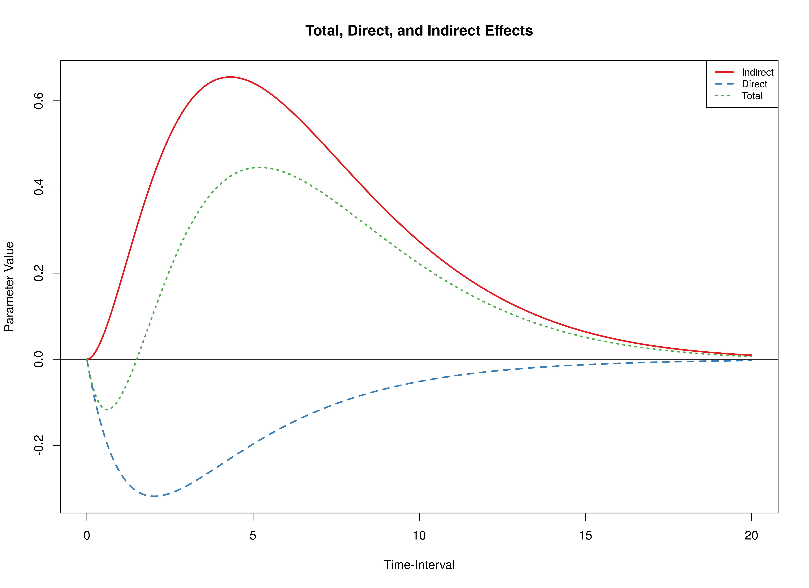
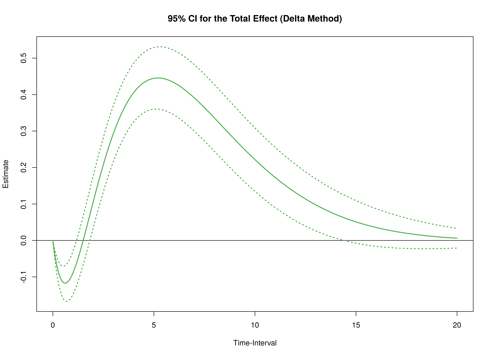
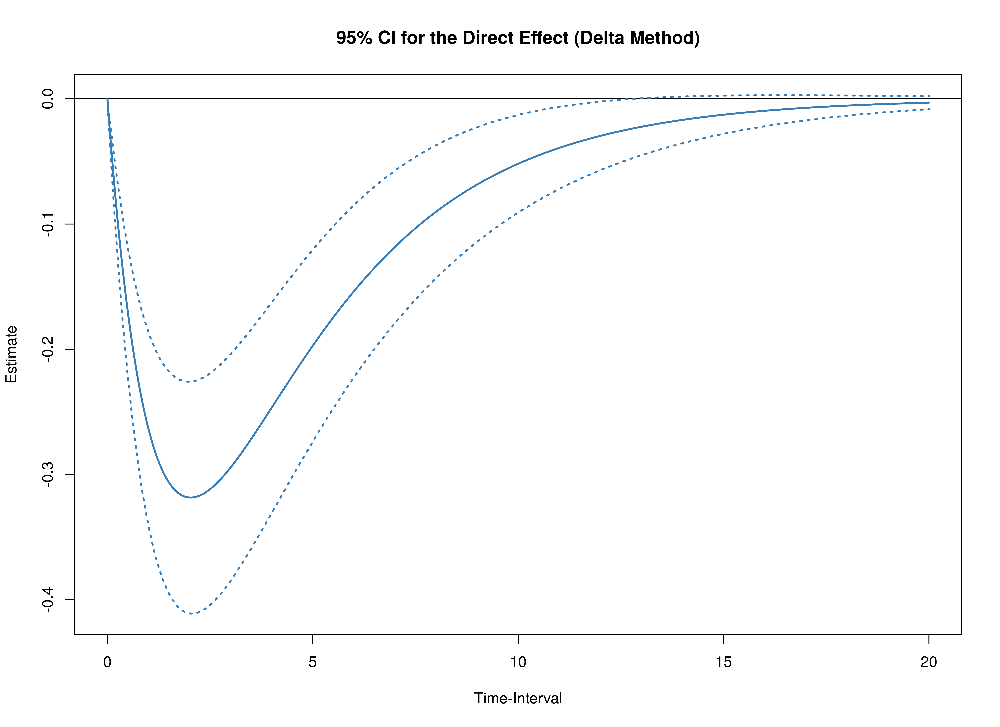
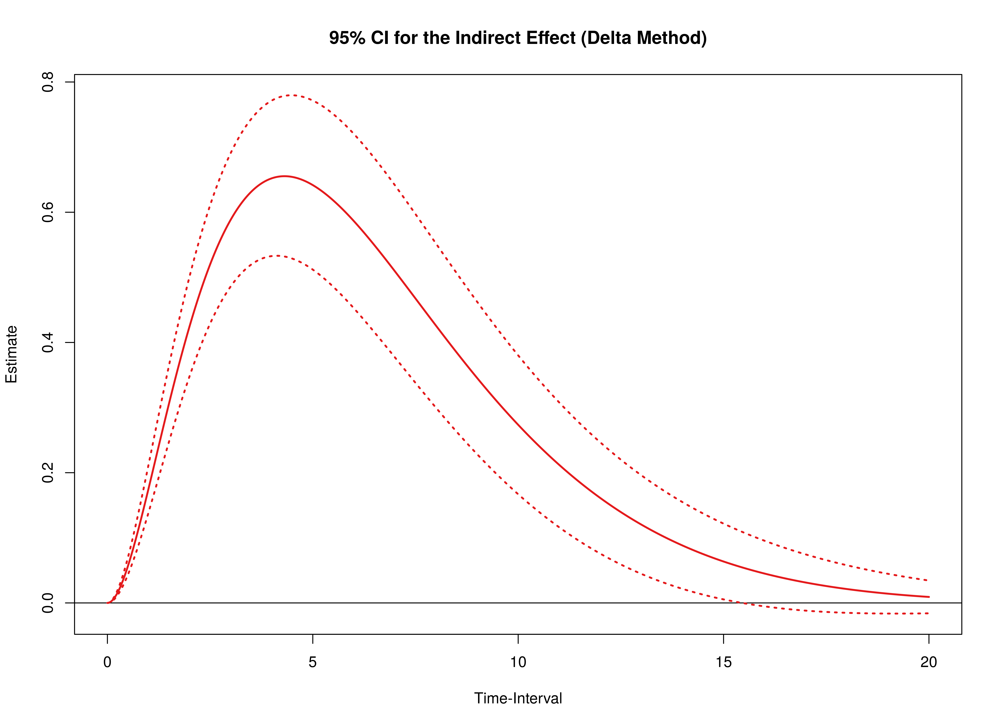

```r
library(manCTMed)
library(cTMed)
```

The drift matrix and the corresponding sampling variance-covariance matrix
of the fitted OU model is available in the data object `deboeck2015phi`.
See this [link](ou.html) for more details on how the model was fitted.


```r
data("deboeck2015phi", package = "manCTMed")
```


## Using Results from the dynr Package


```r
phi <- deboeck2015phi$dynr$phi
vcov_phi_vec <- deboeck2015phi$dynr$vcov
phi
#>            x           m           y
#> x -0.3088312  0.00420865 -0.02871960
#> m  0.7249138 -0.48403875  0.05098498
#> y -0.4457214  0.81299042 -0.76341607
vcov_phi_vec
#>               phi_11        phi_21        phi_31        phi_12        phi_22
#> phi_11  0.0024442345 -0.0013017934  0.0009445281 -0.0013550539  0.0007272379
#> phi_21 -0.0013017934  0.0040392244 -0.0023513958  0.0008019652 -0.0023088592
#> phi_31  0.0009445281 -0.0023513958  0.0051607554 -0.0006242932  0.0014966782
#> phi_12 -0.0013550539  0.0008019652 -0.0006242932  0.0018691182 -0.0010165455
#> phi_22  0.0007272379 -0.0023088592  0.0014966782 -0.0010165455  0.0031216042
#> phi_32 -0.0005332031  0.0013620562 -0.0030457053  0.0007491447 -0.0018573820
#> phi_13  0.0006011448 -0.0004079467  0.0003449904 -0.0011315787  0.0006720194
#> phi_23 -0.0003303167  0.0010716729 -0.0007928437  0.0006097282 -0.0019289915
#> phi_33  0.0002476040 -0.0006500441  0.0014776961 -0.0004481269  0.0011397004
#>               phi_32        phi_13        phi_23        phi_33
#> phi_11 -0.0005332031  0.0006011448 -0.0003303167  0.0002476040
#> phi_21  0.0013620562 -0.0004079467  0.0010716729 -0.0006500441
#> phi_31 -0.0030457053  0.0003449904 -0.0007928437  0.0014776961
#> phi_12  0.0007491447 -0.0011315787  0.0006097282 -0.0004481269
#> phi_22 -0.0018573820  0.0006720194 -0.0019289915  0.0011397004
#> phi_32  0.0040308373 -0.0005239966  0.0012520189 -0.0025418926
#> phi_13 -0.0005239966  0.0017050998 -0.0009065543  0.0006567237
#> phi_23  0.0012520189 -0.0009065543  0.0028102383 -0.0016279725
#> phi_33 -0.0025418926  0.0006567237 -0.0016279725  0.0035739591
```

> **Note:** The input argument `phi` matrix is required to have column and rownames
> as they are used to trace the path of the independent variable column (`from = "x"`)
> to the dependent variable row (`to = "y"`) through mediator variables (`med = "m"`).
> The argument `vcov_phi_vec` does not require names.

### Plot the Effects as a Function of the Time-Interval


```r
med <- Med(
  phi = phi,
  delta_t = seq(from = 0, to = 20, length.out = 1000),
  from = "x",
  to = "y",
  med = "m"
)
plot(med)
```



### Delta Method for Total, Direct, and Indirect Effects for a Range of Time-Intervals

The delta method confidence intervals of the total, direct, and indirect effects
from $X$ to $Y$ through $M$ at a time-intervals of 1 is calculated using the `DeltaMed()` function.


```r
delta <- DeltaMed(
  phi = phi,
  vcov_phi_vec = vcov_phi_vec,
  delta_t = 1,
  from = "x",
  to = "y",
  med = "m"
)
```

The confidence intervals for a range of time-intervals (0 to 20) can also be calculated as follows.
If the length of `delta_t` is long,
using multiple cores by specifying the number of cores to use `ncores` can make the calculations run faster.
The `summary` function can be used to summarize the results as a data frame.
The `plot` function can be used to summarize the results graphically.


```r
delta <- DeltaMed(
  phi = phi,
  vcov_phi_vec = vcov_phi_vec,
  delta_t = seq(from = 0, to = 20, length.out = 1000),
  from = "x",
  to = "y",
  med = "m",
  ncores = parallel::detectCores()
)
head(summary(delta))
#>     effect      interval            est           se         z            p
#> 1    total 2.225074e-308 -9.917631e-309 0.000000e+00      -Inf 0.000000e+00
#> 2   direct 2.225074e-308 -9.917631e-309 0.000000e+00      -Inf 0.000000e+00
#> 3 indirect 2.225074e-308   0.000000e+00 0.000000e+00       NaN          NaN
#> 4    total  2.002002e-02  -8.711266e-03 1.408647e-03 -6.184139 6.244252e-10
#> 5   direct  2.002002e-02  -8.828126e-03 1.419897e-03 -6.217441 5.053270e-10
#> 6 indirect  2.002002e-02   1.168597e-04 1.576828e-05  7.411061 1.252932e-13
#>             2.5%          97.5%
#> 1 -9.917631e-309 -9.917631e-309
#> 2 -9.917631e-309 -9.917631e-309
#> 3   0.000000e+00   0.000000e+00
#> 4  -1.147216e-02  -5.950369e-03
#> 5  -1.161107e-02  -6.045179e-03
#> 6   8.595442e-05   1.477649e-04
plot(delta)
```




## References


