```r
library(manCTMed)
library(cTMed)
```


```r
data(ryan2021phi, package = "manCTMed")
```

## Effects

### Irritable as Mediator 


```r
med <- Med(
  phi = ryan2021phi$phi,
  from = "s",
  to = "f",
  med = "i",
  delta_t = seq(from = 0, to = 20, length.out = 1000)
)
plot(med)
```

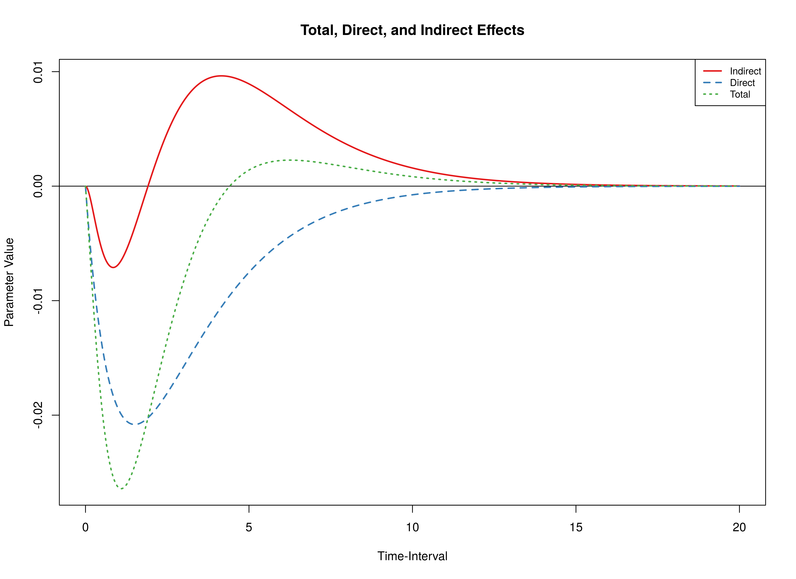

### Restless as Mediator 


```r
med <- Med(
  phi = ryan2021phi$phi,
  from = "s",
  to = "f",
  med = "r",
  delta_t = seq(from = 0, to = 20, length.out = 1000)
)
plot(med)
```

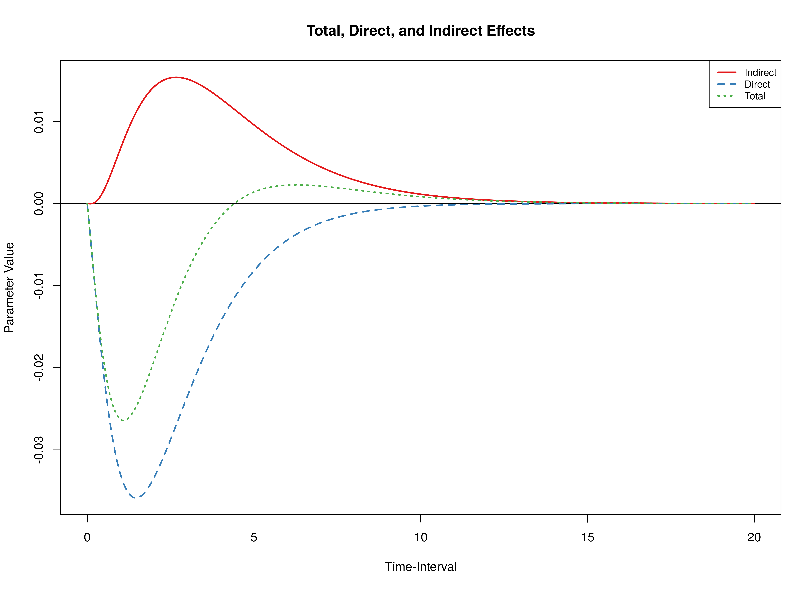

### Irritable and Restless as Mediators


```r
med <- Med(
  phi = ryan2021phi$phi,
  from = "s",
  to = "f",
  med = c("i", "r"),
  delta_t = seq(from = 0, to = 20, length.out = 1000)
)
plot(med)
```

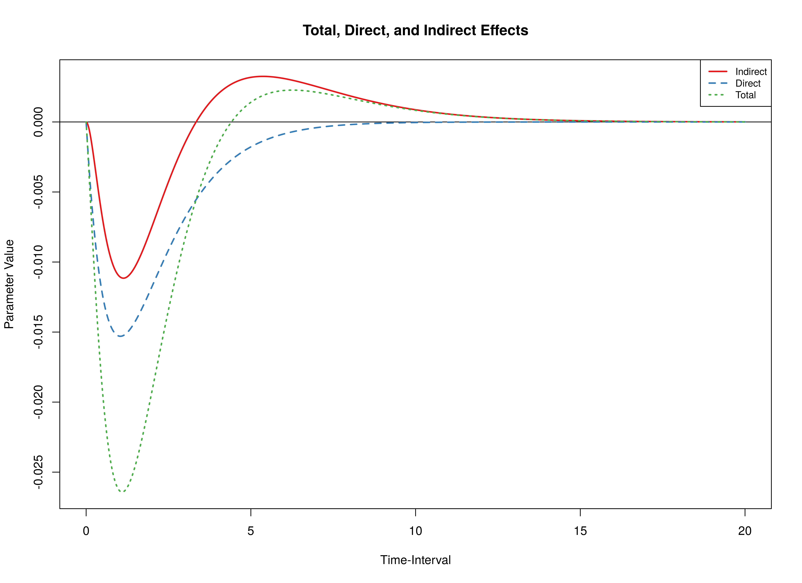

## Confidence Intervals

### Irritable as Mediator 


```r
delta <- DeltaMed(
  phi = ryan2021phi$phi,
  vcov_phi_vec = ryan2021phi$vcov,
  from = "s",
  to = "f",
  med = "i",
  delta_t = seq(from = 0, to = 20, length.out = 1000)
)
plot(delta)
```


```r
mc <- MCMed(
  phi = ryan2021phi$phi,
  vcov_phi_vec = ryan2021phi$vcov,
  from = "s",
  to = "f",
  med = "i",
  delta_t = seq(from = 0, to = 20, length.out = 1000),
  R = 20000L
)
plot(mc)
```


### Restless as Mediator 


```r
delta <- DeltaMed(
  phi = ryan2021phi$phi,
  vcov_phi_vec = ryan2021phi$vcov,
  from = "s",
  to = "f",
  med = "r",
  delta_t = seq(from = 0, to = 20, length.out = 1000)
)
plot(delta)
```

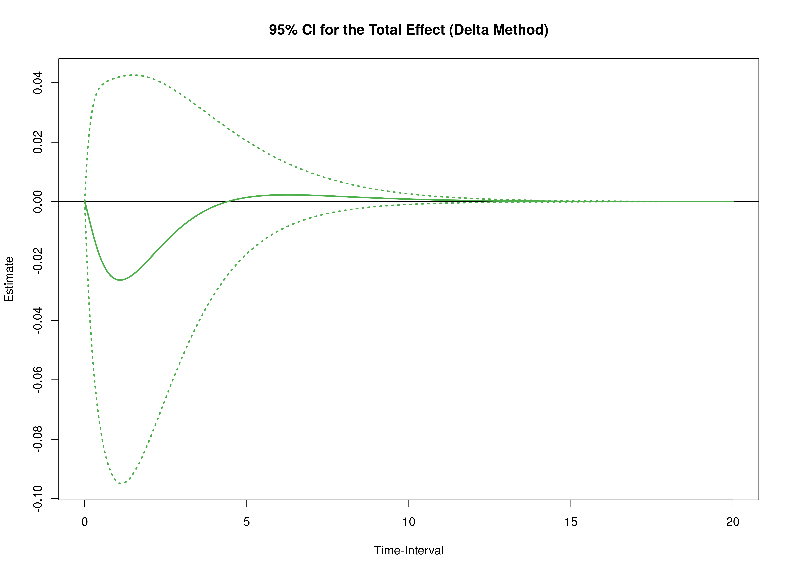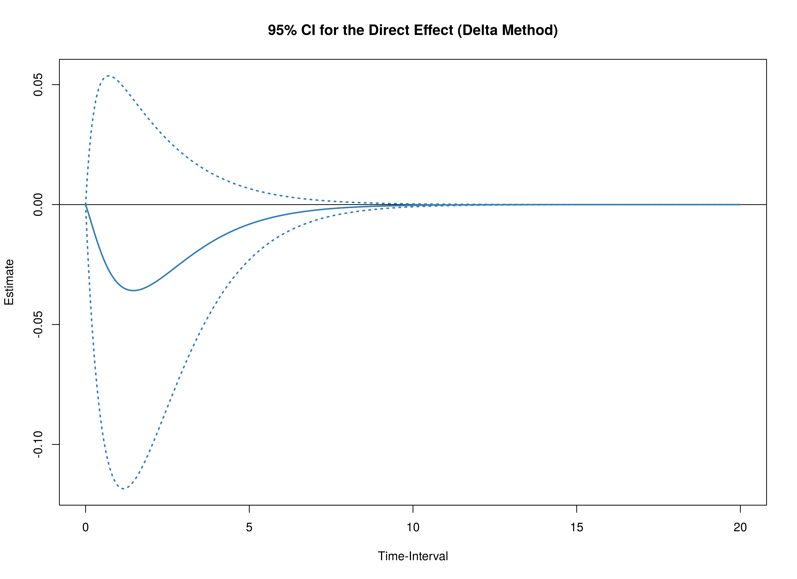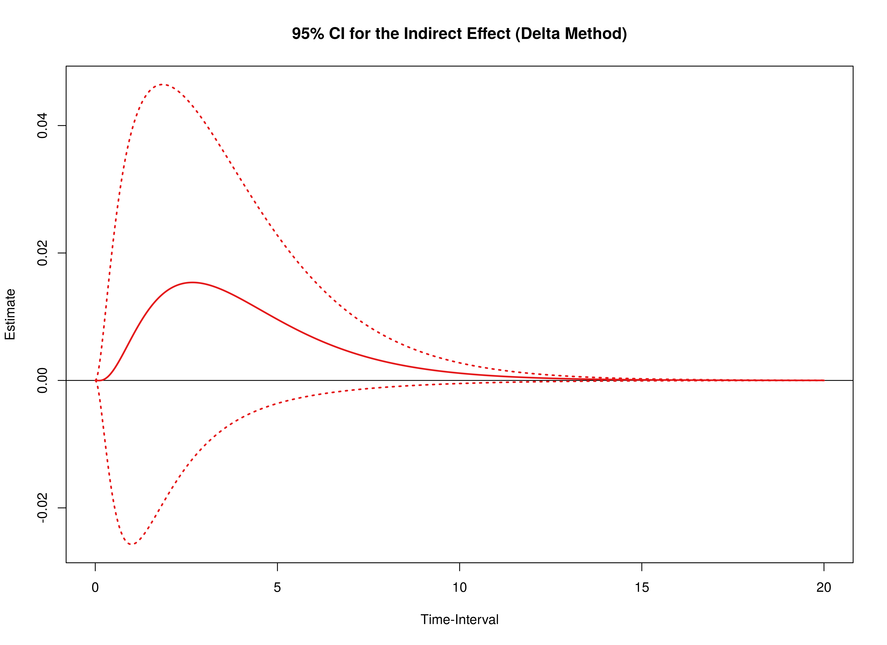


```r
mc <- MCMed(
  phi = ryan2021phi$phi,
  vcov_phi_vec = ryan2021phi$vcov,
  from = "s",
  to = "f",
  med = "r",
  delta_t = seq(from = 0, to = 20, length.out = 1000),
  R = 20000L
)
plot(mc)
```

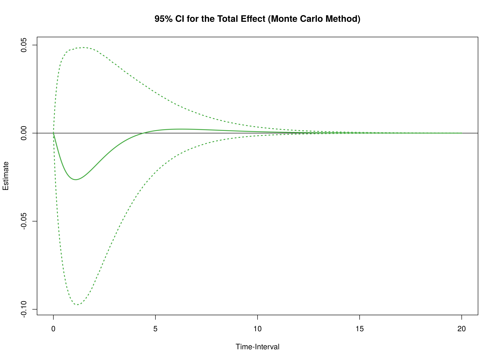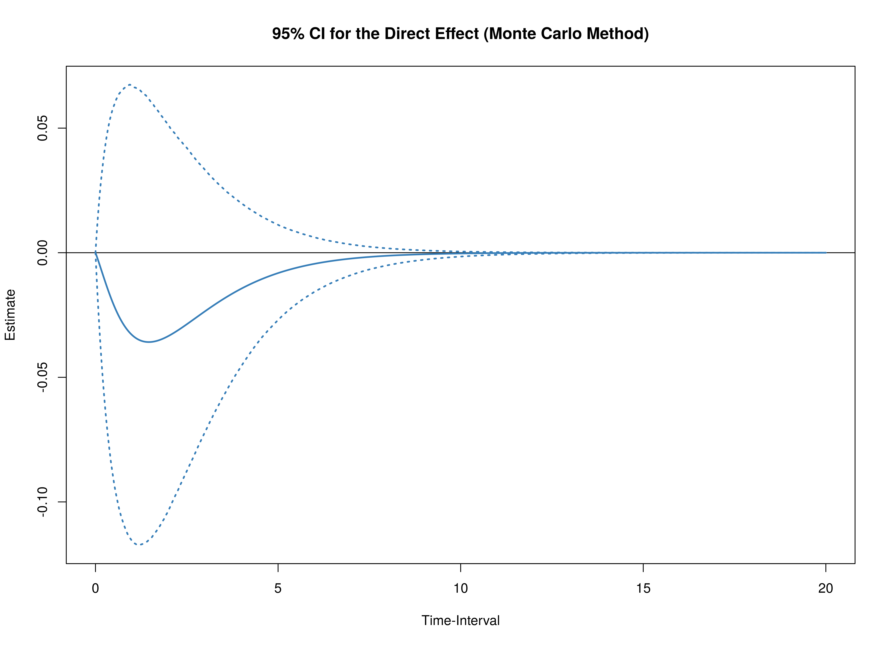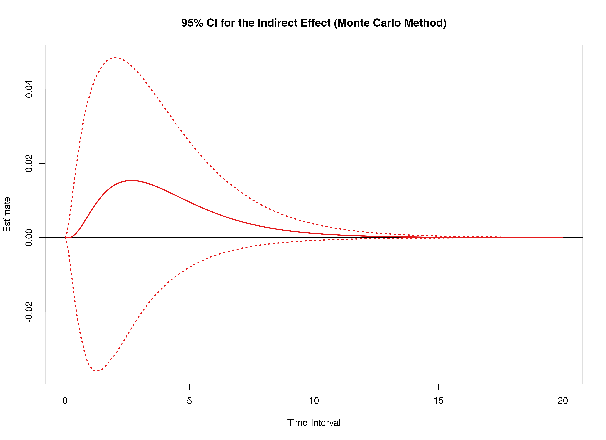

### Irritable and Restless as Mediators


```r
delta <- DeltaMed(
  phi = ryan2021phi$phi,
  vcov_phi_vec = ryan2021phi$vcov,
  from = "s",
  to = "f",
  med = c("i", "r"),
  delta_t = seq(from = 0, to = 20, length.out = 1000)
)
plot(delta)
```


```r
mc <- MCMed(
  phi = ryan2021phi$phi,
  vcov_phi_vec = ryan2021phi$vcov,
  from = "s",
  to = "f",
  med = c("i", "r"),
  delta_t = seq(from = 0, to = 20, length.out = 1000),
  R = 20000L
)
plot(mc)
```

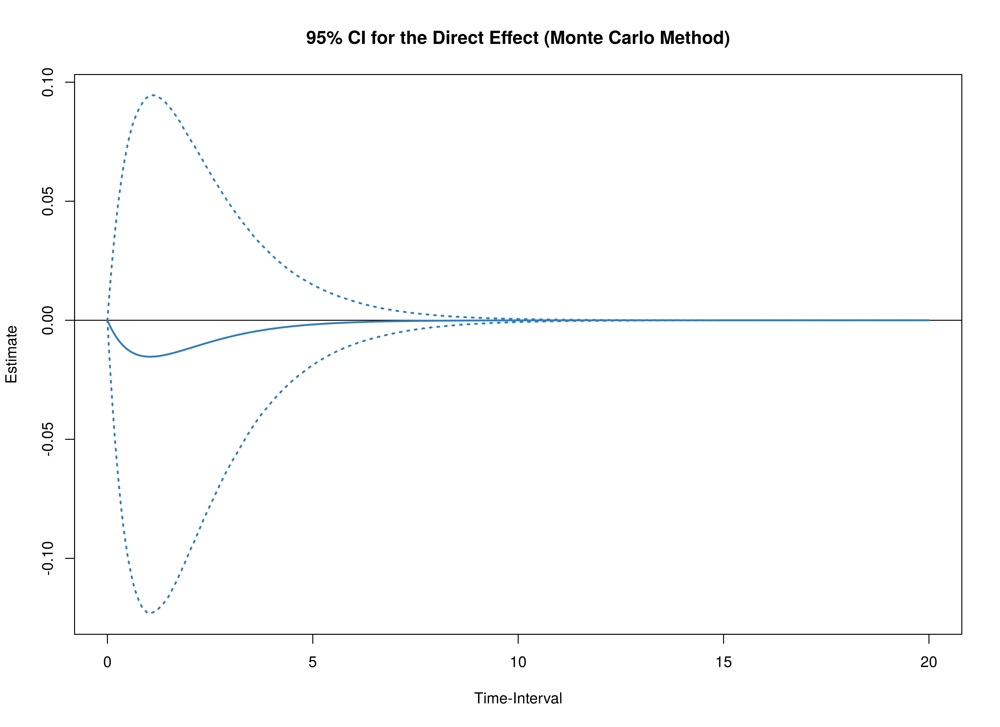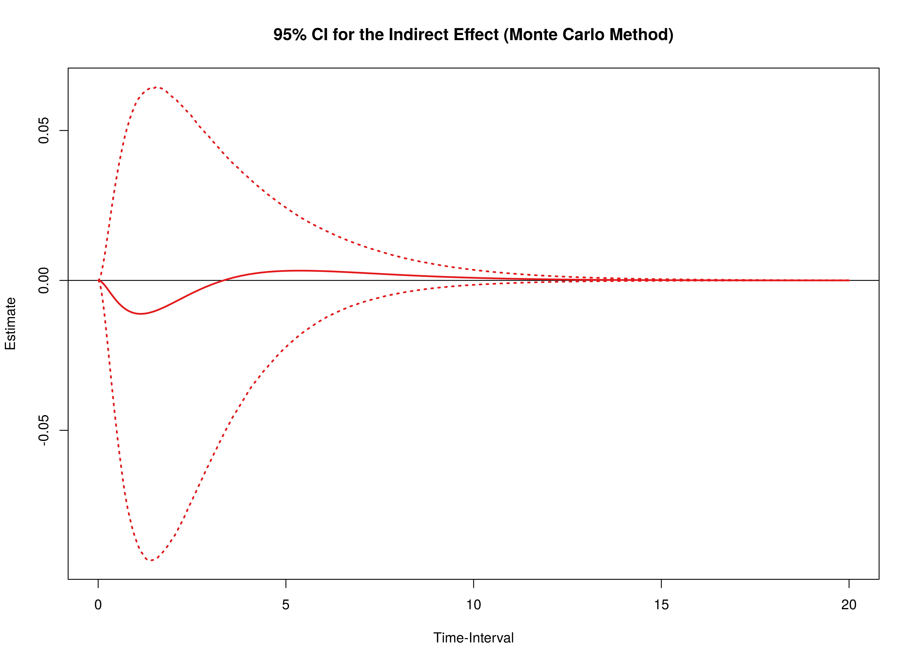

## Code Used Fit the Model 

```r
data(ryan2021, package = "manCTMed")
data <- ryan2021
data <- dynUtils::InsertNA(
  data = data,
  id = "id",
  time = "time",
  observed = c("s", "f", "i", "r"),
  delta_t = min(
    diff(
      sort(data[, "time"])
    )
  ),
  ncores = NULL
)
library(dynr)
dynr_data <- dynr::dynr.data(
  dataframe = data,
  id = "id",
  time = "time",
  observed = c("s", "f", "i", "r")
)
dynr_initial <- dynr::prep.initial(
  values.inistate = c(
    0, # -1.0465,
    0, # -1.2712,
    0, # -1.0601,
    0  # -1.0811
  ),
  params.inistate = c(
    "fixed",
    "fixed",
    "fixed",
    "fixed"
  ),
  values.inicov = diag(4),
  params.inicov = matrix(
    data = c(
      "fixed", "fixed", "fixed", "fixed",
      "fixed", "fixed", "fixed", "fixed",
      "fixed", "fixed", "fixed", "fixed",
      "fixed", "fixed", "fixed", "fixed"
    ),
    nrow = 4
  )
)
dynr_measurement <- dynr::prep.measurement(
  values.load = diag(4),
  params.load = matrix(data = "fixed", nrow = 4, ncol = 4),
  state.names = c("eta_s", "eta_f", "eta_i", "eta_r"),
  obs.names = c("s", "f", "i", "r")
)
dynr_dynamics <- dynr::prep.formulaDynamics(
  formula = list(
    eta_s ~ phi_11 * eta_s + phi_12 * eta_f + phi_13 * eta_i + phi_14 * eta_r,
    eta_f ~ phi_21 * eta_s + phi_22 * eta_f + phi_23 * eta_i + phi_24 * eta_r,
    eta_i ~ phi_31 * eta_s + phi_32 * eta_f + phi_33 * eta_i + phi_34 * eta_r,
    eta_r ~ phi_41 * eta_s + phi_42 * eta_f + phi_43 * eta_i + phi_44 * eta_r
  ),
  startval = c(
    phi_11 = -0.9708,
    phi_12 = 0.0307,
    phi_13 = -0.6346,
    phi_14 = 0.7553,
    phi_21 = -0.0083,
    phi_22 = -0.7805,
    phi_23 = 0.2863,
    phi_24 = -0.0935,
    phi_31 = -0.3071,
    phi_32 = -0.0056,
    phi_33 = -2.1939,
    phi_34 = 1.3135,
    phi_41 = 0.4309,
    phi_42 = -0.1694,
    phi_43 = 0.9606,
    phi_44 = -1.5582
  ),
  isContinuousTime = TRUE
)
dynr_noise <- dynr::prep.noise(
  values.latent = matrix(
    data = c(
      1.2852,
      0.1597,
      0.2767,
      0.0736,
      0.1597,
      1.2337,
      0.0071,
      0.1162,
      0.2767,
      0.0071,
      1.6692,
      0.0757,
      0.0736,
      0.1162,
      0.0757,
      1.1663
    ),
    nrow = 4
  ),
  params.latent = matrix(
    data = c(
      "sigma_11", "sigma_12", "sigma_13", "sigma_14",
      "sigma_12", "sigma_22", "sigma_23", "sigma_24",
      "sigma_13", "sigma_23", "sigma_33", "sigma_34",
      "sigma_14", "sigma_24", "sigma_34", "sigma_44"
    ),
    nrow = 4
  ),
  values.observed = matrix(
    data = 0,
    nrow = 4,
    ncol = 4
  ),
  params.observed = matrix(
    data = c(
      "fixed", "fixed", "fixed", "fixed",
      "fixed", "fixed", "fixed", "fixed",
      "fixed", "fixed", "fixed", "fixed",
      "fixed", "fixed", "fixed", "fixed"
    ),
    nrow = 4
  )
)
model <- dynr::dynr.model(
  data = dynr_data,
  initial = dynr_initial,
  measurement = dynr_measurement,
  dynamics = dynr_dynamics,
  noise = dynr_noise,
  outfile = file.path(tempdir(), "ryan2021.c")
)
model@options$maxeval <- 100000
lb <- ub <- rep(NA, times = length(model$xstart))
names(ub) <- names(lb) <- names(model$xstart)
lb[
  c(
    "phi_11",
    "phi_21",
    "phi_31",
    "phi_41",
    "phi_12",
    "phi_22",
    "phi_32",
    "phi_42",
    "phi_13",
    "phi_23",
    "phi_33",
    "phi_43",
    "phi_14",
    "phi_24",
    "phi_34",
    "phi_44"
  )
] <- -5
ub[
  c(
    "phi_11",
    "phi_21",
    "phi_31",
    "phi_41",
    "phi_12",
    "phi_22",
    "phi_32",
    "phi_42",
    "phi_13",
    "phi_23",
    "phi_33",
    "phi_43",
    "phi_14",
    "phi_24",
    "phi_34",
    "phi_44"
  )
] <- 5
model$lb <- lb
model$ub <- ub
fit <- dynr::dynr.cook(
  model
  # debug_flag = TRUE,
  # verbose = FALSE
)
coef(model) <- coef(fit)
fit <- dynr::dynr.cook(
  model
  # debug_flag = TRUE,
  # verbose = FALSE
)
parnames <- c(
  "phi_11",
  "phi_21",
  "phi_31",
  "phi_41",
  "phi_12",
  "phi_22",
  "phi_32",
  "phi_42",
  "phi_13",
  "phi_23",
  "phi_33",
  "phi_43",
  "phi_14",
  "phi_24",
  "phi_34",
  "phi_44"
)
phi_vec <- coef(fit)[parnames]
phi <- matrix(
  data = phi_vec,
  nrow = 4
)
colnames(phi) <- rownames(phi) <- c("s", "f", "i", "r")
vcov_phi_vec <- vcov(fit)[parnames, parnames]
ryan2021phi <- list(
  phi = phi,
  vcov = vcov_phi_vec
)
```
