```r
library(manCTMed)
library(cTMed)
```

## Estimate of the Drift Matrix


```r
data(ryan2021phi, package = "manCTMed")
ryan2021phi
#> $phi
#>             s           f         i           r
#> s -1.16771101  0.04744771 -1.038479  1.27252784
#> f -0.04027589 -0.78125315  0.217683 -0.01846452
#> i -0.65072311  0.08669968 -2.822523  2.06711984
#> r  0.79889017 -0.26320494  1.401960 -2.08555162
#> 
#> $vcov
#>              phi_11        phi_21       phi_31       phi_41        phi_12
#> phi_11  0.046738029  0.0094480233  0.051763088 -0.031775834 -0.0074731025
#> phi_21  0.009448023  0.0210610829  0.007640554  0.003102624  0.0003668151
#> phi_31  0.051763088  0.0076405544  0.102562306 -0.045636417 -0.0083619487
#> phi_41 -0.031775834  0.0031026241 -0.045636417  0.059958510  0.0037020071
#> phi_12 -0.007473102  0.0003668151 -0.008361949  0.003702007  0.0090470516
#> phi_22 -0.001870407 -0.0047315726 -0.001109413 -0.001040443  0.0014556287
#> phi_32 -0.007564409  0.0026785591 -0.018491754  0.005814229  0.0096594971
#> phi_42  0.004917584 -0.0032159619  0.008892485 -0.011035050 -0.0052483675
#> phi_13  0.079786386  0.0178398745  0.097529147 -0.054975754 -0.0152871499
#> phi_23  0.018168113  0.0382333177  0.013608621  0.004773075 -0.0004034743
#> phi_33  0.083329554  0.0143841453  0.192565024 -0.078623744 -0.0177730426
#> phi_43 -0.049275648  0.0052789709 -0.082414968  0.100365576  0.0079035721
#> phi_14 -0.091187795 -0.0203298629 -0.107509182  0.065908811  0.0139045889
#> phi_24 -0.019919904 -0.0425034146 -0.015183859 -0.005973931 -0.0003179366
#> phi_34 -0.096840824 -0.0170080621 -0.210887692  0.093000139  0.0158822248
#> phi_44  0.057604439 -0.0052274011  0.090439673 -0.116296596 -0.0067147099
#>               phi_22        phi_32       phi_42       phi_13        phi_23
#> phi_11 -0.0018704069 -0.0075644090  0.004917584  0.079786386  0.0181681125
#> phi_21 -0.0047315726  0.0026785591 -0.003215962  0.017839875  0.0382333177
#> phi_31 -0.0011094128 -0.0184917537  0.008892485  0.097529147  0.0136086212
#> phi_41 -0.0010404426  0.0058142285 -0.011035050 -0.054975754  0.0047730750
#> phi_12  0.0014556287  0.0096594971 -0.005248368 -0.015287150 -0.0004034743
#> phi_22  0.0053930807  0.0004529844  0.001548615 -0.003937697 -0.0098547697
#> phi_32  0.0004529844  0.0197767239 -0.007944994 -0.017843971  0.0040085100
#> phi_42  0.0015486149 -0.0079449945  0.010445854  0.010291644 -0.0065076199
#> phi_13 -0.0039376975 -0.0178439707  0.010291644  0.217245001  0.0490415461
#> phi_23 -0.0098547697  0.0040085100 -0.006507620  0.049041546  0.1077624118
#> phi_33 -0.0024909983 -0.0443354952  0.020147934  0.253969408  0.0375213944
#> phi_43 -0.0018797351  0.0144183726 -0.021684114 -0.136392351  0.0168058991
#> phi_14  0.0039076096  0.0151976308 -0.009960687 -0.216174567 -0.0502958410
#> phi_24  0.0093652898 -0.0054584054  0.007096891 -0.048552184 -0.1061677366
#> phi_34  0.0025134351  0.0393397135 -0.019142234 -0.255951508 -0.0395929808
#> phi_44  0.0017230075 -0.0119291234  0.021237917  0.138453889 -0.0140582047
#>              phi_33       phi_43       phi_14        phi_24       phi_34
#> phi_11  0.083329554 -0.049275648 -0.091187795 -0.0199199038 -0.096840824
#> phi_21  0.014384145  0.005278971 -0.020329863 -0.0425034146 -0.017008062
#> phi_31  0.192565024 -0.082414968 -0.107509182 -0.0151838588 -0.210887692
#> phi_41 -0.078623744  0.100365576  0.065908811 -0.0059739308  0.093000139
#> phi_12 -0.017773043  0.007903572  0.013904589 -0.0003179366  0.015882225
#> phi_22 -0.002490998 -0.001879735  0.003907610  0.0093652898  0.002513435
#> phi_32 -0.044335495  0.014418373  0.015197631 -0.0054584054  0.039339713
#> phi_42  0.020147934 -0.021684114 -0.009960687  0.0070968906 -0.019142234
#> phi_13  0.253969408 -0.136392351 -0.216174567 -0.0485521844 -0.255951508
#> phi_23  0.037521394  0.016805899 -0.050295841 -0.1061677366 -0.039592981
#> phi_33  0.581640505 -0.225135122 -0.245763035 -0.0373588931 -0.561070966
#> phi_43 -0.225135122  0.260699845  0.140280403 -0.0167098673  0.231588814
#> phi_14 -0.245763035  0.140280403  0.230125516  0.0521958035  0.264574771
#> phi_24 -0.037358893 -0.016709867  0.052195804  0.1106667689  0.041513751
#> phi_34 -0.561070966  0.231588814  0.264574771  0.0415137506  0.574194916
#> phi_44  0.217629538 -0.265178742 -0.152824241  0.0152907088 -0.238673627
#>              phi_44
#> phi_11  0.057604439
#> phi_21 -0.005227401
#> phi_31  0.090439673
#> phi_41 -0.116296596
#> phi_12 -0.006714710
#> phi_22  0.001723007
#> phi_32 -0.011929123
#> phi_42  0.021237917
#> phi_13  0.138453889
#> phi_23 -0.014058205
#> phi_33  0.217629538
#> phi_43 -0.265178742
#> phi_14 -0.152824241
#> phi_24  0.015290709
#> phi_34 -0.238673627
#> phi_44  0.286485470
```

## Physical (Fatigue) to Cognition (Self-Doubt) Mediated by Affect (Irritable and Restless)

### Effects


```r
phi <- ryan2021phi$phi
vcov_phi_vec <- ryan2021phi$vcov
from <- "f" # fatigue
to <- "s" # self-doubt
med <- c("i", "r") # irritable and restless
delta_t <- seq(from = 0, to = 15, length.out = 1000)
```


```r
effects <- Med(
  phi = phi,
  from = from,
  to = to,
  med = med,
  delta_t = delta_t
)
plot(effects)
```

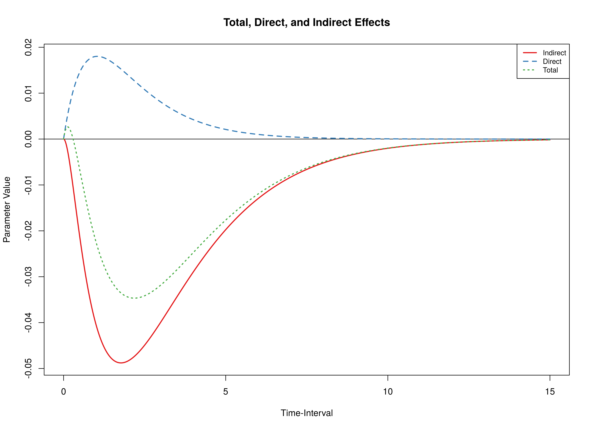


### Confidence Intervals


```r
delta <- DeltaMed(
  phi = phi,
  vcov_phi_vec = vcov_phi_vec,
  from = from,
  to = to,
  med = med,
  delta_t = delta_t,
  ncores = parallel::detectCores()
)
plot(delta)
```

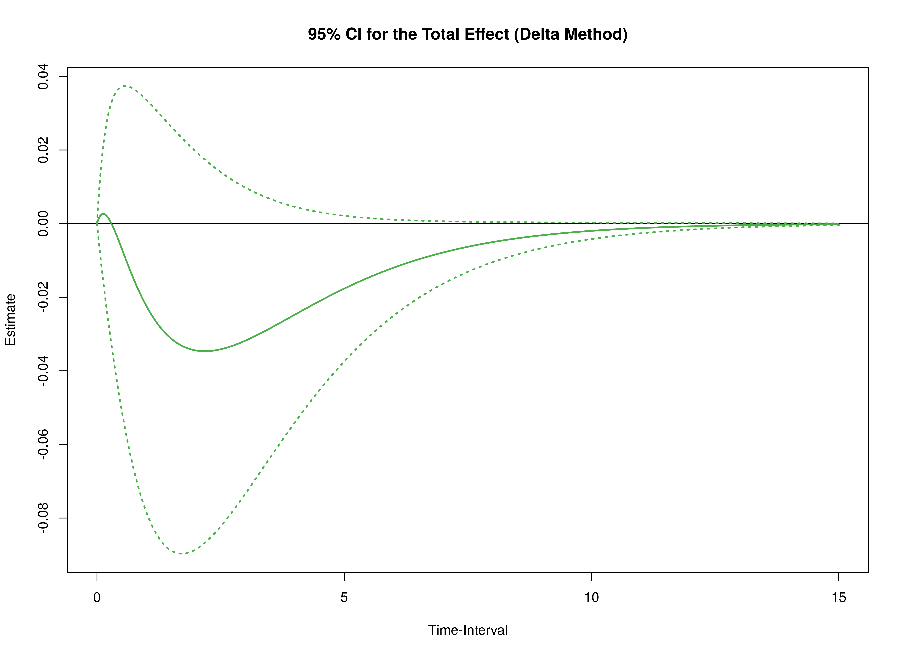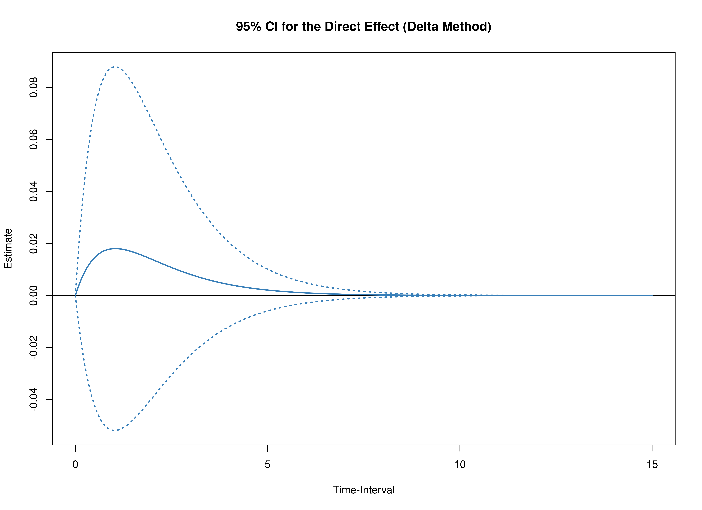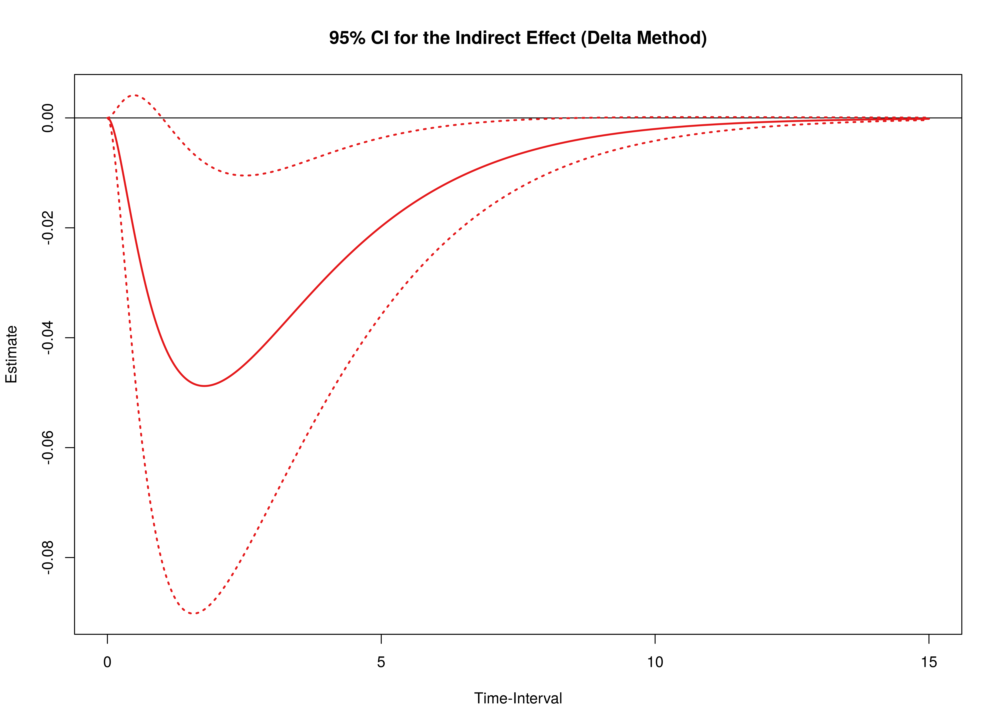


```r
mc <- MCMed(
  phi = phi,
  vcov_phi_vec = vcov_phi_vec,
  from = from,
  to = to,
  med = med,
  delta_t = delta_t,
  R = 20000L,
  seed = 42,
  ncores = parallel::detectCores()
)
plot(mc)
```

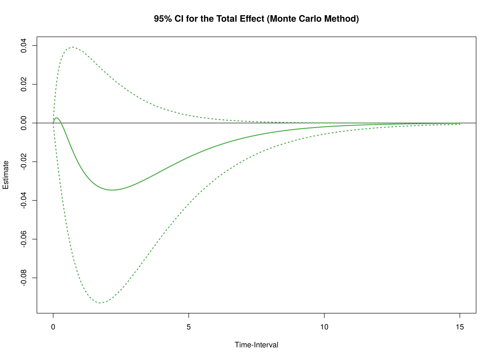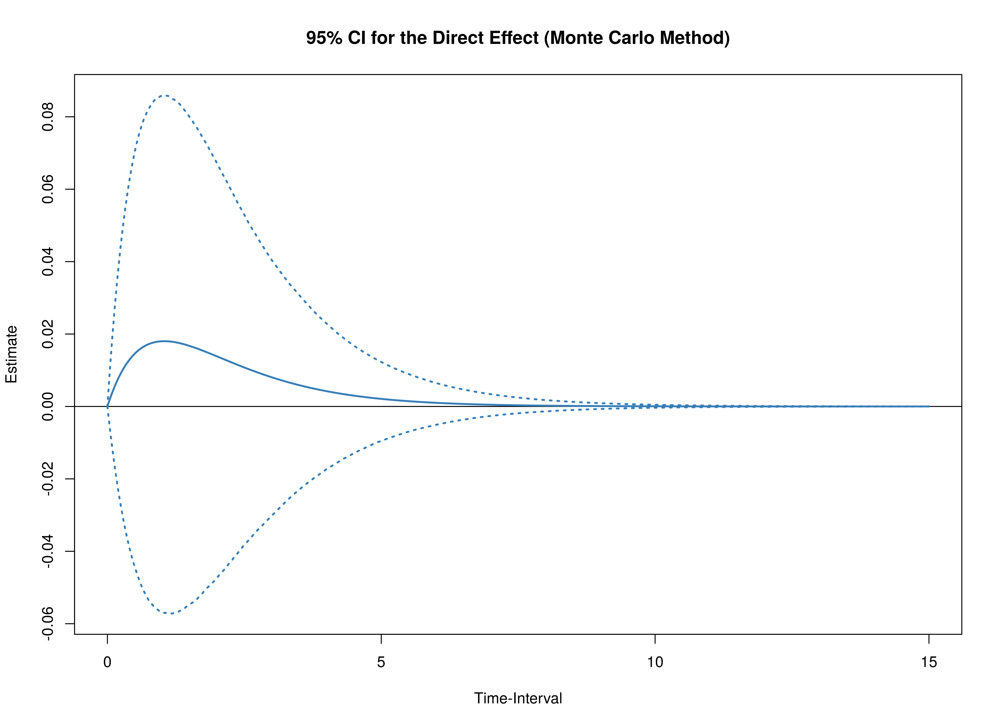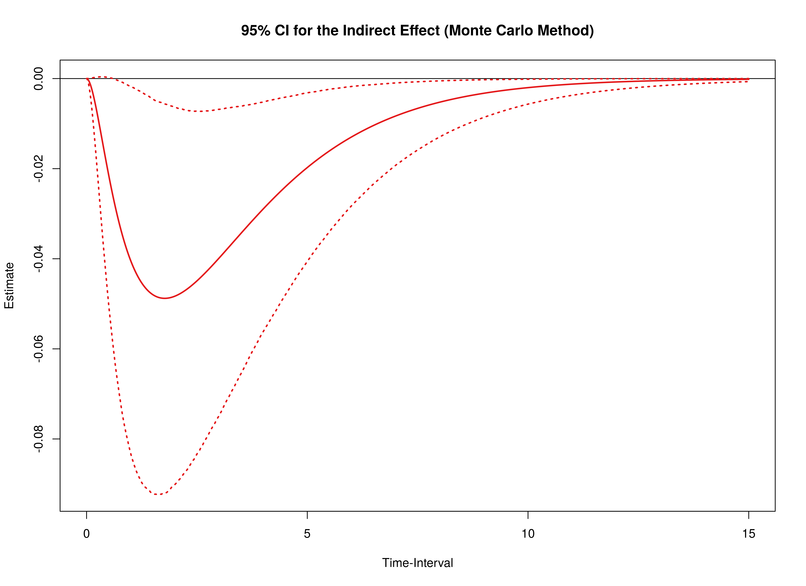


## Cognition (Self-Doubt) to Physical (Fatigue) Mediated by Affect (Irritable and Restless)

### Effects


```r
from <- "s" # self-doubt
to <- "f" # fatigue
```


```r
effects <- Med(
  phi = phi,
  from = from,
  to = to,
  med = med,
  delta_t = delta_t
)
plot(effects)
```

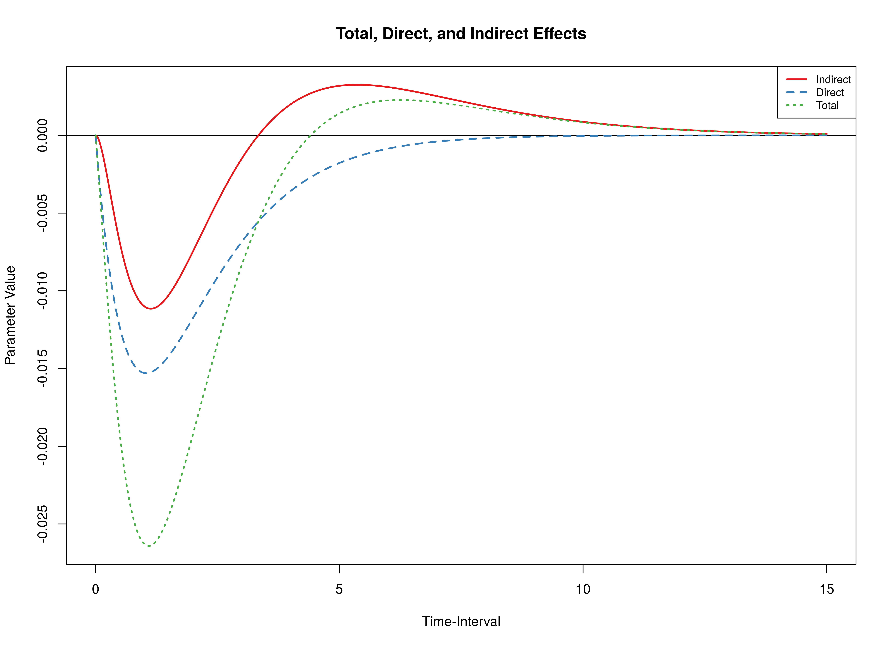


### Confidence Intervals


```r
delta <- DeltaMed(
  phi = phi,
  vcov_phi_vec = vcov_phi_vec,
  from = from,
  to = to,
  med = med,
  delta_t = delta_t,
  ncores = parallel::detectCores()
)
plot(delta)
```

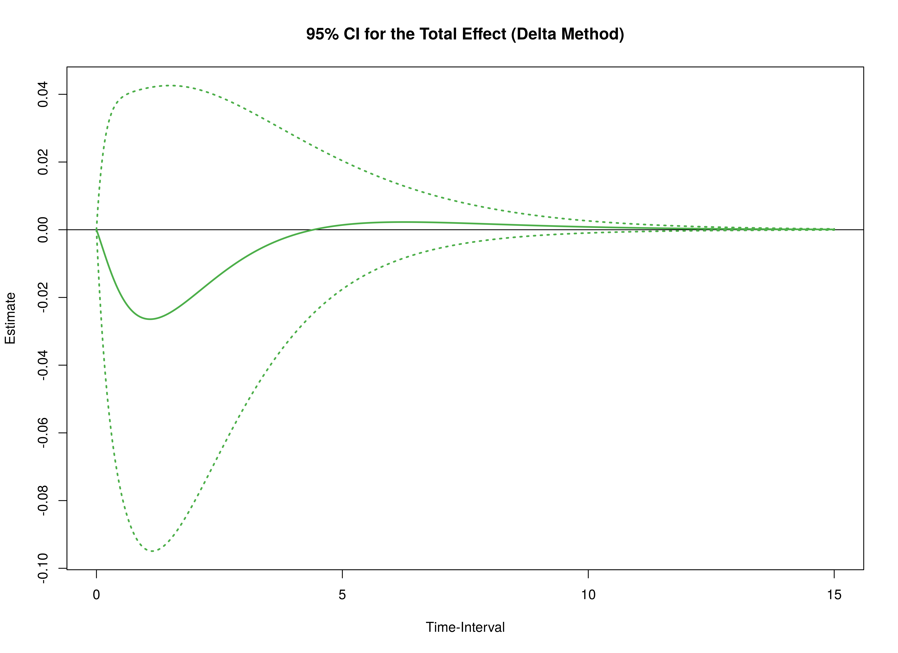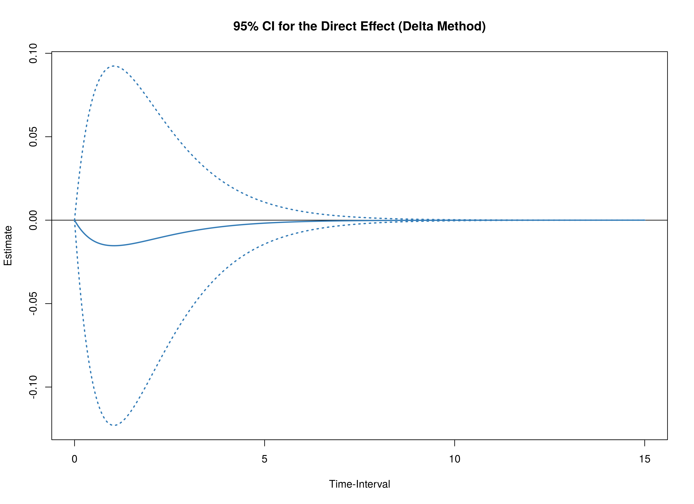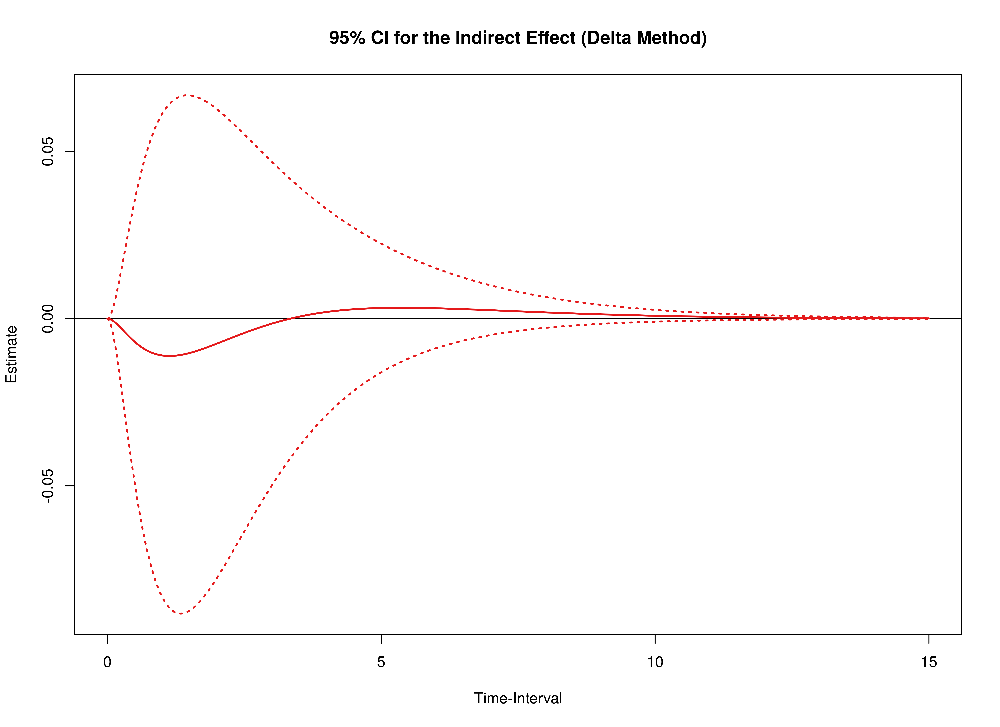


```r
mc <- MCMed(
  phi = phi,
  vcov_phi_vec = vcov_phi_vec,
  from = from,
  to = to,
  med = med,
  delta_t = delta_t,
  R = 20000L,
  seed = 42,
  ncores = parallel::detectCores()
)
plot(mc)
```

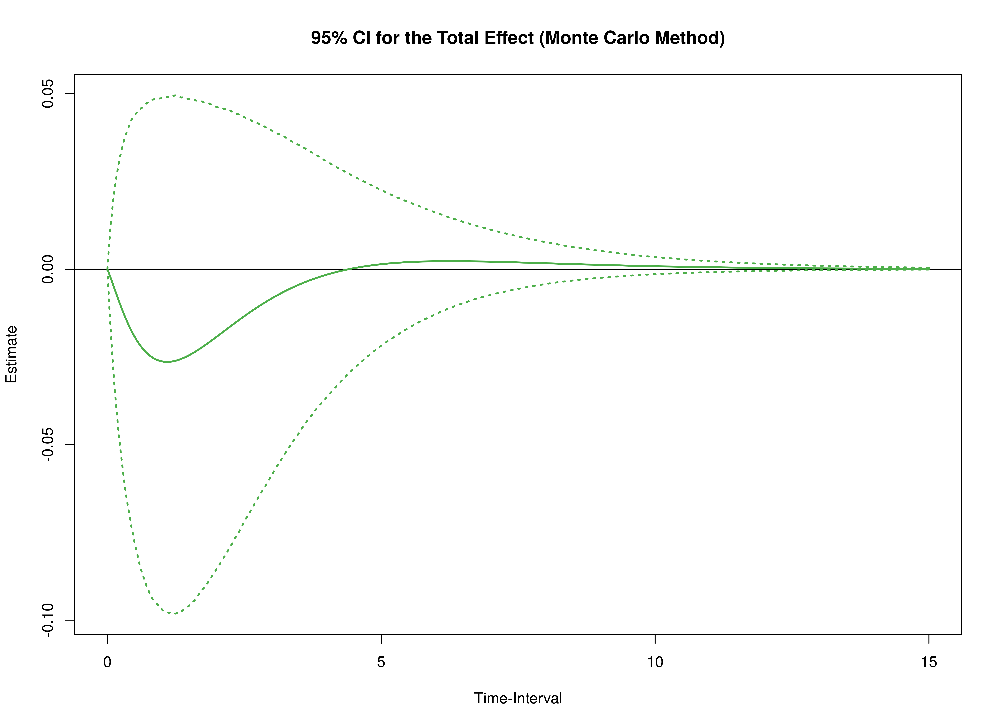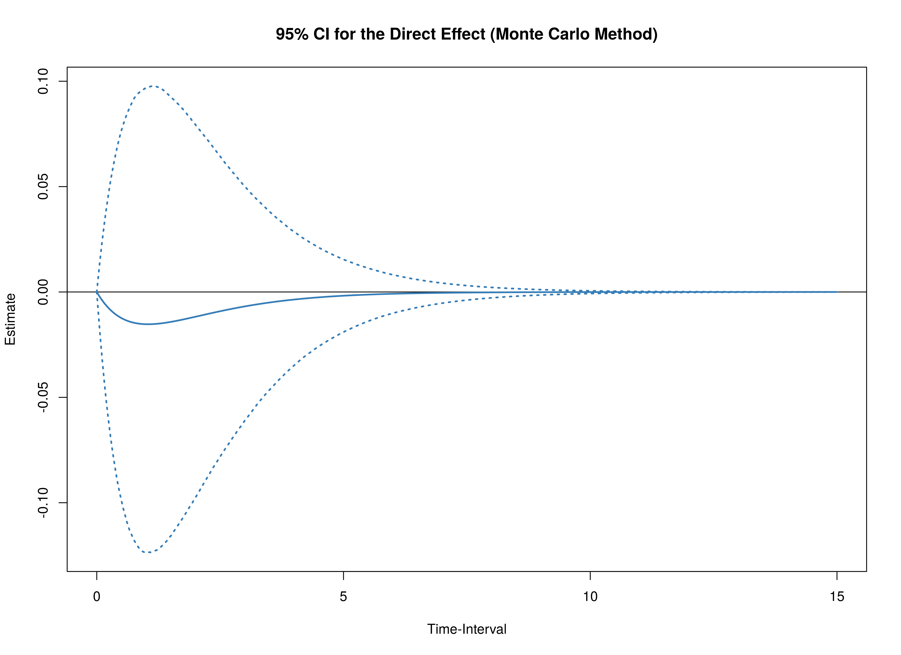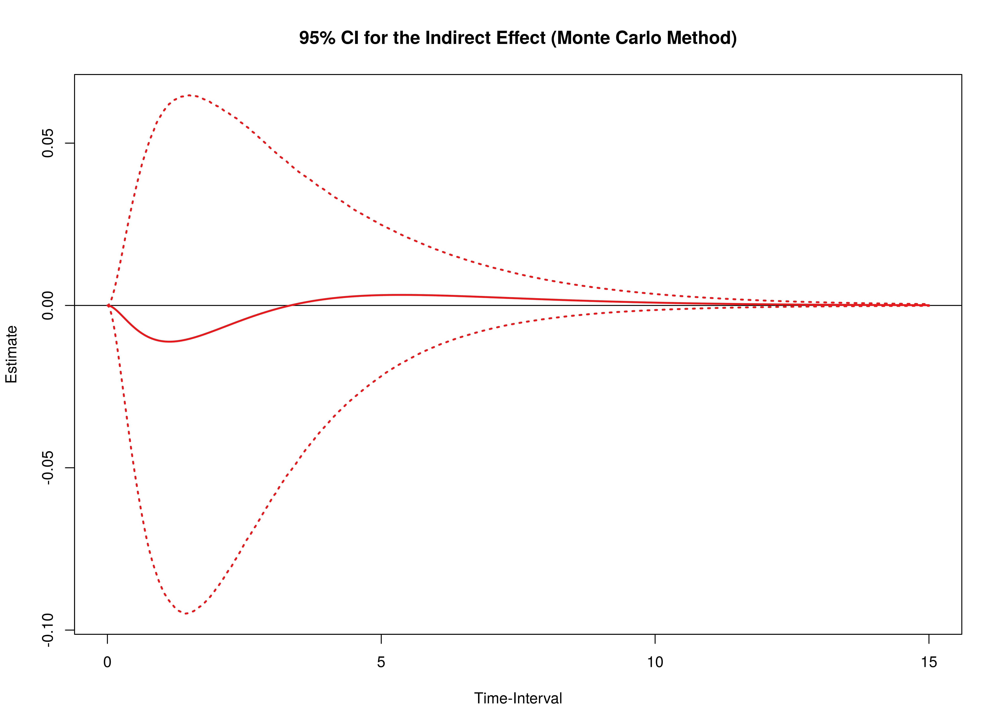


<details>
<summary>
Code used fit the model.
</summary>
```r
data(ryan2021, package = "manCTMed")
data <- ryan2021
data <- dynUtils::InsertNA(
  data = data,
  id = "id",
  time = "time",
  observed = c("s", "f", "i", "r"),
  delta_t = min(
    diff(
      sort(data[, "time"])
    )
  ),
  ncores = NULL
)
library(dynr)
dynr_data <- dynr::dynr.data(
  dataframe = data,
  id = "id",
  time = "time",
  observed = c("s", "f", "i", "r")
)
dynr_initial <- dynr::prep.initial(
  values.inistate = c(
    0, # -1.0465,
    0, # -1.2712,
    0, # -1.0601,
    0  # -1.0811
  ),
  params.inistate = c(
    "fixed",
    "fixed",
    "fixed",
    "fixed"
  ),
  values.inicov = diag(4),
  params.inicov = matrix(
    data = c(
      "fixed", "fixed", "fixed", "fixed",
      "fixed", "fixed", "fixed", "fixed",
      "fixed", "fixed", "fixed", "fixed",
      "fixed", "fixed", "fixed", "fixed"
    ),
    nrow = 4
  )
)
dynr_measurement <- dynr::prep.measurement(
  values.load = diag(4),
  params.load = matrix(data = "fixed", nrow = 4, ncol = 4),
  state.names = c("eta_s", "eta_f", "eta_i", "eta_r"),
  obs.names = c("s", "f", "i", "r")
)
dynr_dynamics <- dynr::prep.formulaDynamics(
  formula = list(
    eta_s ~ phi_11 * eta_s + phi_12 * eta_f + phi_13 * eta_i + phi_14 * eta_r,
    eta_f ~ phi_21 * eta_s + phi_22 * eta_f + phi_23 * eta_i + phi_24 * eta_r,
    eta_i ~ phi_31 * eta_s + phi_32 * eta_f + phi_33 * eta_i + phi_34 * eta_r,
    eta_r ~ phi_41 * eta_s + phi_42 * eta_f + phi_43 * eta_i + phi_44 * eta_r
  ),
  startval = c(
    phi_11 = -0.9708,
    phi_12 = 0.0307,
    phi_13 = -0.6346,
    phi_14 = 0.7553,
    phi_21 = -0.0083,
    phi_22 = -0.7805,
    phi_23 = 0.2863,
    phi_24 = -0.0935,
    phi_31 = -0.3071,
    phi_32 = -0.0056,
    phi_33 = -2.1939,
    phi_34 = 1.3135,
    phi_41 = 0.4309,
    phi_42 = -0.1694,
    phi_43 = 0.9606,
    phi_44 = -1.5582
  ),
  isContinuousTime = TRUE
)
dynr_noise <- dynr::prep.noise(
  values.latent = matrix(
    data = c(
      1.2852,
      0.1597,
      0.2767,
      0.0736,
      0.1597,
      1.2337,
      0.0071,
      0.1162,
      0.2767,
      0.0071,
      1.6692,
      0.0757,
      0.0736,
      0.1162,
      0.0757,
      1.1663
    ),
    nrow = 4
  ),
  params.latent = matrix(
    data = c(
      "sigma_11", "sigma_12", "sigma_13", "sigma_14",
      "sigma_12", "sigma_22", "sigma_23", "sigma_24",
      "sigma_13", "sigma_23", "sigma_33", "sigma_34",
      "sigma_14", "sigma_24", "sigma_34", "sigma_44"
    ),
    nrow = 4
  ),
  values.observed = matrix(
    data = 0,
    nrow = 4,
    ncol = 4
  ),
  params.observed = matrix(
    data = c(
      "fixed", "fixed", "fixed", "fixed",
      "fixed", "fixed", "fixed", "fixed",
      "fixed", "fixed", "fixed", "fixed",
      "fixed", "fixed", "fixed", "fixed"
    ),
    nrow = 4
  )
)
model <- dynr::dynr.model(
  data = dynr_data,
  initial = dynr_initial,
  measurement = dynr_measurement,
  dynamics = dynr_dynamics,
  noise = dynr_noise,
  outfile = file.path(tempdir(), "ryan2021.c")
)
model@options$maxeval <- 100000
lb <- ub <- rep(NA, times = length(model$xstart))
names(ub) <- names(lb) <- names(model$xstart)
lb[
  c(
    "phi_11",
    "phi_21",
    "phi_31",
    "phi_41",
    "phi_12",
    "phi_22",
    "phi_32",
    "phi_42",
    "phi_13",
    "phi_23",
    "phi_33",
    "phi_43",
    "phi_14",
    "phi_24",
    "phi_34",
    "phi_44"
  )
] <- -5
ub[
  c(
    "phi_11",
    "phi_21",
    "phi_31",
    "phi_41",
    "phi_12",
    "phi_22",
    "phi_32",
    "phi_42",
    "phi_13",
    "phi_23",
    "phi_33",
    "phi_43",
    "phi_14",
    "phi_24",
    "phi_34",
    "phi_44"
  )
] <- 5
model$lb <- lb
model$ub <- ub
fit <- dynr::dynr.cook(
  model
  # debug_flag = TRUE,
  # verbose = FALSE
)
coef(model) <- coef(fit)
fit <- dynr::dynr.cook(
  model
  # debug_flag = TRUE,
  # verbose = FALSE
)
parnames <- c(
  "phi_11",
  "phi_21",
  "phi_31",
  "phi_41",
  "phi_12",
  "phi_22",
  "phi_32",
  "phi_42",
  "phi_13",
  "phi_23",
  "phi_33",
  "phi_43",
  "phi_14",
  "phi_24",
  "phi_34",
  "phi_44"
)
phi_vec <- coef(fit)[parnames]
phi <- matrix(
  data = phi_vec,
  nrow = 4
)
colnames(phi) <- rownames(phi) <- c("s", "f", "i", "r")
vcov_phi_vec <- vcov(fit)[parnames, parnames]
ryan2021phi <- list(
  phi = phi,
  vcov = vcov_phi_vec
)
```
</details>
