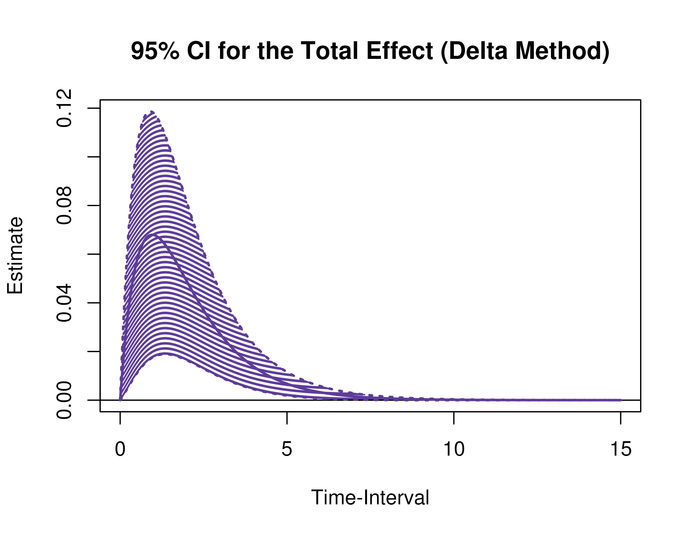
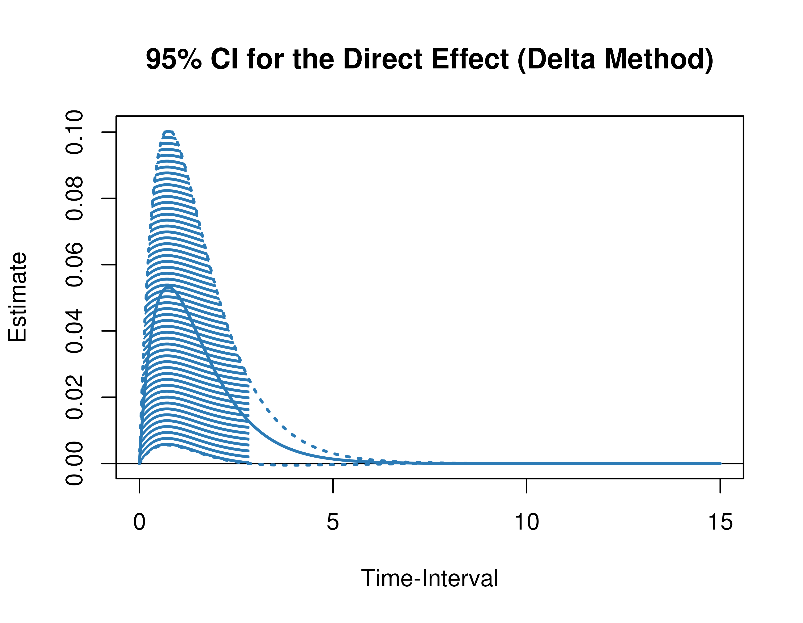
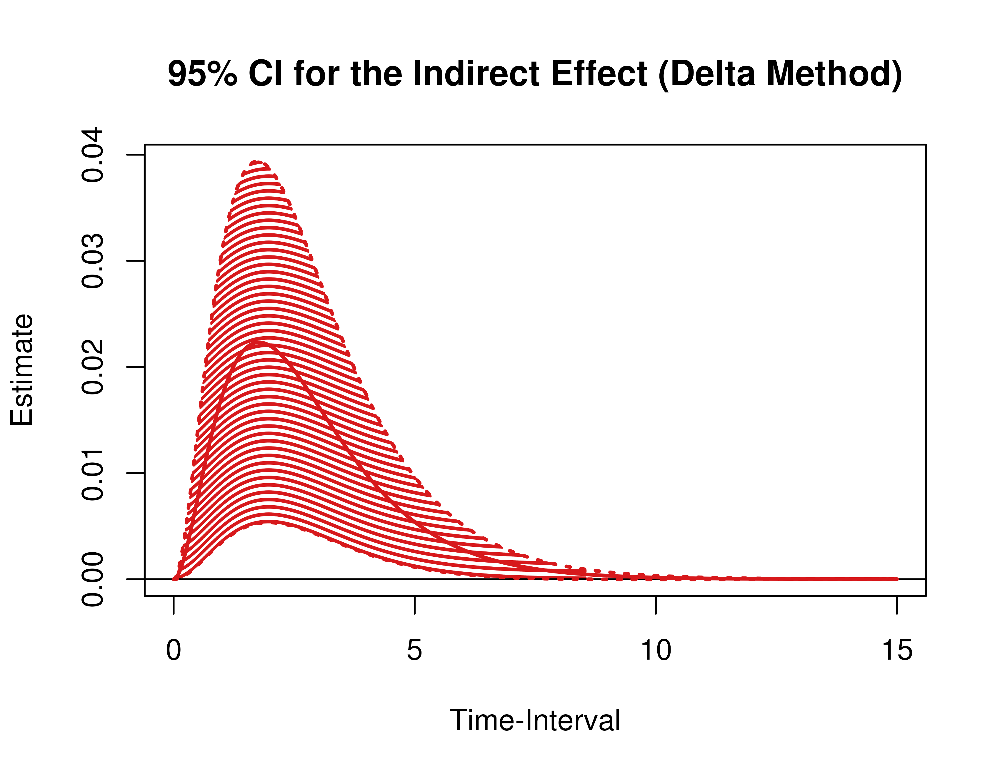
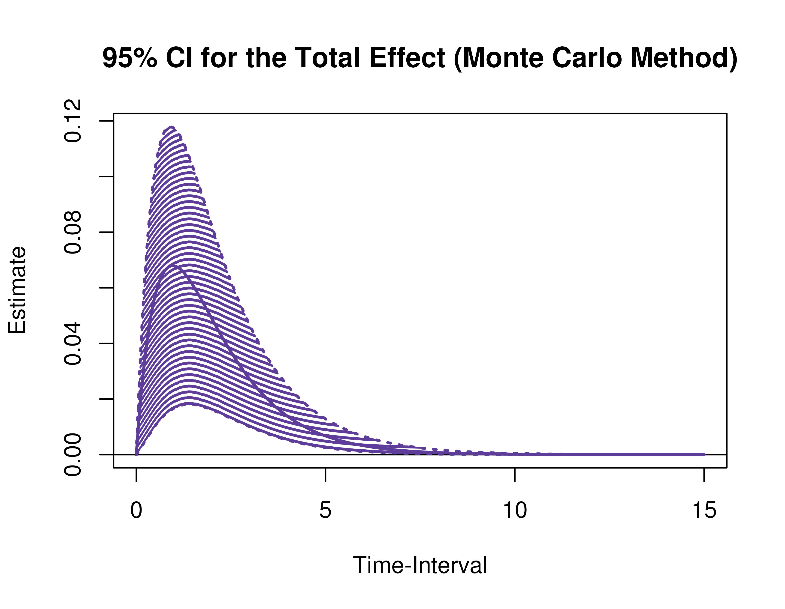
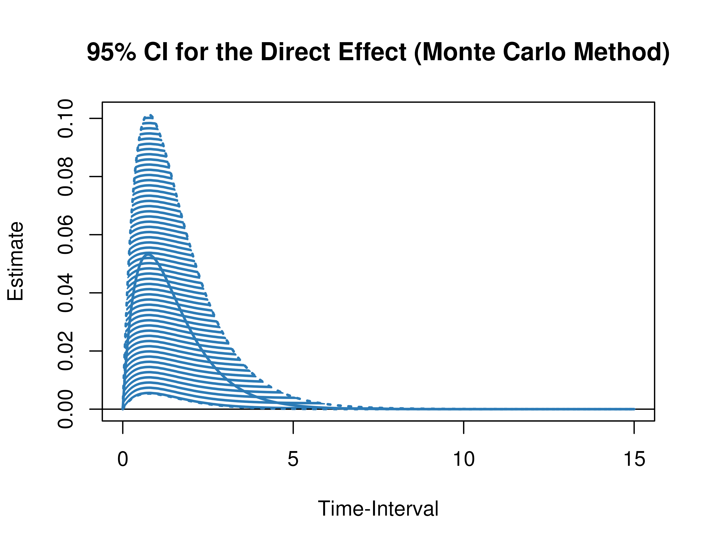
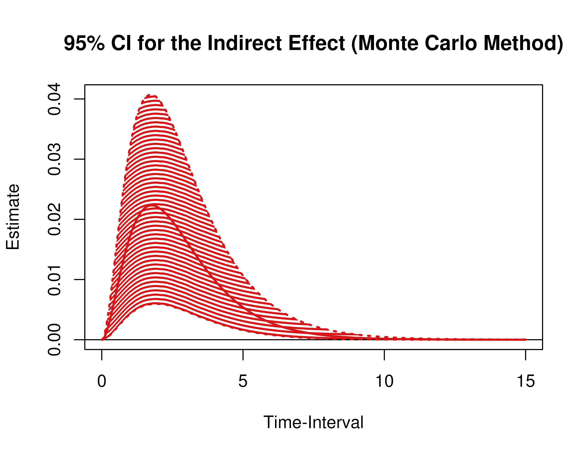

```r
library(dynr)
library(cTMed)
```

## Summary of CT-VAR Estimates


```r
summary(fit)
#> Coefficients:
#>          Estimate Std. Error t value ci.lower ci.upper Pr(>|t|)    
#> phi_11   -1.06703    0.12133  -8.794 -1.30484 -0.82923   <2e-16 ***
#> phi_12   -0.39524    0.13031  -3.033 -0.65065 -0.13983   0.0012 ** 
#> phi_13   -0.32643    0.08461  -3.858 -0.49226 -0.16060   0.0001 ***
#> phi_21   -0.33933    0.12800  -2.651 -0.59022 -0.08845   0.0040 ** 
#> phi_22   -1.13583    0.13748  -8.262 -1.40528 -0.86638   <2e-16 ***
#> phi_23    0.19473    0.08952   2.175  0.01927  0.37019   0.0148 *  
#> phi_31    0.04108    0.18175   0.226 -0.31515  0.39731   0.4106    
#> phi_32   -0.01353    0.19572  -0.069 -0.39713  0.37007   0.4724    
#> phi_33   -1.56956    0.12792 -12.270 -1.82028 -1.31884   <2e-16 ***
#> sigma_11  1.70062    0.09797  17.359  1.50861  1.89264   <2e-16 ***
#> sigma_12 -1.21836    0.08735 -13.948 -1.38956 -1.04716   <2e-16 ***
#> sigma_13  0.93105    0.11804   7.887  0.69969  1.16242   <2e-16 ***
#> sigma_22  1.87972    0.11294  16.643  1.65835  2.10108   <2e-16 ***
#> sigma_23 -1.06777    0.12676  -8.423 -1.31622 -0.81932   <2e-16 ***
#> sigma_33  3.09906    0.23518  13.178  2.63812  3.56000   <2e-16 ***
#> ---
#> Signif. codes:  0 '***' 0.001 '**' 0.01 '*' 0.05 '.' 0.1 ' ' 1
#> 
#> -2 log-likelihood value at convergence = 10267.54
#> AIC = 10297.54
#> BIC = 10411.53
```

## Extract Elements of the Drift Matrix


```r
varnames <- c(
  "phi_11",
  "phi_21",
  "phi_31",
  "phi_12",
  "phi_22",
  "phi_32",
  "phi_13",
  "phi_23",
  "phi_33"
)
phi <- matrix(
  data = coef(fit)[varnames],
  nrow = 3
)
colnames(phi) <- rownames(phi) <- c(
  "psych_distress",
  "esteem",
  "physical_distress"
)
vcov_phi_vec <- vcov(fit)[varnames, varnames]
```

## Delta Method Confidence Intervals For The Direct, Indirect, and Total Effects

A long sequence of time-interval values makes regions of significance more visible.


```r
delta <- DeltaMed(
  phi = phi,
  vcov_phi_vec = vcov_phi_vec,
  from = "physical_distress",
  to = "esteem",
  med = "psych_distress",
  delta_t = seq(from = 0, to = 15, length.out = 1000)
)
plot(delta)
```



## Monte Carlo Method Confidence Intervals For The Direct, Indirect, and Total Effects


```r
mc <- MCMed(
  phi = phi,
  vcov_phi_vec = vcov_phi_vec,
  from = "physical_distress",
  to = "esteem",
  med = "psych_distress",
  delta_t = seq(from = 0, to = 15, length.out = 1000),
  seed = 42,
  R = 20000L
)
plot(mc)
```




