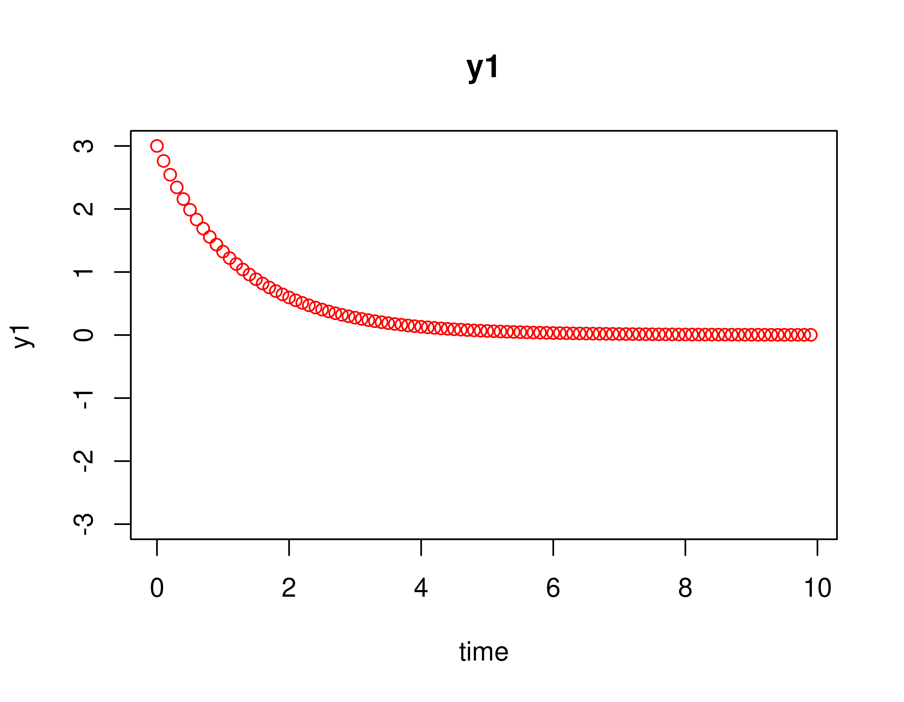
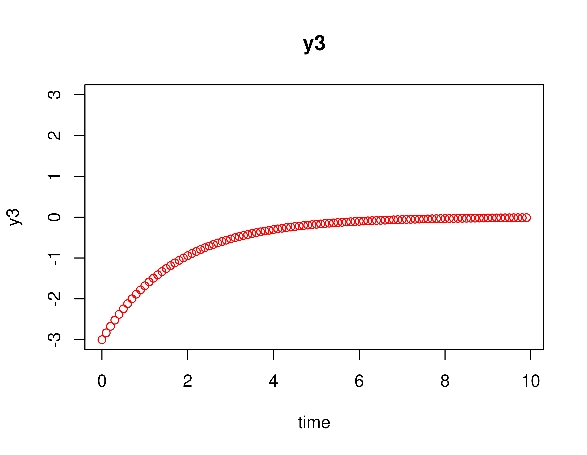
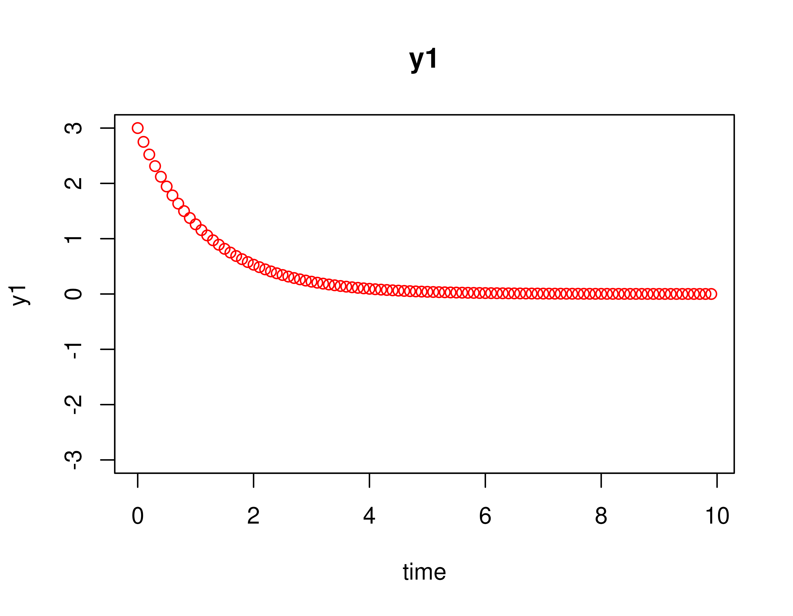
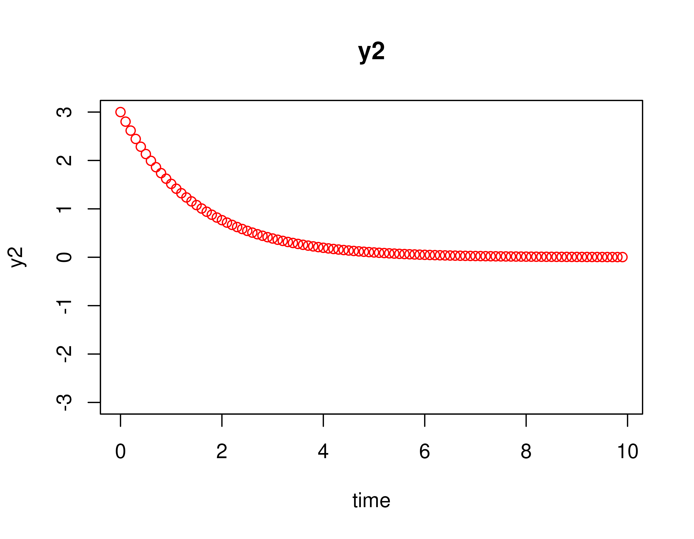
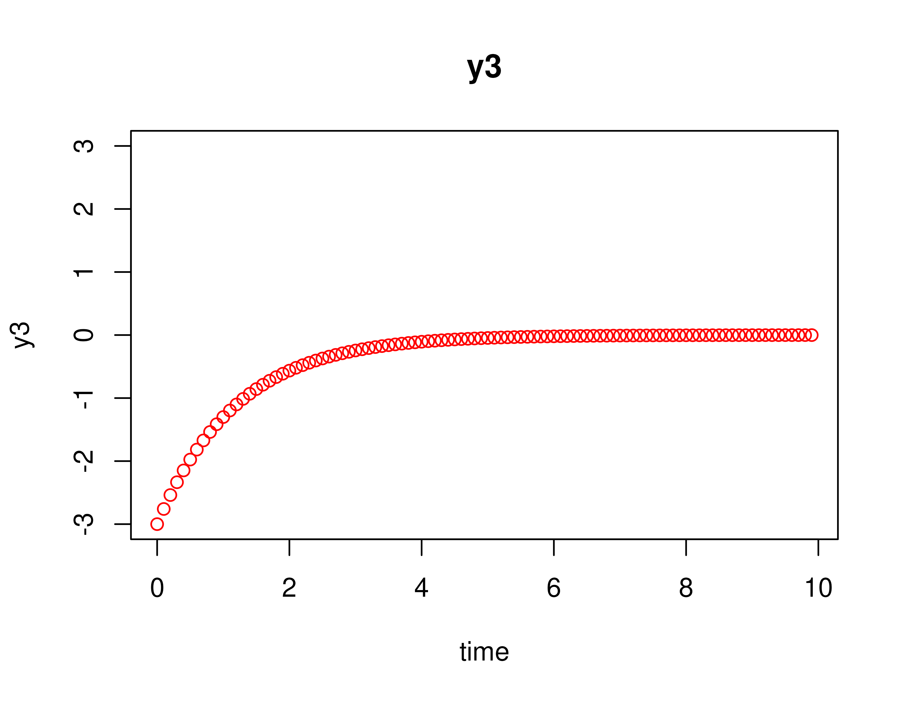
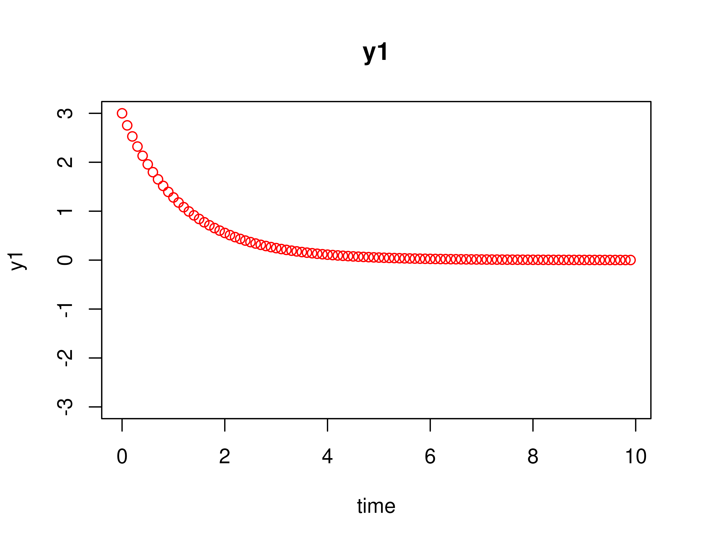
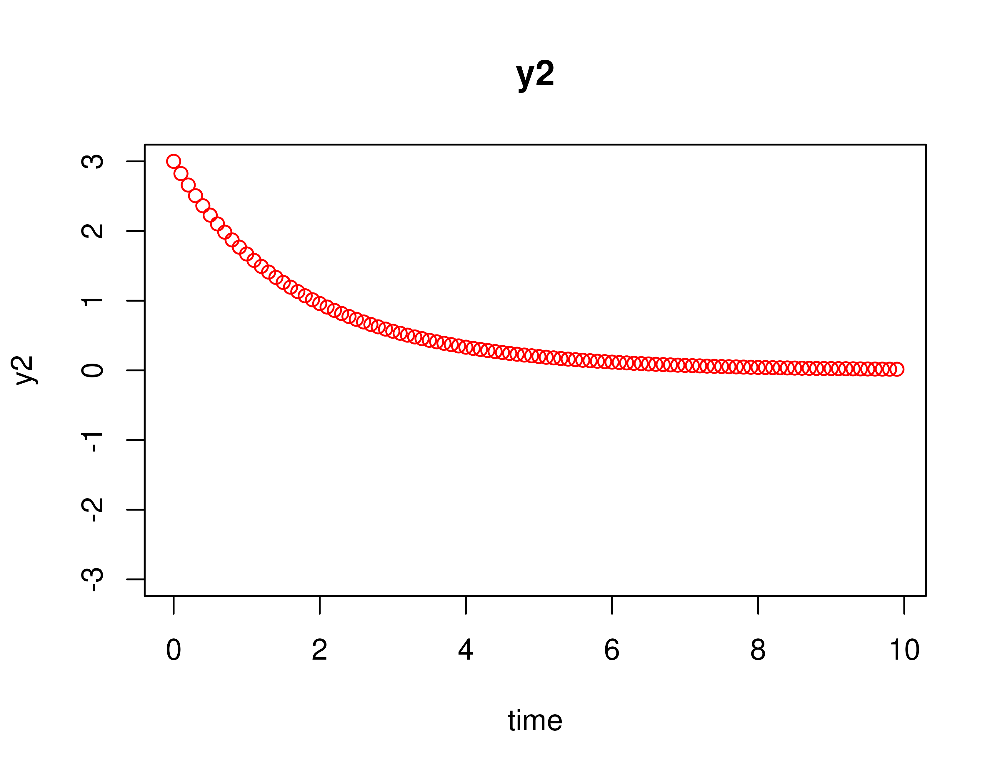
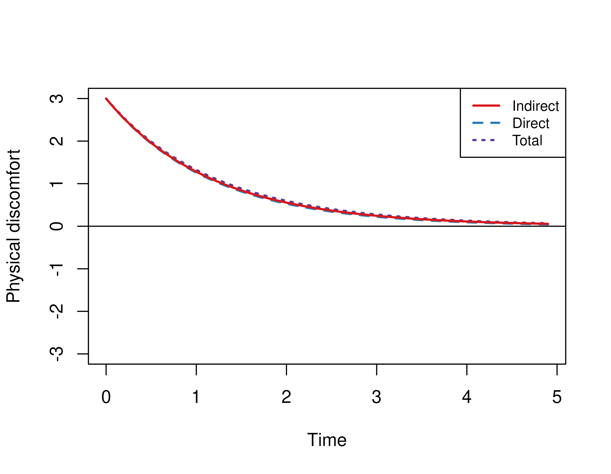
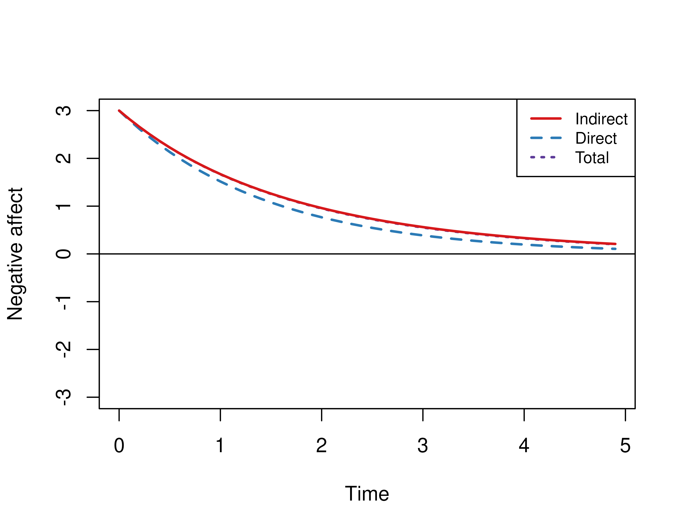
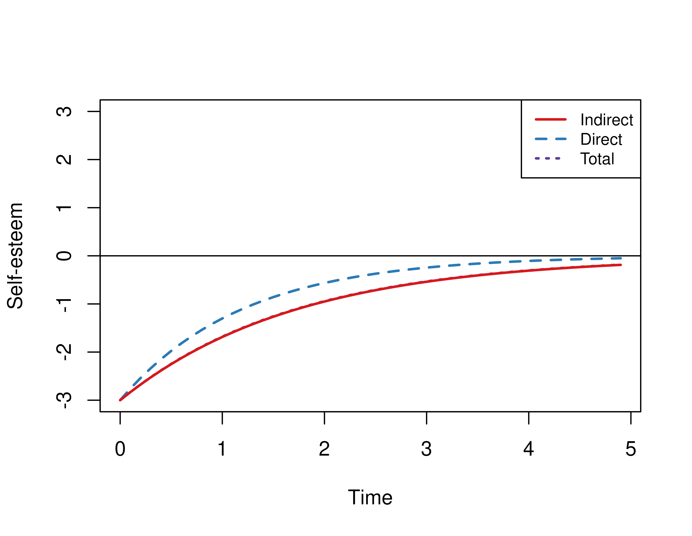

  
This vignette accompanies the Empirical Example. The goal of the example is to visualize how the variables evolve over time. To aid in interpretation we removed the measurement error and process noise. We compared how variables evolve using the estimated drift matrix $\boldsymbol{\Phi}$ denoted by `phi` and the drift matrix where the effects coming from and to the mediator variable (negative emotion) are set to zero denoted by `phi_direct`. This example features the `SimSSMOUFixed` function from the `simStateSpace` package.


``` r
library(dynr)
library(cTMed)
library(simStateSpace)
```

## Summary of CT-VAR Estimates

The object `fit` contains the fitted `dynr` model.


``` r
summary(fit)
#> Coefficients:
#>           Estimate Std. Error t value  ci.lower  ci.upper Pr(>|t|)    
#> phi_11   -0.682289   0.091137  -7.486 -0.860914 -0.503664   <2e-16 ***
#> phi_12   -0.230881   0.100695  -2.293 -0.428240 -0.033523   0.0109 *  
#> phi_13   -0.154588   0.057133  -2.706 -0.266567 -0.042609   0.0034 ** 
#> phi_21   -0.255948   0.104128  -2.458 -0.460035 -0.051861   0.0070 ** 
#> phi_22   -0.829891   0.118322  -7.014 -1.061797 -0.597985   <2e-16 ***
#> phi_23    0.005405   0.066135   0.082 -0.124218  0.135029   0.4674    
#> phi_31    0.041008   0.130473   0.314 -0.214715  0.296730   0.3766    
#> phi_32   -0.030100   0.146146  -0.206 -0.316541  0.256340   0.4184    
#> phi_33   -0.898237   0.080969 -11.094 -1.056933 -0.739540   <2e-16 ***
#> sigma_11  1.089489   0.070942  15.357  0.950445  1.228533   <2e-16 ***
#> sigma_12 -0.780305   0.065795 -11.860 -0.909261 -0.651349   <2e-16 ***
#> sigma_13  0.482061   0.075104   6.419  0.334859  0.629263   <2e-16 ***
#> sigma_22  1.255423   0.091716  13.688  1.075663  1.435184   <2e-16 ***
#> sigma_23 -0.527300   0.083808  -6.292 -0.691560 -0.363040   <2e-16 ***
#> sigma_33  1.748546   0.138528  12.622  1.477036  2.020056   <2e-16 ***
#> ---
#> Signif. codes:  0 '***' 0.001 '**' 0.01 '*' 0.05 '.' 0.1 ' ' 1
#> 
#> -2 log-likelihood value at convergence = 10263.49
#> AIC = 10293.49
#> BIC = 10428.20
```

## Extract Elements of the Drift Matrix

We extract the elements of the drift matrix and the corresponding sampling variance-covariance matrix from the `fit` object.


``` r
varnames <- c(
  "phi_11",
  "phi_21",
  "phi_31",
  "phi_12",
  "phi_22",
  "phi_32",
  "phi_13",
  "phi_23",
  "phi_33"
)
coef <- summary(fit)$Coefficients
phi_vec <- coef[varnames, "Estimate"]
phi <- matrix(
  data = phi_vec,
  nrow = 3
)
colnames(phi) <- rownames(phi) <- c(
  "Negative affect",
  "Self-esteem",
  "Physical discomfort"
)
phi
#>                     Negative affect Self-esteem Physical discomfort
#> Negative affect         -0.68228879 -0.23088139        -0.154587872
#> Self-esteem             -0.25594788 -0.82989122         0.005405377
#> Physical discomfort      0.04100777 -0.03010042        -0.898236563
```

To simplify interpretation we set non-significant coefficients to zero.


``` r
p <- coef[varnames, "Pr(>|t|)"]
phi_vec <- ifelse(test = p < 0.05, yes = phi, no = 0)
phi <- matrix(
  data = phi_vec,
  nrow = 3
)
colnames(phi) <- rownames(phi) <- c(
  "Negative affect",
  "Self-esteem",
  "Physical discomfort"
)
phi
```

We rearrange the matrix to reflect the $X$, $M$, and $Y$ arrangement.


``` r
phi <- phi[
  c("Physical discomfort", "Negative affect", "Self-esteem"),
  c("Physical discomfort", "Negative affect", "Self-esteem")
]
phi
#>                     Physical discomfort Negative affect Self-esteem
#> Physical discomfort        -0.898236563      0.04100777 -0.03010042
#> Negative affect            -0.154587872     -0.68228879 -0.23088139
#> Self-esteem                 0.005405377     -0.25594788 -0.82989122
```

## Generate Data Without Measurement Error and Process Noise

### Using the Original Drift Matrix (`phi`)

Using the `SimSSMOUFixed` function from the `simStateSpace` package, we generate data for a single individual (n = 1) for fifty time points (t = 50) and $\Delta t$ of 0.10 without measurement error and process noise. We set the initial condition for $X$ (physical discomfort) and $M$ (negative affect) to be high and $Y$ (self-esteem) to be low.


``` r
mu0 <- c(
  3,
  3,
  -3
)
```


``` r
iden_mat <- diag(3)
null_vec <- c(0, 0, 0)
null_mat <- matrix(
  data = 0,
  nrow = 3,
  ncol = 3
)
```


``` r
y_phi <- SimSSMOUFixed(
  n = 1,
  time = 100,
  delta_t = 0.10,
  mu0 = mu0,
  sigma0_l = null_mat,
  mu = null_vec,
  phi = phi,
  sigma_l = null_mat,
  nu = null_vec,
  lambda = iden_mat,
  theta_l = null_mat
)
```

The `plot` method for the `SimSSMOUFixed` plots the trajectories of the three variables.


``` r
plot(y_phi)
```



### Using the Modified Drift Matrix (`direct`)

We modify the drift matrix by setting coefficients that originate from and go to the mediator (negative effect) to zero except for the autoeffect.


``` r
d <- matrix(
  data = c(
    1, 0, 1,
    0, 1, 0,
    1, 0, 1
  ),
  nrow = 3
)
phi_direct <- phi
for (j in 1:3) {
  for (i in 1:3) {
    if (d[i, j] == 0) {
      phi_direct[i, j] <- 0
    }
  }
}
phi_direct
#>                     Physical discomfort Negative affect Self-esteem
#> Physical discomfort        -0.898236563       0.0000000 -0.03010042
#> Negative affect             0.000000000      -0.6822888  0.00000000
#> Self-esteem                 0.005405377       0.0000000 -0.82989122
```

We use `phi_direct` to generate data.


``` r
y_phi_direct <- SimSSMOUFixed(
  n = 1,
  time = 100,
  delta_t = 0.10,
  mu0 = mu0,
  sigma0_l = null_mat,
  mu = null_vec,
  phi = phi_direct,
  sigma_l = null_mat,
  nu = null_vec,
  lambda = iden_mat,
  theta_l = null_mat
)
plot(y_phi_direct)
```



### Using the Modified Drift Matrix (`indirect`)

We modify the drift matrix by getting the difference between `phi` and `phi_direct`. We add back the diagonal elements to the matrix to ensure stability.


``` r
phi_indirect <- phi - phi_direct
diag(phi_indirect) <- diag(phi)
phi_indirect
#>                     Physical discomfort Negative affect Self-esteem
#> Physical discomfort          -0.8982366      0.04100777   0.0000000
#> Negative affect              -0.1545879     -0.68228879  -0.2308814
#> Self-esteem                   0.0000000     -0.25594788  -0.8298912
```

We use `phi_indirect` to generate data.


``` r
y_phi_indirect <- SimSSMOUFixed(
  n = 1,
  time = 100,
  delta_t = 0.10,
  mu0 = mu0,
  sigma0_l = null_mat,
  mu = null_vec,
  phi = phi_indirect,
  sigma_l = null_mat,
  nu = null_vec,
  lambda = iden_mat,
  theta_l = null_mat
)
plot(y_phi_indirect)
```



## Combine the plots

The `Trajectory` function and the `plot` method in the `cTMed` package automates the process described earlier and combines the plots for easier interpretation. The argument `mu0` can be used to modify the initial condition. Note that `Total` corresponds to the plots for `phi`, `Direct` corresponds to the plots for `phi_direct`, and `Indirect` corresponds to the plots for `phi_indirect`.


``` r
x <- Trajectory(
  mu0 = c(3, 3, -3),
  time = 50,
  phi = phi,
  med = "Negative affect"
)
plot(x)
```




