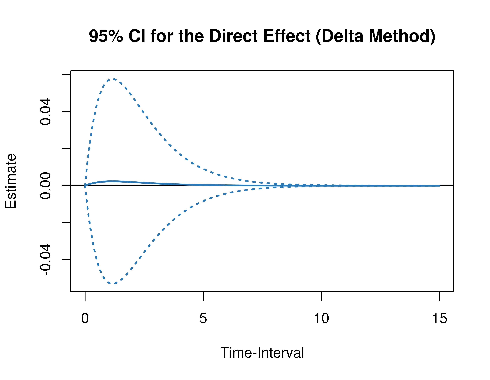
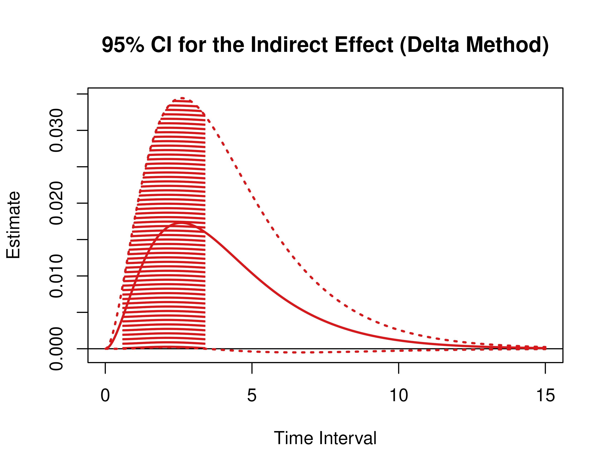
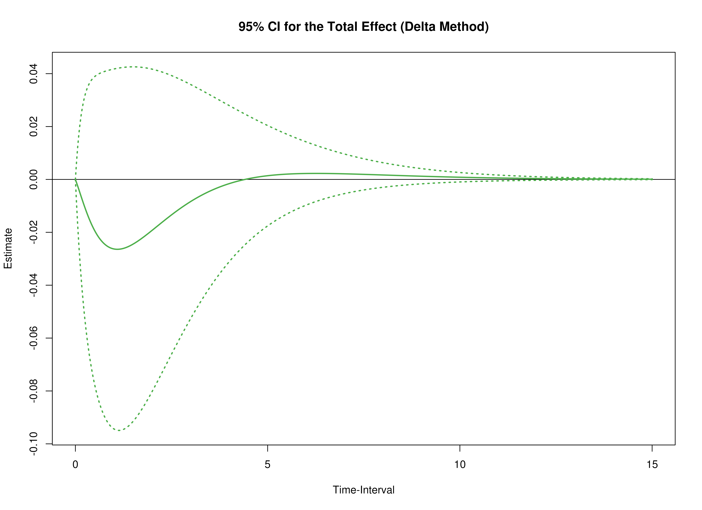
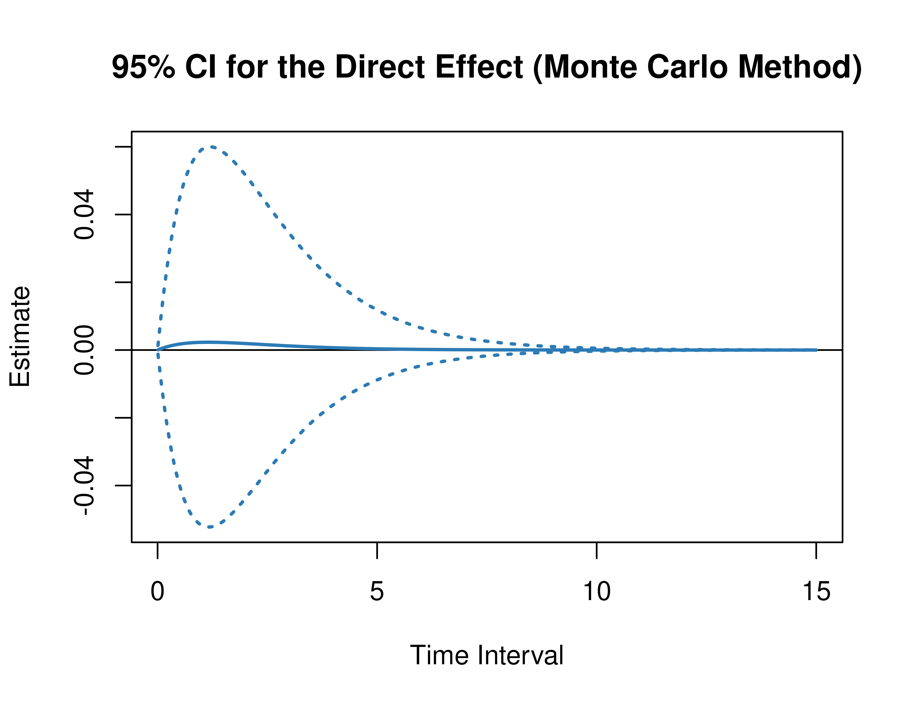
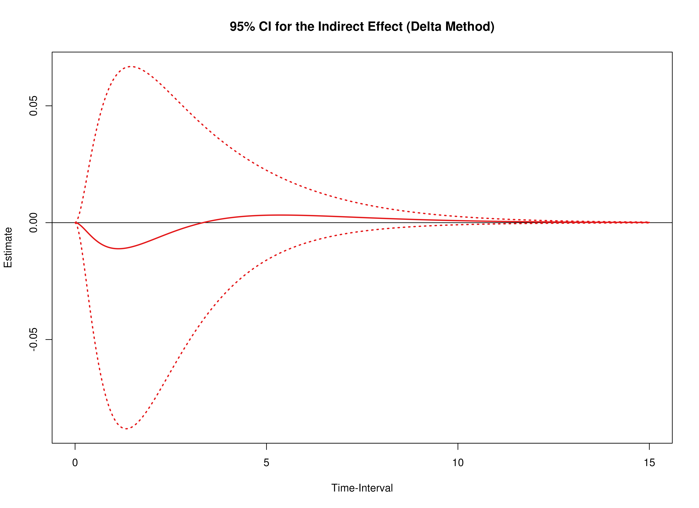

This vignette accompanies the Empirical Example. The goal of the example is to visualize regions of significance, that is, a range of time intervals, where the effects are significantly different from zero, using confidence intervals for the direct, indirect, and total effects from the continuous-time vector autoregressive model drift matrix $\boldsymbol{\Phi}$ for a range of time intervals. This example features `plot` methods for the `DeltaMed` and `MCMed` functions from the `cTMed` package.


``` r
library(dynr)
library(cTMed)
```

## Summary of CT-VAR Estimates

The object `fit` contains the fitted `dynr` model.


``` r
summary(fit)
#> Coefficients:
#>           Estimate Std. Error t value  ci.lower  ci.upper Pr(>|t|)    
#> phi_11   -0.682289   0.091137  -7.486 -0.860914 -0.503664   <2e-16 ***
#> phi_12   -0.230881   0.100695  -2.293 -0.428240 -0.033523   0.0109 *  
#> phi_13   -0.154588   0.057133  -2.706 -0.266567 -0.042609   0.0034 ** 
#> phi_21   -0.255948   0.104128  -2.458 -0.460035 -0.051861   0.0070 ** 
#> phi_22   -0.829891   0.118322  -7.014 -1.061797 -0.597985   <2e-16 ***
#> phi_23    0.005405   0.066135   0.082 -0.124218  0.135029   0.4674    
#> phi_31    0.041008   0.130473   0.314 -0.214715  0.296730   0.3766    
#> phi_32   -0.030100   0.146146  -0.206 -0.316541  0.256340   0.4184    
#> phi_33   -0.898237   0.080969 -11.094 -1.056933 -0.739540   <2e-16 ***
#> sigma_11  1.089489   0.070942  15.357  0.950445  1.228533   <2e-16 ***
#> sigma_12 -0.780305   0.065795 -11.860 -0.909261 -0.651349   <2e-16 ***
#> sigma_13  0.482061   0.075104   6.419  0.334859  0.629263   <2e-16 ***
#> sigma_22  1.255423   0.091716  13.688  1.075663  1.435184   <2e-16 ***
#> sigma_23 -0.527300   0.083808  -6.292 -0.691560 -0.363040   <2e-16 ***
#> sigma_33  1.748546   0.138528  12.622  1.477036  2.020056   <2e-16 ***
#> ---
#> Signif. codes:  0 '***' 0.001 '**' 0.01 '*' 0.05 '.' 0.1 ' ' 1
#> 
#> -2 log-likelihood value at convergence = 10263.49
#> AIC = 10293.49
#> BIC = 10428.20
```

## Extract Elements of the Drift Matrix

We extract the elements of the drift matrix and the corresponding sampling variance-covariance matrix from the `fit` object.


``` r
varnames <- c(
  "phi_11",
  "phi_21",
  "phi_31",
  "phi_12",
  "phi_22",
  "phi_32",
  "phi_13",
  "phi_23",
  "phi_33"
)
phi <- matrix(
  data = coef(fit)[varnames],
  nrow = 3
)
colnames(phi) <- rownames(phi) <- c(
  "neg",
  "est",
  "phy"
)
vcov_phi_vec <- vcov(fit)[varnames, varnames]
```

## Delta Method Confidence Intervals For The Direct, Indirect, and Total Effects

Using the `DeltaMed` function from the `cTMed` package, confidence intervals for the direct, indirect, and total effects for a long sequence of time interval values. This makes regions of significance more visible. Consider using the `ncores` argument to use multiple cores when the `delta_t` vector is long. The `plot` method for the `DeltaMed` presents the regions of significance visually represented by shaded areas in the plot.


``` r
delta <- DeltaMed(
  phi = phi,
  vcov_phi_vec = vcov_phi_vec,
  from = "phy",
  to = "est",
  med = "neg",
  delta_t = seq(from = 0, to = 15, length.out = 1000)
)
plot(delta)
```



## Monte Carlo Method Confidence Intervals For The Direct, Indirect, and Total Effects

Using the `MCMed` function from the `cTMed` package, confidence intervals for the direct, indirect, and total effects for a long sequence of time interval values. This makes regions of significance more visible. Consider using the `ncores` argument to use multiple cores when the `delta_t` vector is long. The `plot` method for the `MCMed` presents the regions of significance visually represented by shaded areas in the plot.


``` r
mc <- MCMed(
  phi = phi,
  vcov_phi_vec = vcov_phi_vec,
  from = "phy",
  to = "est",
  med = "neg",
  delta_t = seq(from = 0, to = 15, length.out = 1000),
  seed = 42,
  R = 20000L
)
plot(mc)
```



<details>
<summary>
Code to fit the CT-VAR model in the `dynr` package.
</summary>
```r
rawdata <- read.csv("ESMdata.csv")
# reverse
rawdata$pat_concent <- 8 - rawdata$pat_concent
rawdata$se_ashamed <- 8 - rawdata$se_ashamed
rawdata$se_selfdoub <- 8 - rawdata$se_selfdoub
# extract time variable
t1 <- as.POSIXct(
  paste(
    rawdata$date,
    rawdata$resptime_s
  ),
  format = "%d/%m/%y %H:%M:%S"
)
time <- as.numeric(
  difftime(
    t1,
    t1[1],
    units = "hours"
  )
)
# select variables
neg <- c(
  "pat_restl",
  "pat_agitate",
  "pat_worry",
  "pat_concent"
)
est <- c(
  "se_selflike",
  "se_ashamed",
  "se_selfdoub",
  "se_handle"
)
phy <- c(
  "phy_hungry",
  "phy_tired",
  "phy_pain",
  "phy_dizzy",
  "phy_drymouth",
  "phy_nauseous",
  "phy_headache",
  "phy_sleepy"
)
data_esm <- data.frame(
  neg = rowMeans(
    rawdata[, neg]
  ),
  est = rowMeans(
    rawdata[, est]
  ),
  phy = rowMeans(
    rawdata[, phy]
  )
)
# scale
data_esm <- apply(
  X = data_esm,
  MARGIN = 2,
  FUN = scale
)
# create ID variable
id <- rep(
  x = 1,
  times = dim(data_esm)[1]
)
# create long form dataset for ctsem
data <- data.frame(
  id = id,
  time = time,
  data_esm
)
data <- dynUtils::InsertNA(
  data = data,
  id = "id",
  time = "time",
  observed = c(
    "neg",
    "est",
    "phy"
  ),
  delta_t = .10,
  ncores = parallel::detectCores()
)
manifest_names <- c(
  "neg",
  "est",
  "phy"
)
latent_names <- paste0(
  "eta_",
  manifest_names
)
n_manifest <- length(manifest_names)
n_latent <- length(latent_names)
library(dynr)
dynr_data <- dynr::dynr.data(
  dataframe = data,
  id = "id",
  time = "time",
  observed = manifest_names
)
dynr_initial <- dynr::prep.initial(
  values.inistate = rep(x = 0, times = n_latent),
  params.inistate = rep(x = "fixed", times = n_latent),
  values.inicov = diag(n_latent),
  params.inicov = matrix(
    data = "fixed",
    nrow = n_latent,
    ncol = n_latent
  )
)
dynr_measurement <- dynr::prep.measurement(
  values.load = diag(n_manifest),
  params.load = matrix(
    data = "fixed",
    nrow = n_manifest,
    ncol = n_manifest
  ),
  state.names = paste0("eta_", manifest_names),
  obs.names = manifest_names
)
dynr_dynamics <- dynr::prep.formulaDynamics(
  formula = list(
    eta_neg ~ (phi_11 * eta_neg) + (phi_12 * eta_est) + (phi_13 * eta_phy),
    eta_est ~ (phi_21 * eta_neg) + (phi_22 * eta_est) + (phi_23 * eta_phy),
    eta_phy ~ (phi_31 * eta_neg) + (phi_32 * eta_est) + (phi_33 * eta_phy)
  ),
  startval = c(
    phi_11 = 0,
    phi_12 = 0,
    phi_13 = 0,
    phi_21 = 0,
    phi_22 = 0,
    phi_23 = 0,
    phi_31 = 0,
    phi_32 = 0,
    phi_33 = 0
  ),
  isContinuousTime = TRUE
)
dynr_noise <- dynr::prep.noise(
  values.latent = diag(n_latent),
  params.latent = matrix(
    data = c(
      "sigma_11", "sigma_12", "sigma_13",
      "sigma_12", "sigma_22", "sigma_23",
      "sigma_13", "sigma_23", "sigma_33"
    ),
    nrow = n_latent
  ),
  values.observed = matrix(
    data = 0,
    nrow = n_manifest,
    ncol = n_manifest
  ),
  params.observed = matrix(
    data = "fixed",
    nrow = n_manifest,
    ncol = n_manifest
  )
)
model <- dynr::dynr.model(
  data = dynr_data,
  initial = dynr_initial,
  measurement = dynr_measurement,
  dynamics = dynr_dynamics,
  noise = dynr_noise,
  outfile = file.path(
    tempdir(),
    "empirical-ct-dynr.c"
  )
)
model@options$maxeval <- 100000
lb <- ub <- rep(NA, times = length(model$xstart))
names(ub) <- names(lb) <- names(model$xstart)
lb[
  c(
    "phi_11",
    "phi_21",
    "phi_31",
    "phi_12",
    "phi_22",
    "phi_32",
    "phi_13",
    "phi_23",
    "phi_33"
  )
] <- -10
ub[
  c(
    "phi_11",
    "phi_21",
    "phi_31",
    "phi_12",
    "phi_22",
    "phi_32",
    "phi_13",
    "phi_23",
    "phi_33"
  )
] <- 10
lb[
  c(
    "sigma_11",
    "sigma_22",
    "sigma_33"
  )
] <- .Machine$double.xmin
model$lb <- lb
model$ub <- ub
fit <- dynr::dynr.cook(
  model,
  verbose = FALSE
)
coef(model) <- coef(fit)
fit <- dynr::dynr.cook(
  model,
  verbose = FALSE
)
```
</details>


