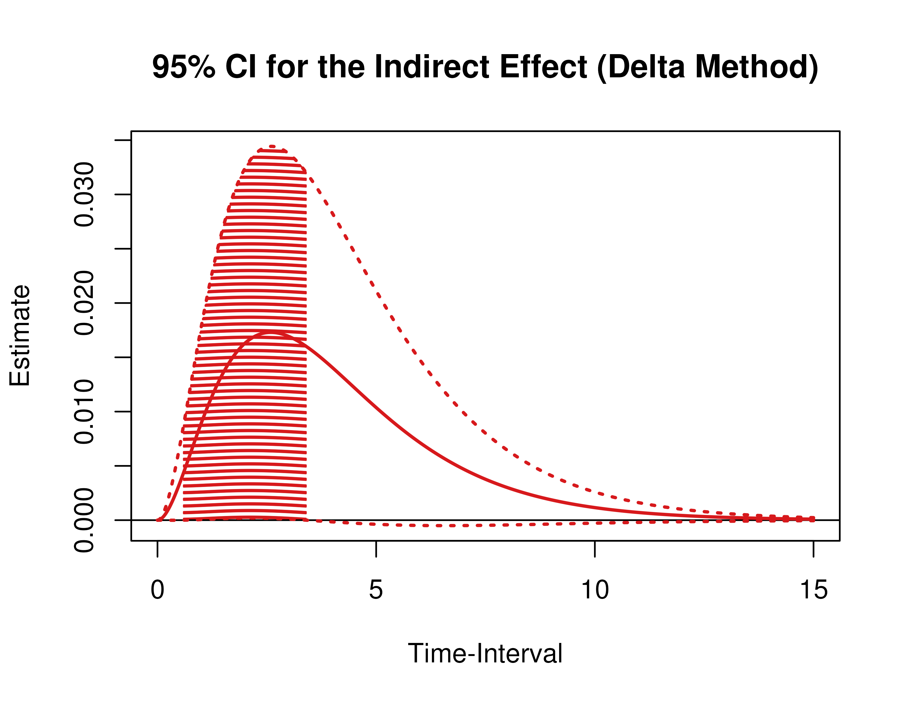

```r
library(dynr)
library(cTMed)
```

## Summary of CT-VAR Estimates


```r
summary(fit)
#> Coefficients:
#>           Estimate Std. Error t value  ci.lower  ci.upper Pr(>|t|)    
#> phi_11   -0.682289   0.091137  -7.486 -0.860914 -0.503664   <2e-16 ***
#> phi_12   -0.230881   0.100695  -2.293 -0.428240 -0.033523   0.0109 *  
#> phi_13   -0.154588   0.057133  -2.706 -0.266567 -0.042609   0.0034 ** 
#> phi_21   -0.255948   0.104128  -2.458 -0.460035 -0.051861   0.0070 ** 
#> phi_22   -0.829891   0.118322  -7.014 -1.061797 -0.597985   <2e-16 ***
#> phi_23    0.005405   0.066135   0.082 -0.124218  0.135029   0.4674    
#> phi_31    0.041008   0.130473   0.314 -0.214715  0.296730   0.3766    
#> phi_32   -0.030100   0.146146  -0.206 -0.316541  0.256340   0.4184    
#> phi_33   -0.898237   0.080969 -11.094 -1.056933 -0.739540   <2e-16 ***
#> sigma_11  1.089489   0.070942  15.357  0.950445  1.228533   <2e-16 ***
#> sigma_12 -0.780305   0.065795 -11.860 -0.909261 -0.651349   <2e-16 ***
#> sigma_13  0.482061   0.075104   6.419  0.334859  0.629263   <2e-16 ***
#> sigma_22  1.255423   0.091716  13.688  1.075663  1.435184   <2e-16 ***
#> sigma_23 -0.527300   0.083808  -6.292 -0.691560 -0.363040   <2e-16 ***
#> sigma_33  1.748546   0.138528  12.622  1.477036  2.020056   <2e-16 ***
#> ---
#> Signif. codes:  0 '***' 0.001 '**' 0.01 '*' 0.05 '.' 0.1 ' ' 1
#> 
#> -2 log-likelihood value at convergence = 10263.49
#> AIC = 10293.49
#> BIC = 10428.20
```

## Extract Elements of the Drift Matrix


```r
varnames <- c(
  "phi_11",
  "phi_21",
  "phi_31",
  "phi_12",
  "phi_22",
  "phi_32",
  "phi_13",
  "phi_23",
  "phi_33"
)
phi <- matrix(
  data = coef(fit)[varnames],
  nrow = 3
)
colnames(phi) <- rownames(phi) <- c(
  "psych_distress",
  "esteem",
  "physical_distress"
)
vcov_phi_vec <- vcov(fit)[varnames, varnames]
```

## Delta Method Confidence Intervals For The Direct, Indirect, and Total Effects

A long sequence of time-interval values makes regions of significance more visible.


```r
delta <- DeltaMed(
  phi = phi,
  vcov_phi_vec = vcov_phi_vec,
  from = "physical_distress",
  to = "esteem",
  med = "psych_distress",
  delta_t = seq(from = 0, to = 15, length.out = 1000)
)
plot(delta)
```



## Monte Carlo Method Confidence Intervals For The Direct, Indirect, and Total Effects


```r
mc <- MCMed(
  phi = phi,
  vcov_phi_vec = vcov_phi_vec,
  from = "physical_distress",
  to = "esteem",
  med = "psych_distress",
  delta_t = seq(from = 0, to = 15, length.out = 1000),
  seed = 42,
  R = 20000L
)
plot(mc)
```


