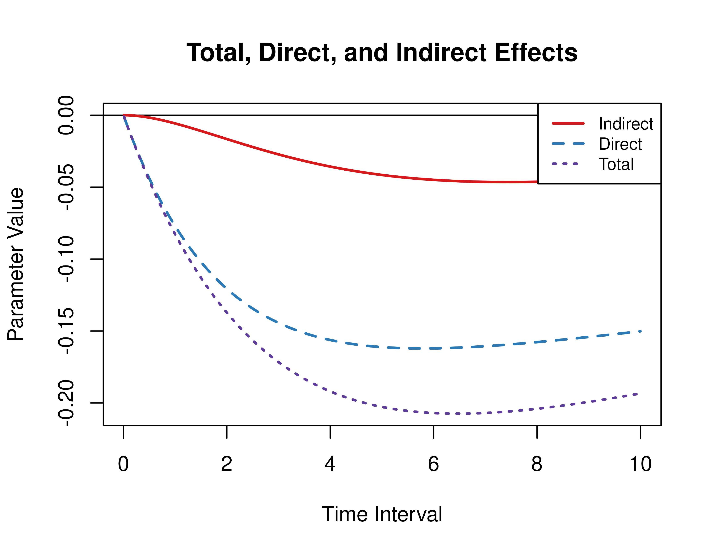

This vignette accompanies Illustrative Example 1. The goal of the example is to calculate the direct, indirect, and total effects from the continuous-time vector autoregressive model drift matrix $\boldsymbol{\Phi}$ for a specific time interval or a range of time intervals. This example features the `Med` and `MedStd` functions from the `cTMed` package.


``` r
library(dynr)
library(cTMed)
```

## Continuous-Time Vector Autoregressive Model Estimates

The object `fit` contains the fitted `dynr` model for the data set with a sample size of 133. See [Fitting the Continuous-Time Vector Autoregressive Model](https://jeksterslab.github.io/manCTMed/articles/fig-example-ct-var.html) for more details.

## Extract Elements of the Drift Matrix and the Process Noise Covariance Matrix

We extract the elements of the drift matrix and the process noise covariance matrix from the `fit` object.


``` r
# drift matrix
phi <- matrix(
  data = coef(fit)[
    c(
      "phi_11",
      "phi_21",
      "phi_31",
      "phi_12",
      "phi_22",
      "phi_32",
      "phi_13",
      "phi_23",
      "phi_33"
    )
  ],
  nrow = 3
)
# column names and row names are needed to define the indirect effects
colnames(phi) <- rownames(phi) <- c(
  "conflict",
  "knowledge",
  "competence"
)
```


``` r
# process noise covariance matrix
sigma <- matrix(
  data = coef(fit)[
    c(
      "sigma_11",
      "sigma_12",
      "sigma_13",
      "sigma_12",
      "sigma_22",
      "sigma_23",
      "sigma_13",
      "sigma_23",
      "sigma_33"
    )
  ],
  nrow = 3
)
```

## Direct, Indirect, and Total Effects of a Time Interval of Three

Using the `Med` function from the `cTMed` package, the direct, indirect, and total effects for a time interval of three are given below.


``` r
Med(
  phi = phi,
  from = "conflict",
  to = "competence",
  med = "knowledge",
  delta_t = 3
)
#> 
#> Total, Direct, and Indirect Effects
#> 
#>      interval   total  direct indirect
#> [1,]        3 -0.1716 -0.1443  -0.0273
```

## Direct, Indirect, and Total Effects of a Time Interval of Zero to Ten

Using the `Med` function from the `cTMed` package, the direct, indirect, and total effects for a range of time interval values from 0 to 10 are plotted below.


``` r
med <- Med(
  phi = phi,
  from = "conflict",
  to = "competence",
  med = "knowledge",
  delta_t = seq(from = 0, to = 10, length.out = 1000)
)
plot(med)
```



## Standardized Direct, Indirect, and Total Effects of a Time Interval of Three

Using the `MedStd` function from the `cTMed` package, the standardized direct, indirect, and total effects for a time interval of three are given below.


``` r
MedStd(
  phi = phi,
  sigma = sigma,
  from = "conflict",
  to = "competence",
  med = "knowledge",
  delta_t = 1
)
#> 
#> Total, Direct, and Indirect Effects
#> 
#>      interval   total direct indirect
#> [1,]        1 -0.0956 -0.089  -0.0066
```

## Standardized Direct, Indirect, and Total Effects of a Time Interval of Zero to Ten

Using the `Med` function from the `cTMed` package, the standardized direct, indirect, and total effects for a range of time interval values from 0 to 10 are plotted below.


``` r
med_std <- MedStd(
  phi = phi,
  sigma = sigma,
  from = "conflict",
  to = "competence",
  med = "knowledge",
  delta_t = seq(from = 0, to = 10, length.out = 1000)
)
plot(med_std)
```


