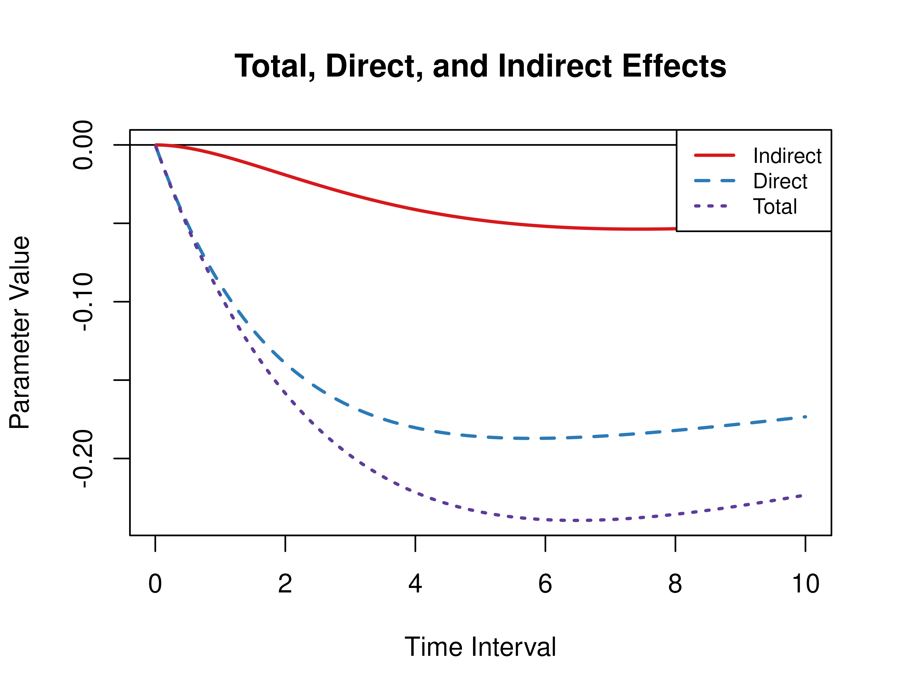

This vignette accompanies Illustrative Example 1. The goal of the example is to calculate the direct, indirect, and total effects from the continuous-time vector autoregressive model drift matrix $\boldsymbol{\Phi}$ for a range of time intervals. This example features the `Med` and `MedStd` functions from the `cTMed` package.

> **_NOTE:_**  The code to fit the continous-time vector autoregressive model in `dynr` is provided at the end of this vignette.


``` r
library(dynr)
library(cTMed)
```

## Summary of CT-VAR Estimates

The object `fit` contains the fitted `dynr` model for the data set with a sample size of 133. See the script used to fit the CT-VAR model below.


``` r
summary(fit)
#> Coefficients:
#>           Estimate Std. Error t value  ci.lower  ci.upper Pr(>|t|)    
#> phi_11   -0.033660   0.022452  -1.499 -0.077665  0.010346   0.0670 .  
#> phi_12    0.037812   0.036990   1.022 -0.034688  0.110312   0.1534    
#> phi_13   -0.013204   0.033136  -0.398 -0.078149  0.051742   0.3452    
#> phi_21   -0.152328   0.061236  -2.488 -0.272348 -0.032308   0.0065 ** 
#> phi_22   -0.590292   0.176377  -3.347 -0.935986 -0.244599   0.0004 ***
#> phi_23    0.230222   0.113756   2.024  0.007264  0.453180   0.0215 *  
#> phi_31   -0.100440   0.056630  -1.774 -0.211432  0.010553   0.0381 *  
#> phi_32    0.105504   0.106899   0.987 -0.104015  0.315023   0.1619    
#> phi_33   -0.515121   0.145912  -3.530 -0.801103 -0.229139   0.0002 ***
#> sigma_11  0.057709   0.022959   2.514  0.012710  0.102708   0.0060 ** 
#> sigma_12 -0.008653   0.029841  -0.290 -0.067140  0.049834   0.3859    
#> sigma_13  0.010219   0.028178   0.363 -0.045009  0.065447   0.3584    
#> sigma_22  0.746297   0.314849   2.370  0.129204  1.363389   0.0089 ** 
#> sigma_23  0.099176   0.082421   1.203 -0.062366  0.260718   0.1145    
#> sigma_33  0.841669   0.292439   2.878  0.268499  1.414839   0.0020 ** 
#> theta_11  0.104822   0.016744   6.260  0.072004  0.137639   <2e-16 ***
#> theta_22  0.171724   0.098249   1.748 -0.020839  0.364288   0.0403 *  
#> theta_33  0.078653   0.091566   0.859 -0.100812  0.258118   0.1952    
#> ---
#> Signif. codes:  0 '***' 0.001 '**' 0.01 '*' 0.05 '.' 0.1 ' ' 1
#> 
#> -2 log-likelihood value at convergence = 3569.91
#> AIC = 3605.91
#> BIC = 3719.75
```

## Extract Elements of the Drift Matrix and the Process Noise Covariance Matrix

We extract the elements of the drift matrix and the process noise covariance matrix from the `fit` object.


``` r
# drift matrix
varnames <- c(
  "phi_11",
  "phi_21",
  "phi_31",
  "phi_12",
  "phi_22",
  "phi_32",
  "phi_13",
  "phi_23",
  "phi_33"
)
phi <- matrix(
  data = coef(fit)[varnames],
  nrow = 3
)
colnames(phi) <- rownames(phi) <- c(
  "conflict",
  "knowledge",
  "competence"
)
```


``` r
# process noise covariance matrix
varnames <- c(
  "sigma_11",
  "sigma_12",
  "sigma_13",
  "sigma_12",
  "sigma_22",
  "sigma_23",
  "sigma_13",
  "sigma_23",
  "sigma_33"
)
sigma <- matrix(
  data = coef(fit)[varnames],
  nrow = 3
)
```

## Direct, Indirect, and Total Effects of a Time Interval of One

Using the `Med` function from the `cTMed` package, the direct, indirect, and total effects for a time interval of one are given below.


``` r
Med(
  phi = phi,
  from = "conflict",
  to = "competence",
  med = "knowledge",
  delta_t = 1
)
#> 
#> Total, Direct, and Indirect Effects
#> 
#>      interval   total  direct indirect
#> [1,]        1 -0.0828 -0.0771  -0.0057
```

## Direct, Indirect, and Total Effects of a Time Interval of Zero to Ten

Using the `Med` function from the `cTMed` package, the direct, indirect, and total effects for a range of time interval values from 0 to 10 are plotted below.


``` r
med <- Med(
  phi = phi,
  from = "conflict",
  to = "competence",
  med = "knowledge",
  delta_t = seq(from = 0, to = 10, length.out = 1000)
)
plot(med)
```


## Standardized Direct, Indirect, and Total Effects of a Time Interval of One

Using the `MedStd` function from the `cTMed` package, the standardized direct, indirect, and total effects for a time interval of one are given below.


``` r
MedStd(
  phi = phi,
  sigma = sigma,
  from = "conflict",
  to = "competence",
  med = "knowledge",
  delta_t = 1
)
#> 
#> Total, Direct, and Indirect Effects
#> 
#>      interval   total direct indirect
#> [1,]        1 -0.0956 -0.089  -0.0066
```

## Standardized Direct, Indirect, and Total Effects of a Time Interval of Zero to Ten

Using the `Med` function from the `cTMed` package, the standardized direct, indirect, and total effects for a range of time interval values from 0 to 10 are plotted below.


``` r
med_std <- MedStd(
  phi = phi,
  sigma = sigma,
  from = "conflict",
  to = "competence",
  med = "knowledge",
  delta_t = seq(from = 0, to = 10, length.out = 1000)
)
plot(med_std)
```



<details>
<summary>
Code to fit the CT-VAR model.
</summary>
```r
varnames <- c(
  "conflict",
  "knowledge",
  "competence"
)
data <- dynUtils::InsertNA(
  data = data,
  id = "id",
  time = "time",
  observed = varnames,
  delta_t = 0.10,
  ncores = parallel::detectCores()
)
n_manifest <- 3
n_latent <- 3
# starting values
phi_11 <- 0
phi_12 <- 0
phi_13 <- 0
phi_21 <- 0
phi_22 <- 0
phi_23 <- 0
phi_31 <- 0
phi_32 <- 0
phi_33 <- 0
sigma_11 <- .10
sigma_12 <- 0
sigma_13 <- 0
sigma_22 <- .10
sigma_23 <- 0
sigma_33 <- .10
theta_11 <- .10
theta_22 <- .10
theta_33 <- .10
sigma <- matrix(
  data = c(
    sigma_11, sigma_12, sigma_13,
    sigma_12, sigma_22, sigma_23,
    sigma_13, sigma_23, sigma_33
  ),
  nrow = n_latent
)
theta <- diag(
  c(
    theta_11,
    theta_22,
    theta_33
  ),
  nrow = n_latent
)
library(dynr)
dynr_data <- dynr::dynr.data(
  dataframe = data,
  id = "id",
  time = "time",
  observed = varnames
)
data_0 <- data[which(data[, "time"] == 0), ]
dynr_initial <- dynr::prep.initial(
  values.inistate = colMeans(data_0)[varnames],
  params.inistate = rep(x = "fixed", times = n_latent),
  values.inicov = cov(data_0)[varnames, varnames],
  params.inicov = matrix(
    data = "fixed",
    nrow = n_latent,
    ncol = n_latent
  )
)
dynr_measurement <- dynr::prep.measurement(
  values.load = diag(n_manifest),
  params.load = matrix(
    data = "fixed",
    nrow = n_manifest,
    ncol = n_manifest
  ),
  state.names = paste0(
    "eta_",
    varnames
  ),
  obs.names = varnames
)
dynr_dynamics <- dynr::prep.formulaDynamics(
  formula = list(
    eta_conflict ~ (phi_11 * eta_conflict) + (phi_12 * eta_knowledge) + (phi_13 * eta_competence),
    eta_knowledge ~ (phi_21 * eta_conflict) + (phi_22 * eta_knowledge) + (phi_23 * eta_competence),
    eta_competence ~ (phi_31 * eta_conflict) + (phi_32 * eta_knowledge) + (phi_33 * eta_competence)
  ),
  startval = c(
    phi_11 = phi_11,
    phi_12 = phi_12,
    phi_13 = phi_13,
    phi_21 = phi_21,
    phi_22 = phi_22,
    phi_23 = phi_23,
    phi_31 = phi_31,
    phi_32 = phi_32,
    phi_33 = phi_33
  ),
  isContinuousTime = TRUE
)
dynr_noise <- dynr::prep.noise(
  values.latent = sigma,
  params.latent = matrix(
    data = c(
      "sigma_11", "sigma_12", "sigma_13",
      "sigma_12", "sigma_22", "sigma_23",
      "sigma_13", "sigma_23", "sigma_33"
    ),
    nrow = n_latent
  ),
  values.observed = theta,
  params.observed = matrix(
    data = c(
      "theta_11", "fixed", "fixed",
      "fixed", "theta_22", "fixed",
      "fixed", "fixed", "theta_33"
    ),
    nrow = n_manifest,
    ncol = n_manifest
  )
)
model <- dynr::dynr.model(
  data = dynr_data,
  initial = dynr_initial,
  measurement = dynr_measurement,
  dynamics = dynr_dynamics,
  noise = dynr_noise,
  outfile = file.path(
    tempdir(),
    paste0(
      "example-ct-dynr-",
      n,
      ".c"
    )
  )
)
lb <- ub <- rep(NA, times = length(model$xstart))
names(ub) <- names(lb) <- names(model$xstart)
lb[
  c(
    "phi_11",
    "phi_21",
    "phi_31",
    "phi_12",
    "phi_22",
    "phi_32",
    "phi_13",
    "phi_23",
    "phi_33"
  )
] <- -1.5
ub[
  c(
    "phi_11",
    "phi_21",
    "phi_31",
    "phi_12",
    "phi_22",
    "phi_32",
    "phi_13",
    "phi_23",
    "phi_33"
  )
] <- 1.5
ub[
  c(
    "phi_11",
    "phi_22",
    "phi_33"
  )
] <- 0
lb[
  c(
    "sigma_11",
    "sigma_22",
    "sigma_33"
  )
] <- .Machine$double.xmin
lb[
  c(
    "theta_11",
    "theta_22",
    "theta_33"
  )
] <- .Machine$double.xmin
model$lb <- lb
model$ub <- ub
fit <- dynr::dynr.cook(
  model,
  verbose = FALSE
)
print(summary(fit))
coef(model) <- coef(fit)
fit <- dynr::dynr.cook(
  model,
  verbose = FALSE
)
```
</details>
