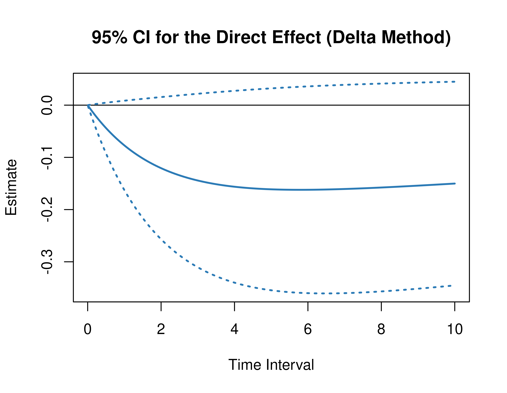
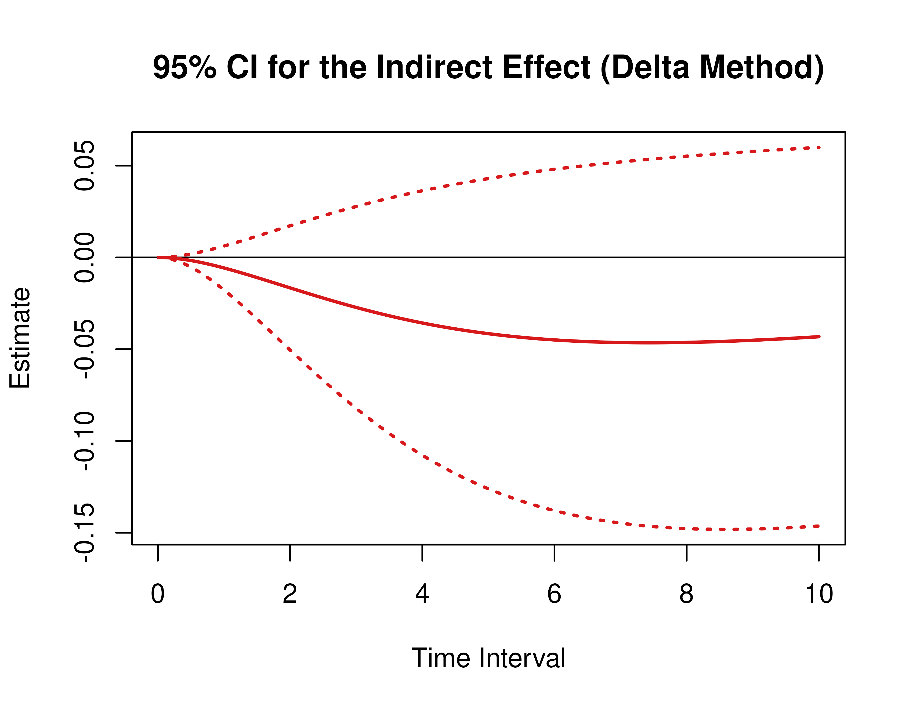

This vignette accompanies Illustrative Example 3. The goal of the example is to visualize regions of significance, that is, a range of time intervals, where the effects are significantly different from zero, using confidence intervals for the direct, indirect, and total effects from the continuous-time vector autoregressive model drift matrix $\boldsymbol{\Phi}$ for a range of time intervals. This example features `plot` methods for the `DeltaMed`, `MCMed`, `BootMed`, `DeltaMedStd`, `MCMedStd`, and `BootMedStd` functions from the `cTMed` package.


``` r
library(dynr)
library(simStateSpace)
library(cTMed)
```

## Continuous-Time Vector Autoregressive Model Estimates

The object `fit` contains the fitted `dynr` model for the data set with a sample size of 133. See [Fitting the Continuous-Time Vector Autoregressive Model](https://jeksterslab.github.io/manCTMed/articles/fig-example-ct-var.html) for more details.

## Extract Elements of the Drift Matrix and the Process Noise Covariance Matrix

We extract the elements of the drift matrix and the process noise covariance matrix and their corresponding sampling covariance matrix from the `fit` object.


``` r
# drift matrix
phi_names <- c(
  "phi_11",
  "phi_21",
  "phi_31",
  "phi_12",
  "phi_22",
  "phi_32",
  "phi_13",
  "phi_23",
  "phi_33"
)
phi <- matrix(
  data = coef(fit)[phi_names],
  nrow = 3
)
# column names and row names are needed to define the indirect effects
colnames(phi) <- rownames(phi) <- c(
  "conflict",
  "knowledge",
  "competence"
)
vcov_phi_vec <- vcov(fit)[phi_names, phi_names]
```


``` r
# process noise covariance matrix
sigma_names <- c(
  "sigma_11",
  "sigma_12",
  "sigma_13",
  "sigma_12",
  "sigma_22",
  "sigma_23",
  "sigma_13",
  "sigma_23",
  "sigma_33"
)
sigma <- matrix(
  data = coef(fit)[sigma_names],
  nrow = 3
)
```


``` r
# measurement error covariance matrix
theta_names <- c(
  "theta_11",
  "theta_22",
  "theta_33"
)
theta <- diag(3)
diag(theta) <- coef(fit)[theta_names]
```


``` r
# combining the drift matrix and the process noise covariance matrix
phi_sigma_names <- c(
  "phi_11",
  "phi_21",
  "phi_31",
  "phi_12",
  "phi_22",
  "phi_32",
  "phi_13",
  "phi_23",
  "phi_33",
  "sigma_11",
  "sigma_12",
  "sigma_13",
  "sigma_22",
  "sigma_23",
  "sigma_33"
)
vcov_theta <- matrix(
  data = vcov(fit)[phi_sigma_names, phi_sigma_names],
  nrow = length(phi_sigma_names)
)
```

## Delta Method Confidence Intervals For The Direct, Indirect, and Total Effects

Using the `DeltaMed` function from the `cTMed` package, confidence intervals for the direct, indirect, and total effects for a long sequence of time interval values are generated. This makes regions of significance more visible. Consider using the `ncores` argument to use multiple cores when the `delta_t` vector is long. The `plot` method for the `DeltaMed` presents the regions of significance visually represented by shaded areas in the plot.


``` r
delta <- DeltaMed(
  phi = phi,
  vcov_phi_vec = vcov_phi_vec,
  delta_t = seq(from = 0, to = 10, length.out = 1000),
  from = "conflict",
  to = "competence",
  med = "knowledge",
  ncores = parallel::detectCores()
)
plot(delta)
```



## Monte Carlo Method Confidence Intervals For The Direct, Indirect, and Total Effects

Using the `MCMed` function from the `cTMed` package, confidence intervals for the direct, indirect, and total effects for a long sequence of time interval values are generated. This makes regions of significance more visible. Consider using the `ncores` argument to use multiple cores when the `delta_t` vector is long. The `plot` method for the `MCMed` presents the regions of significance visually represented by shaded areas in the plot.


``` r
mc <- MCMed(
  phi = phi,
  vcov_phi_vec = vcov_phi_vec,
  delta_t = seq(from = 0, to = 10, length.out = 1000),
  from = "conflict",
  to = "competence",
  med = "knowledge",
  R = 20000L,
  ncores = parallel::detectCores(), # use multiple cores
  seed = 42
)
plot(mc)
```


## Parametric Bootstrap Method Confidence Intervals For The Direct, Indirect, and Total Effects

The parametric bootstrap approach involves generating data from the parametric model and fitting the model on the generated data multipke times. The data generation and model fitting is hadled by the `simStateSpace` package. The estimated parameters are passed as arguments to the `PBSSMOUFixed` function from the `simStateSpace` package, which generates a parametric bootstrap sampling distribution of the parameter estimates. The argument `R` specifies the number of bootstrap replications. The generated data and model estimates are be stored in `path` using the specified `prefix` for the file names. The `ncores = parallel::detectCores()` argument instructs the function to use all available CPU cores in the system.

> **_NOTE:_**  Fitting the CT-VAR model multiple times is computationally intensive. 


``` r
R <- 1000L
path <- root$find_file(
  ".setup",
  "data-raw"
)
prefix <- "pb_example_133"
```


``` r
phi_hat <- phi
sigma_hat <- sigma
nu <- c(0, 0, 0)
lambda <- diag(3)
```


``` r
# fixed mu0 and sigma0
data("grundy2007", package = "manCTMed")
data_0 <- grundy2007[which(grundy2007[, "time"] == 0), ]
varnames <- c(
  "conflict",
  "knowledge",
  "competence"
)
mu0 <- colMeans(data_0)[varnames]
sigma0 <- cov(data_0)[varnames, varnames]
```


``` r
boot <- PBSSMOUFixed(
  R = R,
  path = path,
  prefix = prefix,
  n = 133,
  time = 30,
  delta_t = 0.10,
  mu0 = mu0,
  sigma0_l = t(chol(sigma0)),
  mu = c(0, 0, 0),
  phi = phi,
  sigma_l = t(chol(sigma)),
  nu = nu,
  lambda = lambda,
  theta_l = t(chol(theta)),
  mu0_fixed = TRUE,
  sigma0_fixed = TRUE,
  ncores = parallel::detectCores(),
  seed = 42
)
```

Using the `BootMed` function from the `cTMed` package, confidence intervals for the direct, indirect, and total effects for a long sequence of time interval values are generated. This makes regions of significance more visible. Consider using the `ncores` argument to use multiple cores when the `delta_t` vector is long. The `plot` method for the `BootMed` presents the regions of significance visually represented by shaded areas in the plot.


``` r
pb <- BootMed(
  phi = extract(object = boot, what = "phi"), # extracts the bootstrap drift matrices
  phi_hat = phi_hat,
  delta_t = seq(from = 0, to = 10, length.out = 1000),
  from = "conflict",
  to = "competence",
  med = "knowledge",
  ncores = parallel::detectCores()
)
plot(pb)
```


``` r
plot(pb, type = "bc") # bias-corrected
```


## Delta Method Confidence Intervals For The Standardized Direct, Indirect, and Total Effects

Using the `DeltaMedStd` function from the `cTMed` package, confidence intervals for the direct, indirect, and total effects for a long sequence of time interval values are generated.


``` r
delta_std <- DeltaMedStd(
  phi = phi,
  sigma = sigma,
  vcov_theta = vcov_theta,
  delta_t = seq(from = 0, to = 10, length.out = 1000),
  from = "conflict",
  to = "competence",
  med = "knowledge",
  ncores = parallel::detectCores()
)
plot(delta_std)
```


## Monte Carlo Method Confidence Intervals For The Standardized Direct, Indirect, and Total Effects

Using the `MCMedStd` function from the `cTMed` package, confidence intervals for the standardized direct, indirect, and total effects for a time interval of one, two, and three are given below.


``` r
mc_std <- MCMedStd(
  phi = phi,
  sigma = sigma,
  vcov_theta = vcov_theta,
  delta_t = seq(from = 0, to = 10, length.out = 1000),
  from = "conflict",
  to = "competence",
  med = "knowledge",
  R = 20000L,
  ncores = parallel::detectCores(),
  seed = 42
)
plot(mc_std)
```


## Parametric Bootstrap Method Confidence Intervals For The Standardized Direct, Indirect, and Total Effects

Using the `MCMedStd` function from the `cTMed` package, confidence intervals for the standardized direct, indirect, and total effects for a time interval of one, two, and three are given below.


``` r
pb <- BootMedStd(
  phi = extract(object = boot, what = "phi"), # extracts the bootstrap drift matrices
  sigma = extract(object = boot, what = "sigma"), # extracts the bootstrap process noise covariance matrices
  phi_hat = phi_hat,
  sigma_hat = sigma_hat,
  delta_t = seq(from = 0, to = 10, length.out = 1000),
  from = "conflict",
  to = "competence",
  med = "knowledge",
  ncores = parallel::detectCores()
)
plot(pb)
```


``` r
plot(pb, type = "bc")
```


