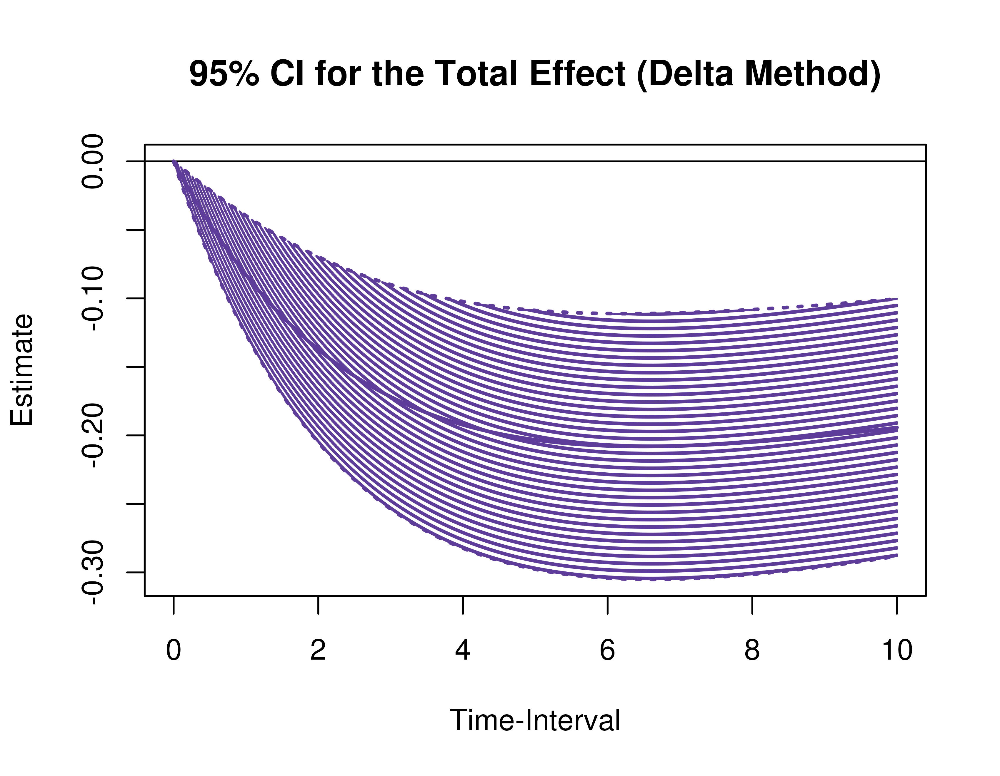
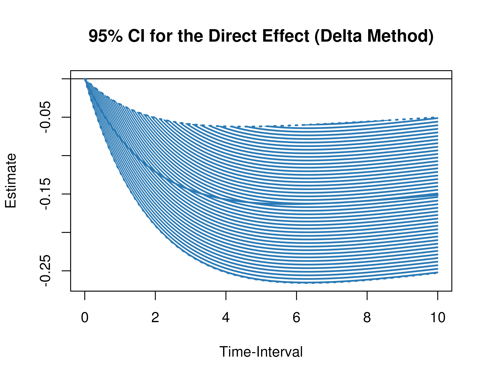
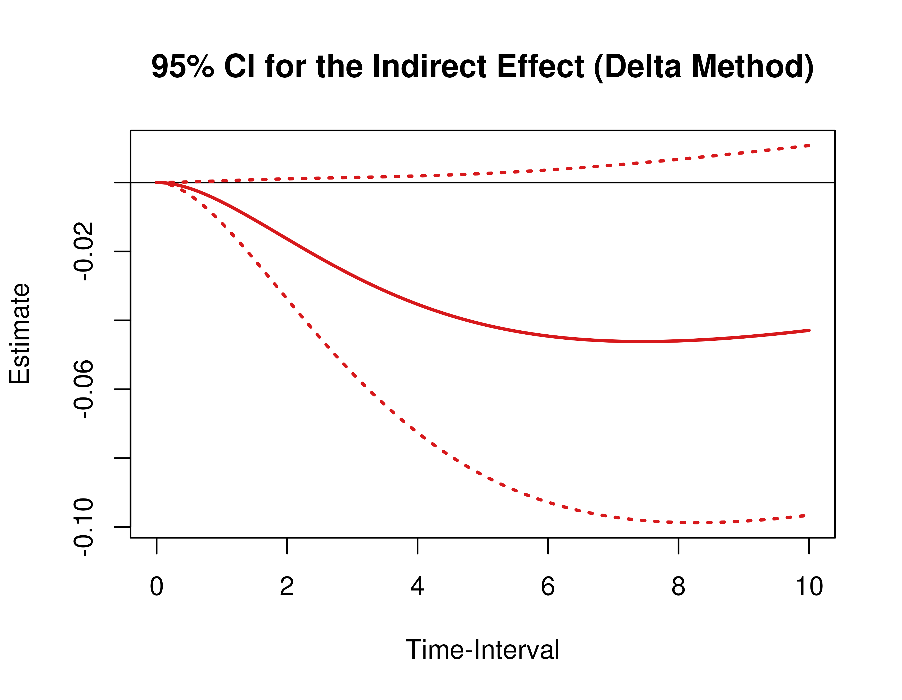
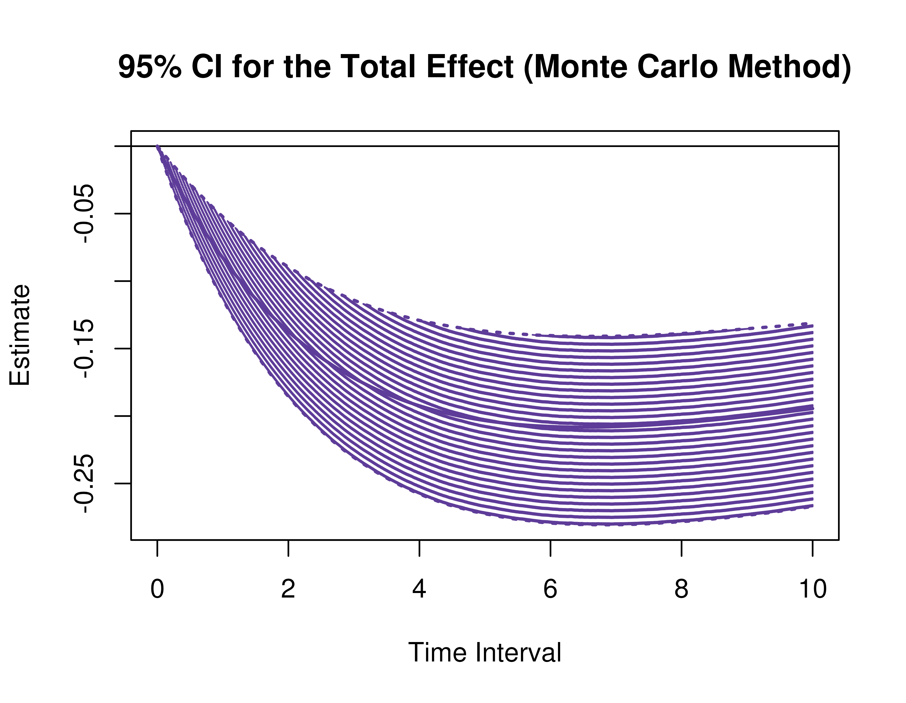
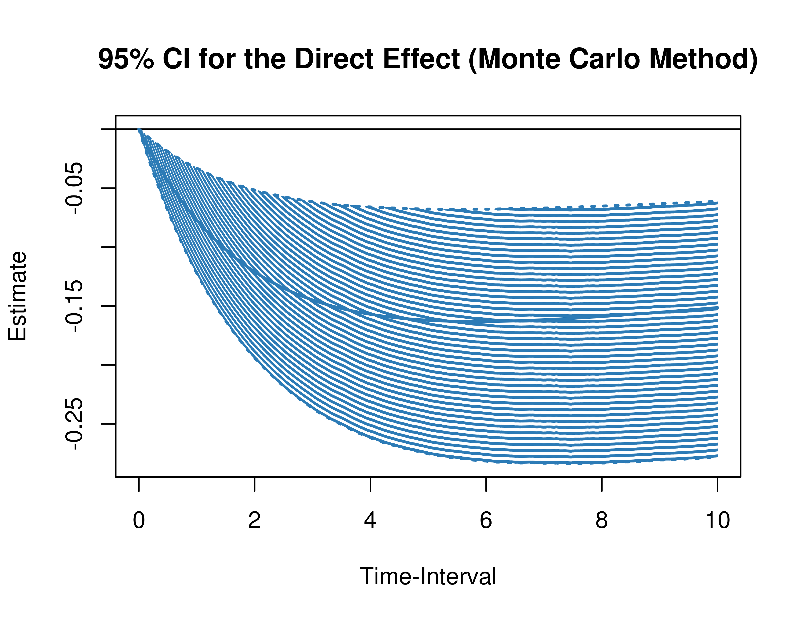
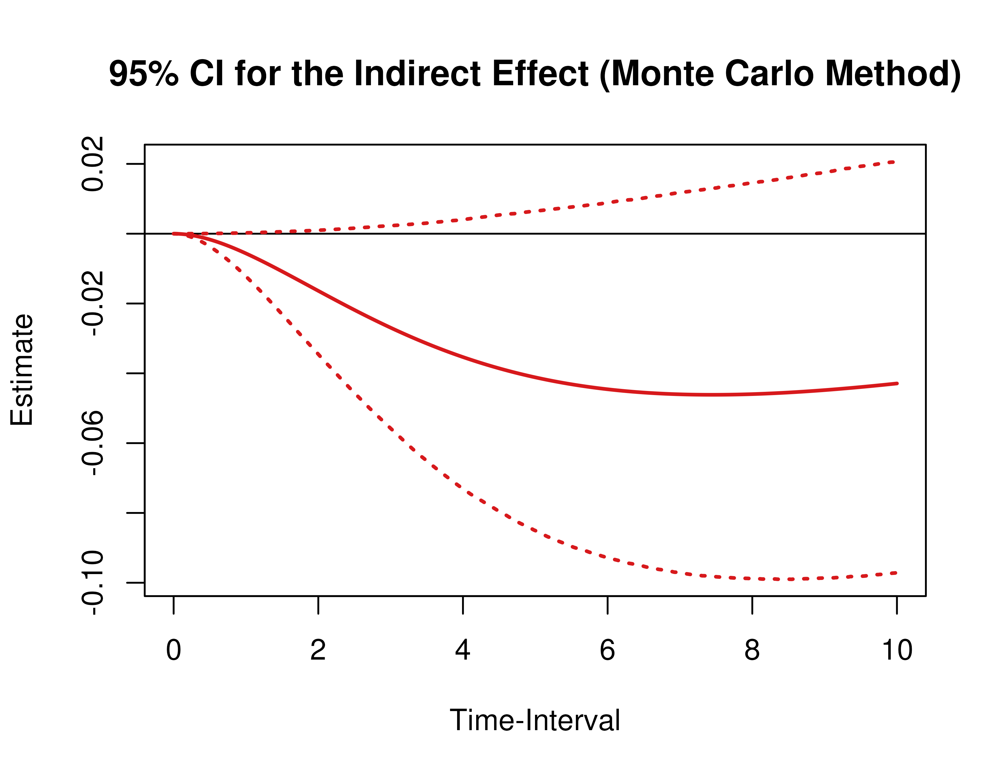

```r
library(dynr)
library(cTMed)
```

## Summary of CT-VAR Estimates


```r
summary(fit)
#> Coefficients:
#>            Estimate Std. Error t value   ci.lower   ci.upper Pr(>|t|)    
#> phi_11   -0.0335015  0.0115834  -2.892 -0.0562045 -0.0107985  0.00192 ** 
#> phi_12    0.0378995  0.0190828   1.986  0.0004979  0.0753011  0.02352 *  
#> phi_13   -0.0132453  0.0170977  -0.775 -0.0467563  0.0202656  0.21927    
#> phi_21   -0.1517373  0.0314688  -4.822 -0.2134150 -0.0900596  < 2e-16 ***
#> phi_22   -0.5861297  0.0908420  -6.452 -0.7641768 -0.4080827  < 2e-16 ***
#> phi_23    0.2282876  0.0585998   3.896  0.1134340  0.3431411    5e-05 ***
#> phi_31   -0.1003889  0.0291247  -3.447 -0.1574722 -0.0433056  0.00028 ***
#> phi_32    0.1040908  0.0551386   1.888 -0.0039789  0.2121605  0.02954 *  
#> phi_33   -0.5118440  0.0752570  -6.801 -0.6593451 -0.3643429  < 2e-16 ***
#> sigma_11  0.0579308  0.0119040   4.867  0.0345995  0.0812621  < 2e-16 ***
#> sigma_12 -0.0086746  0.0154201  -0.563 -0.0388974  0.0215483  0.28688    
#> sigma_13  0.0102638  0.0145734   0.704 -0.0182996  0.0388271  0.24063    
#> sigma_22  0.7424345  0.1621833   4.578  0.4245610  1.0603081  < 2e-16 ***
#> sigma_23  0.1011136  0.0425308   2.377  0.0177547  0.1844725  0.00872 ** 
#> sigma_33  0.8388809  0.1509879   5.556  0.5429501  1.1348116  < 2e-16 ***
#> theta_11  0.1054679  0.0086864  12.142  0.0884428  0.1224929  < 2e-16 ***
#> theta_22  0.1752225  0.0508289   3.447  0.0755996  0.2748453  0.00028 ***
#> theta_33  0.0815182  0.0474585   1.718 -0.0114988  0.1745351  0.04294 *  
#> ---
#> Signif. codes:  0 '***' 0.001 '**' 0.01 '*' 0.05 '.' 0.1 ' ' 1
#> 
#> -2 log-likelihood value at convergence = 13453.10
#> AIC = 13489.10
#> BIC = 13626.78
```

## Extract Elements of the Drift Matrix


```r
varnames <- c(
  "phi_11",
  "phi_21",
  "phi_31",
  "phi_12",
  "phi_22",
  "phi_32",
  "phi_13",
  "phi_23",
  "phi_33"
)
phi <- matrix(
  data = coef(fit)[varnames],
  nrow = 3
)
colnames(phi) <- rownames(phi) <- c(
  "conflict",
  "knowledge",
  "competence"
)
vcov_phi_vec <- vcov(fit)[varnames, varnames]
```

## Delta Method Confidence Intervals For The Direct, Indirect, and Total Effects

A long sequence of time-interval values makes regions of significance more visible.


```r
delta <- DeltaMed(
  phi = phi,
  vcov_phi_vec = vcov_phi_vec,
  from = "conflict",
  to = "competence",
  med = "knowledge",
  delta_t = seq(from = 0, to = 10, length.out = 1000)
)
plot(delta)
```



## Monte Carlo Method Confidence Intervals For The Direct, Indirect, and Total Effects


```r
mc <- MCMed(
  phi = phi,
  vcov_phi_vec = vcov_phi_vec,
  from = "conflict",
  to = "competence",
  med = "knowledge",
  delta_t = seq(from = 0, to = 10, length.out = 1000),
  seed = 42,
  R = 20000L
)
plot(mc)
```




