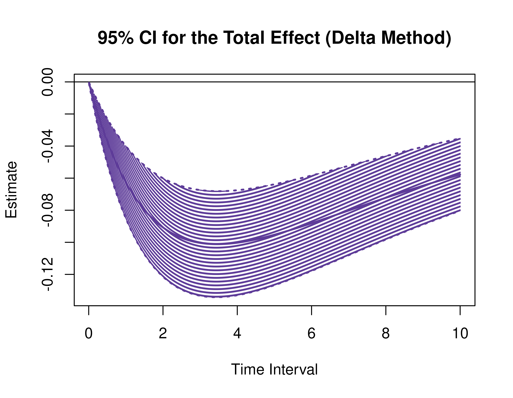
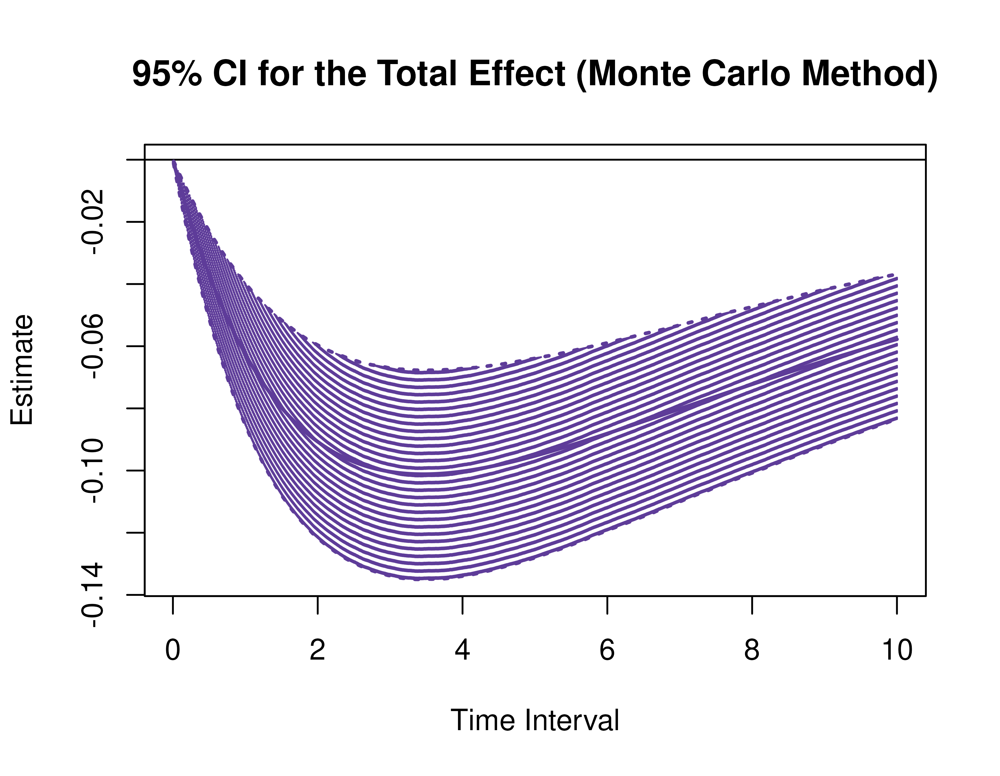
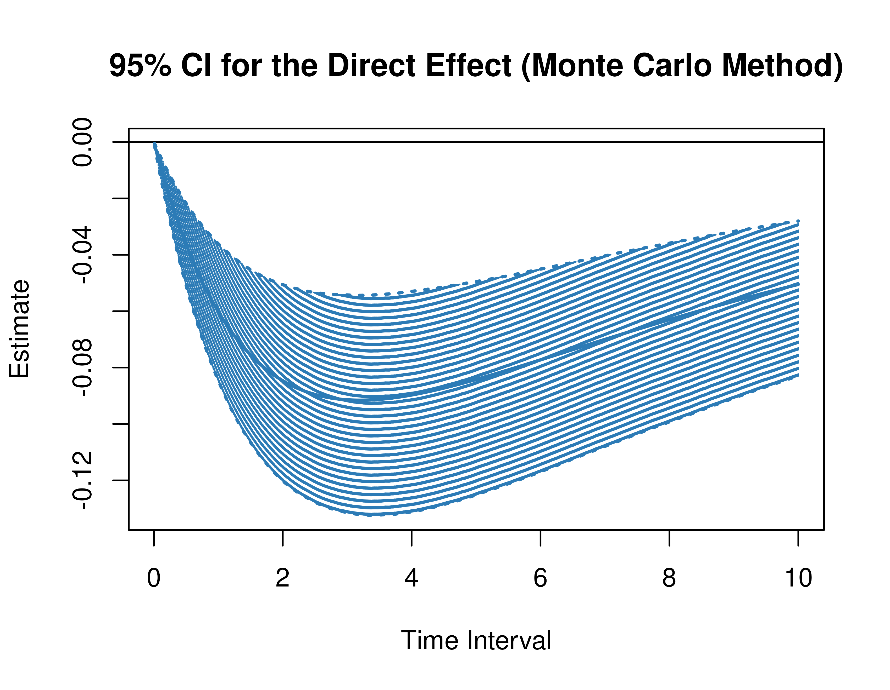
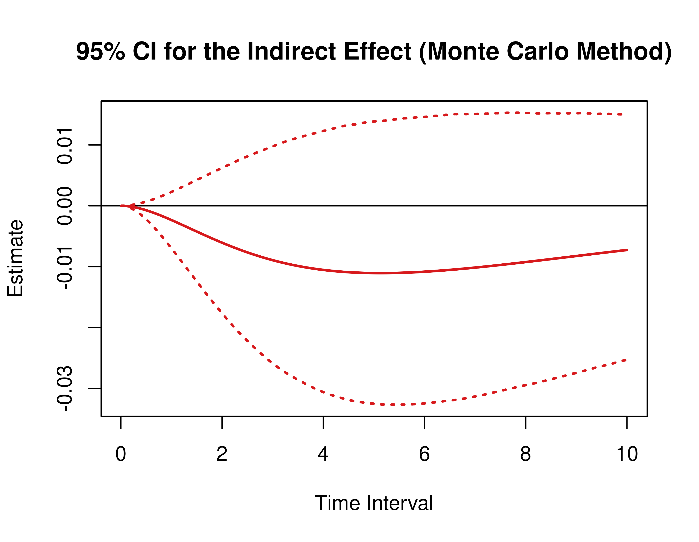
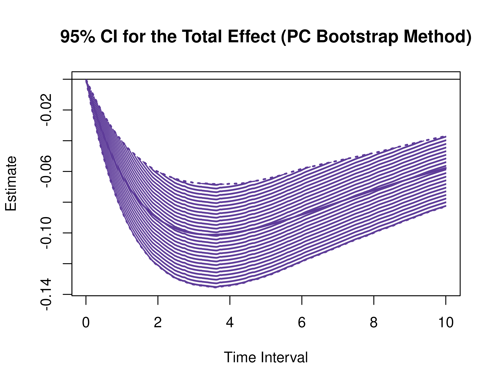
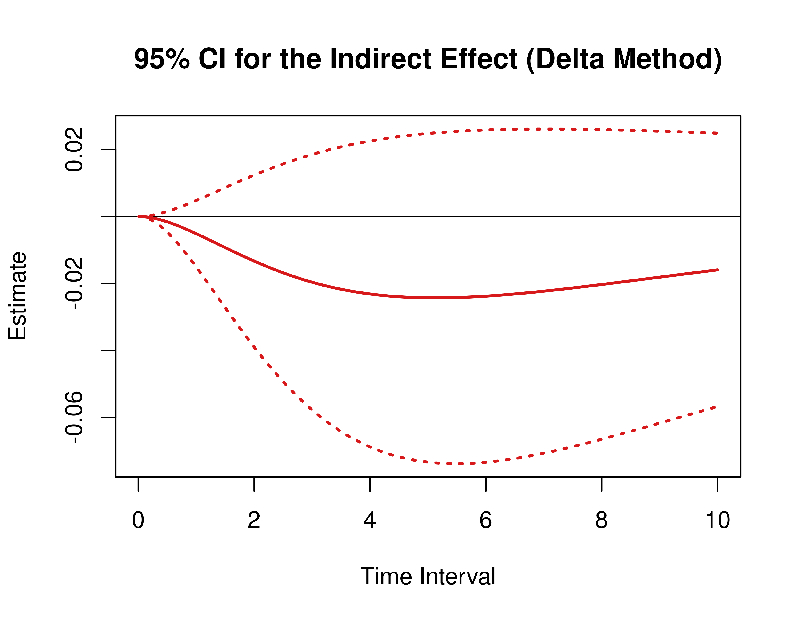
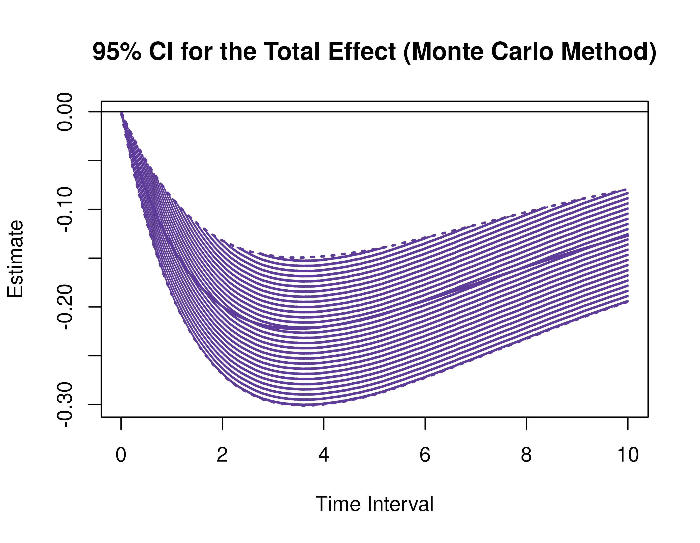
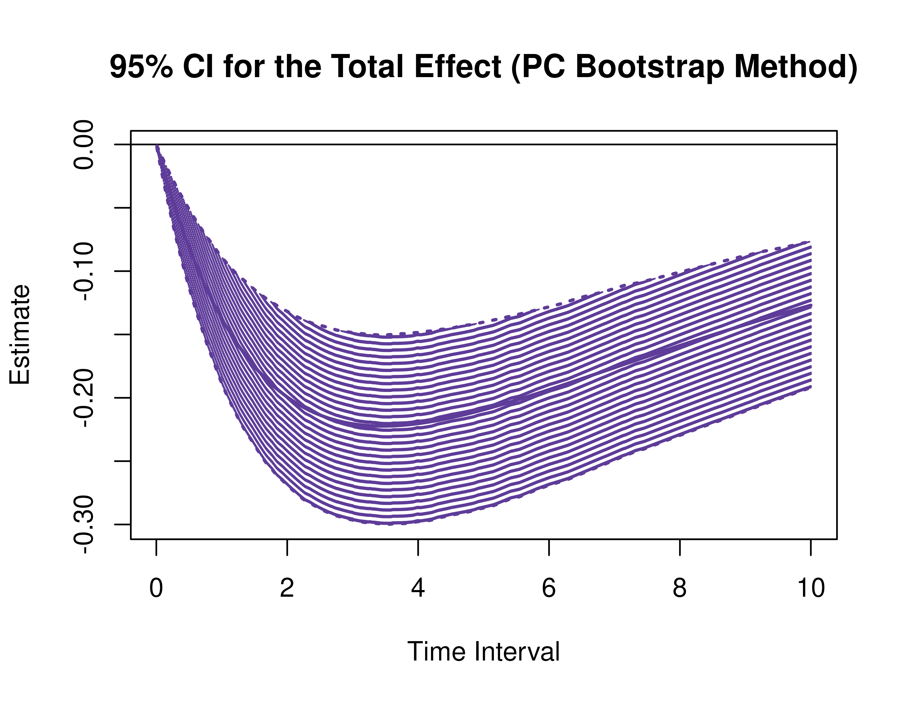

This vignette accompanies Illustration 3. The goal of the illustration is to visualize regions of significance, that is, a range of time intervals, where the effects are significantly different from zero, using confidence intervals for the direct, indirect, and total effects from the continuous-time vector autoregressive model drift matrix $\boldsymbol{\Phi}$ and process noise covariance matrix $\boldsymbol{\Sigma}$ for a range of time intervals. This example features `plot` methods for the `DeltaMed`, `MCMed`, `BootMed`, `DeltaMedStd`, `MCMedStd`, and `BootMedStd` functions from the `cTMed` package.


``` r
library(bootStateSpace)
library(cTMed)
```

## Continuous-Time Vector Autoregressive Model Estimates

The object `fit` contains the fitted `dynr` model. Data is generated using the `manCTMed::IllustrationGenData` function. The model was fitted using the `manCTMed::IllustrationFitDynr`.


``` r
summary(fit)
#> Coefficients:
#>             Estimate Std. Error t value   ci.lower   ci.upper Pr(>|t|)    
#> phi_11    -0.1157754  0.0174197  -6.646 -0.1499173 -0.0816334   <2e-16 ***
#> phi_12     0.0203747  0.0550571   0.370 -0.0875352  0.1282846   0.3557    
#> phi_13    -0.0070992  0.0535302  -0.133 -0.1120165  0.0978181   0.4472    
#> phi_21    -0.1226909  0.0187426  -6.546 -0.1594258 -0.0859560   <2e-16 ***
#> phi_22    -0.8819998  0.0653717 -13.492 -1.0101259 -0.7538737   <2e-16 ***
#> phi_23     0.4737224  0.0594135   7.973  0.3572740  0.5901708   <2e-16 ***
#> phi_31    -0.0877980  0.0178492  -4.919 -0.1227817 -0.0528143   <2e-16 ***
#> phi_32     0.0595814  0.0586861   1.015 -0.0554414  0.1746041   0.1550    
#> phi_33    -0.6636176  0.0616495 -10.764 -0.7844485 -0.5427867   <2e-16 ***
#> sigma_11   0.0954899  0.0049239  19.393  0.0858393  0.1051405   <2e-16 ***
#> sigma_12   0.0009624  0.0040987   0.235 -0.0070710  0.0089957   0.4072    
#> sigma_13   0.0070297  0.0040069   1.754 -0.0008237  0.0148830   0.0397 *  
#> sigma_22   0.1027182  0.0078961  13.009  0.0872422  0.1181942   <2e-16 ***
#> sigma_23   0.0009240  0.0049248   0.188 -0.0087285  0.0105764   0.4256    
#> sigma_33   0.0991956  0.0074695  13.280  0.0845558  0.1138355   <2e-16 ***
#> theta_11   0.1016133  0.0014901  68.194  0.0986928  0.1045338   <2e-16 ***
#> theta_22   0.0996380  0.0015668  63.592  0.0965671  0.1027089   <2e-16 ***
#> theta_33   0.0992561  0.0015460  64.202  0.0962260  0.1022862   <2e-16 ***
#> mu0_1     -0.1217526  0.0521444  -2.335 -0.2239538 -0.0195514   0.0098 ** 
#> mu0_2      0.0160785  0.0279075   0.576 -0.0386192  0.0707762   0.2823    
#> mu0_3      0.0204163  0.0288928   0.707 -0.0362125  0.0770451   0.2399    
#> sigma0_11  0.3346315  0.0446548   7.494  0.2471097  0.4221533   <2e-16 ***
#> sigma0_12 -0.0644525  0.0177503  -3.631 -0.0992424 -0.0296626   0.0001 ***
#> sigma0_13 -0.0519690  0.0179974  -2.888 -0.0872433 -0.0166946   0.0019 ** 
#> sigma0_22  0.0691741  0.0127707   5.417  0.0441439  0.0942043   <2e-16 ***
#> sigma0_23  0.0364469  0.0098132   3.714  0.0172134  0.0556805   0.0001 ***
#> sigma0_33  0.0792446  0.0137057   5.782  0.0523819  0.1061072   <2e-16 ***
#> ---
#> Signif. codes:  0 '***' 0.001 '**' 0.01 '*' 0.05 '.' 0.1 ' ' 1
#> 
#> -2 log-likelihood value at convergence = 32662.46
#> AIC = 32716.46
#> BIC = 32919.11
```

## Parameter Estimates

We extract parameter estimates from the `fit` object.


``` r
# drift matrix
phi <- matrix(
  data = coef(fit)[
    c(
      "phi_11", "phi_21", "phi_31",
      "phi_12", "phi_22", "phi_32",
      "phi_13", "phi_23", "phi_33"
    )
  ],
  nrow = 3
)
# column names and row names are needed to define the indirect effects
colnames(phi) <- rownames(phi) <- c(
  "conflict",
  "knowledge",
  "competence"
)
```


``` r
# process noise covariance matrix
sigma <- matrix(
  data = coef(fit)[
    c(
      "sigma_11", "sigma_12", "sigma_13",
      "sigma_12", "sigma_22", "sigma_23",
      "sigma_13", "sigma_23", "sigma_33"
    )
  ],
  nrow = 3
)
```


``` r
# measurement error covariance matrix
theta <- matrix(
  data = coef(fit)[
    c(
      "theta_11", 0, 0,
      0, "theta_22", 0,
      0, 0, "theta_33"
    )
  ],
  nrow = 3
)
```


``` r
# initial condition
mu0 <- coef(fit)[
  c(
    "mu0_1", "mu0_2", "mu0_3"
  )
]
sigma0 <- matrix(
  data = coef(fit)[
    c(
      "sigma0_11", "sigma0_12", "sigma0_13",
      "sigma0_12", "sigma0_22", "sigma0_23",
      "sigma0_13", "sigma0_23", "sigma0_33"
    )
  ],
  nrow = 3
)
```

### Sampling Variance-Covariance Matrix of Parameter Estimates


``` r
# combining the drift matrix and the process noise covariance matrix
phi_sigma_names <- c(
  "phi_11", "phi_21", "phi_31",
  "phi_12", "phi_22", "phi_32",
  "phi_13", "phi_23", "phi_33",
  "sigma_11", "sigma_12", "sigma_13",
  "sigma_22", "sigma_23",
  "sigma_33"
)
vcov_theta <- vcov(fit)[phi_sigma_names, phi_sigma_names]
```


``` r
phi_names <- c(
  "phi_11", "phi_21", "phi_31",
  "phi_12", "phi_22", "phi_32",
  "phi_13", "phi_23", "phi_33"
)
vcov_phi_vec <- vcov_theta[phi_names, phi_names]
```


``` r
# range of time intervals
delta_t <- sort(
  c(
    0:10,
    seq(from = 0, to = 10, length.out = 1000)
  )
)
```

## Delta Method Confidence Intervals For The Direct, Indirect, and Total Effects

Using the `DeltaMed` function from the `cTMed` package, confidence intervals for the direct, indirect, and total effects for a long sequence of time interval values are generated. This makes regions of significance more visible. Consider using the `ncores` argument to use multiple cores when the `delta_t` vector is long. The `plot` method for the `DeltaMed` presents the regions of significance visually represented by shaded areas in the plot.


``` r
delta <- DeltaMed(
  phi = phi,
  vcov_phi_vec = vcov_phi_vec,
  delta_t = delta_t,
  from = "conflict",
  to = "competence",
  med = "knowledge",
  ncores = parallel::detectCores()
)
plot(delta)
```



## Monte Carlo Method Confidence Intervals For The Direct, Indirect, and Total Effects

Using the `MCMed` function from the `cTMed` package, confidence intervals for the direct, indirect, and total effects for a long sequence of time interval values are generated. This makes regions of significance more visible. Consider using the `ncores` argument to use multiple cores when the `delta_t` vector is long. The `plot` method for the `MCMed` presents the regions of significance visually represented by shaded areas in the plot.


``` r
mc <- MCMed(
  phi = phi,
  vcov_phi_vec = vcov_phi_vec,
  delta_t = delta_t,
  from = "conflict",
  to = "competence",
  med = "knowledge",
  R = 20000L,
  ncores = parallel::detectCores(), # use multiple cores
  seed = 42
)
plot(mc)
```



## Parametric Bootstrap Method Confidence Intervals For The Direct, Indirect, and Total Effects

The parametric bootstrap approach involves generating data from the parametric model and fitting the model on the generated data multiple times. The data generation and model fitting is hadled by the `bootStateSpace` package. The estimated parameters are passed as arguments to the `PBSSMOUFixed` function from the `bootStateSpace` package, which generates a parametric bootstrap sampling distribution of the parameter estimates. The argument `R` specifies the number of bootstrap replications. The generated data and model estimates are be stored in `path` using the specified `prefix` for the file names. The `ncores = parallel::detectCores()` argument instructs the function to use all available CPU cores in the system.

> **_NOTE:_**  Fitting the CT-VAR model multiple times is computationally intensive. 


``` r
R <- 1000L
path <- root$find_file(
  ".setup",
  "data-raw"
)
prefix <- "illustration_pb"
```


``` r
phi_hat <- phi
sigma_hat <- sigma
```


``` r
boot <- PBSSMOUFixed(
  R = R,
  path = path,
  prefix = prefix,
  n = 133,
  time = 101,
  delta_t = 0.10,
  mu0 = mu0,
  sigma0_l = t(chol(sigma0)),
  mu = c(0, 0, 0),
  phi = phi,
  sigma_l = t(chol(sigma)),
  nu = c(0, 0, 0),
  lambda = diag(3),
  theta_l = t(chol(theta)),
  mu0_fixed = FALSE,
  sigma0_fixed = FALSE,
  ncores = parallel::detectCores(),
  seed = 42,
  clean = FALSE
)
```


Using the `BootMed` function from the `cTMed` package, confidence intervals for the direct, indirect, and total effects for a long sequence of time interval values are generated. This makes regions of significance more visible. Consider using the `ncores` argument to use multiple cores when the `delta_t` vector is long. The `plot` method for the `BootMed` presents the regions of significance visually represented by shaded areas in the plot.


``` r
pb <- BootMed(
  phi = extract(object = boot, what = "phi"), # extracts the bootstrap drift matrices
  phi_hat = phi_hat,
  delta_t = delta_t,
  from = "conflict",
  to = "competence",
  med = "knowledge",
  ncores = parallel::detectCores()
)
plot(pb)
```



``` r
plot(pb, type = "bc") # bias-corrected
```


## Delta Method Confidence Intervals For The Standardized Direct, Indirect, and Total Effects

Using the `DeltaMedStd` function from the `cTMed` package, confidence intervals for the direct, indirect, and total effects for a long sequence of time interval values are generated.


``` r
delta_std <- DeltaMedStd(
  phi = phi,
  sigma = sigma,
  vcov_theta = vcov_theta,
  delta_t = delta_t,
  from = "conflict",
  to = "competence",
  med = "knowledge",
  ncores = parallel::detectCores()
)
plot(delta_std)
```



## Monte Carlo Method Confidence Intervals For The Standardized Direct, Indirect, and Total Effects

Using the `MCMedStd` function from the `cTMed` package, confidence intervals for the standardized direct, indirect, and total effects for a time interval of one, two, and three are given below.


``` r
mc_std <- MCMedStd(
  phi = phi,
  sigma = sigma,
  vcov_theta = vcov_theta,
  delta_t = delta_t,
  from = "conflict",
  to = "competence",
  med = "knowledge",
  R = 20000L,
  ncores = parallel::detectCores(),
  seed = 42
)
plot(mc_std)
```



## Parametric Bootstrap Method Confidence Intervals For The Standardized Direct, Indirect, and Total Effects

Using the `BootMedStd` function from the `cTMed` package, confidence intervals for the standardized direct, indirect, and total effects for a time interval of one, two, and three are given below.


``` r
pb <- BootMedStd(
  phi = extract(object = boot, what = "phi"), # extracts the bootstrap drift matrices
  sigma = extract(object = boot, what = "sigma"), # extracts the bootstrap process noise covariance matrices
  phi_hat = phi_hat,
  sigma_hat = sigma_hat,
  delta_t = delta_t,
  from = "conflict",
  to = "competence",
  med = "knowledge",
  ncores = parallel::detectCores()
)
plot(pb)
```



``` r
plot(pb, type = "bc")
```


