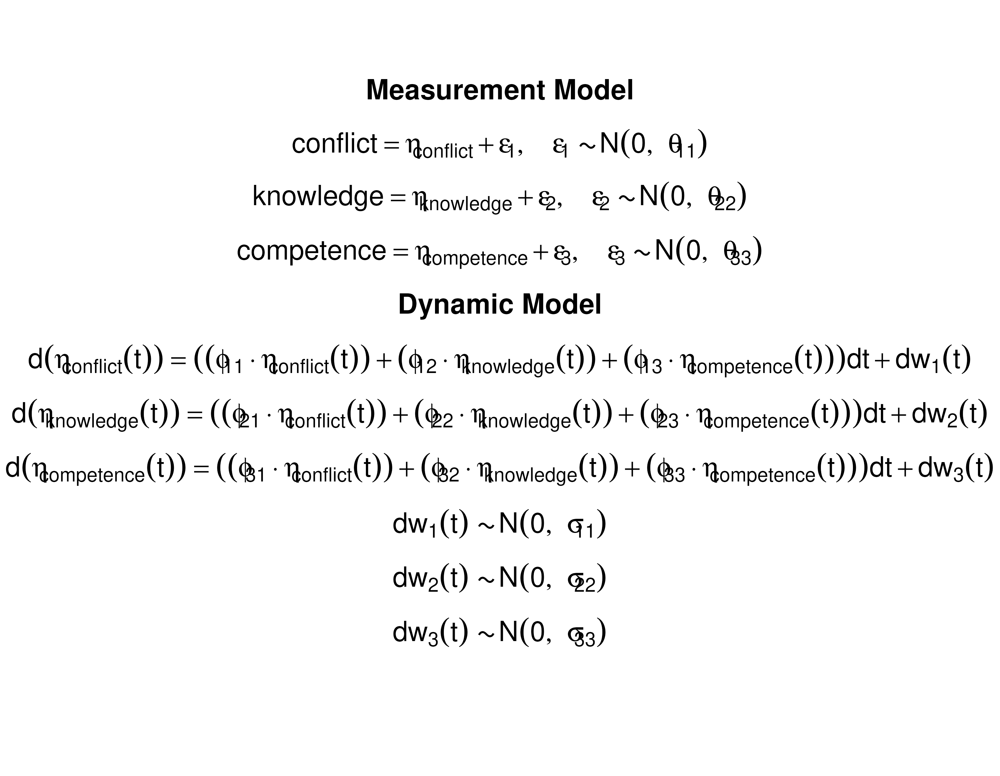

This vignette demonstrates how to fit the continuous-time vector autoregressive model using the `dynr` package.


``` r
library(dynr)
```

## Load the data set


``` r
data("grundy2007", package = "manCTMed")
```

## Prepare the Data


``` r
dynr_data <- dynr::dynr.data(
  dataframe = grundy2007,
  id = "id",
  time = "time",
  observed = c(
    "conflict",
    "knowledge",
    "competence"
  )
)
```

## Prepare the Initial Condition


``` r
data_0 <- grundy2007[which(grundy2007[, "time"] == 0), ]
dynr_initial <- dynr::prep.initial(
  values.inistate = colMeans(data_0)[
    c(
      "conflict",
      "knowledge",
      "competence"
    )
  ],
  params.inistate = rep(x = "fixed", times = 3),
  values.inicov = cov(data_0)[
    c(
      "conflict",
      "knowledge",
      "competence"
    ),
    c(
      "conflict",
      "knowledge",
      "competence"
    )
  ],
  params.inicov = matrix(
    data = "fixed",
    nrow = 3,
    ncol = 3
  )
)
```

## Prepare Measurement Model


``` r
dynr_measurement <- dynr::prep.measurement(
  values.load = diag(3),
  params.load = matrix(
    data = "fixed",
    nrow = 3,
    ncol = 3
  ),
  state.names = paste0(
    "eta_",
    c(
      "conflict",
      "knowledge",
      "competence"
    )
  ),
  obs.names =     c(
    "conflict",
    "knowledge",
    "competence"
  )
)
```

## Prepare Dynamic Model


``` r
dynr_dynamics <- dynr::prep.formulaDynamics(
  formula = list(
    eta_conflict ~ (phi_11 * eta_conflict) + (phi_12 * eta_knowledge) + (phi_13 * eta_competence),
    eta_knowledge ~ (phi_21 * eta_conflict) + (phi_22 * eta_knowledge) + (phi_23 * eta_competence),
    eta_competence ~ (phi_31 * eta_conflict) + (phi_32 * eta_knowledge) + (phi_33 * eta_competence)
  ),
  startval = c(
    phi_11 = 0,
    phi_12 = 0,
    phi_13 = 0,
    phi_21 = 0,
    phi_22 = 0,
    phi_23 = 0,
    phi_31 = 0,
    phi_32 = 0,
    phi_33 = 0
  ),
  isContinuousTime = TRUE
)
```

## Prepare Noise


``` r
dynr_noise <- dynr::prep.noise(
  values.latent = matrix(
    data = c(
      .10, .00, .00,
      .00, .10, .00,
      .00, .00, .10
    ),
    nrow = 3
  ),
  params.latent = matrix(
    data = c(
      "sigma_11", "sigma_12", "sigma_13",
      "sigma_12", "sigma_22", "sigma_23",
      "sigma_13", "sigma_23", "sigma_33"
    ),
    nrow = 3
  ),
  values.observed = matrix(
    data = c(
      .10, .00, .00,
      .00, .10, .00,
      .00, .00, .10
    ),
    nrow = 3
  ),
  params.observed = matrix(
    data = c(
      "theta_11", "fixed", "fixed",
      "fixed", "theta_22", "fixed",
      "fixed", "fixed", "theta_33"
    ),
    nrow = 3,
    ncol = 3
  )
)
```

## Prepare the Model


``` r
model <- dynr::dynr.model(
  data = dynr_data,
  initial = dynr_initial,
  measurement = dynr_measurement,
  dynamics = dynr_dynamics,
  noise = dynr_noise,
  outfile = "ct-var.c"
)
```

## Add Model Constraints to Aid in Optimization


``` r
lb <- ub <- rep(NA, times = length(model$xstart))
names(ub) <- names(lb) <- names(model$xstart)
lb[
  c(
    "phi_11",
    "phi_21",
    "phi_31",
    "phi_12",
    "phi_22",
    "phi_32",
    "phi_13",
    "phi_23",
    "phi_33"
  )
] <- -1.5
ub[
  c(
    "phi_11",
    "phi_21",
    "phi_31",
    "phi_12",
    "phi_22",
    "phi_32",
    "phi_13",
    "phi_23",
    "phi_33"
  )
] <- 1.5
ub[
  c(
    "phi_11",
    "phi_22",
    "phi_33"
  )
] <- 0
lb[
  c(
    "sigma_11",
    "sigma_22",
    "sigma_33"
  )
] <- .Machine$double.xmin
lb[
  c(
    "theta_11",
    "theta_22",
    "theta_33"
  )
] <- .Machine$double.xmin
model$lb <- lb
model$ub <- ub
```

## Model Formula


``` r
dynr::plotFormula(
  dynrModel = model,
  ParameterAs = model$"param.names",
  printDyn = TRUE,
  printMeas = TRUE
)
```



## Fit the Model


``` r
fit <- dynr::dynr.cook(
  model,
  verbose = FALSE
)
#> [1] "Get ready!!!!"
#> using C compiler: ‘gcc (Ubuntu 13.3.0-6ubuntu2~24.04) 13.3.0’
#> Optimization function called.
#> Starting Hessian calculation ...
#> Finished Hessian calculation.
#> Original exit flag:  3 
#> Modified exit flag:  3 
#> Optimization terminated successfully: ftol_rel or ftol_abs was reached. 
#> Original fitted parameters:  -0.03371248 0.03781617 -0.01320671 -0.1523502 
#> -0.5902622 0.230235 -0.1004354 0.1054622 -0.5151492 -2.852352 -0.1499536 
#> 0.1770817 -0.2943714 0.1351704 -0.1908467 -2.255498 -1.761862 -2.542695 
#> 
#> Transformed fitted parameters:  -0.03371248 0.03781617 -0.01320671 -0.1523502 
#> -0.5902622 0.230235 -0.1004354 0.1054622 -0.5151492 0.05770845 -0.008653589 
#> 0.01021911 0.7462974 0.09916955 0.8416808 0.1048214 0.1717249 0.07865413 
#> 
#> Doing end processing
#> Successful trial
#> Total Time: 1.970678 
#> Backend Time: 1.95964
```

## Summary


``` r
summary(fit)
#> Coefficients:
#>           Estimate Std. Error t value  ci.lower  ci.upper Pr(>|t|)    
#> phi_11   -0.033712   0.022461  -1.501 -0.077735  0.010310   0.0667 .  
#> phi_12    0.037816   0.037012   1.022 -0.034727  0.110359   0.1535    
#> phi_13   -0.013207   0.033180  -0.398 -0.078239  0.051826   0.3453    
#> phi_21   -0.152350   0.061199  -2.489 -0.272299 -0.032402   0.0064 ** 
#> phi_22   -0.590262   0.176063  -3.353 -0.935339 -0.245185   0.0004 ***
#> phi_23    0.230235   0.113647   2.026  0.007491  0.452979   0.0214 *  
#> phi_31   -0.100435   0.056641  -1.773 -0.211450  0.010579   0.0381 *  
#> phi_32    0.105462   0.106935   0.986 -0.104126  0.315050   0.1620    
#> phi_33   -0.515149   0.146135  -3.525 -0.801568 -0.228730   0.0002 ***
#> sigma_11  0.057708   0.022977   2.512  0.012674  0.102743   0.0060 ** 
#> sigma_12 -0.008654   0.029862  -0.290 -0.067182  0.049874   0.3860    
#> sigma_13  0.010219   0.028265   0.362 -0.045179  0.065617   0.3589    
#> sigma_22  0.746297   0.314194   2.375  0.130487  1.362107   0.0088 ** 
#> sigma_23  0.099170   0.082397   1.204 -0.062325  0.260664   0.1144    
#> sigma_33  0.841681   0.292901   2.874  0.267605  1.415756   0.0020 ** 
#> theta_11  0.104821   0.016754   6.256  0.071984  0.137659   <2e-16 ***
#> theta_22  0.171725   0.098048   1.751 -0.020445  0.363895   0.0400 *  
#> theta_33  0.078654   0.091670   0.858 -0.101015  0.258323   0.1955    
#> ---
#> Signif. codes:  0 '***' 0.001 '**' 0.01 '*' 0.05 '.' 0.1 ' ' 1
#> 
#> -2 log-likelihood value at convergence = 3569.91
#> AIC = 3605.91
#> BIC = 3719.75
```


