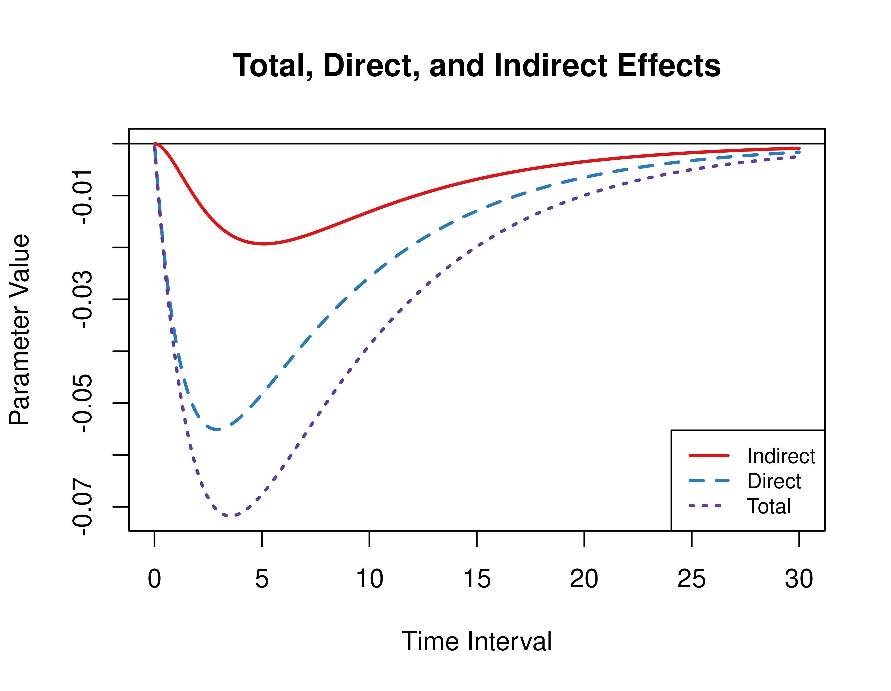
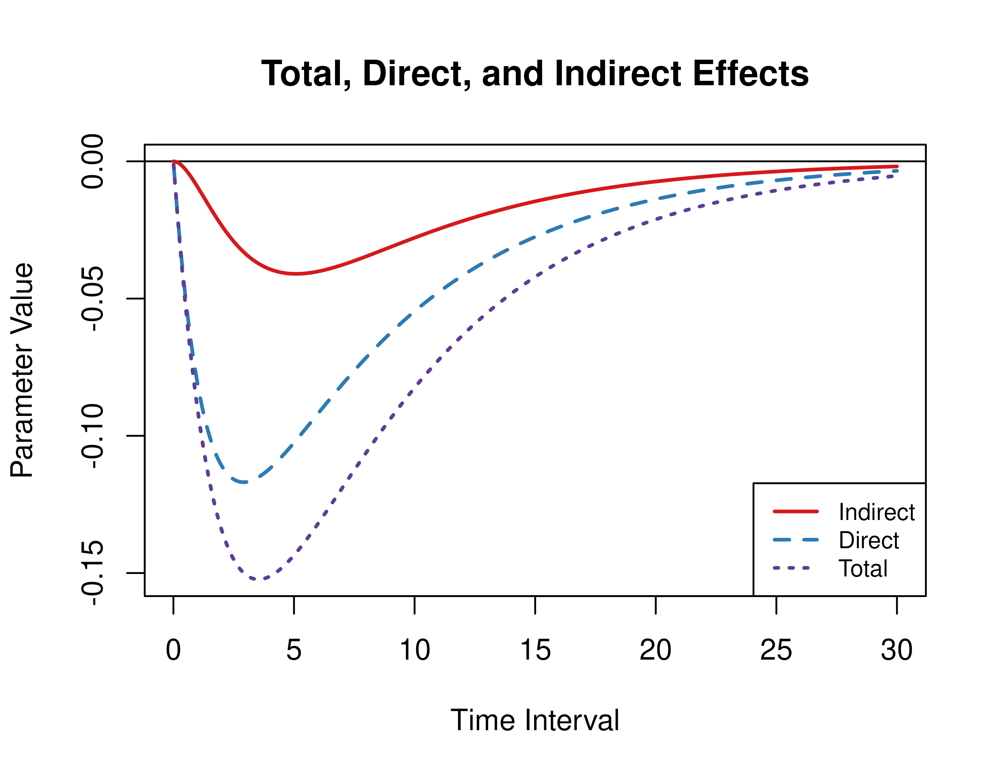
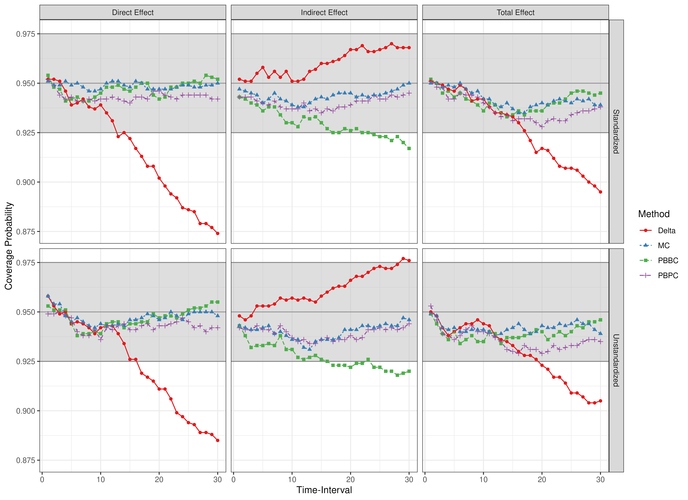
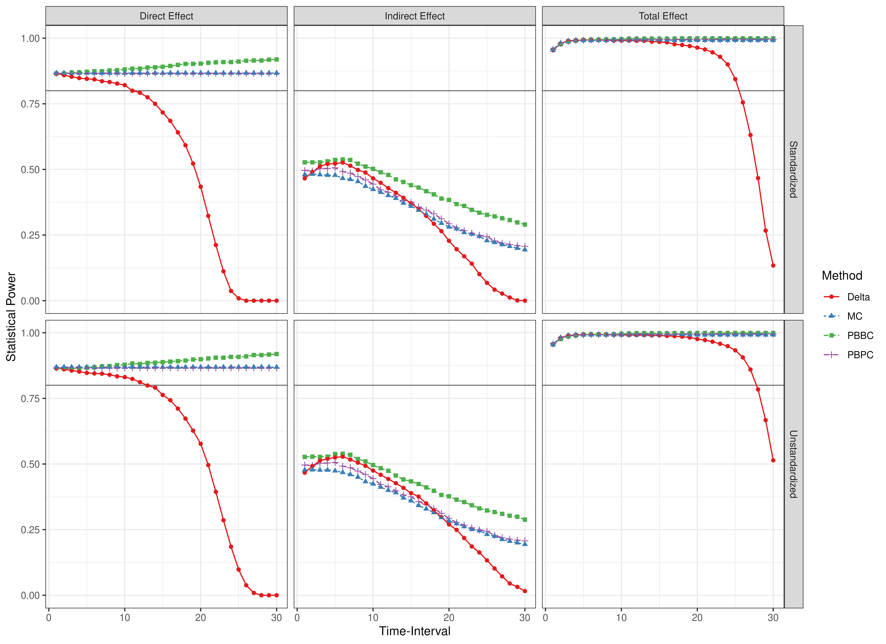

``` r
library(manCTMed)
```

## Population Total, Direct, and Indirect Effects

Total, direct, and indirect effects for the drift matrix

\begin{equation}
    \left(
    \begin{array}{ccc}
         -0.138 & 0 & 0 \\
         -0.124 & -0.865 & 0.434 \\
         -0.057 & 0.115 & -0.693 \\
    \end{array}
    \right)
\end{equation}
  

``` r
IllustrationFigPlotEffects(std = FALSE)
#> 
#> phi:
#>        x      m      y
#> x -0.138  0.000  0.000
#> m -0.124 -0.865  0.434
#> y -0.057  0.115 -0.693
```



Standardized total, direct, and indirect effects for the drift matrix
\begin{equation}
    \left(
    \begin{array}{ccc}
         -0.138 & 0 & 0 \\
         -0.124 & -0.865 & 0.434 \\
         -0.057 & 0.115 & -0.693 \\
    \end{array}
    \right)
\end{equation}
and process noise covariance matrix
\begin{equation}
    \left(
    \begin{array}{ccc}
         0.10 & 0 & 0 \\
         0 & 0.10 & 0 \\
         0 & 0 & 0.10 \\
    \end{array}
    \right)
\end{equation}


``` r
IllustrationFigPlotEffects(std = TRUE)
#> 
#> phi:
#>        x      m      y
#> x -0.138  0.000  0.000
#> m -0.124 -0.865  0.434
#> y -0.057  0.115 -0.693
#> 
#> sigma:
#>      [,1] [,2] [,3]
#> [1,]  0.1  0.0  0.0
#> [2,]  0.0  0.1  0.0
#> [3,]  0.0  0.0  0.1
```



## Evaluation of Confidence Intervals

Presented below are scatter plots of coverage probabilities and power for the $\eta_X \to \eta_M \ to \eta_Y$ model.


``` r
data(illustration_results, package = "manCTMed")
```

### Coverage Probabilities



### Statistical Power


