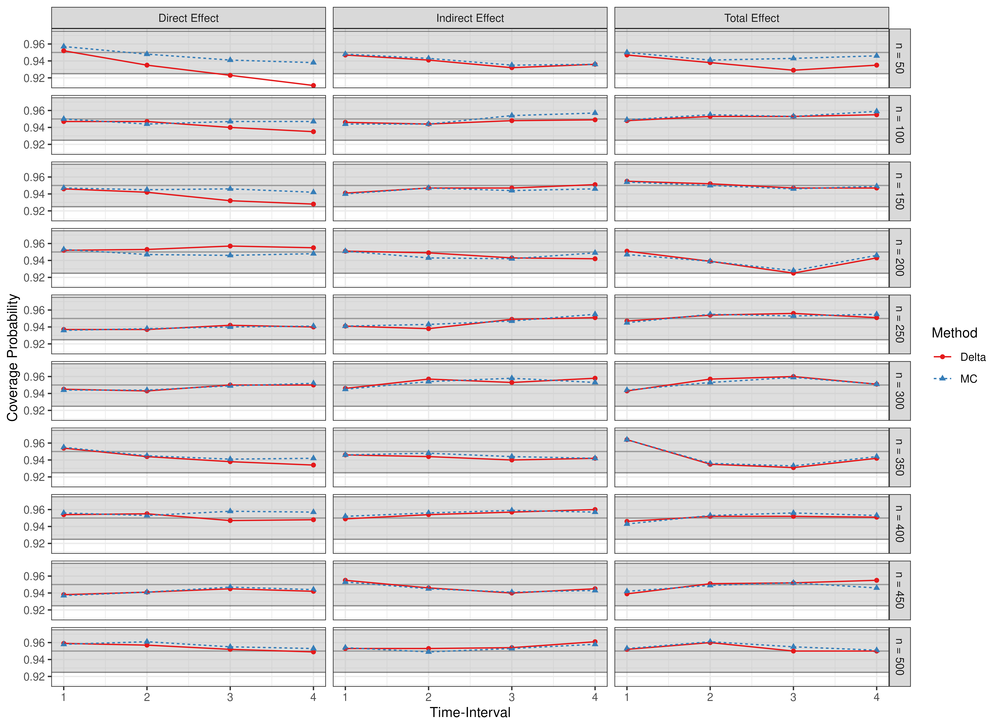
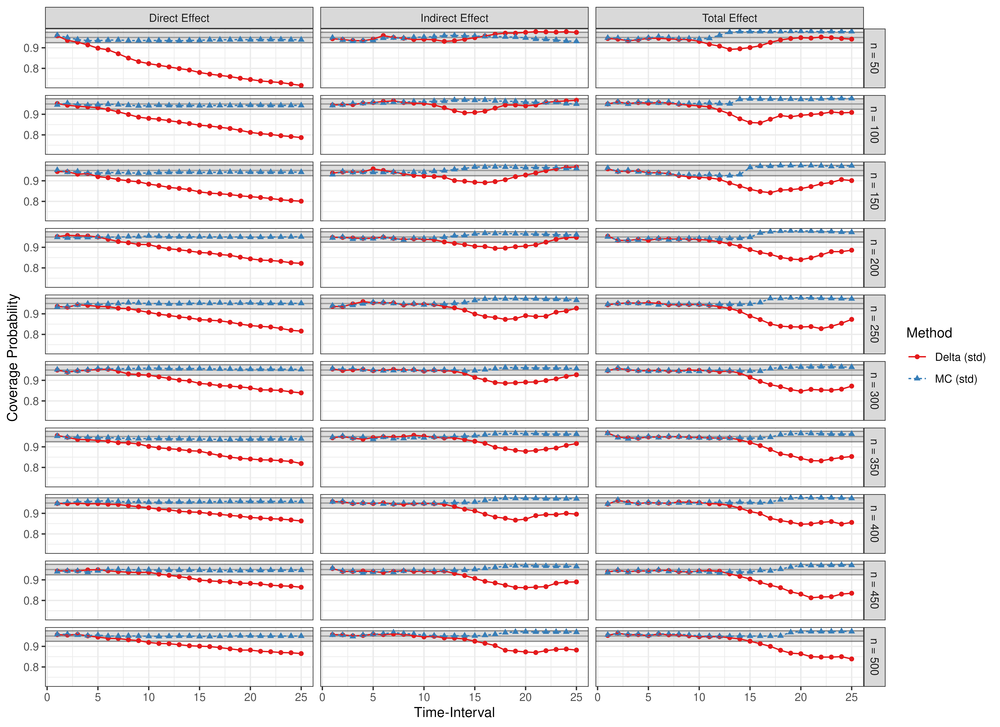
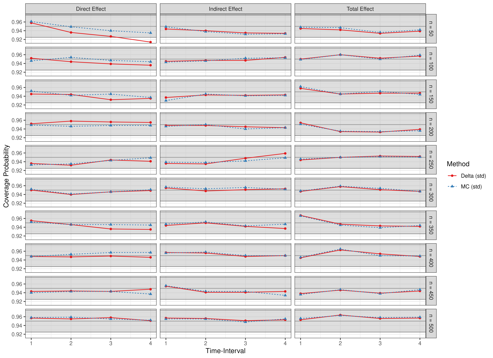
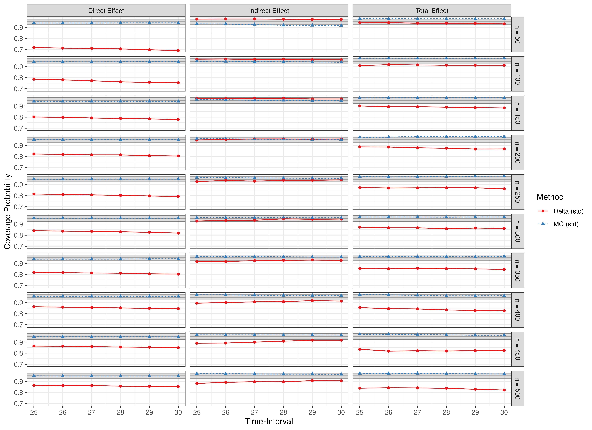
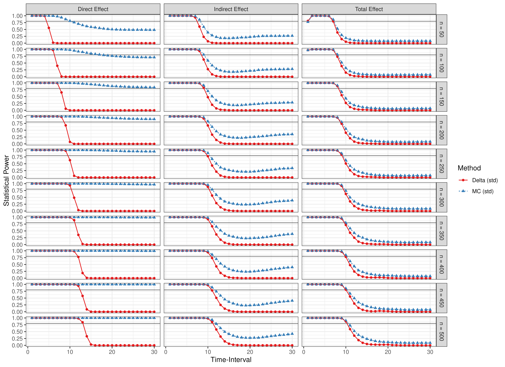
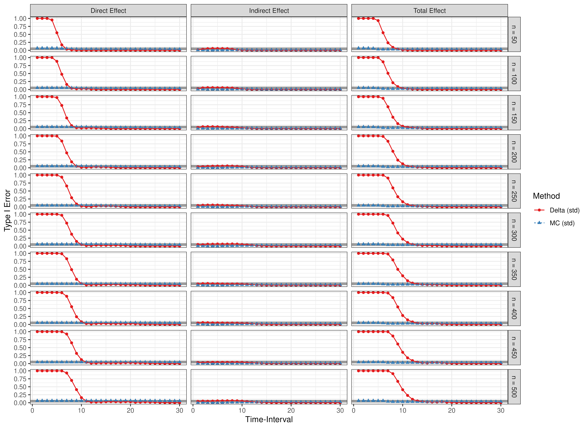

``` r
library(manCTMed)
```

## Population Total, Direct, and Indirect Effects

Total, direct, and indirect effects for the drift matrix

\begin{equation}
    \left(
    \begin{array}{ccc}
         −0.714 & 0 & 0 \\
         1.542 & −1.022 & 0 \\
         −0.900 & 1.458 & −1.386 \\
    \end{array}
    \right)
\end{equation}


``` r
FigPlotEffects(dynamics = 1)
#> 
#> phi:
#>        x      m      y
#> x -0.714  0.000  0.000
#> m  1.542 -1.022  0.000
#> y -0.900  1.458 -1.386
```


Standardized total, direct, and indirect effects for the drift matrix
\begin{equation}
    \left(
    \begin{array}{ccc}
         −0.714 & 0 & 0 \\
         1.542 & −1.022 & 0 \\
         −0.900 & 1.458 & −1.386 \\
    \end{array}
    \right)
\end{equation}
and process noise covariance matrix
\begin{equation}
    \left(
    \begin{array}{ccc}
         0.4891 & 0.0440 & -0.1001 \\
         0.0440 & 0.1414 & 0.0308 \\
         -0.1001 & 0.0308 & 0.1511 \\
    \end{array}
    \right)
\end{equation}


``` r
FigPlotEffects(dynamics = 1, std = TRUE)
#> 
#> phi:
#>        x      m      y
#> x -0.714  0.000  0.000
#> m  1.542 -1.022  0.000
#> y -0.900  1.458 -1.386
#> 
#> sigma:
#>             [,1]       [,2]        [,3]
#> [1,]  0.24455556 0.02201587 -0.05004762
#> [2,]  0.02201587 0.07067800  0.01539456
#> [3,] -0.05004762 0.01539456  0.07553061
```


## Evaluation of Confidence Intervals

Presented below are scatter plots of coverage probabilities and power for the $\eta_X \to \eta_M \ to \eta_Y$ model and type I error rates for the $\eta_Y \to \eta_M \to \eta_X$ model.


``` r
data(results, package = "manCTMed")
```

### Coverage Probabilities

#### Time Intervals 1 to 25


#### Time Intervals 1 to 4



#### Time Intervals 5 to 25


#### Time Intervals 25 to 30


### Statistical Power


### Type I Error Rate


### Coverage Probabilities (Standardized)

#### Time Intervals 1 to 25



#### Time Intervals 1 to 4



#### Time Intervals 5 to 25


#### Time Intervals 25 to 30



### Statistical Power (Standardized)



### Type I Error Rate (Standardized)


