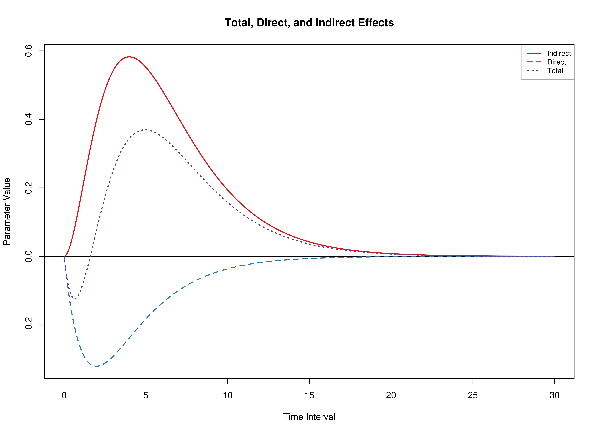
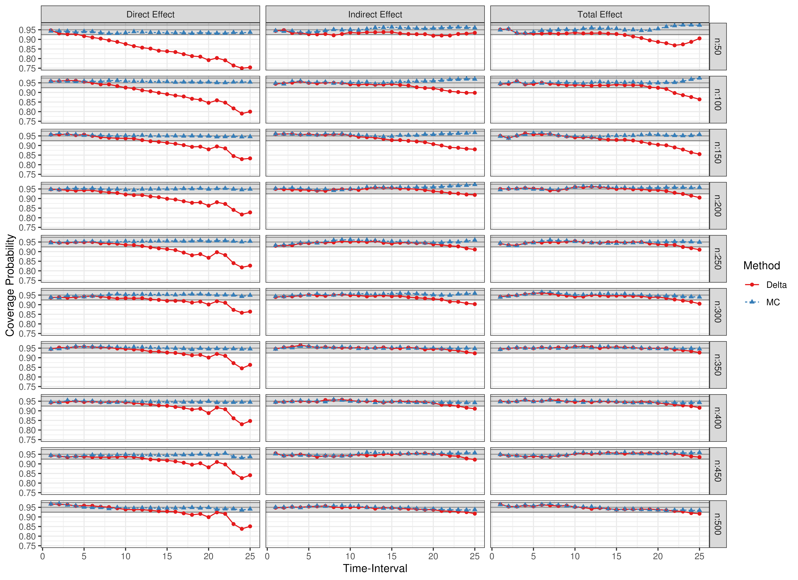
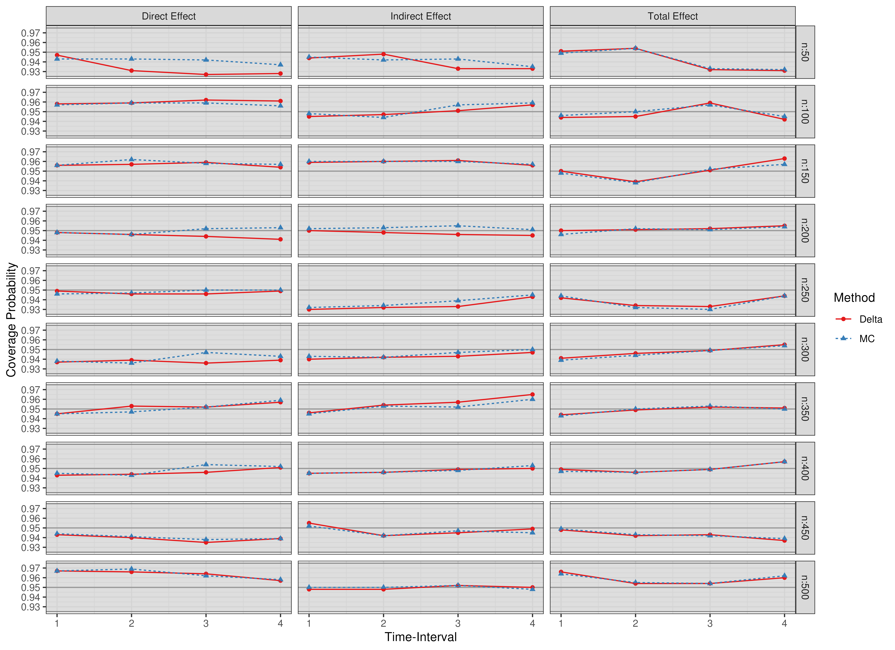
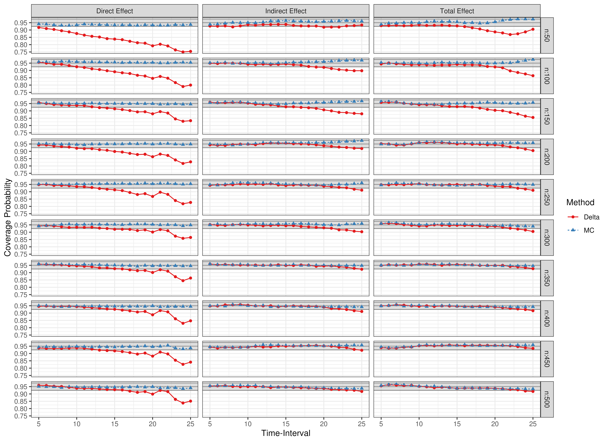
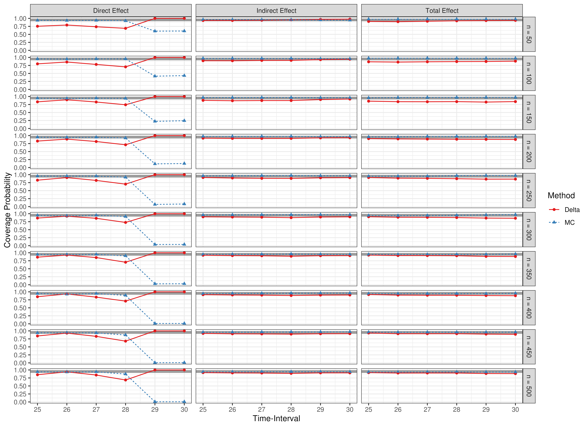
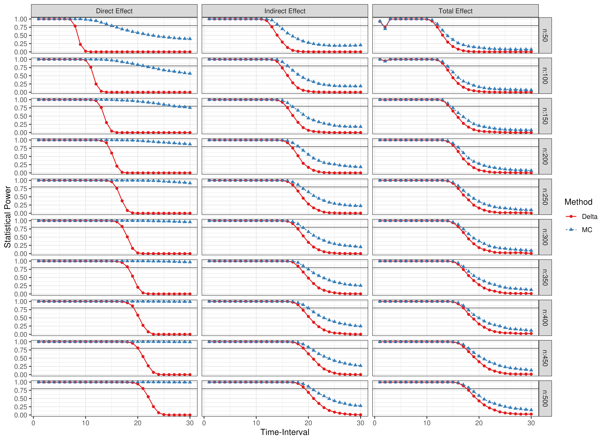

```r
library(manCTMed)
```

## Population Total, Direct, and Indirect Effects

Total, direct, and indirect effects for the drift matrix

\begin{equation}
    \left(
    \begin{array}{ccc}
         -0.357 & 0 & 0 \\
         0.771 & -0.511 & 0 \\
         -0.450 & 0.729 & -0.693 \\
    \end{array}
    \right)
\end{equation}


```r
FigPlotEffects()
```



## Evaluation of Confidence Intervals

Presented below are scatter plots of coverage probabilities and power for the $\eta_X \to \eta_M \ to \eta_Y$ model and type I error rates for the $\eta_Y \to \eta_M \to \eta_X$ model.


```r
data(results, package = "manCTMed")
```

### Coverage Probabilities

#### Time Intervals 1 to 25



#### Time Intervals 1 to 4



#### Time Intervals 5 to 25



#### Time Intervals 25 to 30



### Statistical Power



### Type I Error Rate


