``` r
library(manCTMed)
```

## Data Generation


``` r
set.seed(42)
sim <- GenData(n = 50)
plot(sim)
```


``` r
data <- RandomMeasurement(sim)
str(data)
#> 'data.frame':	9000 obs. of  5 variables:
#>  $ id  : num  1 1 1 1 1 1 1 1 1 1 ...
#>  $ time: num  0 0.0333 0.0667 0.1 0.1333 ...
#>  $ x   : num  -0.35 NA NA NA -1.21 ...
#>  $ m   : num  0.419 NA NA NA 0.21 ...
#>  $ y   : num  2.61 NA NA NA 1.98 ...
```

## Model Fitting


``` r
fit <- FitDynr(data)
#> [1] "Get ready!!!!"
#> using C compiler: ‘gcc (Ubuntu 11.4.0-1ubuntu1~22.04) 11.4.0’
#> Optimization function called.
#> Starting Hessian calculation ...
#> Finished Hessian calculation.
#> Original exit flag:  3 
#> Modified exit flag:  3 
#> Optimization terminated successfully: ftol_rel or ftol_abs was reached. 
#> Original fitted parameters:  -0.4646654 0.03915088 0.03260841 0.713087 
#> -0.5024501 0.03569385 -0.4967591 0.7242458 -0.7206101 -1.375187 0.07575868 
#> -0.2263203 -2.480705 0.2371408 -2.756323 -1.610639 -1.659554 -1.589466 
#> -0.09377873 0.02714444 -0.033758 -0.02606706 0.1390054 0.113438 -0.2681591 
#> -0.01077969 0.2001513 
#> 
#> Transformed fitted parameters:  -0.4646654 0.03915088 0.03260841 0.713087 
#> -0.5024501 0.03569385 -0.4967591 0.7242458 -0.7206101 0.2527924 0.01915122 
#> -0.05721204 0.08513504 0.01551062 0.0811792 0.19976 0.1902238 0.2040345 
#> -0.09377873 0.02714444 -0.033758 0.9742698 0.1354287 0.1105192 0.7836114 
#> 0.007118601 1.234213 
#> 
#> Doing end processing
#> Successful trial
#> Total Time: 9.070092 
#> Backend Time: 9.059005
```

``` r
summary(fit)
#> Coefficients:
#>            Estimate Std. Error t value  ci.lower  ci.upper Pr(>|t|)    
#> phi_11    -0.464665   0.091836  -5.060 -0.644661 -0.284670   <2e-16 ***
#> phi_12     0.039151   0.080240   0.488 -0.118116  0.196418   0.3128    
#> phi_13     0.032608   0.070342   0.464 -0.105259  0.170476   0.3215    
#> phi_21     0.713087   0.061174  11.657  0.593188  0.832986   <2e-16 ***
#> phi_22    -0.502450   0.053536  -9.385 -0.607380 -0.397521   <2e-16 ***
#> phi_23     0.035694   0.046259   0.772 -0.054972  0.126360   0.2202    
#> phi_31    -0.496759   0.062363  -7.966 -0.618989 -0.374529   <2e-16 ***
#> phi_32     0.724246   0.054473  13.296  0.617481  0.831010   <2e-16 ***
#> phi_33    -0.720610   0.047243 -15.253 -0.813205 -0.628015   <2e-16 ***
#> sigma_11   0.252792   0.023950  10.555  0.205851  0.299734   <2e-16 ***
#> sigma_12   0.019151   0.010941   1.750 -0.002293  0.040596   0.0400 *  
#> sigma_13  -0.057212   0.011740  -4.873 -0.080222 -0.034202   <2e-16 ***
#> sigma_22   0.085135   0.009857   8.637  0.065815  0.104455   <2e-16 ***
#> sigma_23   0.015511   0.007207   2.152  0.001386  0.029635   0.0157 *  
#> sigma_33   0.081179   0.010962   7.406  0.059695  0.102664   <2e-16 ***
#> theta_11   0.199760   0.004655  42.909  0.190636  0.208884   <2e-16 ***
#> theta_22   0.190224   0.004150  45.832  0.182089  0.198359   <2e-16 ***
#> theta_33   0.204034   0.004488  45.462  0.195238  0.212831   <2e-16 ***
#> mu0_1     -0.093779   0.143876  -0.652 -0.375770  0.188213   0.2573    
#> mu0_2      0.027144   0.128117   0.212 -0.223960  0.278249   0.4161    
#> mu0_3     -0.033758   0.160511  -0.210 -0.348354  0.280838   0.4167    
#> sigma0_11  0.974270   0.206836   4.710  0.568878  1.379661   <2e-16 ***
#> sigma0_12  0.135429   0.131638   1.029 -0.122577  0.393435   0.1518    
#> sigma0_13  0.110519   0.163843   0.675 -0.210607  0.431645   0.2500    
#> sigma0_22  0.783611   0.164778   4.756  0.460653  1.106570   <2e-16 ***
#> sigma0_23  0.007119   0.145934   0.049 -0.278907  0.293144   0.4805    
#> sigma0_33  1.234213   0.255268   4.835  0.733898  1.734529   <2e-16 ***
#> ---
#> Signif. codes:  0 '***' 0.001 '**' 0.01 '*' 0.05 '.' 0.1 ' ' 1
#> 
#> -2 log-likelihood value at convergence = 21149.28
#> AIC = 21203.28
#> BIC = 21395.12
```

``` r
phi_hat <- PhiHat(fit)
```

## Confidence Intervals

### Model $\eta_X \to \eta_M \to \eta_Y$

#### Delta Method


``` r
delta <- DeltaXMY(phi_hat)
plot(delta)
```

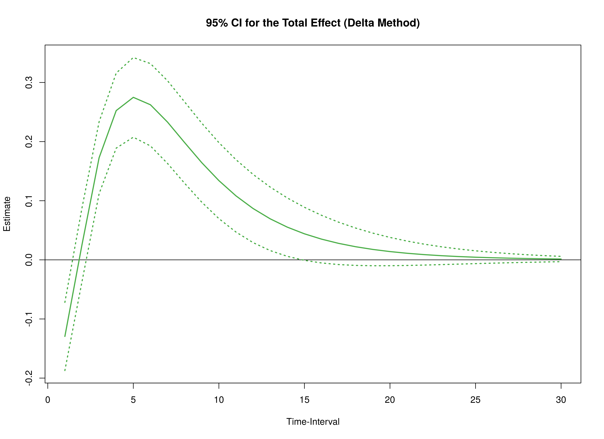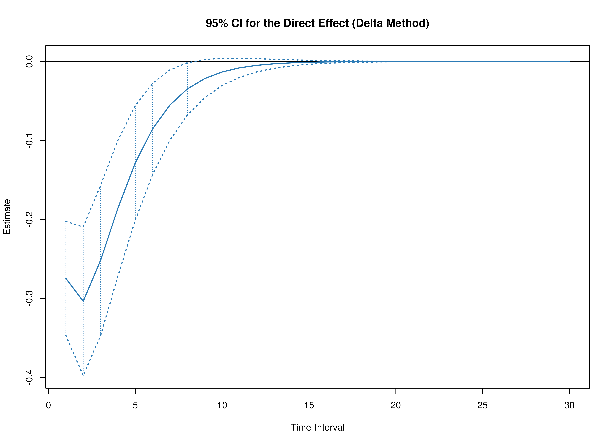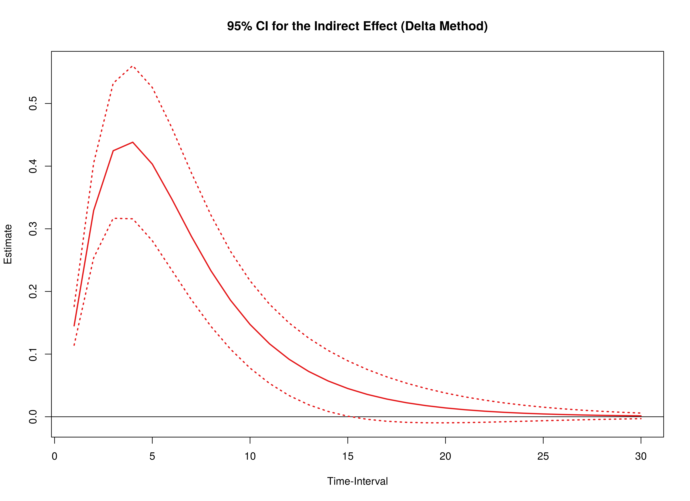

#### Monte Carlo Method


``` r
mc <- MCXMY(phi_hat, seed = 42)
plot(mc)
```

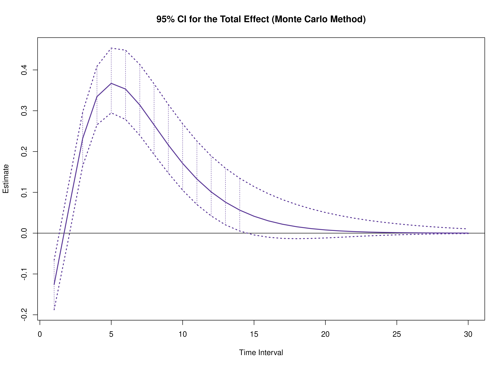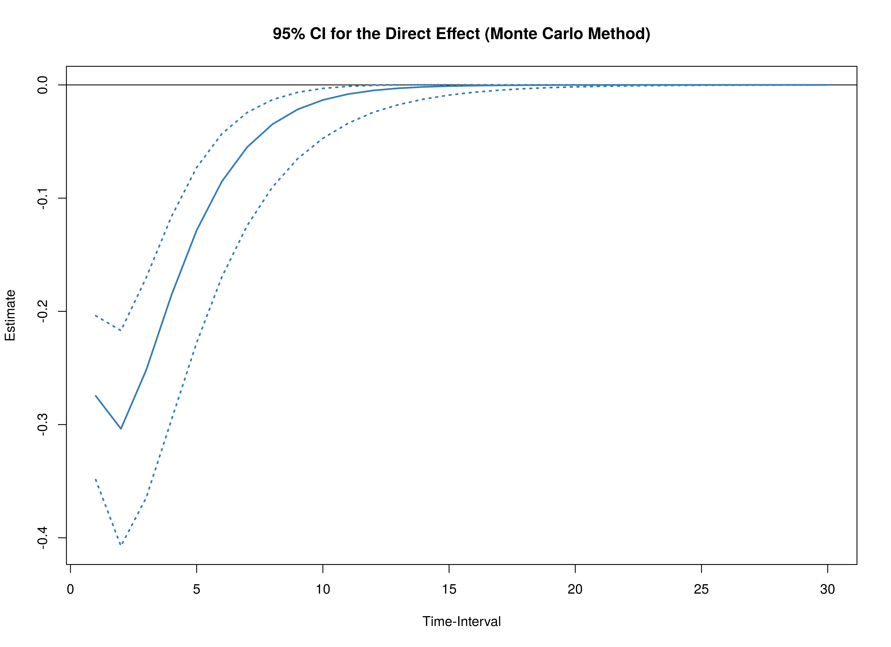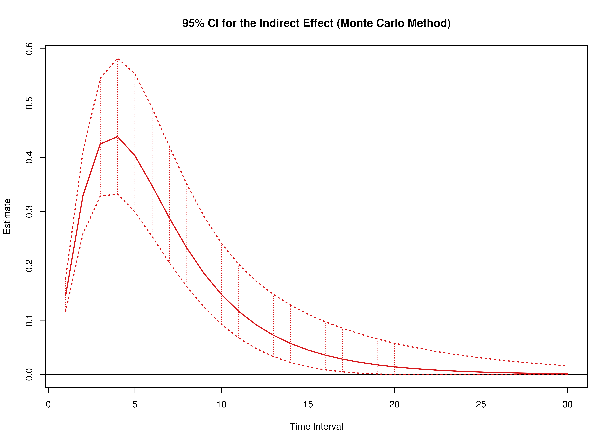

### Model $\eta_Y \to \eta_M \to \eta_M$

#### Delta Method


``` r
delta <- DeltaYMX(phi_hat)
plot(delta)
```

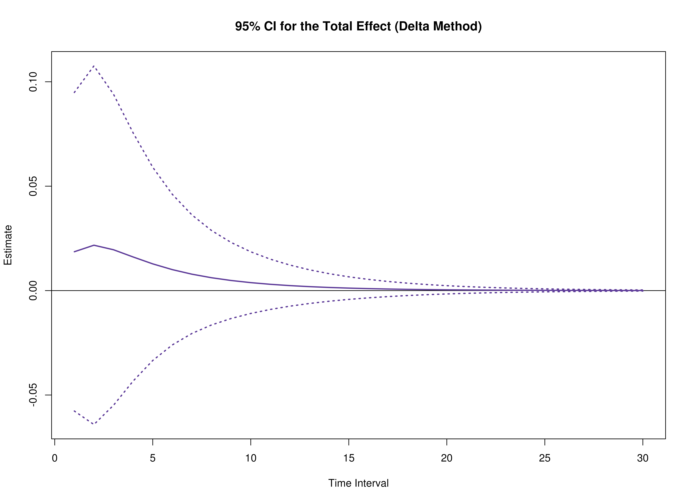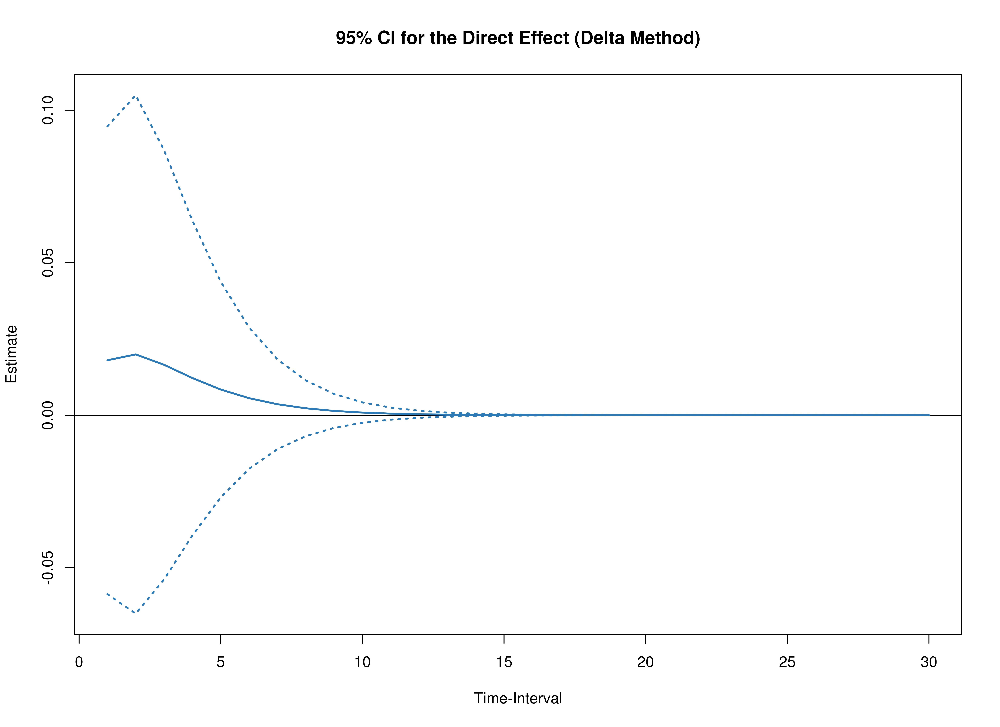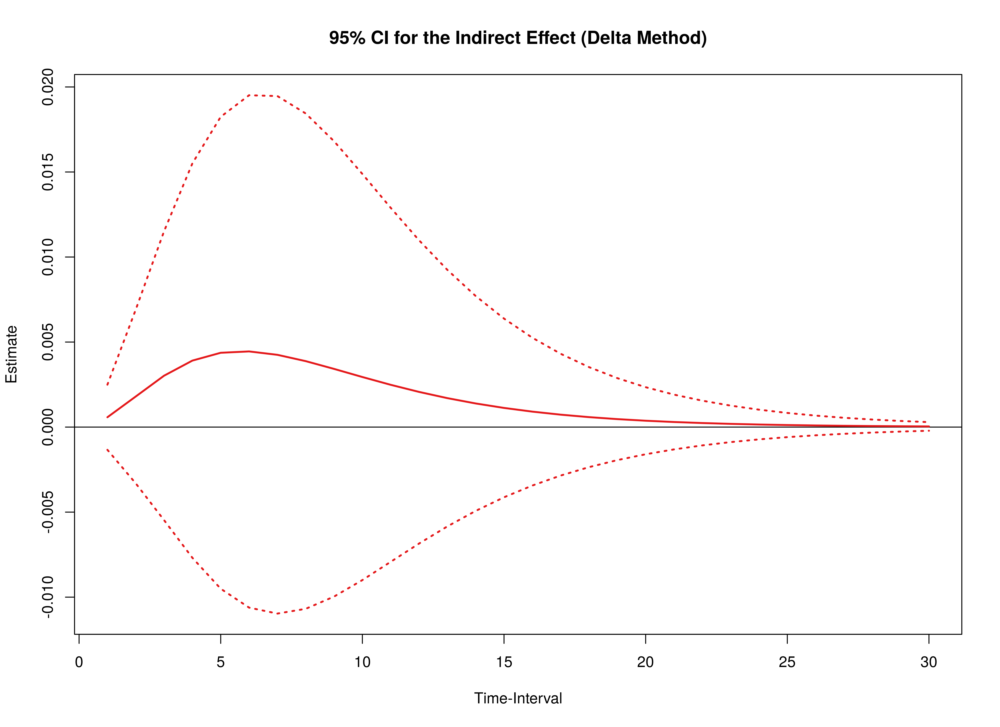

#### Monte Carlo Method


``` r
mc <- MCYMX(phi_hat, seed = 42)
plot(mc)
```

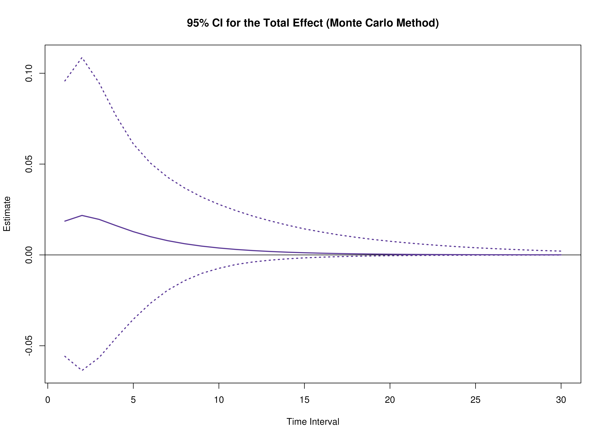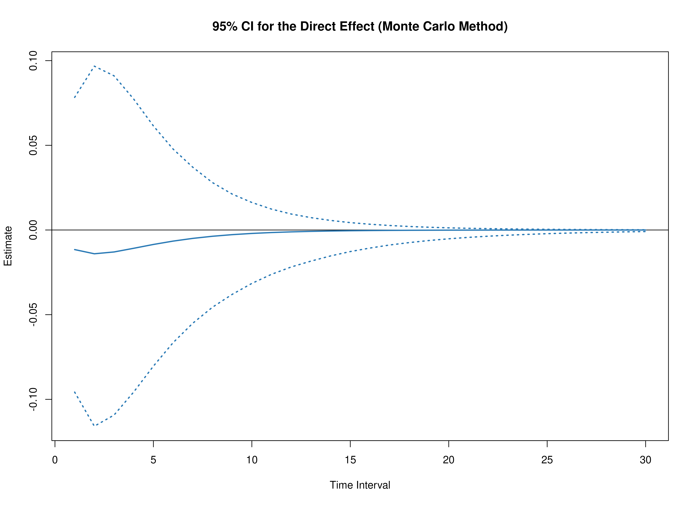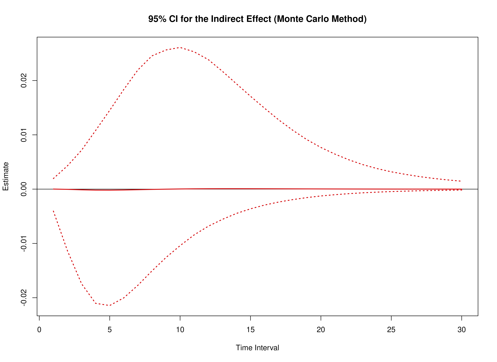
