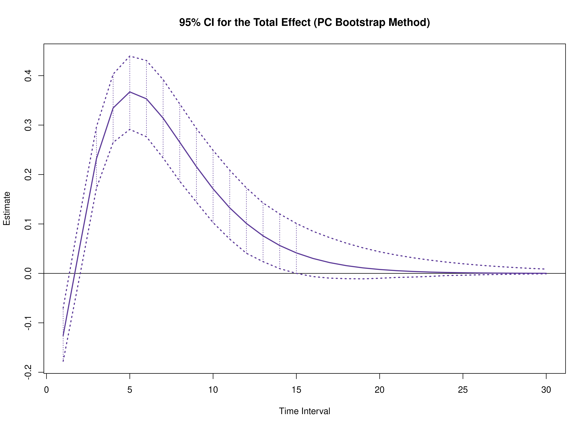
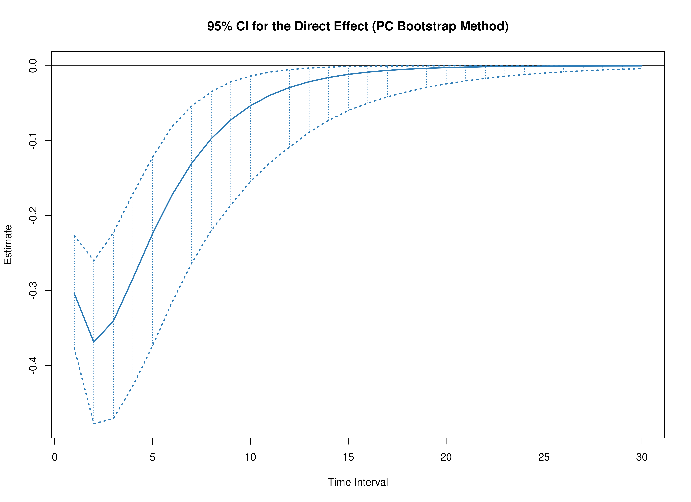
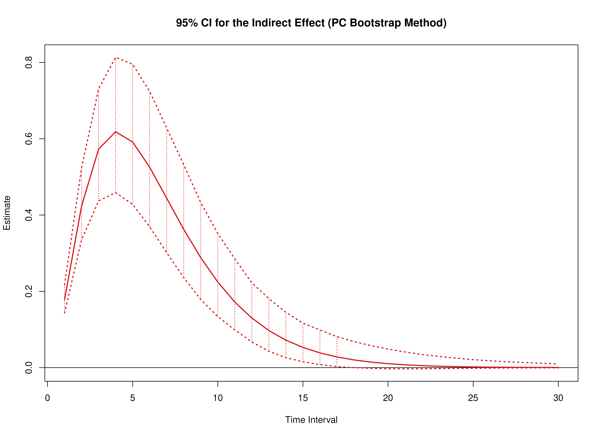

``` r
library(manCTMed)
```

## Data Generation


``` r
set.seed(1)
sim <- GenData(taskid = 1)
plot(sim)
```


``` r
data <- RandomMeasurement(sim)
str(data)
#> 'data.frame':	9000 obs. of  5 variables:
#>  $ id  : num  1 1 1 1 1 1 1 1 1 1 ...
#>  $ time: num  0 0.0333 0.0667 0.1 0.1333 ...
#>  $ x   : num  -1.427 -0.67 -2.044 -0.977 -0.604 ...
#>  $ m   : num  -0.972 -1.492 -1.343 -0.702 -0.842 ...
#>  $ y   : num  -0.0563 0.4158 0.1407 -0.1219 -0.119 ...
```

## Model Fitting


``` r
fit <- FitDynr(data = data, taskid = 1)
#> [1] "Get ready!!!!"
#> using C compiler: ‘gcc (Ubuntu 13.3.0-6ubuntu2~24.04) 13.3.0’
#> Optimization function called.
#> Starting Hessian calculation ...
#> Finished Hessian calculation.
#> Original exit flag:  3 
#> Modified exit flag:  3 
#> Optimization terminated successfully: ftol_rel or ftol_abs was reached. 
#> Original fitted parameters:  -0.3346013 0.02166289 -0.01933279 0.7706831 
#> -0.5507161 0.008072293 -0.5077725 0.7861072 -0.7079146 -1.646831 0.1363935 
#> -0.1794374 -2.668642 0.1643978 -2.856534 -1.617031 -1.639487 -1.553734 
#> 0.1037222 -0.02241764 0.1438094 0.02120675 0.3877461 0.3593095 -0.4531352 
#> 0.1506019 -0.4459209 
#> 
#> Transformed fitted parameters:  -0.3346013 0.02166289 -0.01933279 0.7706831 
#> -0.5507161 0.008072293 -0.5077725 0.7861072 -0.7079146 0.1926596 0.02627752 
#> -0.03457033 0.07293042 0.006685215 0.06554499 0.198487 0.1940796 0.2114569 
#> 0.1037222 -0.02241764 0.1438094 1.021433 0.3960568 0.3670106 0.7892017 
#> 0.2380344 0.7865216 
#> 
#> Doing end processing
#> Successful trial
#> Total Time: 9.686451 
#> Backend Time: 9.676194
summary(fit)
#> Coefficients:
#>            Estimate Std. Error t value  ci.lower  ci.upper Pr(>|t|)    
#> phi_11    -0.334601   0.094078  -3.557 -0.518991 -0.150211   0.0002 ***
#> phi_12     0.021663   0.090875   0.238 -0.156448  0.199774   0.4058    
#> phi_13    -0.019333   0.074466  -0.260 -0.165283  0.126617   0.3976    
#> phi_21     0.770683   0.068892  11.187  0.635656  0.905710   <2e-16 ***
#> phi_22    -0.550716   0.067048  -8.214 -0.682128 -0.419305   <2e-16 ***
#> phi_23     0.008072   0.053580   0.151 -0.096942  0.113087   0.4401    
#> phi_31    -0.507772   0.068188  -7.447 -0.641419 -0.374126   <2e-16 ***
#> phi_32     0.786107   0.066051  11.902  0.656650  0.915565   <2e-16 ***
#> phi_33    -0.707915   0.053656 -13.194 -0.813078 -0.602751   <2e-16 ***
#> sigma_11   0.192660   0.019483   9.888  0.154473  0.230846   <2e-16 ***
#> sigma_12   0.026278   0.009713   2.705  0.007239  0.045316   0.0034 ** 
#> sigma_13  -0.034570   0.009843  -3.512 -0.053861 -0.015279   0.0002 ***
#> sigma_22   0.072930   0.009634   7.570  0.054048  0.091813   <2e-16 ***
#> sigma_23   0.006685   0.006742   0.992 -0.006529  0.019900   0.1607    
#> sigma_33   0.065545   0.009791   6.695  0.046356  0.084734   <2e-16 ***
#> theta_11   0.198487   0.004542  43.698  0.189584  0.207390   <2e-16 ***
#> theta_22   0.194080   0.004240  45.769  0.185769  0.202391   <2e-16 ***
#> theta_33   0.211457   0.004604  45.933  0.202434  0.220480   <2e-16 ***
#> mu0_1      0.103722   0.145704   0.712 -0.181853  0.389297   0.2383    
#> mu0_2     -0.022418   0.128088  -0.175 -0.273465  0.228630   0.4305    
#> mu0_3      0.143809   0.128032   1.123 -0.107129  0.394747   0.1307    
#> sigma0_11  1.021433   0.211348   4.833  0.607199  1.435667   <2e-16 ***
#> sigma0_12  0.396057   0.143821   2.754  0.114173  0.677940   0.0030 ** 
#> sigma0_13  0.367011   0.143034   2.566  0.086669  0.647353   0.0052 ** 
#> sigma0_22  0.789202   0.165089   4.780  0.465632  1.112771   <2e-16 ***
#> sigma0_23  0.238034   0.122124   1.949 -0.001324  0.477393   0.0257 *  
#> sigma0_33  0.786522   0.166425   4.726  0.460334  1.112709   <2e-16 ***
#> ---
#> Signif. codes:  0 '***' 0.001 '**' 0.01 '*' 0.05 '.' 0.1 ' ' 1
#> 
#> -2 log-likelihood value at convergence = 21100.40
#> AIC = 21154.40
#> BIC = 21346.24
phi_hat <- PhiHat(fit)
theta_hat <- ThetaHat(fit)
```

## Confidence Intervals (Unstandardized)

### Model $\eta_X \to \eta_M \to \eta_Y$

#### Delta Method


``` r
delta <- DeltaXMY(phi_hat)
plot(delta)
```


#### Monte Carlo Method


``` r
mc <- MCXMY(phi_hat, seed = 42)
plot(mc)
```


### Model $\eta_Y \to \eta_M \to \eta_M$

#### Delta Method


``` r
delta <- DeltaYMX(phi_hat)
plot(delta)
```


#### Monte Carlo Method


``` r
mc <- MCYMX(phi_hat, seed = 42)
plot(mc)
```


## Confidence Intervals (Standardized)

### Model $\eta_X \to \eta_M \to \eta_Y$

#### Delta Method


``` r
delta <- DeltaStdXMY(theta_hat)
plot(delta)
```



#### Monte Carlo Method


``` r
mc <- MCStdXMY(theta_hat, seed = 1)
plot(mc)
```


### Model $\eta_Y \to \eta_M \to \eta_M$

#### Delta Method


``` r
delta <- DeltaStdYMX(theta_hat)
plot(delta)
```


#### Monte Carlo Method


``` r
mc <- MCStdYMX(theta_hat, seed = 1)
plot(mc)
```


