``` r
library(manCTMed)
```

## Data Generation


``` r
seed <- 1
set.seed(seed)
taskid <- 1
sim <- GenData(taskid = taskid)
plot(sim)
```


``` r
data <- RandomMeasurement(sim)
str(data)
#> 'data.frame':	9000 obs. of  5 variables:
#>  $ id  : num  1 1 1 1 1 1 1 1 1 1 ...
#>  $ time: num  0 0.0333 0.0667 0.1 0.1333 ...
#>  $ x   : num  -1.427 -0.67 -2.044 -0.977 -0.604 ...
#>  $ m   : num  -0.972 -1.492 -1.343 -0.702 -0.842 ...
#>  $ y   : num  -0.0563 0.4158 0.1407 -0.1219 -0.119 ...
```

## Model Fitting


``` r
fit <- FitDynr(data = data, taskid = taskid)
#> [1] "Get ready!!!!"
#> using C compiler: ‘gcc (Ubuntu 13.3.0-6ubuntu2~24.04) 13.3.0’
#> Optimization function called.
#> Starting Hessian calculation ...
#> Finished Hessian calculation.
#> Original exit flag:  3 
#> Modified exit flag:  3 
#> Optimization terminated successfully: ftol_rel or ftol_abs was reached. 
#> Original fitted parameters:  -0.3346013 0.02166289 -0.01933279 0.7706831 
#> -0.5507161 0.008072293 -0.5077725 0.7861072 -0.7079146 -1.646831 0.1363935 
#> -0.1794374 -2.668642 0.1643978 -2.856534 -1.617031 -1.639487 -1.553734 
#> 0.1037222 -0.02241764 0.1438094 0.02120675 0.3877461 0.3593095 -0.4531352 
#> 0.1506019 -0.4459209 
#> 
#> Transformed fitted parameters:  -0.3346013 0.02166289 -0.01933279 0.7706831 
#> -0.5507161 0.008072293 -0.5077725 0.7861072 -0.7079146 0.1926596 0.02627752 
#> -0.03457033 0.07293042 0.006685215 0.06554499 0.198487 0.1940796 0.2114569 
#> 0.1037222 -0.02241764 0.1438094 1.021433 0.3960568 0.3670106 0.7892017 
#> 0.2380344 0.7865216 
#> 
#> Doing end processing
#> Successful trial
#> Total Time: 9.628353 
#> Backend Time: 9.605483
summary(fit)
#> Coefficients:
#>            Estimate Std. Error t value  ci.lower  ci.upper Pr(>|t|)    
#> phi_11    -0.334601   0.094078  -3.557 -0.518991 -0.150211   0.0002 ***
#> phi_12     0.021663   0.090875   0.238 -0.156448  0.199774   0.4058    
#> phi_13    -0.019333   0.074466  -0.260 -0.165283  0.126617   0.3976    
#> phi_21     0.770683   0.068892  11.187  0.635656  0.905710   <2e-16 ***
#> phi_22    -0.550716   0.067048  -8.214 -0.682128 -0.419305   <2e-16 ***
#> phi_23     0.008072   0.053580   0.151 -0.096942  0.113087   0.4401    
#> phi_31    -0.507772   0.068188  -7.447 -0.641419 -0.374126   <2e-16 ***
#> phi_32     0.786107   0.066051  11.902  0.656650  0.915565   <2e-16 ***
#> phi_33    -0.707915   0.053656 -13.194 -0.813078 -0.602751   <2e-16 ***
#> sigma_11   0.192660   0.019483   9.888  0.154473  0.230846   <2e-16 ***
#> sigma_12   0.026278   0.009713   2.705  0.007239  0.045316   0.0034 ** 
#> sigma_13  -0.034570   0.009843  -3.512 -0.053861 -0.015279   0.0002 ***
#> sigma_22   0.072930   0.009634   7.570  0.054048  0.091813   <2e-16 ***
#> sigma_23   0.006685   0.006742   0.992 -0.006529  0.019900   0.1607    
#> sigma_33   0.065545   0.009791   6.695  0.046356  0.084734   <2e-16 ***
#> theta_11   0.198487   0.004542  43.698  0.189584  0.207390   <2e-16 ***
#> theta_22   0.194080   0.004240  45.769  0.185769  0.202391   <2e-16 ***
#> theta_33   0.211457   0.004604  45.933  0.202434  0.220480   <2e-16 ***
#> mu0_1      0.103722   0.145704   0.712 -0.181853  0.389297   0.2383    
#> mu0_2     -0.022418   0.128088  -0.175 -0.273465  0.228630   0.4305    
#> mu0_3      0.143809   0.128032   1.123 -0.107129  0.394747   0.1307    
#> sigma0_11  1.021433   0.211348   4.833  0.607199  1.435667   <2e-16 ***
#> sigma0_12  0.396057   0.143821   2.754  0.114173  0.677940   0.0030 ** 
#> sigma0_13  0.367011   0.143034   2.566  0.086669  0.647353   0.0052 ** 
#> sigma0_22  0.789202   0.165089   4.780  0.465632  1.112771   <2e-16 ***
#> sigma0_23  0.238034   0.122124   1.949 -0.001324  0.477393   0.0257 *  
#> sigma0_33  0.786522   0.166425   4.726  0.460334  1.112709   <2e-16 ***
#> ---
#> Signif. codes:  0 '***' 0.001 '**' 0.01 '*' 0.05 '.' 0.1 ' ' 1
#> 
#> -2 log-likelihood value at convergence = 21100.40
#> AIC = 21154.40
#> BIC = 21346.24
phi_hat <- PhiHat(fit)
theta_hat <- ThetaHat(fit)
```

## Confidence Intervals (Unstandardized)

### Model $\eta_X \to \eta_M \to \eta_Y$

#### Delta Method


``` r
delta <- DeltaXMY(phi_hat = phi_hat)
plot(delta)
```


``` r
summary(delta)
#>      effect interval           est           se          z            p
#> 1     total        1 -0.1256906920 0.0308918759 -4.0687297 4.727015e-05
#> 2    direct        1 -0.3037507224 0.0419975788 -7.2325770 4.739138e-13
#> 3  indirect        1  0.1780600303 0.0200807224  8.8672124 7.499978e-19
#> 4     total        2  0.0547873238 0.0335737093  1.6318520 1.027107e-01
#> 5    direct        2 -0.3688024194 0.0596256657 -6.1852965 6.198587e-10
#> 6  indirect        2  0.4235897432 0.0505670167  8.3767992 5.438654e-17
#> 7     total        3  0.2322234227 0.0336008193  6.9112429 4.804257e-12
#> 8    direct        3 -0.3406933403 0.0677448446 -5.0290667 4.928730e-07
#> 9  indirect        3  0.5729167630 0.0760667805  7.5317604 5.006077e-14
#> 10    total        4  0.3345715006 0.0364851142  9.1700823 4.726579e-20
#> 11   direct        4 -0.2836293280 0.0696159090 -4.0742027 4.617224e-05
#> 12 indirect        4  0.6182008285 0.0919204611  6.7253887 1.751243e-11
#> 13    total        5  0.3671226357 0.0402454180  9.1220977 7.368405e-20
#> 14   direct        5 -0.2242547245 0.0670821528 -3.3429864 8.288196e-04
#> 15 indirect        5  0.5913773602 0.0979402040  6.0381471 1.558939e-09
#> 16    total        6  0.3530953009 0.0427896862  8.2518787 1.559236e-16
#> 17   direct        6 -0.1722832310 0.0617782365 -2.7887366 5.291408e-03
#> 18 indirect        6  0.5253785319 0.0960973509  5.4671490 4.573317e-08
#> 19    total        7  0.3140492805 0.0435718568  7.2076176 5.693927e-13
#> 20   direct        7 -0.1301149456 0.0550230922 -2.3647334 1.804305e-02
#> 21 indirect        7  0.4441642261 0.0889481801  4.9935167 5.928964e-07
#> 22    total        8  0.2652310175 0.0429392412  6.1768911 6.537613e-10
#> 23   direct        8 -0.0972392485 0.0477684656 -2.0356368 4.178684e-02
#> 24 indirect        8  0.3624702660 0.0789137467  4.5932462 4.364037e-06
#> 25    total        9  0.2159203686 0.0414880526  5.2043987 1.946257e-07
#> 26   direct        9 -0.0721899710 0.0406421182 -1.7762354 7.569412e-02
#> 27 indirect        9  0.2881103396 0.0679754135  4.2384492 2.250691e-05
#> 28    total       10  0.1710189987 0.0396745377  4.3105480 1.628505e-05
#> 29   direct       10 -0.0533669745 0.0340204734 -1.5686723 1.167243e-01
#> 30 indirect       10  0.2243859733 0.0575411679  3.8995728 9.636256e-05
#> 31    total       11  0.1325971732 0.0376886068  3.5182296 4.344363e-04
#> 32   direct       11 -0.0393443549 0.0280990247 -1.4002036 1.614524e-01
#> 33 indirect       11  0.1719415281 0.0484196097  3.5510722 3.836652e-04
#> 34    total       12  0.1010631543 0.0355250643  2.8448409 4.443362e-03
#> 35   direct       12 -0.0289549896 0.0229505143 -1.2616270 2.070830e-01
#> 36 indirect       12  0.1300181439 0.0408869663  3.1799411 1.473050e-03
#> 37    total       13  0.0759493417 0.0331202091  2.2931420 2.183983e-02
#> 38   direct       13 -0.0212845291 0.0185694334 -1.1462132 2.517070e-01
#> 39 indirect       13  0.0972338708 0.0348314757  2.7915519 5.245595e-03
#> 40    total       14  0.0564004968 0.0304478777  1.8523622 6.397383e-02
#> 41   direct       14 -0.0156342942 0.0149043087 -1.0489782 2.941882e-01
#> 42 indirect       14  0.0720347910 0.0299402769  2.4059494 1.613050e-02
#> 43    total       15  0.0414557535 0.0275480675  1.5048516 1.323622e-01
#> 44   direct       15 -0.0114783446 0.0118800638 -0.9661854 3.339514e-01
#> 45 indirect       15  0.0529340981 0.0258704656  2.0461208 4.074449e-02
#> 46    total       16  0.0301977504 0.0245117831  1.2319687 2.179608e-01
#> 47   direct       16 -0.0084244345 0.0094127759 -0.8950000 3.707871e-01
#> 48 indirect       16  0.0386221849 0.0223531169  1.7278210 8.402032e-02
#> 49    total       17  0.0218209161 0.0214519774  1.0171984 3.090591e-01
#> 50   direct       17 -0.0061817434 0.0074188690 -0.8332461 4.047060e-01
#> 51 indirect       17  0.0280026595 0.0192220522  1.4567986 1.451720e-01
#> 52    total       18  0.0156533681 0.0184781162  0.8471301 3.969226e-01
#> 53   direct       18 -0.0045354608 0.0058204007 -0.7792352 4.358412e-01
#> 54 indirect       18  0.0201888288 0.0163955957  1.2313568 2.181894e-01
#> 55    total       19  0.0111541299 0.0156802289  0.7113499 4.768674e-01
#> 56   direct       19 -0.0033273058 0.0045477173 -0.7316431 4.643865e-01
#> 57 indirect       19  0.0144814357 0.0138439814  1.0460456 2.955400e-01
#> 58    total       20  0.0078987343 0.0131220554  0.6019434 5.472118e-01
#> 59   direct       20 -0.0024408347 0.0035404148 -0.6894206 4.905587e-01
#> 60 indirect       20  0.0103395690 0.0115611877  0.8943345 3.711429e-01
#> 61    total       21  0.0055606962 0.0108407123  0.5129456 6.079893e-01
#> 62   direct       21 -0.0017904707 0.0027472658 -0.6517282 5.145765e-01
#> 63 indirect       21  0.0073511669 0.0095467789  0.7700154 4.412907e-01
#> 64    total       22  0.0038928671 0.0088501452  0.4398648 6.600351e-01
#> 65   direct       22 -0.0013133639 0.0021255685 -0.6178883 5.366490e-01
#> 66 indirect       22  0.0052062310 0.0077966995  0.6677481 5.042944e-01
#> 67    total       23  0.0027106046 0.0071462364  0.3793052 7.044612e-01
#> 68   direct       23 -0.0009633757 0.0016402113 -0.5873485 5.569697e-01
#> 69 indirect       23  0.0036739804 0.0063001179  0.5831606 5.597852e-01
#> 70    total       24  0.0018774952 0.0057121589  0.3286840 7.423946e-01
#> 71   direct       24 -0.0007066455 0.0012626439 -0.5596554 5.757145e-01
#> 72 indirect       24  0.0025841407 0.0050396514  0.5127618 6.081180e-01
#> 73    total       25  0.0012937263 0.0045231842  0.2860211 7.748619e-01
#> 74   direct       25 -0.0005183277 0.0009698639 -0.5344334 5.930417e-01
#> 75 indirect       25  0.0018120540 0.0039931039  0.4537959 6.499758e-01
#> 76    total       26  0.0008868868 0.0035505859  0.2497860 8.027528e-01
#> 77   direct       26 -0.0003801939 0.0007434821 -0.5113693 6.090925e-01
#> 78 indirect       26  0.0012670807 0.0031355954  0.4040957 6.861423e-01
#> 79    total       27  0.0006048452 0.0027645621  0.2187852 8.268174e-01
#> 80   direct       27 -0.0002788718 0.0005688940 -0.4902000 6.239924e-01
#> 81 indirect       27  0.0008837170 0.0024415006  0.3619565 7.173845e-01
#> 82    total       28  0.0004103317 0.0021362558  0.1920799 8.476797e-01
#> 83   direct       28 -0.0002045518 0.0004345666 -0.4707029 6.378529e-01
#> 84 indirect       28  0.0006148835 0.0018859565  0.3260327 7.443996e-01
#> 85    total       29  0.0002768726 0.0016390223  0.1689255 8.658553e-01
#> 86   direct       29 -0.0001500380 0.0003314373 -0.4526889 6.507728e-01
#> 87 indirect       29  0.0004269106 0.0014458914  0.2952577 7.677970e-01
#> 88    total       30  0.0001857764 0.0012491141  0.1487265 8.817694e-01
#> 89   direct       30 -0.0001100522 0.0002524158 -0.4359959 6.628397e-01
#> 90 indirect       30  0.0002958286 0.0011006275  0.2687818 7.880976e-01
#>             2.5%         97.5%
#> 1  -0.1862376561 -0.0651437279
#> 2  -0.3860644642 -0.2214369806
#> 3   0.1387025376  0.2174175231
#> 4  -0.0110159372  0.1205905847
#> 5  -0.4856665768 -0.2519382620
#> 6   0.3244802116  0.5226992748
#> 7   0.1663670270  0.2980798183
#> 8  -0.4734707959 -0.2079158848
#> 9   0.4238286128  0.7220049132
#> 10  0.2630619908  0.4060810103
#> 11 -0.4200740024 -0.1471846535
#> 12  0.4380400353  0.7983616218
#> 13  0.2882430658  0.4460022056
#> 14 -0.3557333280 -0.0927761209
#> 15  0.3994180877  0.7833366326
#> 16  0.2692290571  0.4369615447
#> 17 -0.2933663496 -0.0512001125
#> 18  0.3370311851  0.7137258787
#> 19  0.2286500105  0.3994485506
#> 20 -0.2379582246 -0.0222716666
#> 21  0.2698289966  0.6184994556
#> 22  0.1810716513  0.3493903837
#> 23 -0.1908637207 -0.0036147763
#> 24  0.2078021645  0.5171383675
#> 25  0.1346052798  0.2972354575
#> 26 -0.1518470588  0.0074671169
#> 27  0.1548809773  0.4213397018
#> 28  0.0932583337  0.2487796638
#> 29 -0.1200458770  0.0133119280
#> 30  0.1116073566  0.3371645899
#> 31  0.0587288612  0.2064654852
#> 32 -0.0944174314  0.0157287215
#> 33  0.0770408370  0.2668422193
#> 34  0.0314353077  0.1706910009
#> 35 -0.0739371711  0.0160271920
#> 36  0.0498811626  0.2101551252
#> 37  0.0110349248  0.1408637586
#> 38 -0.0576799497  0.0151108916
#> 39  0.0289654329  0.1655023086
#> 40 -0.0032762469  0.1160772405
#> 41 -0.0448462024  0.0135776140
#> 42  0.0133529265  0.1307166555
#> 43 -0.0125374666  0.0954489737
#> 44 -0.0347628417  0.0118061525
#> 45  0.0022289173  0.1036392789
#> 46 -0.0178444617  0.0782399625
#> 47 -0.0268731363  0.0100242673
#> 48 -0.0051891191  0.0824334889
#> 49 -0.0202241871  0.0638660192
#> 50 -0.0207224595  0.0083589727
#> 51 -0.0096718705  0.0656771894
#> 52 -0.0205630742  0.0518698103
#> 53 -0.0159432365  0.0068723149
#> 54 -0.0119459483  0.0523236060
#> 55 -0.0195785539  0.0418868137
#> 56 -0.0122406680  0.0055860564
#> 57 -0.0126522692  0.0416151406
#> 58 -0.0178200217  0.0336174903
#> 59 -0.0093799202  0.0044982507
#> 60 -0.0123199425  0.0329990806
#> 61 -0.0156867095  0.0268081019
#> 62 -0.0071750128  0.0035940714
#> 63 -0.0113601758  0.0260625096
#> 64 -0.0134530989  0.0212388330
#> 65 -0.0054794016  0.0028526739
#> 66 -0.0100750192  0.0204874811
#> 67 -0.0112957613  0.0167169706
#> 68 -0.0041781309  0.0022513794
#> 69 -0.0086740239  0.0160219846
#> 70 -0.0093181305  0.0130731209
#> 71 -0.0031813821  0.0017680911
#> 72 -0.0072933946  0.0124616760
#> 73 -0.0075715518  0.0101590045
#> 74 -0.0024192260  0.0013825706
#> 75 -0.0060142858  0.0096383939
#> 76 -0.0060721337  0.0078459072
#> 77 -0.0018373921  0.0010770042
#> 78 -0.0048785733  0.0074127347
#> 79 -0.0048135969  0.0060232874
#> 80 -0.0013938836  0.0008361399
#> 81 -0.0039015362  0.0056689703
#> 82 -0.0037766528  0.0045973162
#> 83 -0.0010562866  0.0006471831
#> 84 -0.0030815232  0.0043112902
#> 85 -0.0029355520  0.0034892973
#> 86 -0.0007996432  0.0004995672
#> 87 -0.0024069844  0.0032608057
#> 88 -0.0022624422  0.0026339950
#> 89 -0.0006047780  0.0003846736
#> 90 -0.0018613617  0.0024530190
```

#### Monte Carlo Method


``` r
mc <- MCXMY(phi_hat = phi_hat, seed = seed)
plot(mc)
```


``` r
summary(mc)
#>      effect interval           est          se     R          2.5%
#> 1     total        1 -0.1256906920 0.030918568 20000 -0.1869791011
#> 2    direct        1 -0.3037507224 0.041980003 20000 -0.3886010498
#> 3  indirect        1  0.1780600303 0.020059379 20000  0.1408047197
#> 4     total        2  0.0547873238 0.033876655 20000 -0.0142993962
#> 5    direct        2 -0.3688024194 0.060525370 20000 -0.4985977091
#> 6  indirect        2  0.4235897432 0.051025024 20000  0.3329876718
#> 7     total        3  0.2322234227 0.033838788 20000  0.1655282635
#> 8    direct        3 -0.3406933403 0.070165575 20000 -0.5008906509
#> 9  indirect        3  0.5729167630 0.077894454 20000  0.4426513533
#> 10    total        4  0.3345715006 0.036692167 20000  0.2663046973
#> 11   direct        4 -0.2836293280 0.073990654 20000 -0.4616496790
#> 12 indirect        4  0.6182008285 0.095851715 20000  0.4669791212
#> 13    total        5  0.3671226357 0.040667760 20000  0.2953307719
#> 14   direct        5 -0.2242547245 0.073644527 20000 -0.4096828571
#> 15 indirect        5  0.5913773602 0.104307653 20000  0.4363696913
#> 16    total        6  0.3530953009 0.043558468 20000  0.2796447652
#> 17   direct        6 -0.1722832310 0.070550034 20000 -0.3558646636
#> 18 indirect        6  0.5253785319 0.104828572 20000  0.3770350042
#> 19    total        7  0.3140492805 0.044699280 20000  0.2403623115
#> 20   direct        7 -0.1301149456 0.065853809 20000 -0.3067056768
#> 21 indirect        7  0.4441642261 0.099677470 20000  0.3107140101
#> 22    total        8  0.2652310175 0.044383404 20000  0.1943364233
#> 23   direct        8 -0.0972392485 0.060393567 20000 -0.2652269090
#> 24 indirect        8  0.3624702660 0.091106681 20000  0.2471933304
#> 25    total        9  0.2159203686 0.043196687 20000  0.1477593900
#> 26   direct        9 -0.0721899710 0.054737440 20000 -0.2280769702
#> 27 indirect        9  0.2881103396 0.081028641 20000  0.1900110111
#> 28    total       10  0.1710189987 0.041607039 20000  0.1060752703
#> 29   direct       10 -0.0533669745 0.049244682 20000 -0.1941477460
#> 30 indirect       10  0.2243859733 0.070859302 20000  0.1424503771
#> 31    total       11  0.1325971732 0.039820924 20000  0.0703529005
#> 32   direct       11 -0.0393443549 0.044123282 20000 -0.1650168399
#> 33 indirect       11  0.1719415281 0.061482017 20000  0.1033058716
#> 34    total       12  0.1010631543 0.037843040 20000  0.0407332048
#> 35   direct       12 -0.0289549896 0.039477163 20000 -0.1415685108
#> 36 indirect       12  0.1300181439 0.053309608 20000  0.0720594168
#> 37    total       13  0.0759493417 0.035609784 20000  0.0197460764
#> 38   direct       13 -0.0212845291 0.035342138 20000 -0.1212438690
#> 39 indirect       13  0.0972338708 0.046411235 20000  0.0477917921
#> 40    total       14  0.0564004968 0.033088958 20000  0.0045043655
#> 41   direct       14 -0.0156342942 0.031712003 20000 -0.1042632568
#> 42 indirect       14  0.0720347910 0.040660294 20000  0.0302870787
#> 43    total       15  0.0414557535 0.030313856 20000 -0.0055767877
#> 44   direct       15 -0.0114783446 0.028556633 20000 -0.0893071096
#> 45 indirect       15  0.0529340981 0.035861114 20000  0.0177769254
#> 46    total       16  0.0301977504 0.027371757 20000 -0.0117410907
#> 47   direct       16 -0.0084244345 0.025834034 20000 -0.0768759588
#> 48 indirect       16  0.0386221849 0.031828950 20000  0.0092249428
#> 49    total       17  0.0218209161 0.024375851 20000 -0.0143911975
#> 50   direct       17 -0.0061817434 0.023497967 20000 -0.0659026462
#> 51 indirect       17  0.0280026595 0.028421910 20000  0.0036407020
#> 52    total       18  0.0156533681 0.021438886 20000 -0.0147688384
#> 53   direct       18 -0.0045354608 0.021502508 20000 -0.0567494811
#> 54 indirect       18  0.0201888288 0.025540439 20000  0.0002997946
#> 55    total       19  0.0111541299 0.018655516 20000 -0.0140381821
#> 56   direct       19 -0.0033273058 0.019804554 20000 -0.0485077374
#> 57 indirect       19  0.0144814357 0.023113174 20000 -0.0015950536
#> 58    total       20  0.0078987343 0.016093820 20000 -0.0123533113
#> 59   direct       20 -0.0024408347 0.018365011 20000 -0.0417012187
#> 60 indirect       20  0.0103395690 0.021082378 20000 -0.0025279416
#> 61    total       21  0.0055606962 0.013793897 20000 -0.0104138547
#> 62   direct       21 -0.0017904707 0.017149186 20000 -0.0356180805
#> 63 indirect       21  0.0073511669 0.019394842 20000 -0.0027764958
#> 64    total       22  0.0038928671 0.011770954 20000 -0.0086014033
#> 65   direct       22 -0.0013133639 0.016126716 20000 -0.0305485402
#> 66 indirect       22  0.0052062310 0.017998912 20000 -0.0026262933
#> 67    total       23  0.0027106046 0.010020667 20000 -0.0069171159
#> 68   direct       23 -0.0009633757 0.015271258 20000 -0.0260906142
#> 69 indirect       23  0.0036739804 0.016845602 20000 -0.0022990453
#> 70    total       24  0.0018774952 0.008525186 20000 -0.0053513231
#> 71   direct       24 -0.0007066455 0.014560084 20000 -0.0224467596
#> 72 indirect       24  0.0025841407 0.015891172 20000 -0.0019372122
#> 73    total       25  0.0012937263 0.007258729 20000 -0.0041484145
#> 74   direct       25 -0.0005183277 0.013973644 20000 -0.0193071134
#> 75 indirect       25  0.0018120540 0.015099174 20000 -0.0016187147
#> 76    total       26  0.0008868868 0.006192160 20000 -0.0031654324
#> 77   direct       26 -0.0003801939 0.013495153 20000 -0.0165773195
#> 78 indirect       26  0.0012670807 0.014441113 20000 -0.0012513974
#> 79    total       27  0.0006048452 0.005296305 20000 -0.0023506567
#> 80   direct       27 -0.0002788718 0.013110213 20000 -0.0142498758
#> 81 indirect       27  0.0008837170 0.013895784 20000 -0.0009730558
#> 82    total       28  0.0004103317 0.004544056 20000 -0.0017255010
#> 83   direct       28 -0.0002045518 0.012806482 20000 -0.0122217295
#> 84 indirect       28  0.0006148835 0.013447819 20000 -0.0007458488
#> 85    total       29  0.0002768726 0.003911442 20000 -0.0012501279
#> 86   direct       29 -0.0001500380 0.012573387 20000 -0.0105101985
#> 87 indirect       29  0.0004269106 0.013085977 20000 -0.0005607599
#> 88    total       30  0.0001857764 0.003377964 20000 -0.0009091101
#> 89   direct       30 -0.0001100522 0.012401875 20000 -0.0090545986
#> 90 indirect       30  0.0002958286 0.012801618 20000 -0.0004141329
#>            97.5%
#> 1  -6.646446e-02
#> 2  -2.233577e-01
#> 3   2.199914e-01
#> 4   1.176580e-01
#> 5  -2.614643e-01
#> 6   5.333207e-01
#> 7   2.986343e-01
#> 8  -2.272604e-01
#> 9   7.478701e-01
#> 10  4.109161e-01
#> 11 -1.743764e-01
#> 12  8.395155e-01
#> 13  4.544647e-01
#> 14 -1.247865e-01
#> 15  8.428931e-01
#> 16  4.497320e-01
#> 17 -8.609432e-02
#> 18  7.846319e-01
#> 19  4.149341e-01
#> 20 -5.700074e-02
#> 21  6.964449e-01
#> 22  3.674155e-01
#> 23 -3.720898e-02
#> 24  5.988217e-01
#> 25  3.170367e-01
#> 26 -2.374214e-02
#> 27  5.010845e-01
#> 28  2.686865e-01
#> 29 -1.482227e-02
#> 30  4.118206e-01
#> 31  2.259415e-01
#> 32 -9.171390e-03
#> 33  3.354873e-01
#> 34  1.895172e-01
#> 35 -5.625974e-03
#> 36  2.720115e-01
#> 37  1.594271e-01
#> 38 -3.377325e-03
#> 39  2.209714e-01
#> 40  1.342035e-01
#> 41 -1.990189e-03
#> 42  1.806128e-01
#> 43  1.136657e-01
#> 44 -1.167150e-03
#> 45  1.481355e-01
#> 46  9.625064e-02
#> 47 -6.656567e-04
#> 48  1.227296e-01
#> 49  8.211953e-02
#> 50 -3.831208e-04
#> 51  1.024684e-01
#> 52  6.989265e-02
#> 53 -2.094467e-04
#> 54  8.650737e-02
#> 55  5.939192e-02
#> 56 -1.122974e-04
#> 57  7.354663e-02
#> 58  5.070657e-02
#> 59 -6.050309e-05
#> 60  6.317263e-02
#> 61  4.330184e-02
#> 62 -3.144843e-05
#> 63  5.404042e-02
#> 64  3.702237e-02
#> 65 -1.555783e-05
#> 66  4.669262e-02
#> 67  3.160801e-02
#> 68 -6.704140e-06
#> 69  4.051071e-02
#> 70  2.686572e-02
#> 71 -2.943748e-06
#> 72  3.532881e-02
#> 73  2.302549e-02
#> 74 -1.112480e-06
#> 75  3.081770e-02
#> 76  1.963603e-02
#> 77 -2.234064e-07
#> 78  2.673677e-02
#> 79  1.678864e-02
#> 80  9.555190e-08
#> 81  2.332481e-02
#> 82  1.438135e-02
#> 83  1.382529e-07
#> 84  2.041860e-02
#> 85  1.232948e-02
#> 86  1.276054e-07
#> 87  1.788115e-02
#> 88  1.055287e-02
#> 89  9.798301e-08
#> 90  1.550820e-02
```

#### Parametric Bootstrap Method


``` r
B <- 1000L
path <- root$find_file(
  ".setup",
  "data-raw"
)
prefix <- "pb_replication"
```


``` r
boot <- BootPara(
  fit = fit,
  path = path,
  prefix = prefix,
  taskid = taskid,
  B = B,
  ncores = parallel::detectCores(),
  seed = seed
)
```


``` r
pb <- BootParaXMY(boot = boot, phi_hat = phi_hat)
plot(pb)
```

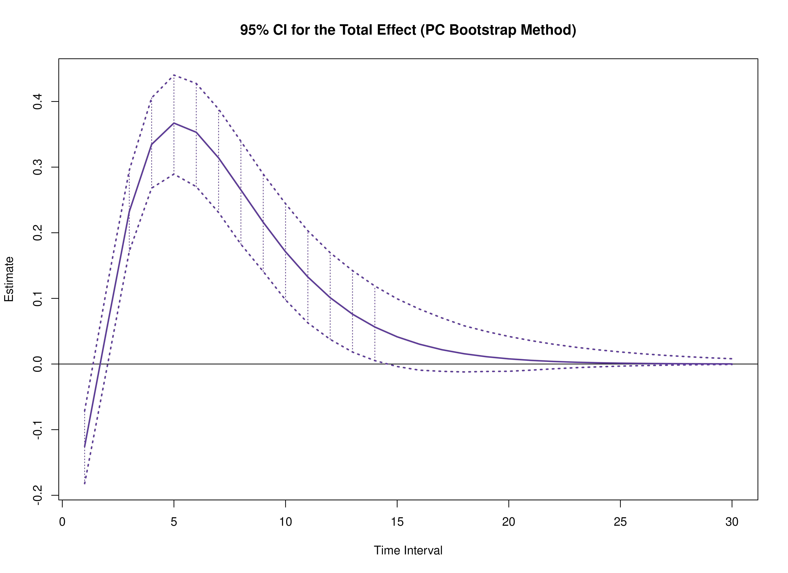

``` r
plot(pb, type = "bc")
```

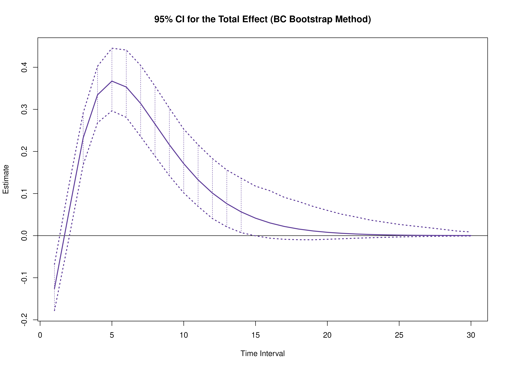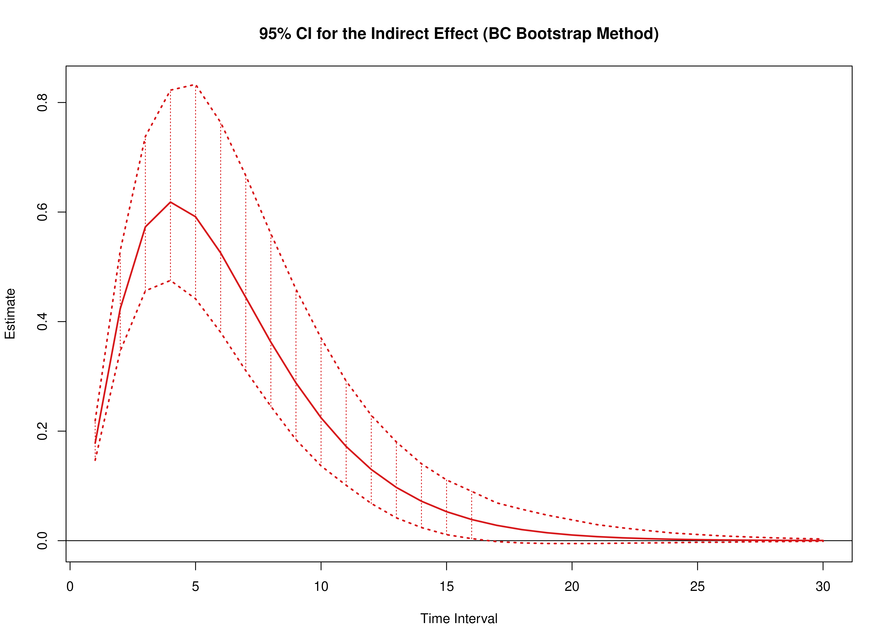

``` r
summary(pb)
#>      effect interval           est          se    R          2.5%         97.5%
#> 1     total        1 -0.1256906920 0.028398181 1000 -1.776736e-01 -7.028066e-02
#> 2    direct        1 -0.3037507224 0.038215296 1000 -3.763482e-01 -2.262534e-01
#> 3  indirect        1  0.1780600303 0.018675889 1000  1.433375e-01  2.175944e-01
#> 4     total        2  0.0547873238 0.031635811 1000 -4.758205e-03  1.174089e-01
#> 5    direct        2 -0.3688024194 0.055456375 1000 -4.776316e-01 -2.600843e-01
#> 6  indirect        2  0.4235897432 0.048048163 1000  3.351298e-01  5.238105e-01
#> 7     total        3  0.2322234227 0.032055188 1000  1.726267e-01  2.965579e-01
#> 8    direct        3 -0.3406933403 0.063755899 1000 -4.708281e-01 -2.228700e-01
#> 9  indirect        3  0.5729167630 0.072524982 1000  4.370530e-01  7.308394e-01
#> 10    total        4  0.3345715006 0.034536693 1000  2.648531e-01  4.030091e-01
#> 11   direct        4 -0.2836293280 0.066081590 1000 -4.270745e-01 -1.709436e-01
#> 12 indirect        4  0.6182008285 0.087414907 1000  4.586491e-01  8.135953e-01
#> 13    total        5  0.3671226357 0.037732644 1000  2.912769e-01  4.395896e-01
#> 14   direct        5 -0.2242547245 0.064354475 1000 -3.737249e-01 -1.220547e-01
#> 15 indirect        5  0.5913773602 0.093009468 1000  4.280742e-01  7.952833e-01
#> 16    total        6  0.3530953009 0.040039656 1000  2.763938e-01  4.305610e-01
#> 17   direct        6 -0.1722832310 0.060156519 1000 -3.154770e-01 -8.106072e-02
#> 18 indirect        6  0.5253785319 0.091452105 1000  3.690950e-01  7.240256e-01
#> 19    total        7  0.3140492805 0.040887928 1000  2.336383e-01  3.920134e-01
#> 20   direct        7 -0.1301149456 0.054671477 1000 -2.633347e-01 -5.381636e-02
#> 21 indirect        7  0.4441642261 0.085141170 1000  3.010770e-01  6.280935e-01
#> 22    total        8  0.2652310175 0.040451222 1000  1.863620e-01  3.427803e-01
#> 23   direct        8 -0.0972392485 0.048710354 1000 -2.197702e-01 -3.478245e-02
#> 24 indirect        8  0.3624702660 0.076216009 1000  2.360747e-01  5.318158e-01
#> 25    total        9  0.2159203686 0.039199090 1000  1.440625e-01  2.929963e-01
#> 26   direct        9 -0.0721899710 0.042790010 1000 -1.857133e-01 -2.156836e-02
#> 27 indirect        9  0.2881103396 0.066394881 1000  1.786097e-01  4.326618e-01
#> 28    total       10  0.1710189987 0.037543240 1000  1.027573e-01  2.489881e-01
#> 29   direct       10 -0.0533669745 0.037214077 1000 -1.544139e-01 -1.378191e-02
#> 30 indirect       10  0.2243859733 0.056899118 1000  1.336977e-01  3.516953e-01
#> 31    total       11  0.1325971732 0.035687991 1000  6.926088e-02  2.087104e-01
#> 32   direct       11 -0.0393443549 0.032139730 1000 -1.295207e-01 -8.386632e-03
#> 33 indirect       11  0.1719415281 0.048442830 1000  9.882530e-02  2.853009e-01
#> 34    total       12  0.1010631543 0.033665021 1000  4.072894e-02  1.729392e-01
#> 35   direct       12 -0.0289549896 0.027628288 1000 -1.083431e-01 -5.077786e-03
#> 36 indirect       12  0.1300181439 0.041297746 1000  6.711506e-02  2.222227e-01
#> 37    total       13  0.0759493417 0.031441492 1000  2.375089e-02  1.425483e-01
#> 38   direct       13 -0.0212845291 0.023681757 1000 -8.886805e-02 -3.043268e-03
#> 39 indirect       13  0.0972338708 0.035418317 1000  4.283117e-02  1.809986e-01
#> 40    total       14  0.0564004968 0.029004150 1000  9.621504e-03  1.202033e-01
#> 41   direct       14 -0.0156342942 0.020268138 1000 -7.285920e-02 -1.832649e-03
#> 42 indirect       14  0.0720347910 0.030590906 1000  2.615334e-02  1.449295e-01
#> 43    total       15  0.0414557535 0.026389024 1000  8.819056e-05  1.010617e-01
#> 44   direct       15 -0.0114783446 0.017338261 1000 -5.972128e-02 -1.040724e-03
#> 45 indirect       15  0.0529340981 0.026563130 1000  1.546666e-02  1.166295e-01
#> 46    total       16  0.0301977504 0.023672720 1000 -6.429494e-03  8.513991e-02
#> 47   direct       16 -0.0084244345 0.014836453 1000 -4.977414e-02 -6.041340e-04
#> 48 indirect       16  0.0386221849 0.023122876 1000  8.026534e-03  9.878213e-02
#> 49    total       17  0.0218209161 0.020949851 1000 -9.609835e-03  7.236571e-02
#> 50   direct       17 -0.0061817434 0.012706943 1000 -4.153923e-02 -3.506216e-04
#> 51 indirect       17  0.0280026595 0.020124687 1000  2.813426e-03  8.104625e-02
#> 52    total       18  0.0156533681 0.018312084 1000 -1.069663e-02  6.113885e-02
#> 53   direct       18 -0.0045354608 0.010897396 1000 -3.468913e-02 -1.983209e-04
#> 54 indirect       18  0.0201888288 0.017482144 1000 -4.012357e-05  6.831198e-02
#> 55    total       19  0.0111541299 0.015834516 1000 -1.103427e-02  5.166165e-02
#> 56   direct       19 -0.0033273058 0.009360615 1000 -2.896841e-02 -1.101256e-04
#> 57 indirect       19  0.0144814357 0.015147722 1000 -1.923027e-03  5.760068e-02
#> 58    total       20  0.0078987343 0.013569598 1000 -9.876025e-03  4.366365e-02
#> 59   direct       20 -0.0024408347 0.008055131 1000 -2.418934e-02 -5.852534e-05
#> 60 indirect       20  0.0103395690 0.013093694 1000 -2.999369e-03  4.868818e-02
#> 61    total       21  0.0055606962 0.011546669 1000 -8.209053e-03  3.712379e-02
#> 62   direct       21 -0.0017904707 0.006945130 1000 -2.019461e-02 -2.958780e-05
#> 63 indirect       21  0.0073511669 0.011299139 1000 -3.122039e-03  4.109955e-02
#> 64    total       22  0.0038928671 0.009774907 1000 -7.397281e-03  3.159581e-02
#> 65   direct       22 -0.0013133639 0.006000051 1000 -1.685957e-02 -1.392663e-05
#> 66 indirect       22  0.0052062310 0.009743195 1000 -2.904100e-03  3.431815e-02
#> 67    total       23  0.0027106046 0.008247884 1000 -6.186887e-03  2.688457e-02
#> 68   direct       23 -0.0009633757 0.005194023 1000 -1.399268e-02 -6.695815e-06
#> 69 indirect       23  0.0036739804 0.008402843 1000 -2.471024e-03  2.936654e-02
#> 70    total       24  0.0018774952 0.006948445 1000 -4.397705e-03  2.287328e-02
#> 71   direct       24 -0.0007066455 0.004505261 1000 -1.166969e-02 -3.026912e-06
#> 72 indirect       24  0.0025841407 0.007253285 1000 -2.023495e-03  2.483414e-02
#> 73    total       25  0.0012937263 0.005853161 1000 -3.755179e-03  1.946664e-02
#> 74   direct       25 -0.0005183277 0.003915482 1000 -9.740497e-03 -1.261228e-06
#> 75 indirect       25  0.0018120540 0.006269386 1000 -1.729554e-03  2.094719e-02
#> 76    total       26  0.0008868868 0.004935945 1000 -2.825353e-03  1.656882e-02
#> 77   direct       26 -0.0003801939 0.003409370 1000 -8.092529e-03 -6.703648e-07
#> 78 indirect       26  0.0012670807 0.005427222 1000 -1.327942e-03  1.788044e-02
#> 79    total       27  0.0006048452 0.004170723 1000 -2.177111e-03  1.412393e-02
#> 80   direct       27 -0.0002788718 0.002974100 1000 -6.674268e-03 -1.215489e-07
#> 81 indirect       27  0.0008837170 0.004705202 1000 -1.021462e-03  1.520693e-02
#> 82    total       28  0.0004103317 0.003533165 1000 -1.626116e-03  1.205109e-02
#> 83   direct       28 -0.0002045518 0.002598934 1000 -5.504002e-03 -1.059035e-08
#> 84 indirect       28  0.0006148835 0.004084640 1000 -7.991592e-04  1.341395e-02
#> 85    total       29  0.0002768726 0.003001651 1000 -1.177189e-03  1.020792e-02
#> 86   direct       29 -0.0001500380 0.002274874 1000 -4.600470e-03 -4.278340e-09
#> 87 indirect       29  0.0004269106 0.003549832 1000 -5.930946e-04  1.145729e-02
#> 88    total       30  0.0001857764 0.002557632 1000 -8.170507e-04  8.685178e-03
#> 89   direct       30 -0.0001100522 0.001994365 1000 -3.845264e-03  2.177822e-08
#> 90 indirect       30  0.0002958286 0.003087801 1000 -4.314993e-04  9.643141e-03
summary(pb, type = "bc")
#>      effect interval           est          se    R          2.5%         97.5%
#> 1     total        1 -0.1256906920 0.028398181 1000 -0.1837172162 -7.404537e-02
#> 2    direct        1 -0.3037507224 0.038215296 1000 -0.3761322756 -2.254882e-01
#> 3  indirect        1  0.1780600303 0.018675889 1000  0.1422570000  2.153697e-01
#> 4     total        2  0.0547873238 0.031635811 1000 -0.0134940358  1.103266e-01
#> 5    direct        2 -0.3688024194 0.055456375 1000 -0.4805731882 -2.642012e-01
#> 6  indirect        2  0.4235897432 0.048048163 1000  0.3352047744  5.245625e-01
#> 7     total        3  0.2322234227 0.032055188 1000  0.1667265232  2.882976e-01
#> 8    direct        3 -0.3406933403 0.063755899 1000 -0.4792183602 -2.319624e-01
#> 9  indirect        3  0.5729167630 0.072524982 1000  0.4389416735  7.317000e-01
#> 10    total        4  0.3345715006 0.034536693 1000  0.2624615236  4.012416e-01
#> 11   direct        4 -0.2836293280 0.066081590 1000 -0.4349818804 -1.775936e-01
#> 12 indirect        4  0.6182008285 0.087414907 1000  0.4612951240  8.152691e-01
#> 13    total        5  0.3671226357 0.037732644 1000  0.2937398803  4.418540e-01
#> 14   direct        5 -0.2242547245 0.064354475 1000 -0.3786535020 -1.268598e-01
#> 15 indirect        5  0.5913773602 0.093009468 1000  0.4358542925  8.019767e-01
#> 16    total        6  0.3530953009 0.040039656 1000  0.2787758160  4.349676e-01
#> 17   direct        6 -0.1722832310 0.060156519 1000 -0.3244634896 -8.857150e-02
#> 18 indirect        6  0.5253785319 0.091452105 1000  0.3736280421  7.332702e-01
#> 19    total        7  0.3140492805 0.040887928 1000  0.2373295157  4.008004e-01
#> 20   direct        7 -0.1301149456 0.054671477 1000 -0.2759073723 -5.894624e-02
#> 21 indirect        7  0.4441642261 0.085141170 1000  0.3070592486  6.454258e-01
#> 22    total        8  0.2652310175 0.040451222 1000  0.1923631637  3.511696e-01
#> 23   direct        8 -0.0972392485 0.048710354 1000 -0.2353796810 -3.821376e-02
#> 24 indirect        8  0.3624702660 0.076216009 1000  0.2417100021  5.469655e-01
#> 25    total        9  0.2159203686 0.039199090 1000  0.1470220769  3.034110e-01
#> 26   direct        9 -0.0721899710 0.042790010 1000 -0.2002274388 -2.407575e-02
#> 27 indirect        9  0.2881103396 0.066394881 1000  0.1843076410  4.584639e-01
#> 28    total       10  0.1710189987 0.037543240 1000  0.1084387201  2.562211e-01
#> 29   direct       10 -0.0533669745 0.037214077 1000 -0.1680928551 -1.506335e-02
#> 30 indirect       10  0.2243859733 0.056899118 1000  0.1385476778  3.658671e-01
#> 31    total       11  0.1325971732 0.035687991 1000  0.0728167879  2.153350e-01
#> 32   direct       11 -0.0393443549 0.032139730 1000 -0.1417134993 -9.394012e-03
#> 33 indirect       11  0.1719415281 0.048442830 1000  0.0991427158  2.853321e-01
#> 34    total       12  0.1010631543 0.033665021 1000  0.0444274474  1.773527e-01
#> 35   direct       12 -0.0289549896 0.027628288 1000 -0.1182395945 -5.598847e-03
#> 36 indirect       12  0.1300181439 0.041297746 1000  0.0670828633  2.218562e-01
#> 37    total       13  0.0759493417 0.031441492 1000  0.0254210133  1.482613e-01
#> 38   direct       13 -0.0212845291 0.023681757 1000 -0.0973897450 -3.408676e-03
#> 39 indirect       13  0.0972338708 0.035418317 1000  0.0415167255  1.743742e-01
#> 40    total       14  0.0564004968 0.029004150 1000  0.0110697108  1.245906e-01
#> 41   direct       14 -0.0156342942 0.020268138 1000 -0.0799316121 -2.041825e-03
#> 42 indirect       14  0.0720347910 0.030590906 1000  0.0250862954  1.392280e-01
#> 43    total       15  0.0414557535 0.026389024 1000  0.0020648887  1.067636e-01
#> 44   direct       15 -0.0114783446 0.017338261 1000 -0.0663452857 -1.182202e-03
#> 45 indirect       15  0.0529340981 0.026563130 1000  0.0134600183  1.102783e-01
#> 46    total       16  0.0301977504 0.023672720 1000 -0.0054187678  8.795200e-02
#> 47   direct       16 -0.0084244345 0.014836453 1000 -0.0542721993 -6.564246e-04
#> 48 indirect       16  0.0386221849 0.023122876 1000  0.0052740205  8.926871e-02
#> 49    total       17  0.0218209161 0.020949851 1000 -0.0090662127  7.388254e-02
#> 50   direct       17 -0.0061817434 0.012706943 1000 -0.0449215622 -3.713153e-04
#> 51 indirect       17  0.0280026595 0.020124687 1000 -0.0004096311  7.180040e-02
#> 52    total       18  0.0156533681 0.018312084 1000 -0.0104753714  6.253074e-02
#> 53   direct       18 -0.0045354608 0.010897396 1000 -0.0371446889 -2.125306e-04
#> 54 indirect       18  0.0201888288 0.017482144 1000 -0.0032808754  5.746723e-02
#> 55    total       19  0.0111541299 0.015834516 1000 -0.0100997946  5.292020e-02
#> 56   direct       19 -0.0033273058 0.009360615 1000 -0.0303120276 -1.159604e-04
#> 57 indirect       19  0.0144814357 0.015147722 1000 -0.0044859372  4.604822e-02
#> 58    total       20  0.0078987343 0.013569598 1000 -0.0093637208  4.509699e-02
#> 59   direct       20 -0.0024408347 0.008055131 1000 -0.0250748705 -6.685255e-05
#> 60 indirect       20  0.0103395690 0.013093694 1000 -0.0048695153  3.702565e-02
#> 61    total       21  0.0055606962 0.011546669 1000 -0.0080581628  3.811022e-02
#> 62   direct       21 -0.0017904707 0.006945130 1000 -0.0207721099 -3.747188e-05
#> 63 indirect       21  0.0073511669 0.011299139 1000 -0.0050547924  2.980407e-02
#> 64    total       22  0.0038928671 0.009774907 1000 -0.0069697787  3.265393e-02
#> 65   direct       22 -0.0013133639 0.006000051 1000 -0.0175012685 -2.136656e-05
#> 66 indirect       22  0.0052062310 0.009743195 1000 -0.0053195581  2.455884e-02
#> 67    total       23  0.0027106046 0.008247884 1000 -0.0054847048  2.802728e-02
#> 68   direct       23 -0.0009633757 0.005194023 1000 -0.0145997627 -1.193258e-05
#> 69 indirect       23  0.0036739804 0.008402843 1000 -0.0045626195  1.983976e-02
#> 70    total       24  0.0018774952 0.006948445 1000 -0.0041121442  2.399451e-02
#> 71   direct       24 -0.0007066455 0.004505261 1000 -0.0122214422 -5.005957e-06
#> 72 indirect       24  0.0025841407 0.007253285 1000 -0.0039899915  1.614330e-02
#> 73    total       25  0.0012937263 0.005853161 1000 -0.0031410183  2.040349e-02
#> 74   direct       25 -0.0005183277 0.003915482 1000 -0.0100125667 -2.030307e-06
#> 75 indirect       25  0.0018120540 0.006269386 1000 -0.0036114571  1.275438e-02
#> 76    total       26  0.0008868868 0.004935945 1000 -0.0025253200  1.715800e-02
#> 77   direct       26 -0.0003801939 0.003409370 1000 -0.0083537848 -1.221788e-06
#> 78 indirect       26  0.0012670807 0.005427222 1000 -0.0029356635  1.005923e-02
#> 79    total       27  0.0006048452 0.004170723 1000 -0.0020390408  1.438496e-02
#> 80   direct       27 -0.0002788718 0.002974100 1000 -0.0068338894 -4.003560e-07
#> 81 indirect       27  0.0008837170 0.004705202 1000 -0.0025817254  7.806697e-03
#> 82    total       28  0.0004103317 0.003533165 1000 -0.0014952392  1.214817e-02
#> 83   direct       28 -0.0002045518 0.002598934 1000 -0.0057516679 -2.013209e-07
#> 84 indirect       28  0.0006148835 0.004084640 1000 -0.0023991298  6.289194e-03
#> 85    total       29  0.0002768726 0.003001651 1000 -0.0012003553  9.997932e-03
#> 86   direct       29 -0.0001500380 0.002274874 1000 -0.0047645575 -7.432541e-08
#> 87 indirect       29  0.0004269106 0.003549832 1000 -0.0019304790  4.787198e-03
#> 88    total       30  0.0001857764 0.002557632 1000 -0.0008758693  7.371423e-03
#> 89   direct       30 -0.0001100522 0.001994365 1000 -0.0039722405 -3.100326e-09
#> 90 indirect       30  0.0002958286 0.003087801 1000 -0.0017242334  3.437629e-03
```

### Model $\eta_Y \to \eta_M \to \eta_M$

#### Delta Method


``` r
delta <- DeltaYMX(phi_hat = phi_hat)
plot(delta)
```

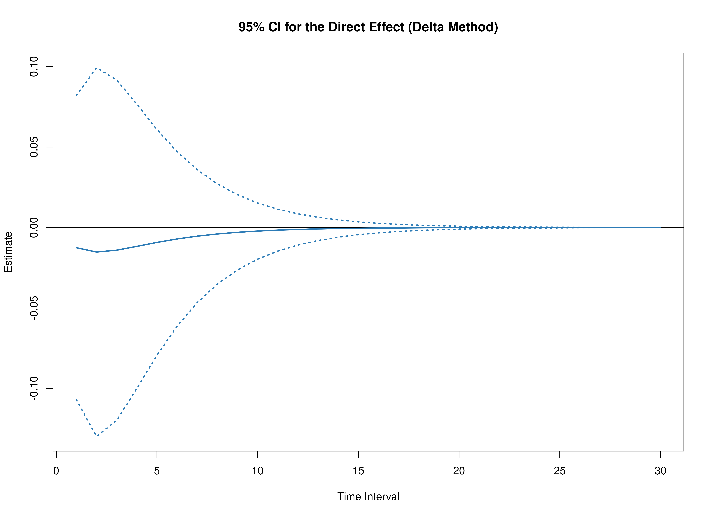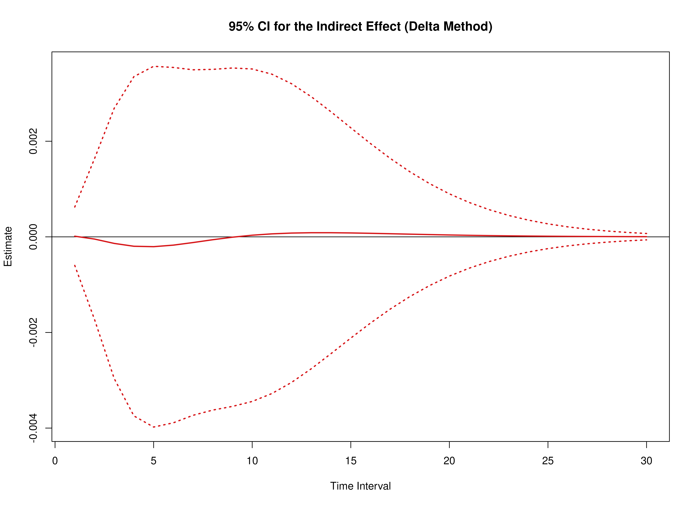

``` r
summary(delta)
#>      effect interval           est           se            z         p
#> 1     total        1 -1.155252e-02 4.446122e-02 -0.259833651 0.7949921
#> 2    direct        1 -1.156492e-02 4.435617e-02 -0.260728628 0.7943018
#> 3  indirect        1  1.240083e-05 2.871105e-04  0.043191826 0.9655486
#> 4     total        2 -1.408408e-02 5.438427e-02 -0.258973520 0.7956557
#> 5    direct        2 -1.404168e-02 5.375525e-02 -0.261215083 0.7939266
#> 6  indirect        2 -4.240204e-05 7.889860e-04 -0.053742453 0.9571404
#> 7     total        3 -1.309786e-02 5.082946e-02 -0.257682407 0.7966520
#> 8    direct        3 -1.297147e-02 4.968110e-02 -0.261094556 0.7940196
#> 9  indirect        3 -1.263934e-04 1.327836e-03 -0.095187493 0.9241659
#> 10    total        4 -1.098008e-02 4.280684e-02 -0.256502815 0.7975626
#> 11   direct        4 -1.079883e-02 4.146906e-02 -0.260406798 0.7945500
#> 12 indirect        4 -1.812500e-04 1.667480e-03 -0.108696964 0.9134428
#> 13    total        5 -8.727446e-03 3.411197e-02 -0.255847029 0.7980690
#> 14   direct        5 -8.538213e-03 3.293937e-02 -0.259209979 0.7954732
#> 15 indirect        5 -1.892332e-04 1.773180e-03 -0.106719681 0.9150114
#> 16    total        6 -6.718987e-03 2.624474e-02 -0.256012706 0.7979410
#> 17   direct        6 -6.559465e-03 2.546639e-02 -0.257573412 0.7967362
#> 18 indirect        6 -1.595224e-04 1.746925e-03 -0.091316124 0.9272414
#> 19    total        7 -5.063621e-03 1.968619e-02 -0.257216918 0.7970113
#> 20   direct        7 -4.953961e-03 1.938394e-02 -0.255570410 0.7982826
#> 21 indirect        7 -1.096601e-04 1.698556e-03 -0.064560757 0.9485237
#> 22    total        8 -3.757504e-03 1.447244e-02 -0.259631752 0.7951478
#> 23   direct        8 -3.702261e-03 1.461770e-02 -0.253272389 0.8000577
#> 24 indirect        8 -5.524344e-05 1.674953e-03 -0.032982092 0.9736889
#> 25    total        9 -2.755037e-03 1.045895e-02 -0.263414298 0.7922313
#> 26   direct        9 -2.748541e-03 1.096151e-02 -0.250744746 0.8020115
#> 27 indirect        9 -6.495647e-06 1.663364e-03 -0.003905127 0.9968842
#> 28    total       10 -2.000302e-03 7.443552e-03 -0.268729438 0.7881379
#> 29   direct       10 -2.031880e-03 8.191592e-03 -0.248044544 0.8040999
#> 30 indirect       10  3.157812e-05 1.634075e-03  0.019324772 0.9845820
#> 31    total       11 -1.440230e-03 5.222660e-03 -0.275765575 0.7827281
#> 32   direct       11 -1.497986e-03 6.108752e-03 -0.245219704 0.8062863
#> 33 indirect       11  5.775644e-05 1.569309e-03  0.036803733 0.9706415
#> 34    total       12 -1.029362e-03 3.615066e-03 -0.284742376 0.7758415
#> 35   direct       12 -1.102424e-03 4.549658e-03 -0.242309272 0.8085405
#> 36 indirect       12  7.306199e-05 1.467292e-03  0.049793757 0.9602867
#> 37    total       13 -7.308208e-04 2.469776e-03 -0.295905717 0.7673021
#> 38   direct       13 -8.103814e-04 3.385839e-03 -0.239344304 0.8108386
#> 39 indirect       13  7.956057e-05 1.336152e-03  0.059544528 0.9525184
#> 40    total       14 -5.156803e-04 1.666190e-03 -0.309496631 0.7569438
#> 41   direct       14 -5.952559e-04 2.518546e-03 -0.236349055 0.8131618
#> 42 indirect       14  7.957560e-05 1.187631e-03  0.067003615 0.9465788
#> 43    total       15 -3.617743e-04 1.110882e-03 -0.325664112 0.7446785
#> 44   direct       15 -4.370234e-04 1.872886e-03 -0.233342207 0.8154957
#> 45 indirect       15  7.524910e-05 1.033141e-03  0.072835299 0.9419372
#> 46    total       16 -2.524048e-04 7.331796e-04 -0.344260550 0.7306503
#> 47   direct       16 -3.207496e-04 1.392517e-03 -0.230338007 0.8178291
#> 48 indirect       16  6.834481e-05 8.819036e-04  0.077496918 0.9382282
#> 49    total       17 -1.751620e-04 4.806644e-04 -0.364416483 0.7155470
#> 50   direct       17 -2.353620e-04 1.035253e-03 -0.227347248 0.8201537
#> 51 indirect       17  6.020000e-05 7.404217e-04  0.081305013 0.9351994
#> 52    total       18 -1.209245e-04 3.150730e-04 -0.383798166 0.7011280
#> 53   direct       18 -1.726819e-04 7.696024e-04 -0.224378080 0.8224631
#> 54 indirect       18  5.175744e-05 6.126455e-04  0.084481879 0.9326733
#> 55    total       19 -8.305073e-05 2.088029e-04 -0.397746957 0.6908167
#> 56   direct       19 -1.266829e-04 5.720956e-04 -0.221436639 0.8247525
#> 57 indirect       19  4.363220e-05 5.004473e-04  0.087186399 0.9305234
#> 58    total       20 -5.674485e-05 1.420531e-04 -0.399462326 0.6895526
#> 59   direct       20 -9.293168e-05 4.252630e-04 -0.218527546 0.8270181
#> 60 indirect       20  3.618682e-05 4.041676e-04  0.089534194 0.9286574
#> 61    total       21 -3.856892e-05 1.006545e-04 -0.383181121 0.7015855
#> 62   direct       21 -6.816989e-05 3.161073e-04 -0.215654274 0.8292572
#> 63 indirect       21  2.960097e-05 3.231164e-04  0.091610852 0.9270072
#> 64    total       22 -2.607509e-05 7.465646e-05 -0.349267707 0.7268883
#> 65   direct       22 -5.000466e-05 2.349628e-04 -0.212819432 0.8314678
#> 66 indirect       22  2.392957e-05 2.559840e-04  0.093480722 0.9255217
#> 67    total       23 -1.753128e-05 5.749686e-05 -0.304908540 0.7604358
#> 68   direct       23 -3.667930e-05 1.746426e-04 -0.210024965 0.8336482
#> 69 indirect       23  1.914802e-05 2.011498e-04  0.095192864 0.9241616
#> 70    total       24 -1.171906e-05 4.528805e-05 -0.258767237 0.7958148
#> 71   direct       24 -2.690463e-05 1.298033e-04 -0.207272313 0.8357972
#> 72 indirect       24  1.518557e-05 1.568998e-04  0.096785125 0.9228970
#> 73    total       25 -7.786092e-06 3.597534e-05 -0.216428584 0.8286537
#> 74   direct       25 -1.973467e-05 9.647255e-05 -0.204562516 0.8379139
#> 75 indirect       25  1.194857e-05 1.215682e-04  0.098287000 0.9217044
#> 76    total       26 -5.139335e-06 2.855275e-05 -0.179994379 0.8571570
#> 77   direct       26 -1.447540e-05 7.169720e-05 -0.201896306 0.8399978
#> 78 indirect       26  9.336065e-06 9.362126e-05  0.099721642 0.9205653
#> 79    total       27 -3.368332e-06 2.252667e-05 -0.149526383 0.8811383
#> 80   direct       27 -1.061769e-05 5.328182e-05 -0.199274161 0.8420483
#> 81 indirect       27  7.249358e-06 7.169963e-05  0.101107326 0.9194653
#> 82    total       28 -2.190458e-06 1.762528e-05 -0.124279314 0.9010941
#> 83   direct       28 -7.788048e-06 3.959427e-05 -0.196696358 0.8440652
#> 84 indirect       28  5.597590e-06 5.463276e-05  0.102458493 0.9183928
#> 85    total       29 -1.412110e-06 1.366520e-05 -0.103336224 0.9176961
#> 86   direct       29 -5.712505e-06 2.942118e-05 -0.194163005 0.8460482
#> 87 indirect       29  4.300396e-06 4.143500e-05  0.103786537 0.9173388
#> 88    total       30 -9.013541e-07 1.049844e-05 -0.085856014 0.9315809
#> 89   direct       30 -4.190099e-06 2.186054e-05 -0.191674070 0.8479975
#> 90 indirect       30  3.288745e-06 3.129147e-05  0.105100370 0.9162962
#>             2.5%        97.5%
#> 1  -9.869491e-02 7.558987e-02
#> 2  -9.850141e-02 7.537156e-02
#> 3  -5.503254e-04 5.751270e-04
#> 4  -1.206753e-01 9.250712e-02
#> 5  -1.194000e-01 9.131668e-02
#> 6  -1.588786e-03 1.503982e-03
#> 7  -1.127218e-01 8.652606e-02
#> 8  -1.103446e-01 8.440171e-02
#> 9  -2.728905e-03 2.476118e-03
#> 10 -9.487995e-02 7.291979e-02
#> 11 -9.207669e-02 7.047904e-02
#> 12 -3.449450e-03 3.086950e-03
#> 13 -7.558568e-02 5.813079e-02
#> 14 -7.309819e-02 5.602176e-02
#> 15 -3.664602e-03 3.286135e-03
#> 16 -5.815773e-02 4.471976e-02
#> 17 -5.647267e-02 4.335374e-02
#> 18 -3.583432e-03 3.264387e-03
#> 19 -4.364784e-02 3.352060e-02
#> 20 -4.294578e-02 3.303786e-02
#> 21 -3.438769e-03 3.219449e-03
#> 22 -3.212296e-02 2.460795e-02
#> 23 -3.235243e-02 2.494791e-02
#> 24 -3.338090e-03 3.227603e-03
#> 25 -2.325420e-02 1.774413e-02
#> 26 -2.423271e-02 1.873563e-02
#> 27 -3.266629e-03 3.253638e-03
#> 28 -1.658940e-02 1.258879e-02
#> 29 -1.808710e-02 1.402335e-02
#> 30 -3.171150e-03 3.234306e-03
#> 31 -1.167646e-02 8.795995e-03
#> 32 -1.347092e-02 1.047495e-02
#> 33 -3.018033e-03 3.133546e-03
#> 34 -8.114761e-03 6.056036e-03
#> 35 -1.001959e-02 7.814742e-03
#> 36 -2.802778e-03 2.948902e-03
#> 37 -5.571492e-03 4.109851e-03
#> 38 -7.446504e-03 5.825742e-03
#> 39 -2.539250e-03 2.698371e-03
#> 40 -3.781353e-03 2.749993e-03
#> 41 -5.531514e-03 4.341003e-03
#> 42 -2.248139e-03 2.407290e-03
#> 43 -2.539062e-03 1.815514e-03
#> 44 -4.107813e-03 3.233766e-03
#> 45 -1.949669e-03 2.100167e-03
#> 46 -1.689410e-03 1.184601e-03
#> 47 -3.050033e-03 2.408534e-03
#> 48 -1.660154e-03 1.796844e-03
#> 49 -1.117247e-03 7.669228e-04
#> 50 -2.264421e-03 1.793697e-03
#> 51 -1.391000e-03 1.511400e-03
#> 52 -7.384563e-04 4.966074e-04
#> 53 -1.681075e-03 1.335711e-03
#> 54 -1.149006e-03 1.252521e-03
#> 55 -4.922970e-04 3.261955e-04
#> 56 -1.247970e-03 9.946039e-04
#> 57 -9.372265e-04 1.024491e-03
#> 58 -3.351638e-04 2.216741e-04
#> 59 -9.264318e-04 7.405684e-04
#> 60 -7.559671e-04 8.283408e-04
#> 61 -2.358482e-04 1.587104e-04
#> 62 -6.877288e-04 5.513891e-04
#> 63 -6.036956e-04 6.628975e-04
#> 64 -1.723991e-04 1.202489e-04
#> 65 -5.105234e-04 4.105140e-04
#> 66 -4.777898e-04 5.256490e-04
#> 67 -1.302231e-04 9.516049e-05
#> 68 -3.789725e-04 3.056139e-04
#> 69 -3.750983e-04 4.133943e-04
#> 70 -1.004820e-04 7.704388e-05
#> 71 -2.813144e-04 2.275051e-04
#> 72 -2.923324e-04 3.227035e-04
#> 73 -7.829647e-05 6.272428e-05
#> 74 -2.088174e-04 1.693481e-04
#> 75 -2.263207e-04 2.502179e-04
#> 76 -6.110170e-05 5.082303e-05
#> 77 -1.549993e-04 1.260485e-04
#> 78 -1.741582e-04 1.928304e-04
#> 79 -4.751980e-05 4.078313e-05
#> 80 -1.150481e-04 9.381276e-05
#> 81 -1.332793e-04 1.477781e-04
#> 82 -3.673537e-05 3.235445e-05
#> 83 -8.539138e-05 6.981529e-05
#> 84 -1.014807e-04 1.126758e-04
#> 85 -2.819540e-05 2.537118e-05
#> 86 -6.337697e-05 5.195195e-05
#> 87 -7.691072e-05 8.551151e-05
#> 88 -2.147791e-05 1.967521e-05
#> 89 -4.703597e-05 3.865577e-05
#> 90 -5.804140e-05 6.461889e-05
```

#### Monte Carlo Method


``` r
mc <- MCYMX(phi_hat = phi_hat, seed = seed)
plot(mc)
```

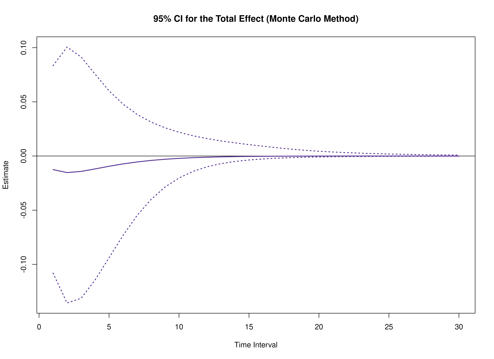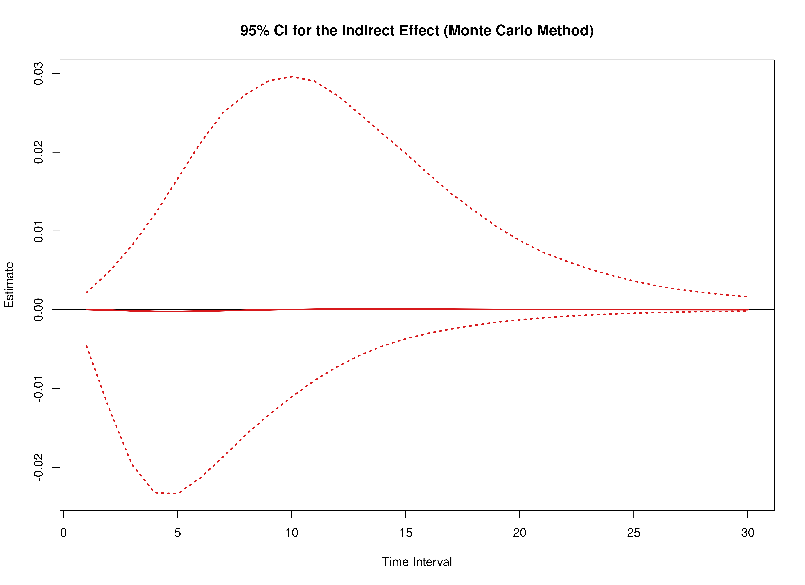

``` r
summary(mc)
#>      effect interval           est           se     R          2.5%
#> 1     total        1 -1.155252e-02 0.0450766621 20000 -0.0990919232
#> 2    direct        1 -1.156492e-02 0.0450087668 20000 -0.0972223947
#> 3  indirect        1  1.240083e-05 0.0014748635 20000 -0.0042250411
#> 4     total        2 -1.408408e-02 0.0554497249 20000 -0.1241844354
#> 5    direct        2 -1.404168e-02 0.0550795218 20000 -0.1180626904
#> 6  indirect        2 -4.240204e-05 0.0039405798 20000 -0.0118030092
#> 7     total        3 -1.309786e-02 0.0522240796 20000 -0.1202685772
#> 8    direct        3 -1.297147e-02 0.0517111445 20000 -0.1110756690
#> 9  indirect        3 -1.263934e-04 0.0061702704 20000 -0.0181241553
#> 10    total        4 -1.098008e-02 0.0444284706 20000 -0.1049248448
#> 11   direct        4 -1.079883e-02 0.0441313064 20000 -0.0969840784
#> 12 indirect        4 -1.812500e-04 0.0077625855 20000 -0.0212186277
#> 13    total        5 -8.727446e-03 0.0358651653 20000 -0.0856074927
#> 14   direct        5 -8.538213e-03 0.0361202221 20000 -0.0819461944
#> 15 indirect        5 -1.892332e-04 0.0087953252 20000 -0.0216337222
#> 16    total        6 -6.718987e-03 0.0280409654 20000 -0.0671326945
#> 17   direct        6 -6.559465e-03 0.0290529289 20000 -0.0682705760
#> 18 indirect        6 -1.595224e-04 0.0094852651 20000 -0.0198583996
#> 19    total        7 -5.063621e-03 0.0214687115 20000 -0.0503872324
#> 20   direct        7 -4.953961e-03 0.0232740415 20000 -0.0563467590
#> 21 indirect        7 -1.096601e-04 0.0099649702 20000 -0.0175140456
#> 22    total        8 -3.757504e-03 0.0162356052 20000 -0.0369771850
#> 23   direct        8 -3.702261e-03 0.0187195519 20000 -0.0469574072
#> 24 indirect        8 -5.524344e-05 0.0102546375 20000 -0.0150727514
#> 25    total        9 -2.755037e-03 0.0122447184 20000 -0.0263868686
#> 26   direct        9 -2.748541e-03 0.0151928219 20000 -0.0392840681
#> 27 indirect        9 -6.495647e-06 0.0103282732 20000 -0.0127701980
#> 28    total       10 -2.000302e-03 0.0093166897 20000 -0.0185455029
#> 29   direct       10 -2.031880e-03 0.0124807056 20000 -0.0327304252
#> 30 indirect       10  3.157812e-05 0.0101708508 20000 -0.0104025083
#> 31    total       11 -1.440230e-03 0.0072353332 20000 -0.0128948430
#> 32   direct       11 -1.497986e-03 0.0103964829 20000 -0.0273130747
#> 33 indirect       11  5.775644e-05 0.0097974716 20000 -0.0083829738
#> 34    total       12 -1.029362e-03 0.0057765204 20000 -0.0092412725
#> 35   direct       12 -1.102424e-03 0.0087905443 20000 -0.0227660937
#> 36 indirect       12  7.306199e-05 0.0092486001 20000 -0.0067880541
#> 37    total       13 -7.308208e-04 0.0047370087 20000 -0.0065721557
#> 38   direct       13 -8.103814e-04 0.0075481347 20000 -0.0191675413
#> 39 indirect       13  7.956057e-05 0.0085781132 20000 -0.0054257856
#> 40    total       14 -5.156803e-04 0.0039595266 20000 -0.0047768709
#> 41   direct       14 -5.952559e-04 0.0065830100 20000 -0.0161094720
#> 42 indirect       14  7.957560e-05 0.0078424310 20000 -0.0044426408
#> 43    total       15 -3.617743e-04 0.0033416507 20000 -0.0034921450
#> 44   direct       15 -4.370234e-04 0.0058307720 20000 -0.0134223334
#> 45 indirect       15  7.524910e-05 0.0070930749 20000 -0.0035742017
#> 46    total       16 -2.524048e-04 0.0028269755 20000 -0.0025637145
#> 47   direct       16 -3.207496e-04 0.0052432269 20000 -0.0113344913
#> 48 indirect       16  6.834481e-05 0.0063725246 20000 -0.0028811297
#> 49    total       17 -1.751620e-04 0.0023887627 20000 -0.0018800630
#> 50   direct       17 -2.353620e-04 0.0047840422 20000 -0.0095094545
#> 51 indirect       17  6.020000e-05 0.0057125325 20000 -0.0023315354
#> 52    total       18 -1.209245e-04 0.0020153851 20000 -0.0014105919
#> 53   direct       18 -1.726819e-04 0.0044255601 20000 -0.0080434717
#> 54 indirect       18  5.175744e-05 0.0051340204 20000 -0.0018930980
#> 55    total       19 -8.305073e-05 0.0017008255 20000 -0.0010579172
#> 56   direct       19 -1.266829e-04 0.0041465177 20000 -0.0068076944
#> 57 indirect       19  4.363220e-05 0.0046478780 20000 -0.0015452118
#> 58    total       20 -5.674485e-05 0.0014397439 20000 -0.0008172077
#> 59   direct       20 -9.293168e-05 0.0039304279 20000 -0.0057692385
#> 60 indirect       20  3.618682e-05 0.0042562636 20000 -0.0012565600
#> 61    total       21 -3.856892e-05 0.0012256634 20000 -0.0006459969
#> 62   direct       21 -6.816989e-05 0.0037644241 20000 -0.0048783215
#> 63 indirect       21  2.960097e-05 0.0039542656 20000 -0.0010291880
#> 64    total       22 -2.607509e-05 0.0010509857 20000 -0.0005237013
#> 65   direct       22 -5.000466e-05 0.0036384236 20000 -0.0041143651
#> 66 indirect       22  2.392957e-05 0.0037319004 20000 -0.0008331698
#> 67    total       23 -1.753128e-05 0.0009078544 20000 -0.0004306387
#> 68   direct       23 -3.667930e-05 0.0035445070 20000 -0.0034576963
#> 69 indirect       23  1.914802e-05 0.0035763224 20000 -0.0006658227
#> 70    total       24 -1.171906e-05 0.0007891357 20000 -0.0003690701
#> 71   direct       24 -2.690463e-05 0.0034764487 20000 -0.0029511770
#> 72 indirect       24  1.518557e-05 0.0034739374 20000 -0.0005438558
#> 73    total       25 -7.786092e-06 0.0006890611 20000 -0.0003209581
#> 74   direct       25 -1.973467e-05 0.0034293530 20000 -0.0024954583
#> 75 indirect       25  1.194857e-05 0.0034120502 20000 -0.0004439975
#> 76    total       26 -5.139335e-06 0.0006033943 20000 -0.0002881791
#> 77   direct       26 -1.447540e-05 0.0033993696 20000 -0.0021049203
#> 78 indirect       26  9.336065e-06 0.0033798471 20000 -0.0003639180
#> 79    total       27 -3.368332e-06 0.0005292303 20000 -0.0002547013
#> 80   direct       27 -1.061769e-05 0.0033834699 20000 -0.0017748022
#> 81 indirect       27  7.249358e-06 0.0033687536 20000 -0.0002975633
#> 82    total       28 -2.190458e-06 0.0004646283 20000 -0.0002170266
#> 83   direct       28 -7.788048e-06 0.0033792697 20000 -0.0015091745
#> 84 indirect       28  5.597590e-06 0.0033723593 20000 -0.0002436937
#> 85    total       29 -1.412110e-06 0.0004082454 20000 -0.0001834578
#> 86   direct       29 -5.712505e-06 0.0033848902 20000 -0.0012811507
#> 87 indirect       29  4.300396e-06 0.0033861192 20000 -0.0002009515
#> 88    total       30 -9.013541e-07 0.0003590597 20000 -0.0001521658
#> 89   direct       30 -4.190099e-06 0.0033988487 20000 -0.0010833878
#> 90 indirect       30  3.288745e-06 0.0034069817 20000 -0.0001663632
#>           97.5%
#> 1  0.0781222619
#> 2  0.0792662806
#> 3  0.0020032310
#> 4  0.0935027598
#> 5  0.0988202133
#> 6  0.0044038829
#> 7  0.0851064892
#> 8  0.0932953589
#> 9  0.0074423653
#> 10 0.0702879215
#> 11 0.0780846237
#> 12 0.0112608150
#> 13 0.0558335100
#> 14 0.0622351221
#> 15 0.0156243688
#> 16 0.0446650471
#> 17 0.0483389167
#> 18 0.0197675729
#> 19 0.0361614651
#> 20 0.0368825424
#> 21 0.0233798935
#> 22 0.0296534937
#> 23 0.0281567512
#> 24 0.0259947236
#> 25 0.0248617014
#> 26 0.0214321751
#> 27 0.0271836759
#> 28 0.0209040548
#> 29 0.0162568638
#> 30 0.0272756323
#> 31 0.0177299868
#> 32 0.0122934400
#> 33 0.0265848171
#> 34 0.0152823455
#> 35 0.0094009156
#> 36 0.0250429032
#> 37 0.0132099375
#> 38 0.0071365593
#> 39 0.0230729814
#> 40 0.0115810109
#> 41 0.0055340868
#> 42 0.0209143961
#> 43 0.0100240967
#> 44 0.0042938045
#> 45 0.0183039579
#> 46 0.0086229910
#> 47 0.0033747394
#> 48 0.0159047147
#> 49 0.0073369732
#> 50 0.0026024189
#> 51 0.0135570373
#> 52 0.0062047950
#> 53 0.0020602735
#> 54 0.0114081591
#> 55 0.0052249292
#> 56 0.0016315341
#> 57 0.0096441589
#> 58 0.0044055635
#> 59 0.0012972294
#> 60 0.0080979347
#> 61 0.0037098481
#> 62 0.0010180311
#> 63 0.0067877136
#> 64 0.0031044754
#> 65 0.0007992242
#> 66 0.0057146570
#> 67 0.0026008702
#> 68 0.0006361584
#> 69 0.0047989242
#> 70 0.0021906199
#> 71 0.0005016164
#> 72 0.0040748018
#> 73 0.0018568413
#> 74 0.0003975743
#> 75 0.0034172942
#> 76 0.0015695605
#> 77 0.0003136096
#> 78 0.0028906852
#> 79 0.0013335047
#> 80 0.0002482165
#> 81 0.0024810970
#> 82 0.0011336929
#> 83 0.0001970045
#> 84 0.0021199181
#> 85 0.0009619083
#> 86 0.0001590837
#> 87 0.0018210976
#> 88 0.0008282391
#> 89 0.0001267157
#> 90 0.0015695901
```

#### Parametric Bootstrap Method


``` r
pb <- BootParaYMX(boot = boot, phi_hat = phi_hat)
plot(pb)
```

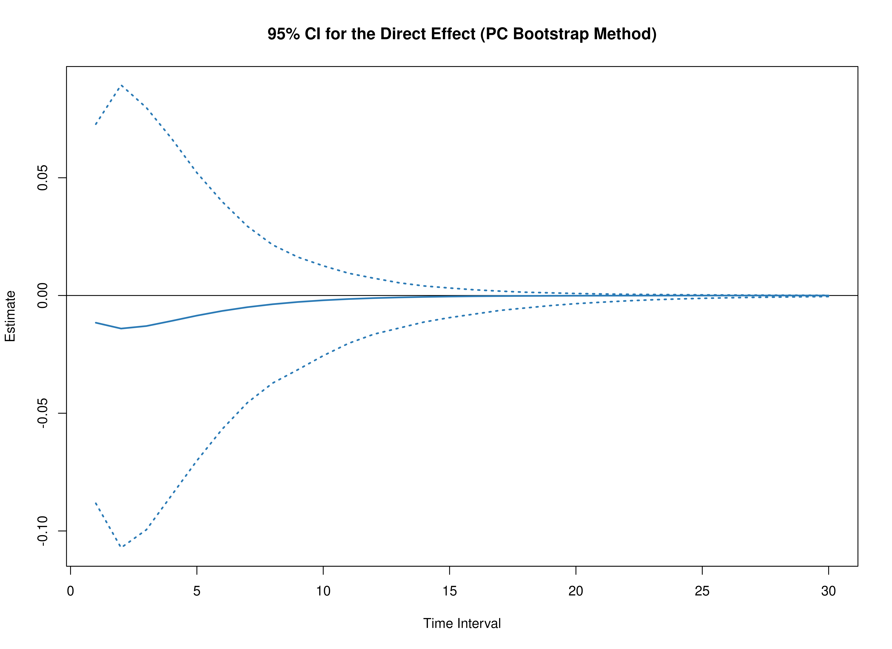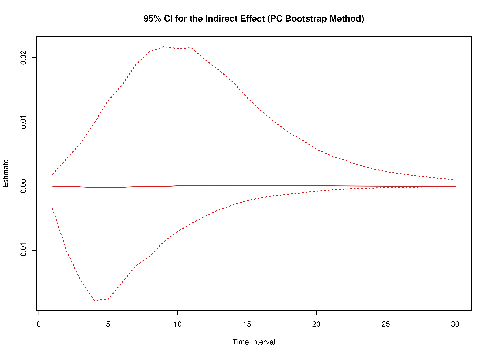

``` r
plot(pb, type = "bc")
```

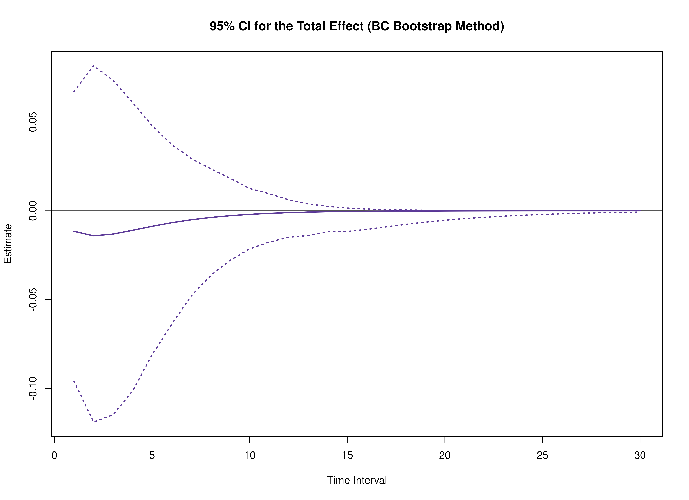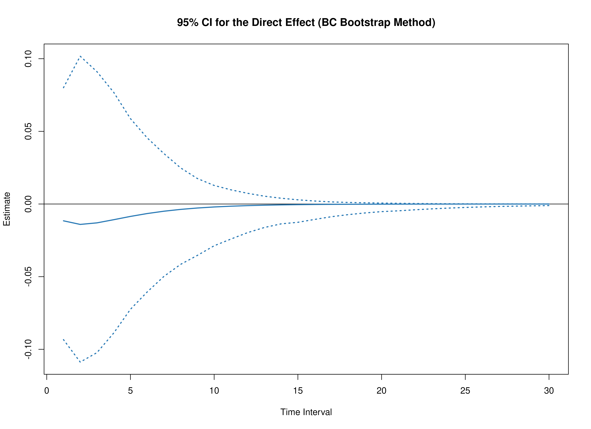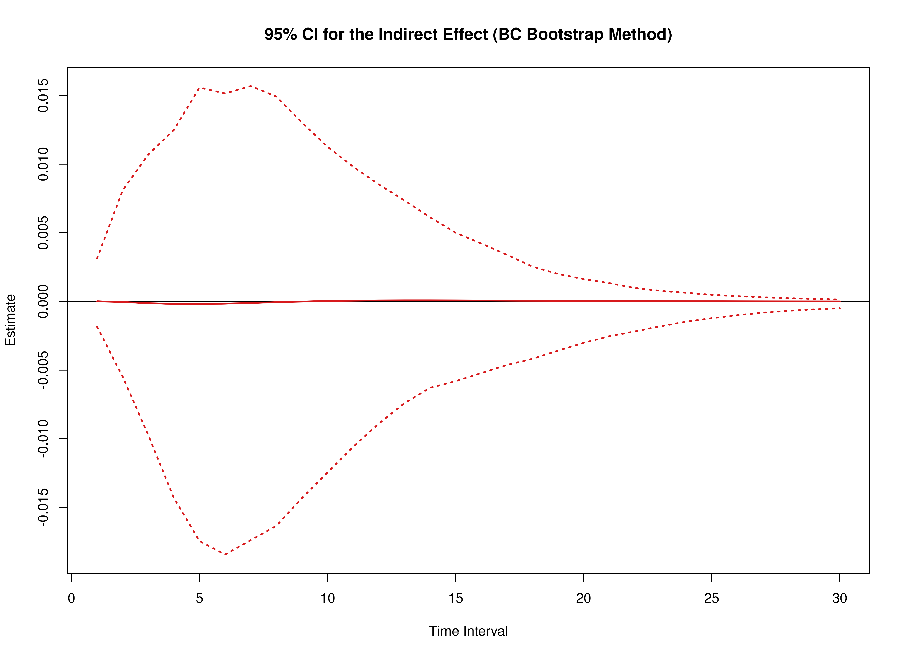

``` r
summary(pb)
#>      effect interval           est           se    R          2.5%        97.5%
#> 1     total        1 -1.155252e-02 0.0435516133 1000 -9.353563e-02 0.0753764893
#> 2    direct        1 -1.156492e-02 0.0435074913 1000 -9.236849e-02 0.0776639536
#> 3  indirect        1  1.240083e-05 0.0012664803 1000 -3.822906e-03 0.0016797673
#> 4     total        2 -1.408408e-02 0.0528806185 1000 -1.152255e-01 0.0885242817
#> 5    direct        2 -1.404168e-02 0.0525086957 1000 -1.098665e-01 0.0954383580
#> 6  indirect        2 -4.240204e-05 0.0034859449 1000 -1.099960e-02 0.0036235670
#> 7     total        3 -1.309786e-02 0.0491924897 1000 -1.118420e-01 0.0781511917
#> 8    direct        3 -1.297147e-02 0.0485286192 1000 -1.036332e-01 0.0890083476
#> 9  indirect        3 -1.263934e-04 0.0055399331 1000 -1.722298e-02 0.0062197125
#> 10    total        4 -1.098008e-02 0.0413988274 1000 -9.801465e-02 0.0644021553
#> 11   direct        4 -1.079883e-02 0.0406840973 1000 -8.811687e-02 0.0738481849
#> 12 indirect        4 -1.812500e-04 0.0069304001 1000 -2.016964e-02 0.0092689159
#> 13    total        5 -8.727446e-03 0.0331293798 1000 -7.946052e-02 0.0512330541
#> 14   direct        5 -8.538213e-03 0.0326305546 1000 -7.186313e-02 0.0577235292
#> 15 indirect        5 -1.892332e-04 0.0076636180 1000 -2.042474e-02 0.0117378680
#> 16    total        6 -6.718987e-03 0.0257351787 1000 -6.195512e-02 0.0406439283
#> 17   direct        6 -6.559465e-03 0.0256433983 1000 -5.759768e-02 0.0436976245
#> 18 indirect        6 -1.595224e-04 0.0079505159 1000 -1.895066e-02 0.0156834771
#> 19    total        7 -5.063621e-03 0.0196129995 1000 -4.604605e-02 0.0319915634
#> 20   direct        7 -4.953961e-03 0.0200000703 1000 -4.656487e-02 0.0329275585
#> 21 indirect        7 -1.096601e-04 0.0079782786 1000 -1.654262e-02 0.0187523936
#> 22    total        8 -3.757504e-03 0.0147746000 1000 -3.375513e-02 0.0256988265
#> 23   direct        8 -3.702261e-03 0.0155967974 1000 -3.804771e-02 0.0239433445
#> 24 indirect        8 -5.524344e-05 0.0078425959 1000 -1.325795e-02 0.0196214137
#> 25    total        9 -2.755037e-03 0.0110828187 1000 -2.483608e-02 0.0207836622
#> 26   direct        9 -2.748541e-03 0.0122161008 1000 -3.049966e-02 0.0184045266
#> 27 indirect        9 -6.495647e-06 0.0075743993 1000 -1.090399e-02 0.0204372747
#> 28    total       10 -2.000302e-03 0.0083482267 1000 -1.674648e-02 0.0171312440
#> 29   direct       10 -2.031880e-03 0.0096352036 1000 -2.519304e-02 0.0145002365
#> 30 indirect       10  3.157812e-05 0.0071840988 1000 -8.462970e-03 0.0199751208
#> 31    total       11 -1.440230e-03 0.0063703740 1000 -1.164293e-02 0.0141809545
#> 32   direct       11 -1.497986e-03 0.0076635419 1000 -2.002239e-02 0.0109644175
#> 33 indirect       11  5.775644e-05 0.0066870406 1000 -6.900728e-03 0.0187040246
#> 34    total       12 -1.029362e-03 0.0049587562 1000 -8.044516e-03 0.0117658197
#> 35   direct       12 -1.102424e-03 0.0061503180 1000 -1.602251e-02 0.0086325162
#> 36 indirect       12  7.306199e-05 0.0061091799 1000 -5.311346e-03 0.0173328925
#> 37    total       13 -7.308208e-04 0.0039473657 1000 -5.904412e-03 0.0104346072
#> 38   direct       13 -8.103814e-04 0.0049807584 1000 -1.298937e-02 0.0063812048
#> 39 indirect       13  7.956057e-05 0.0054830803 1000 -4.202069e-03 0.0153394874
#> 40    total       14 -5.156803e-04 0.0032052532 1000 -4.247046e-03 0.0086009207
#> 41   direct       14 -5.952559e-04 0.0040692036 1000 -1.072764e-02 0.0048962754
#> 42 indirect       14  7.957560e-05 0.0048419269 1000 -3.218242e-03 0.0137357843
#> 43    total       15 -3.617743e-04 0.0026400267 1000 -2.910302e-03 0.0077940278
#> 44   direct       15 -4.370234e-04 0.0033522742 1000 -8.755051e-03 0.0037588973
#> 45 indirect       15  7.524910e-05 0.0042148935 1000 -2.383370e-03 0.0124754225
#> 46    total       16 -2.524048e-04 0.0021930746 1000 -2.062644e-03 0.0065286084
#> 47   direct       16 -3.207496e-04 0.0027831673 1000 -7.143762e-03 0.0028851612
#> 48 indirect       16  6.834481e-05 0.0036246003 1000 -1.793038e-03 0.0106285848
#> 49    total       17 -1.751620e-04 0.0018300170 1000 -1.473736e-03 0.0056637964
#> 50   direct       17 -2.353620e-04 0.0023272450 1000 -5.839960e-03 0.0022142495
#> 51 indirect       17  6.020000e-05 0.0030863565 1000 -1.405254e-03 0.0090225931
#> 52    total       18 -1.209245e-04 0.0015311219 1000 -1.068279e-03 0.0047507468
#> 53   direct       18 -1.726819e-04 0.0019587468 1000 -4.729591e-03 0.0015914647
#> 54 indirect       18  5.175744e-05 0.0026086111 1000 -1.124836e-03 0.0075997156
#> 55    total       19 -8.305073e-05 0.0012842809 1000 -7.904749e-04 0.0039264057
#> 56   direct       19 -1.266829e-04 0.0016583884 1000 -3.871038e-03 0.0012313833
#> 57 indirect       19  4.363220e-05 0.0021940770 1000 -8.982327e-04 0.0061206781
#> 58    total       20 -5.674485e-05 0.0010808578 1000 -5.980953e-04 0.0032593808
#> 59   direct       20 -9.293168e-05 0.0014116238 1000 -3.154439e-03 0.0008917313
#> 60 indirect       20  3.618682e-05 0.0018411212 1000 -7.158757e-04 0.0048959610
#> 61    total       21 -3.856892e-05 0.0009136900 1000 -4.423624e-04 0.0026473291
#> 62   direct       21 -6.816989e-05 0.0012073904 1000 -2.582264e-03 0.0006584225
#> 63 indirect       21  2.960097e-05 0.0015451508 1000 -5.771726e-04 0.0040285134
#> 64    total       22 -2.607509e-05 0.0007763844 1000 -3.442536e-04 0.0021894490
#> 65   direct       22 -5.000466e-05 0.0010372025 1000 -2.107698e-03 0.0005148207
#> 66 indirect       22  2.392957e-05 0.0012998385 1000 -4.539850e-04 0.0033775999
#> 67    total       23 -1.753128e-05 0.0006632394 1000 -2.831019e-04 0.0018372079
#> 68   direct       23 -3.667930e-05 0.0008944946 1000 -1.720530e-03 0.0003889268
#> 69 indirect       23  1.914802e-05 0.0010981141 1000 -3.625718e-04 0.0028342691
#> 70    total       24 -1.171906e-05 0.0005693631 1000 -2.651079e-04 0.0015469317
#> 71   direct       24 -2.690463e-05 0.0007741426 1000 -1.405621e-03 0.0002931593
#> 72 indirect       24  1.518557e-05 0.0009329023 1000 -2.942218e-04 0.0023282340
#> 73    total       25 -7.786092e-06 0.0004907592 1000 -2.175929e-04 0.0012676764
#> 74   direct       25 -1.973467e-05 0.0006721132 1000 -1.148349e-03 0.0002375032
#> 75 indirect       25  1.194857e-05 0.0007976219 1000 -2.396575e-04 0.0018705864
#> 76    total       26 -5.139335e-06 0.0004243060 1000 -1.805443e-04 0.0010662522
#> 77   direct       26 -1.447540e-05 0.0005852051 1000 -9.381658e-04 0.0001932213
#> 78 indirect       26  9.336065e-06 0.0006864753 1000 -2.036482e-04 0.0015277089
#> 79    total       27 -3.368332e-06 0.0003676409 1000 -1.493655e-04 0.0008972221
#> 80   direct       27 -1.061769e-05 0.0005108568 1000 -7.651190e-04 0.0001466771
#> 81 indirect       27  7.249358e-06 0.0005945700 1000 -1.610157e-04 0.0012694309
#> 82    total       28 -2.190458e-06 0.0003190005 1000 -1.310064e-04 0.0007448769
#> 83   direct       28 -7.788048e-06 0.0004470034 1000 -6.281216e-04 0.0001118532
#> 84 indirect       28  5.597590e-06 0.0005179178 1000 -1.301471e-04 0.0010813015
#> 85    total       29 -1.412110e-06 0.0002770609 1000 -1.090064e-04 0.0006184159
#> 86   direct       29 -5.712505e-06 0.0003919676 1000 -5.145941e-04 0.0000902687
#> 87 indirect       29  4.300396e-06 0.0004533547 1000 -1.117568e-04 0.0009207057
#> 88    total       30 -9.013541e-07 0.0002408043 1000 -9.391657e-05 0.0005134381
#> 89   direct       30 -4.190099e-06 0.0003443776 1000 -4.273543e-04 0.0000691145
#> 90 indirect       30  3.288745e-06 0.0003984212 1000 -9.123490e-05 0.0007559571
summary(pb, type = "bc")
#>      effect interval           est           se    R          2.5%        97.5%
#> 1     total        1 -1.155252e-02 0.0435516133 1000 -0.0919506534 7.892572e-02
#> 2    direct        1 -1.156492e-02 0.0435074913 1000 -0.0900304734 8.200343e-02
#> 3  indirect        1  1.240083e-05 0.0012664803 1000 -0.0016975448 2.952356e-03
#> 4     total        2 -1.408408e-02 0.0528806185 1000 -0.1113819289 9.311231e-02
#> 5    direct        2 -1.404168e-02 0.0525086957 1000 -0.1069852222 9.983522e-02
#> 6  indirect        2 -4.240204e-05 0.0034859449 1000 -0.0047751047 6.895697e-03
#> 7     total        3 -1.309786e-02 0.0491924897 1000 -0.1069712355 8.190659e-02
#> 8    direct        3 -1.297147e-02 0.0485286192 1000 -0.1006905530 9.207773e-02
#> 9  indirect        3 -1.263934e-04 0.0055399331 1000 -0.0089227857 1.117200e-02
#> 10    total        4 -1.098008e-02 0.0413988274 1000 -0.0894293234 6.768800e-02
#> 11   direct        4 -1.079883e-02 0.0406840973 1000 -0.0864851199 7.786020e-02
#> 12 indirect        4 -1.812500e-04 0.0069304001 1000 -0.0119030977 1.494361e-02
#> 13    total        5 -8.727446e-03 0.0331293798 1000 -0.0760766155 5.299962e-02
#> 14   direct        5 -8.538213e-03 0.0326305546 1000 -0.0711712653 6.040961e-02
#> 15 indirect        5 -1.892332e-04 0.0076636180 1000 -0.0158668808 1.713259e-02
#> 16    total        6 -6.718987e-03 0.0257351787 1000 -0.0576801664 4.143290e-02
#> 17   direct        6 -6.559465e-03 0.0256433983 1000 -0.0566732976 4.523385e-02
#> 18 indirect        6 -1.595224e-04 0.0079505159 1000 -0.0171498883 1.756950e-02
#> 19    total        7 -5.063621e-03 0.0196129995 1000 -0.0445249575 3.315437e-02
#> 20   direct        7 -4.953961e-03 0.0200000703 1000 -0.0457413429 3.412401e-02
#> 21 indirect        7 -1.096601e-04 0.0079782786 1000 -0.0167245691 1.789528e-02
#> 22    total        8 -3.757504e-03 0.0147746000 1000 -0.0327043524 2.608442e-02
#> 23   direct        8 -3.702261e-03 0.0155967974 1000 -0.0367538954 2.514570e-02
#> 24 indirect        8 -5.524344e-05 0.0078425959 1000 -0.0166659356 1.544121e-02
#> 25    total        9 -2.755037e-03 0.0110828187 1000 -0.0247986000 2.080883e-02
#> 26   direct        9 -2.748541e-03 0.0122161008 1000 -0.0297419442 1.943665e-02
#> 27 indirect        9 -6.495647e-06 0.0075743993 1000 -0.0176837049 1.286195e-02
#> 28    total       10 -2.000302e-03 0.0083482267 1000 -0.0188887438 1.582749e-02
#> 29   direct       10 -2.031880e-03 0.0096352036 1000 -0.0242740176 1.502251e-02
#> 30 indirect       10  3.157812e-05 0.0071840988 1000 -0.0161652762 1.175336e-02
#> 31    total       11 -1.440230e-03 0.0063703740 1000 -0.0163630787 1.077674e-02
#> 32   direct       11 -1.497986e-03 0.0076635419 1000 -0.0198288117 1.157925e-02
#> 33 indirect       11  5.775644e-05 0.0066870406 1000 -0.0134167610 9.733602e-03
#> 34    total       12 -1.029362e-03 0.0049587562 1000 -0.0131152561 6.604475e-03
#> 35   direct       12 -1.102424e-03 0.0061503180 1000 -0.0159534797 8.736056e-03
#> 36 indirect       12  7.306199e-05 0.0061091799 1000 -0.0123473300 8.794322e-03
#> 37    total       13 -7.308208e-04 0.0039473657 1000 -0.0097853549 4.652797e-03
#> 38   direct       13 -8.103814e-04 0.0049807584 1000 -0.0130689873 6.376003e-03
#> 39 indirect       13  7.956057e-05 0.0054830803 1000 -0.0107323806 7.540727e-03
#> 40    total       14 -5.156803e-04 0.0032052532 1000 -0.0083972378 2.669063e-03
#> 41   direct       14 -5.952559e-04 0.0040692036 1000 -0.0107813657 4.630223e-03
#> 42 indirect       14  7.957560e-05 0.0048419269 1000 -0.0095036945 6.099248e-03
#> 43    total       15 -3.617743e-04 0.0026400267 1000 -0.0073693288 1.846080e-03
#> 44   direct       15 -4.370234e-04 0.0033522742 1000 -0.0089636997 3.326749e-03
#> 45 indirect       15  7.524910e-05 0.0042148935 1000 -0.0093884900 4.736609e-03
#> 46    total       16 -2.524048e-04 0.0021930746 1000 -0.0060872902 1.073530e-03
#> 47   direct       16 -3.207496e-04 0.0027831673 1000 -0.0075682299 2.317065e-03
#> 48 indirect       16  6.834481e-05 0.0036246003 1000 -0.0075437389 3.762183e-03
#> 49    total       17 -1.751620e-04 0.0018300170 1000 -0.0047507907 6.273911e-04
#> 50   direct       17 -2.353620e-04 0.0023272450 1000 -0.0062080157 1.736330e-03
#> 51 indirect       17  6.020000e-05 0.0030863565 1000 -0.0062431811 3.038729e-03
#> 52    total       18 -1.209245e-04 0.0015311219 1000 -0.0040332498 3.764075e-04
#> 53   direct       18 -1.726819e-04 0.0019587468 1000 -0.0051670854 1.270944e-03
#> 54 indirect       18  5.175744e-05 0.0026086111 1000 -0.0051188122 2.502783e-03
#> 55    total       19 -8.305073e-05 0.0012842809 1000 -0.0034073084 2.586215e-04
#> 56   direct       19 -1.266829e-04 0.0016583884 1000 -0.0042967654 9.368183e-04
#> 57 indirect       19  4.363220e-05 0.0021940770 1000 -0.0043997762 1.972017e-03
#> 58    total       20 -5.674485e-05 0.0010808578 1000 -0.0028705266 1.977982e-04
#> 59   direct       20 -9.293168e-05 0.0014116238 1000 -0.0035933527 6.597410e-04
#> 60 indirect       20  3.618682e-05 0.0018411212 1000 -0.0038492701 1.549685e-03
#> 61    total       21 -3.856892e-05 0.0009136900 1000 -0.0024280110 1.350973e-04
#> 62   direct       21 -6.816989e-05 0.0012073904 1000 -0.0030089019 5.215101e-04
#> 63 indirect       21  2.960097e-05 0.0015451508 1000 -0.0032964752 1.231675e-03
#> 64    total       22 -2.607509e-05 0.0007763844 1000 -0.0020438719 1.006637e-04
#> 65   direct       22 -5.000466e-05 0.0010372025 1000 -0.0025589764 3.862214e-04
#> 66 indirect       22  2.392957e-05 0.0012998385 1000 -0.0029401569 9.420339e-04
#> 67    total       23 -1.753128e-05 0.0006632394 1000 -0.0017131885 7.813102e-05
#> 68   direct       23 -3.667930e-05 0.0008944946 1000 -0.0021548666 2.887403e-04
#> 69 indirect       23  1.914802e-05 0.0010981141 1000 -0.0025882152 7.191780e-04
#> 70    total       24 -1.171906e-05 0.0005693631 1000 -0.0014361639 5.993773e-05
#> 71   direct       24 -2.690463e-05 0.0007741426 1000 -0.0018209291 2.193851e-04
#> 72 indirect       24  1.518557e-05 0.0009329023 1000 -0.0021849289 5.638376e-04
#> 73    total       25 -7.786092e-06 0.0004907592 1000 -0.0011858581 5.345053e-05
#> 74   direct       25 -1.973467e-05 0.0006721132 1000 -0.0015619137 1.658643e-04
#> 75 indirect       25  1.194857e-05 0.0007976219 1000 -0.0019174058 4.382632e-04
#> 76    total       26 -5.139335e-06 0.0004243060 1000 -0.0009739551 5.426536e-05
#> 77   direct       26 -1.447540e-05 0.0005852051 1000 -0.0013523595 1.246904e-04
#> 78 indirect       26  9.336065e-06 0.0006864753 1000 -0.0016323122 3.450796e-04
#> 79    total       27 -3.368332e-06 0.0003676409 1000 -0.0007948875 6.189120e-05
#> 80   direct       27 -1.061769e-05 0.0005108568 1000 -0.0011386336 9.415006e-05
#> 81 indirect       27  7.249358e-06 0.0005945700 1000 -0.0013613096 2.677765e-04
#> 82    total       28 -2.190458e-06 0.0003190005 1000 -0.0006440032 5.565955e-05
#> 83   direct       28 -7.788048e-06 0.0004470034 1000 -0.0009570774 7.094977e-05
#> 84 indirect       28  5.597590e-06 0.0005179178 1000 -0.0011206465 2.105822e-04
#> 85    total       29 -1.412110e-06 0.0002770609 1000 -0.0005274576 5.535063e-05
#> 86   direct       29 -5.712505e-06 0.0003919676 1000 -0.0007970081 5.276908e-05
#> 87 indirect       29  4.300396e-06 0.0004533547 1000 -0.0009077891 1.717999e-04
#> 88    total       30 -9.013541e-07 0.0002408043 1000 -0.0004784694 5.349984e-05
#> 89   direct       30 -4.190099e-06 0.0003443776 1000 -0.0006753128 3.823971e-05
#> 90 indirect       30  3.288745e-06 0.0003984212 1000 -0.0007891500 1.330794e-04
```

## Confidence Intervals (Standardized)

### Model $\eta_X \to \eta_M \to \eta_Y$

#### Delta Method


``` r
delta <- DeltaStdXMY(theta_hat = theta_hat)
plot(delta)
```

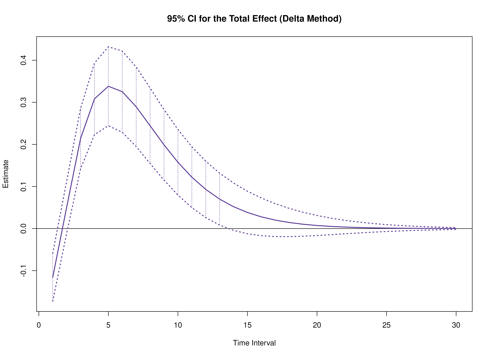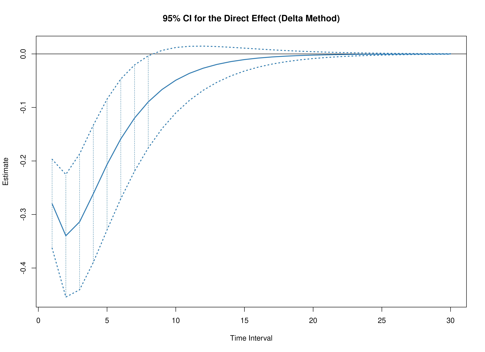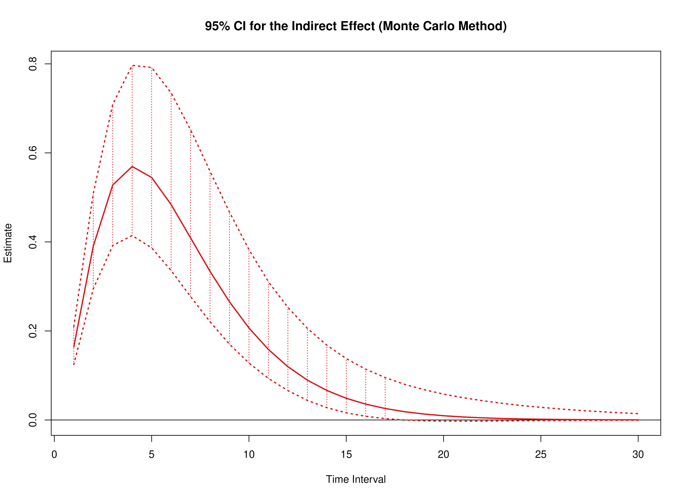

``` r
summary(delta)
#>      effect interval           est           se          z            p
#> 1     total        1 -0.1157835296 0.0291065771 -3.9779164 6.952181e-05
#> 2    direct        1 -0.2798085537 0.0423423852 -6.6082379 3.889214e-11
#> 3  indirect        1  0.1640250241 0.0215131132  7.6244206 2.451328e-14
#> 4     total        2  0.0504688901 0.0315078564  1.6017875 1.092026e-01
#> 5    direct        2 -0.3397327610 0.0584512805 -5.8122381 6.164307e-09
#> 6  indirect        2  0.3902016511 0.0539360977  7.2345177 4.671866e-13
#> 7     total        3  0.2139191622 0.0365900115  5.8463814 5.023815e-09
#> 8    direct        3 -0.3138392892 0.0647121205 -4.8497760 1.236010e-06
#> 9  indirect        3  0.5277584514 0.0796400476  6.6267973 3.430482e-11
#> 10    total        4  0.3081999837 0.0434079303  7.1000847 1.246804e-12
#> 11   direct        4 -0.2612731631 0.0653621587 -3.9973154 6.406492e-05
#> 12 indirect        4  0.5694731468 0.0944057248  6.0321887 1.617537e-09
#> 13    total        5  0.3381853808 0.0478639239  7.0655590 1.599706e-12
#> 14   direct        5 -0.2065785708 0.0623334585 -3.3140881 9.194254e-04
#> 15 indirect        5  0.5447639516 0.0989570137  5.5050565 3.690499e-08
#> 16    total        6  0.3252637053 0.0492364389  6.6061582 3.944214e-11
#> 17   direct        6 -0.1587035623 0.0570587426 -2.7814066 5.412391e-03
#> 18 indirect        6  0.4839672676 0.0958315853  5.0501853 4.413816e-07
#> 19    total        7  0.2892953613 0.0482184285  5.9996846 1.977012e-09
#> 20   direct        7 -0.1198590556 0.0506424990 -2.3667682 1.794417e-02
#> 21 indirect        7  0.4091544169 0.0877977408  4.6601930 3.159130e-06
#> 22    total        8  0.2443250400 0.0457886754  5.3359272 9.505752e-08
#> 23   direct        8 -0.0895746791 0.0438779391 -2.0414514 4.120598e-02
#> 24 indirect        8  0.3338997191 0.0772682865  4.3213035 1.551101e-05
#> 25    total        9  0.1989011436 0.0427959982  4.6476575 3.357257e-06
#> 26   direct        9 -0.0664998299 0.0372906057 -1.7832864 7.453969e-02
#> 27 indirect        9  0.2654009735 0.0661187657  4.0140038 5.969740e-05
#> 28    total       10  0.1575389791 0.0397751232  3.9607415 7.471740e-05
#> 29   direct       10 -0.0491604953 0.0311967117 -1.5758230 1.150666e-01
#> 30 indirect       10  0.2066994743 0.0556366676  3.7151663 2.030701e-04
#> 31    total       11  0.1221456297 0.0369202723  3.3083621 9.384339e-04
#> 32   direct       11 -0.0362431634 0.0257596778 -1.4069727 1.594355e-01
#> 33 indirect       11  0.1583887931 0.0465394056  3.4033265 6.657067e-04
#> 34    total       12  0.0930971779 0.0341923778  2.7227465 6.474171e-03
#> 35   direct       12 -0.0266727061 0.0210379322 -1.2678388 2.048555e-01
#> 36 indirect       12  0.1197698840 0.0390551541  3.0666857 2.164463e-03
#> 37    total       13  0.0699628804 0.0314731320  2.2229399 2.621985e-02
#> 38   direct       13 -0.0196068449 0.0170223152 -1.1518319 2.493902e-01
#> 39 indirect       13  0.0895697252 0.0330599459  2.7093125 6.742280e-03
#> 40    total       14  0.0519549100 0.0286759227  1.8117956 7.001779e-02
#> 41   direct       14 -0.0144019715 0.0136637250 -1.0540297 2.918693e-01
#> 42 indirect       14  0.0663568815 0.0282465408  2.3492038 1.881361e-02
#> 43    total       15  0.0381881378 0.0257850754  1.4810171 1.386020e-01
#> 44   direct       15 -0.0105736012 0.0108925383 -0.9707197 3.316879e-01
#> 45 indirect       15  0.0487617390 0.0242788625  2.0084029 4.460049e-02
#> 46    total       16  0.0278175104 0.0228455109  1.2176357 2.233624e-01
#> 47   direct       16 -0.0077604057 0.0086315607 -0.8990733 3.686136e-01
#> 48 indirect       16  0.0355779160 0.0208883553  1.7032416 8.852286e-02
#> 49    total       17  0.0201009529 0.0199344715  1.0083514 3.132858e-01
#> 50   direct       17 -0.0056944874 0.0068041553 -0.8369132 4.026414e-01
#> 51 indirect       17  0.0257954404 0.0179030046  1.4408442 1.496287e-01
#> 52    total       18  0.0144195419 0.0171350532  0.8415230 4.000550e-01
#> 53   direct       18 -0.0041779678 0.0053389406 -0.7825462 4.338936e-01
#> 54 indirect       18  0.0185975097 0.0152323464  1.2209222 2.221155e-01
#> 55    total       19  0.0102749417 0.0145186814  0.7077049 4.791285e-01
#> 56   direct       19 -0.0030650417 0.0041721550 -0.7346423 4.625574e-01
#> 57 indirect       19  0.0133399833 0.0128377696  1.0391200 2.987489e-01
#> 58    total       20  0.0072761421 0.0121366693  0.5995172 5.488280e-01
#> 59   direct       20 -0.0022484438 0.0032485082 -0.6921466 4.888453e-01
#> 60 indirect       20  0.0095245859 0.0107059632  0.8896524 3.736526e-01
#> 61    total       21  0.0051223923 0.0100184525  0.5112958 6.091440e-01
#> 62   direct       21 -0.0016493427 0.0025211046 -0.6542143 5.129738e-01
#> 63 indirect       21  0.0067717349 0.0088313182  0.7667864 4.432085e-01
#> 64    total       22  0.0035860244 0.0081738154  0.4387210 6.608637e-01
#> 65   direct       22 -0.0012098422 0.0019508456 -0.6201630 5.351505e-01
#> 66 indirect       22  0.0047958666 0.0072066685  0.6654762 5.057459e-01
#> 67    total       23  0.0024969500 0.0065969851  0.3784987 7.050602e-01
#> 68   direct       23 -0.0008874408 0.0015055748 -0.5894365 5.555685e-01
#> 69 indirect       23  0.0033843907 0.0058197939  0.5815310 5.608826e-01
#> 70    total       24  0.0017295077 0.0052711750  0.3281067 7.428310e-01
#> 71   direct       24 -0.0006509465 0.0011591384 -0.5615779 5.744037e-01
#> 72 indirect       24  0.0023804542 0.0046532193  0.5115715 6.089510e-01
#> 73    total       25  0.0011917525 0.0041727664  0.2856025 7.751826e-01
#> 74   direct       25 -0.0004774722 0.0008904598 -0.5362086 5.918144e-01
#> 75 indirect       25  0.0016692247 0.0036855433  0.4529114 6.506125e-01
#> 76    total       26  0.0008169808 0.0032747470  0.2494791 8.029902e-01
#> 77   direct       26 -0.0003502264 0.0006826852 -0.5130130 6.079422e-01
#> 78 indirect       26  0.0011672072 0.0028932219  0.4034282 6.866333e-01
#> 79    total       27  0.0005571702 0.0025493022  0.2185579 8.269944e-01
#> 80   direct       27 -0.0002568907 0.0005224266 -0.4917259 6.229132e-01
#> 81 indirect       27  0.0008140609 0.0022522387  0.3614452 7.177667e-01
#> 82    total       28  0.0003779887 0.0019696106  0.1919104 8.478124e-01
#> 83   direct       28 -0.0001884286 0.0003991092 -0.4721229 6.368390e-01
#> 84 indirect       28  0.0005664173 0.0017394197  0.3256358 7.446999e-01
#> 85    total       29  0.0002550490 0.0015109697  0.1687982 8.659553e-01
#> 86   direct       29 -0.0001382117 0.0003044221 -0.4540135 6.498191e-01
#> 87 indirect       29  0.0003932608 0.0013333327  0.2949457 7.680353e-01
#> 88    total       30  0.0001711332 0.0011513994  0.1486306 8.818451e-01
#> 89   direct       30 -0.0001013777 0.0002318614 -0.4372341 6.619415e-01
#> 90 indirect       30  0.0002725109 0.0010148110  0.2685336 7.882886e-01
#>             2.5%         97.5%
#> 1  -0.1728313725 -0.0587356867
#> 2  -0.3627981038 -0.1968190036
#> 3   0.1218600970  0.2061899512
#> 4  -0.0112853736  0.1122231539
#> 5  -0.4542951656 -0.2251703565
#> 6   0.2844888421  0.4959144601
#> 7   0.1422040573  0.2856342670
#> 8  -0.4406727148 -0.1870058636
#> 9   0.3716668264  0.6838500763
#> 10  0.2231220036  0.3932779638
#> 11 -0.3893806401 -0.1331656862
#> 12  0.3844413262  0.7545049674
#> 13  0.2443738138  0.4319969479
#> 14 -0.3287499044 -0.0844072372
#> 15  0.3508117688  0.7387161345
#> 16  0.2287620583  0.4217653524
#> 17 -0.2705366428 -0.0468704818
#> 18  0.2961408118  0.6717937234
#> 19  0.1947889781  0.3838017445
#> 20 -0.2191165298 -0.0206015815
#> 21  0.2370740070  0.5812348268
#> 22  0.1545808853  0.3340691947
#> 23 -0.1755738594 -0.0035754988
#> 24  0.1824566604  0.4853427778
#> 25  0.1150225285  0.2827797588
#> 26 -0.1395880741  0.0065884143
#> 27  0.1358105740  0.3949913730
#> 28  0.0795811702  0.2354967880
#> 29 -0.1103049267  0.0119839362
#> 30  0.0976536095  0.3157453392
#> 31  0.0497832256  0.1945080338
#> 32 -0.0867312041  0.0142448774
#> 33  0.0671732342  0.2496043519
#> 34  0.0260813488  0.1601130070
#> 35 -0.0679062956  0.0145608833
#> 36  0.0432231886  0.1963165794
#> 37  0.0082766752  0.1316490855
#> 38 -0.0529699695  0.0137562798
#> 39  0.0247734219  0.1543660286
#> 40 -0.0042488657  0.1081586856
#> 41 -0.0411823803  0.0123784373
#> 42  0.0109946789  0.1217190841
#> 43 -0.0123496814  0.0887259570
#> 44 -0.0319225839  0.0107753815
#> 45  0.0011760430  0.0963474349
#> 46 -0.0169588682  0.0725938889
#> 47 -0.0246779538  0.0091571425
#> 48 -0.0053625081  0.0765183402
#> 49 -0.0189698933  0.0591717992
#> 50 -0.0190303868  0.0076414119
#> 51 -0.0092938038  0.0608846845
#> 52 -0.0191645452  0.0480036290
#> 53 -0.0146420990  0.0062861635
#> 54 -0.0112573407  0.0484523600
#> 55 -0.0181811509  0.0387310342
#> 56 -0.0112423153  0.0051122319
#> 57 -0.0118215828  0.0385015494
#> 58 -0.0165112927  0.0310635769
#> 59 -0.0086154028  0.0041185152
#> 60 -0.0114587163  0.0305078882
#> 61 -0.0145134139  0.0247581984
#> 62 -0.0065906169  0.0032919316
#> 63 -0.0105373307  0.0240808006
#> 64 -0.0124343595  0.0196064083
#> 65 -0.0050334292  0.0026137448
#> 66 -0.0093289440  0.0189206773
#> 67 -0.0104329032  0.0154268032
#> 68 -0.0038383131  0.0020634316
#> 69 -0.0080221956  0.0147909771
#> 70 -0.0086018054  0.0120608209
#> 71 -0.0029228160  0.0016209231
#> 72 -0.0067396880  0.0115005964
#> 73 -0.0069867194  0.0093702244
#> 74 -0.0022227413  0.0012677970
#> 75 -0.0055543075  0.0088927570
#> 76 -0.0056014054  0.0072353670
#> 77 -0.0016882648  0.0009878121
#> 78 -0.0045034035  0.0068378179
#> 79 -0.0044393702  0.0055537107
#> 80 -0.0012808279  0.0007670466
#> 81 -0.0036002459  0.0052283677
#> 82 -0.0034823771  0.0042383544
#> 83 -0.0009706684  0.0005938111
#> 84 -0.0028427826  0.0039756172
#> 85 -0.0027063971  0.0032164952
#> 86 -0.0007348680  0.0004584446
#> 87 -0.0022200233  0.0030065448
#> 88 -0.0020855682  0.0024278345
#> 89 -0.0005558177  0.0003530623
#> 90 -0.0017164822  0.0022615039
```

#### Monte Carlo Method


``` r
mc <- MCStdXMY(theta_hat = theta_hat, seed = seed)
plot(mc)
```

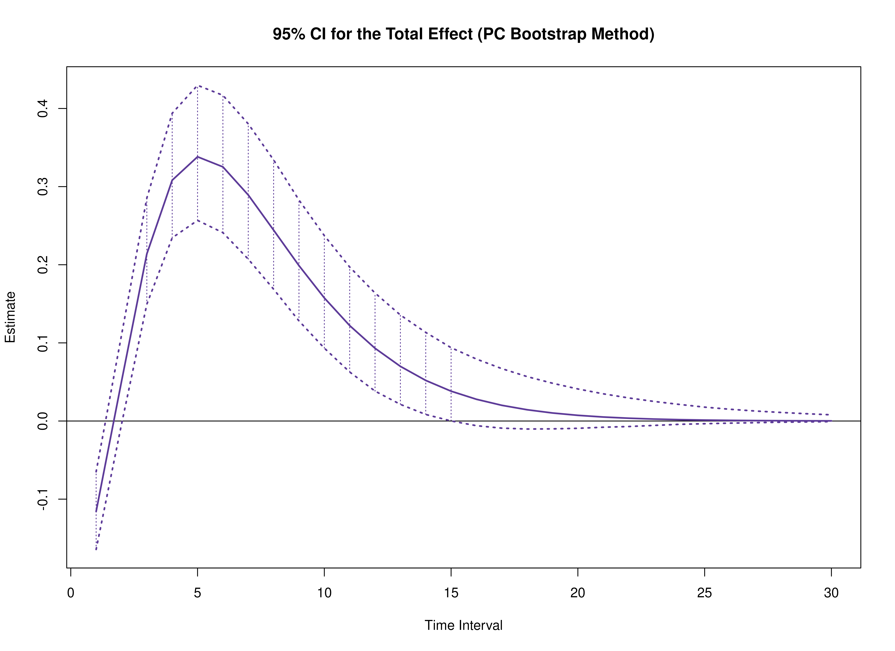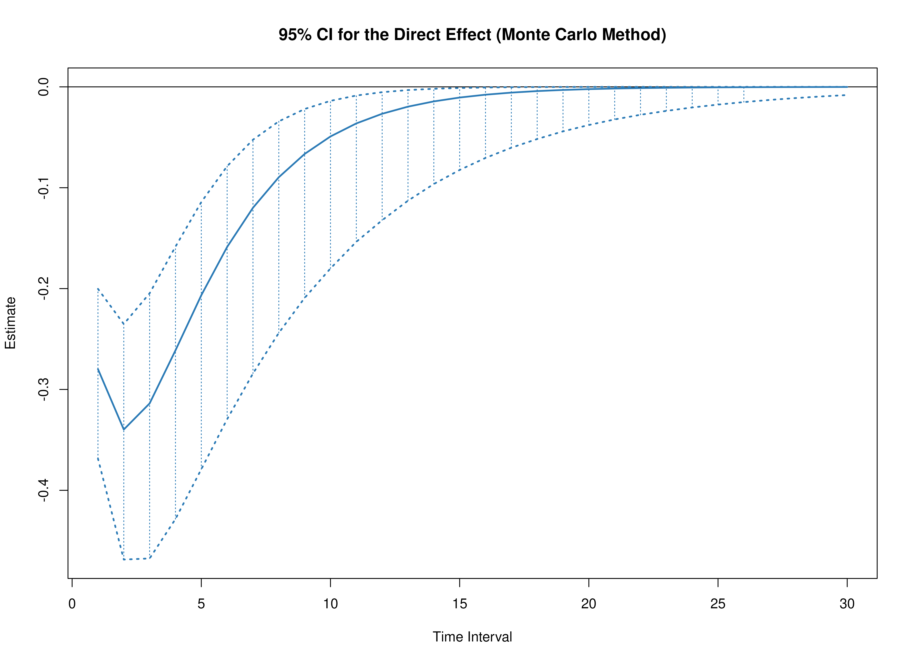

``` r
summary(mc)
#>      effect interval           est          se     R          2.5%
#> 1     total        1 -0.1157835296 0.029481201 20000 -0.1761353116
#> 2    direct        1 -0.2798085537 0.042976365 20000 -0.3684931350
#> 3  indirect        1  0.1640250241 0.021777749 20000  0.1247109014
#> 4     total        2  0.0504688901 0.031972723 20000 -0.0128590440
#> 5    direct        2 -0.3397327610 0.059817888 20000 -0.4686506877
#> 6  indirect        2  0.3902016511 0.054880764 20000  0.2943710045
#> 7     total        3  0.2139191622 0.037165118 20000  0.1447172200
#> 8    direct        3 -0.3138392892 0.067154854 20000 -0.4675518292
#> 9  indirect        3  0.5277584514 0.081716497 20000  0.3919613167
#> 10    total        4  0.3081999837 0.044168665 20000  0.2310736302
#> 11   direct        4 -0.2612731631 0.069299729 20000 -0.4284717977
#> 12 indirect        4  0.5694731468 0.098054069 20000  0.4142811992
#> 13    total        5  0.3381853808 0.048864355 20000  0.2553306428
#> 14   direct        5 -0.2065785708 0.068054846 20000 -0.3790702668
#> 15 indirect        5  0.5447639516 0.104439427 20000  0.3867650724
#> 16    total        6  0.3252637053 0.050516344 20000  0.2425170414
#> 17   direct        6 -0.1587035623 0.064656344 20000 -0.3294813322
#> 18 indirect        6  0.4839672676 0.103160762 20000  0.3357634893
#> 19    total        7  0.2892953613 0.049799008 20000  0.2100540983
#> 20   direct        7 -0.1198590556 0.060037691 20000 -0.2841627260
#> 21 indirect        7  0.4091544169 0.096762543 20000  0.2773019745
#> 22    total        8  0.2443250400 0.047663148 20000  0.1703928085
#> 23   direct        8 -0.0895746791 0.054875143 20000 -0.2439371343
#> 24 indirect        8  0.3338997191 0.087499258 20000  0.2207561093
#> 25    total        9  0.1989011436 0.044931731 20000  0.1312727778
#> 26   direct        9 -0.0664998299 0.049629462 20000 -0.2092240006
#> 27 indirect        9  0.2654009735 0.077159799 20000  0.1702077446
#> 28    total       10  0.1575389791 0.042127200 20000  0.0947579657
#> 29   direct       10 -0.0491604953 0.044592930 20000 -0.1800237511
#> 30 indirect       10  0.2066994743 0.067012340 20000  0.1279972073
#> 31    total       11  0.1221456297 0.039446344 20000  0.0637052296
#> 32   direct       11 -0.0362431634 0.039933624 20000 -0.1536155158
#> 33 indirect       11  0.1583887931 0.057818291 20000  0.0933794063
#> 34    total       12  0.0930971779 0.036859709 20000  0.0378766029
#> 35   direct       12 -0.0266727061 0.035732741 20000 -0.1322106267
#> 36 indirect       12  0.1197698840 0.049908323 20000  0.0659615323
#> 37    total       13  0.0699628804 0.034256735 20000  0.0182562748
#> 38   direct       13 -0.0196068449 0.032013889 20000 -0.1128388637
#> 39 indirect       13  0.0895697252 0.043303549 20000  0.0441100953
#> 40    total       14  0.0519549100 0.031553230 20000  0.0047252942
#> 41   direct       14 -0.0144019715 0.028764816 20000 -0.0963121904
#> 42 indirect       14  0.0663568815 0.037851120 20000  0.0276607423
#> 43    total       15  0.0381881378 0.028732444 20000 -0.0048818230
#> 44   direct       15 -0.0105736012 0.025952783 20000 -0.0823991922
#> 45 indirect       15  0.0487617390 0.033340216 20000  0.0161068749
#> 46    total       16  0.0278175104 0.025838077 20000 -0.0102352229
#> 47   direct       16 -0.0077604057 0.023534935 20000 -0.0704637844
#> 48 indirect       16  0.0355779160 0.029575902 20000  0.0082595413
#> 49    total       17  0.0201009529 0.022948121 20000 -0.0123399563
#> 50   direct       17 -0.0056944874 0.021464984 20000 -0.0603275859
#> 51 indirect       17  0.0257954404 0.026408774 20000  0.0030579417
#> 52    total       18  0.0144195419 0.020148686 20000 -0.0130608708
#> 53   direct       18 -0.0041779678 0.019697284 20000 -0.0517128107
#> 54 indirect       18  0.0185975097 0.023734088 20000 -0.0001742567
#> 55    total       19  0.0102749417 0.017515535 20000 -0.0125602805
#> 56   direct       19 -0.0030650417 0.018189126 20000 -0.0441266535
#> 57 indirect       19  0.0133399833 0.021477717 20000 -0.0018198932
#> 58    total       20  0.0072761421 0.015104288 20000 -0.0112809621
#> 59   direct       20 -0.0022484438 0.016901896 20000 -0.0378126193
#> 60 indirect       20  0.0095245859 0.019581450 20000 -0.0025488721
#> 61    total       21  0.0051223923 0.012947511 20000 -0.0095937893
#> 62   direct       21 -0.0016493427 0.015801494 20000 -0.0322763851
#> 63 indirect       21  0.0067717349 0.017993384 20000 -0.0026180606
#> 64    total       22  0.0035860244 0.011056343 20000 -0.0079740557
#> 65   direct       22 -0.0012098422 0.014858321 20000 -0.0276699526
#> 66 indirect       22  0.0047958666 0.016664197 20000 -0.0024368549
#> 67    total       23  0.0024969500 0.009424608 20000 -0.0063754015
#> 68   direct       23 -0.0008874408 0.014047024 20000 -0.0238277473
#> 69 indirect       23  0.0033843907 0.015547504 20000 -0.0021984400
#> 70    total       24  0.0017295077 0.008033887 20000 -0.0049439685
#> 71   direct       24 -0.0006509465 0.013346103 20000 -0.0204256679
#> 72 indirect       24  0.0023804542 0.014601851 20000 -0.0018000105
#> 73    total       25  0.0011917525 0.006858529 20000 -0.0038539546
#> 74   direct       25 -0.0004774722 0.012737470 20000 -0.0175746546
#> 75 indirect       25  0.0016692247 0.013792461 20000 -0.0014965647
#> 76    total       26  0.0008169808 0.005869935 20000 -0.0029107411
#> 77   direct       26 -0.0003502264 0.012206003 20000 -0.0150919158
#> 78 indirect       26  0.0011672072 0.013091858 20000 -0.0011919910
#> 79    total       27  0.0005571702 0.005039776 20000 -0.0021959139
#> 80   direct       27 -0.0002568907 0.011739118 20000 -0.0129609882
#> 81 indirect       27  0.0008140609 0.012479333 20000 -0.0009445880
#> 82    total       28  0.0003779887 0.004342067 20000 -0.0016271700
#> 83   direct       28 -0.0001884286 0.011326376 20000 -0.0111098673
#> 84 indirect       28  0.0005664173 0.011939700 20000 -0.0007370072
#> 85    total       29  0.0002550490 0.003754196 20000 -0.0011844414
#> 86   direct       29 -0.0001382117 0.010959142 20000 -0.0094948579
#> 87 indirect       29  0.0003932608 0.011461822 20000 -0.0005405760
#> 88    total       30  0.0001711332 0.003257168 20000 -0.0008610378
#> 89   direct       30 -0.0001013777 0.010630276 20000 -0.0081183022
#> 90 indirect       30  0.0002725109 0.011037276 20000 -0.0004063540
#>            97.5%
#> 1  -6.022390e-02
#> 2  -2.002770e-01
#> 3   2.100431e-01
#> 4   1.122175e-01
#> 5  -2.351555e-01
#> 6   5.084692e-01
#> 7   2.900895e-01
#> 8  -2.046597e-01
#> 9   7.092617e-01
#> 10  4.037948e-01
#> 11 -1.584451e-01
#> 12  7.965818e-01
#> 13  4.471292e-01
#> 14 -1.142096e-01
#> 15  7.918683e-01
#> 16  4.403785e-01
#> 17 -7.865831e-02
#> 18  7.348370e-01
#> 19  4.054640e-01
#> 20 -5.240524e-02
#> 21  6.520621e-01
#> 22  3.561369e-01
#> 23 -3.419534e-02
#> 24  5.587353e-01
#> 25  3.054218e-01
#> 26 -2.195428e-02
#> 27  4.667877e-01
#> 28  2.586772e-01
#> 29 -1.387296e-02
#> 30  3.828821e-01
#> 31  2.177587e-01
#> 32 -8.585007e-03
#> 33  3.104801e-01
#> 34  1.828761e-01
#> 35 -5.276083e-03
#> 36  2.530386e-01
#> 37  1.527835e-01
#> 38 -3.180655e-03
#> 39  2.058718e-01
#> 40  1.284796e-01
#> 41 -1.898915e-03
#> 42  1.680674e-01
#> 43  1.080441e-01
#> 44 -1.108369e-03
#> 45  1.378785e-01
#> 46  9.108762e-02
#> 47 -6.349813e-04
#> 48  1.141056e-01
#> 49  7.710077e-02
#> 50 -3.549818e-04
#> 51  9.524178e-02
#> 52  6.536134e-02
#> 53 -1.935430e-04
#> 54  8.004154e-02
#> 55  5.544825e-02
#> 56 -1.045786e-04
#> 57  6.806849e-02
#> 58  4.709897e-02
#> 59 -5.519799e-05
#> 60  5.816189e-02
#> 61  4.017768e-02
#> 62 -2.810064e-05
#> 63  5.012480e-02
#> 64  3.409602e-02
#> 65 -1.466664e-05
#> 66  4.328393e-02
#> 67  2.897088e-02
#> 68 -6.928618e-06
#> 69  3.748907e-02
#> 70  2.470144e-02
#> 71 -2.881779e-06
#> 72  3.243809e-02
#> 73  2.114567e-02
#> 74 -1.075541e-06
#> 75  2.843487e-02
#> 76  1.805013e-02
#> 77 -3.676277e-07
#> 78  2.471554e-02
#> 79  1.532880e-02
#> 80  3.094448e-09
#> 81  2.160064e-02
#> 82  1.308243e-02
#> 83  1.084386e-07
#> 84  1.878357e-02
#> 85  1.117060e-02
#> 86  9.484420e-08
#> 87  1.634976e-02
#> 88  9.534575e-03
#> 89  7.798543e-08
#> 90  1.425509e-02
```

#### Parametric Bootstrap Method


``` r
pb <- BootParaStdXMY(boot = boot, theta_hat = theta_hat)
plot(pb)
```

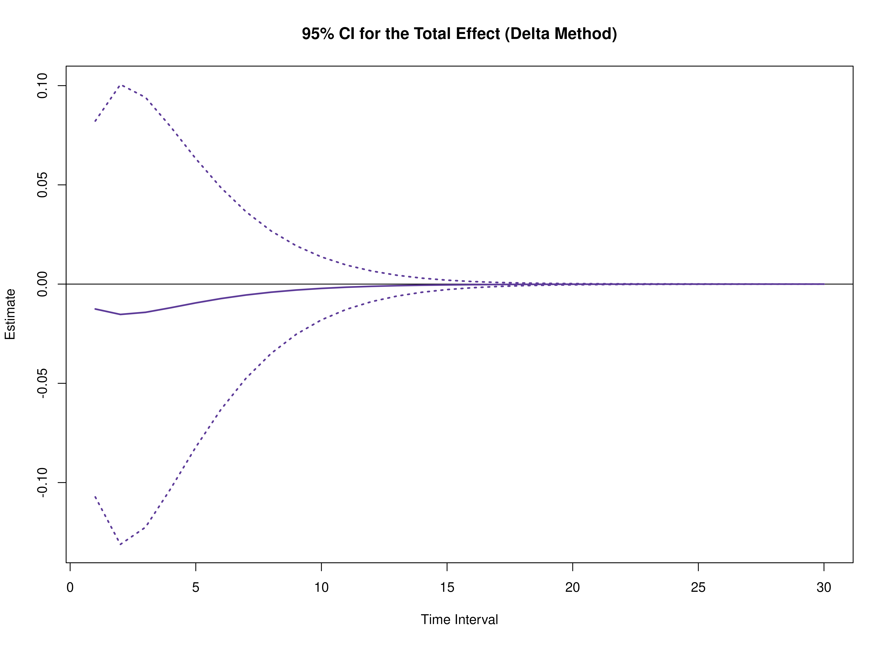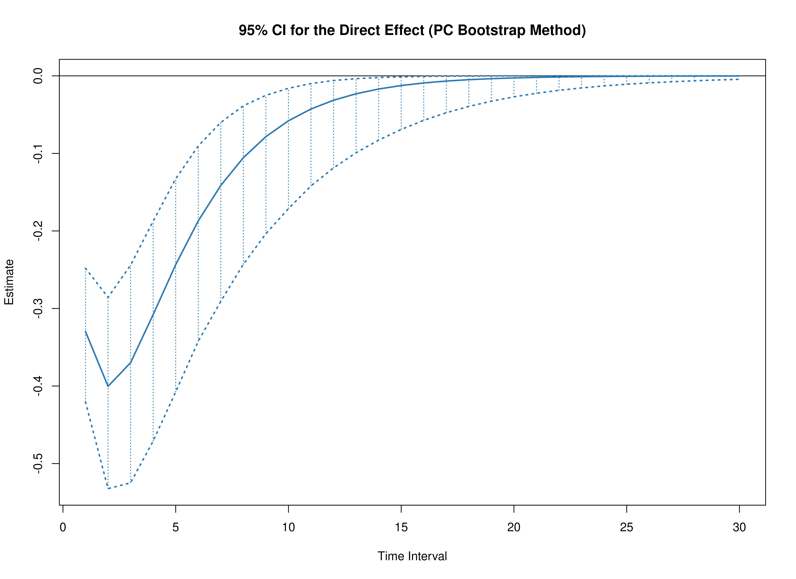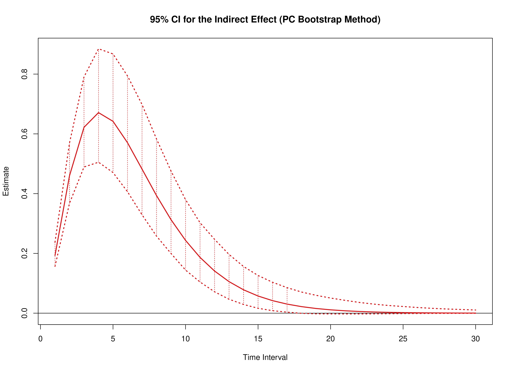

``` r
plot(pb, type = "bc")
```

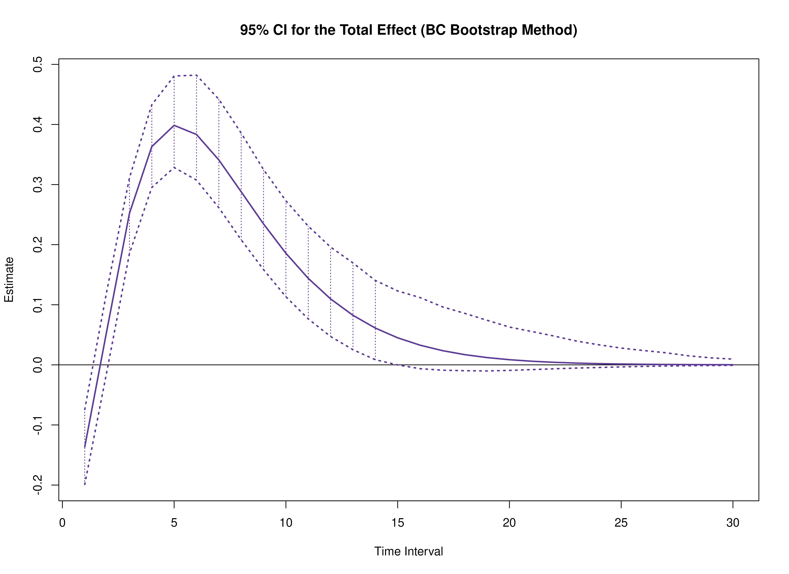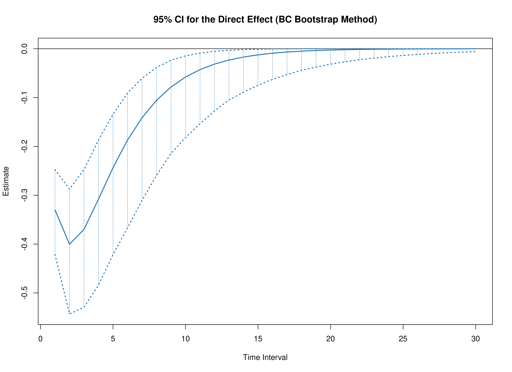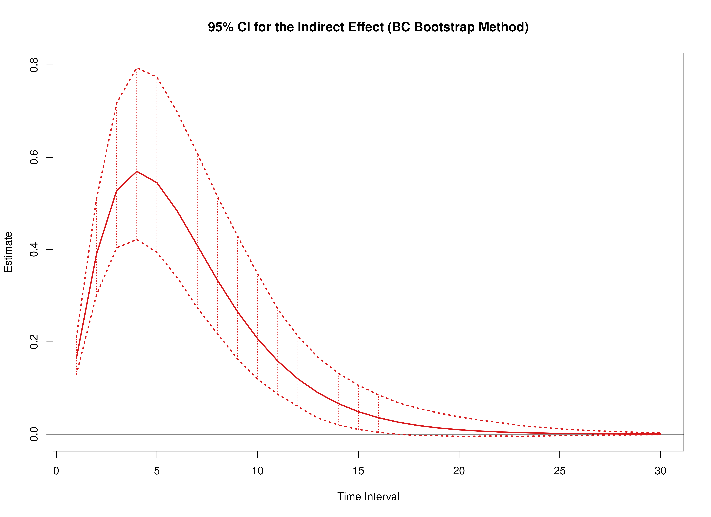

``` r
summary(pb)
#>      effect interval           est          se    R          2.5%         97.5%
#> 1     total        1 -0.1157835296 0.026672149 1000 -0.1643572687 -6.489160e-02
#> 2    direct        1 -0.2798085537 0.038254184 1000 -0.3546267625 -2.049743e-01
#> 3  indirect        1  0.1640250241 0.019912513 1000  0.1262248602  2.066389e-01
#> 4     total        2  0.0504688901 0.029946494 1000 -0.0043632193  1.097176e-01
#> 5    direct        2 -0.3397327610 0.053768358 1000 -0.4427014935 -2.401313e-01
#> 6  indirect        2  0.3902016511 0.050452697 1000  0.2943167653  5.026733e-01
#> 7     total        3  0.2139191622 0.034766157 1000  0.1495066635  2.853954e-01
#> 8    direct        3 -0.3138392892 0.060285506 1000 -0.4378488897 -2.046144e-01
#> 9  indirect        3  0.5277584514 0.074617384 1000  0.3904265748  6.826542e-01
#> 10    total        4  0.3081999837 0.040540595 1000  0.2344539683  3.938482e-01
#> 11   direct        4 -0.2612731631 0.061519523 1000 -0.3925479164 -1.575469e-01
#> 12 indirect        4  0.5694731468 0.088347118 1000  0.4087606743  7.482738e-01
#> 13    total        5  0.3381853808 0.044287460 1000  0.2567855538  4.296782e-01
#> 14   direct        5 -0.2065785708 0.059372909 1000 -0.3386845877 -1.115001e-01
#> 15 indirect        5  0.5447639516 0.092641268 1000  0.3802284994  7.421764e-01
#> 16    total        6  0.3252637053 0.045533435 1000  0.2410832795  4.168691e-01
#> 17   direct        6 -0.1587035623 0.055215710 1000 -0.2921304346 -7.645421e-02
#> 18 indirect        6  0.4839672676 0.090028067 1000  0.3301767182  6.868757e-01
#> 19    total        7  0.2892953613 0.044788876 1000  0.2071904286  3.802898e-01
#> 20   direct        7 -0.1198590556 0.050036209 1000 -0.2463969955 -4.964680e-02
#> 21 indirect        7  0.4091544169 0.083030895 1000  0.2706328301  5.949645e-01
#> 22    total        8  0.2443250400 0.042790955 1000  0.1687156176  3.341598e-01
#> 23   direct        8 -0.0895746791 0.044508125 1000 -0.2086130003 -3.146281e-02
#> 24 indirect        8  0.3338997191 0.073761433 1000  0.2145279518  5.018292e-01
#> 25    total        9  0.1989011436 0.040228010 1000  0.1281288045  2.828230e-01
#> 26   direct        9 -0.0664998299 0.039062650 1000 -0.1741561562 -1.993663e-02
#> 27 indirect        9  0.2654009735 0.063846488 1000  0.1635068753  4.166467e-01
#> 28    total       10  0.1575389791 0.037569607 1000  0.0933021861  2.373091e-01
#> 29   direct       10 -0.0491604953 0.033954296 1000 -0.1425577831 -1.262121e-02
#> 30 indirect       10  0.2066994743 0.054410407 1000  0.1197368152  3.310089e-01
#> 31    total       11  0.1221456297 0.035011125 1000  0.0627293502  1.970687e-01
#> 32   direct       11 -0.0362431634 0.029314644 1000 -0.1184653602 -7.811023e-03
#> 33 indirect       11  0.1583887931 0.046093060 1000  0.0881892906  2.657825e-01
#> 34    total       12  0.0930971779 0.032544474 1000  0.0382896357  1.638233e-01
#> 35   direct       12 -0.0266727061 0.025193741 1000 -0.0980873195 -4.752949e-03
#> 36 indirect       12  0.1197698840 0.039120937 1000  0.0625045505  2.115039e-01
#> 37    total       13  0.0699628804 0.030083320 1000  0.0213085251  1.356599e-01
#> 38   direct       13 -0.0196068449 0.021590600 1000 -0.0808308508 -2.760353e-03
#> 39 indirect       13  0.0895697252 0.033426095 1000  0.0414962882  1.710873e-01
#> 40    total       14  0.0519549100 0.027559756 1000  0.0083723903  1.134060e-01
#> 41   direct       14 -0.0144019715 0.018474741 1000 -0.0667035731 -1.653991e-03
#> 42 indirect       14  0.0663568815 0.028785388 1000  0.0250334250  1.362614e-01
#> 43    total       15  0.0381881378 0.024961981 1000  0.0000879509  9.383919e-02
#> 44   direct       15 -0.0105736012 0.015800745 1000 -0.0554269507 -9.579937e-04
#> 45 indirect       15  0.0487617390 0.024941910 1000  0.0145033243  1.111661e-01
#> 46    total       16  0.0278175104 0.022328572 1000 -0.0059885631  7.928620e-02
#> 47   direct       16 -0.0077604057 0.013517591 1000 -0.0460429829 -5.700881e-04
#> 48 indirect       16  0.0355779160 0.021680127 1000  0.0074489557  9.303132e-02
#> 49    total       17  0.0201009529 0.019725716 1000 -0.0091278337  6.704549e-02
#> 50   direct       17 -0.0056944874 0.011574305 1000 -0.0382438663 -2.985995e-04
#> 51 indirect       17  0.0257954404 0.018851299 1000  0.0028993833  7.805481e-02
#> 52    total       18  0.0144195419 0.017224794 1000 -0.0102520117  5.682896e-02
#> 53   direct       18 -0.0041779678 0.009923103 1000 -0.0317654592 -1.722500e-04
#> 54 indirect       18  0.0185975097 0.016366094 1000 -0.0000371418  6.440451e-02
#> 55    total       19  0.0102749417 0.014887076 1000 -0.0100346940  4.834264e-02
#> 56   direct       19 -0.0030650417 0.008520909 1000 -0.0263001056 -9.806262e-05
#> 57 indirect       19  0.0133399833 0.014174855 1000 -0.0018396955  5.432762e-02
#> 58    total       20  0.0072761421 0.012756117 1000 -0.0093422303  4.102620e-02
#> 59   direct       20 -0.0022484438 0.007329875 1000 -0.0218810493 -5.303745e-05
#> 60 indirect       20  0.0095245859 0.012248707 1000 -0.0027718460  4.586181e-02
#> 61    total       21  0.0051223923 0.010856027 1000 -0.0079417319  3.481553e-02
#> 62   direct       21 -0.0016493427 0.006317315 1000 -0.0182044508 -2.675300e-05
#> 63 indirect       21  0.0067717349 0.010566564 1000 -0.0031003569  3.874912e-02
#> 64    total       22  0.0035860244 0.009193399 1000 -0.0070595519  2.954498e-02
#> 65   direct       22 -0.0012098422 0.005455334 1000 -0.0151376762 -1.171984e-05
#> 66 indirect       22  0.0047958666 0.009108227 1000 -0.0029056453  3.292943e-02
#> 67    total       23  0.0024969500 0.007761041 1000 -0.0056399724  2.505594e-02
#> 68   direct       23 -0.0008874408 0.004720314 1000 -0.0125826968 -6.061010e-06
#> 69 indirect       23  0.0033843907 0.007851923 1000 -0.0023340168  2.790247e-02
#> 70    total       24  0.0017295077 0.006542234 1000 -0.0042406033  2.124837e-02
#> 71   direct       24 -0.0006509465 0.004092369 1000 -0.0104844306 -2.595603e-06
#> 72 indirect       24  0.0023804542 0.006774423 1000 -0.0018341232  2.354927e-02
#> 73    total       25  0.0011917525 0.005514695 1000 -0.0034392275  1.774966e-02
#> 74   direct       25 -0.0004774722 0.003554802 1000 -0.0087150094 -1.123673e-06
#> 75 indirect       25  0.0016692247 0.005852264 1000 -0.0016418449  1.985824e-02
#> 76    total       26  0.0008169808 0.004653844 1000 -0.0027006245  1.503566e-02
#> 77   direct       26 -0.0003502264 0.003093629 1000 -0.0072589239 -5.870827e-07
#> 78 indirect       26  0.0011672072 0.005063116 1000 -0.0012590370  1.693465e-02
#> 79    total       27  0.0005571702 0.003935225 1000 -0.0021299841  1.279372e-02
#> 80   direct       27 -0.0002568907 0.002697136 1000 -0.0060408061 -1.043503e-07
#> 81 indirect       27  0.0008140609 0.004386808 1000 -0.0009808016  1.456853e-02
#> 82    total       28  0.0003779887 0.003336074 1000 -0.0015206664  1.097414e-02
#> 83   direct       28 -0.0001884286 0.002355517 1000 -0.0050372461 -1.032366e-08
#> 84 indirect       28  0.0005664173 0.003805845 1000 -0.0007742606  1.243277e-02
#> 85    total       29  0.0002550490 0.002836193 1000 -0.0011554519  9.342055e-03
#> 86   direct       29 -0.0001382117 0.002060550 1000 -0.0042059610 -4.176982e-09
#> 87 indirect       29  0.0003932608 0.003305490 1000 -0.0005574214  1.119367e-02
#> 88    total       30  0.0001711332 0.002418261 1000 -0.0007795397  7.925182e-03
#> 89   direct       30 -0.0001013777 0.001805335 1000 -0.0035118649  2.139538e-08
#> 90 indirect       30  0.0002725109 0.002873538 1000 -0.0004238150  9.456858e-03
summary(pb, type = "bc")
#>      effect interval           est          se    R          2.5%         97.5%
#> 1     total        1 -0.1157835296 0.026672149 1000 -0.1701322151 -6.783201e-02
#> 2    direct        1 -0.2798085537 0.038254184 1000 -0.3559586637 -2.069425e-01
#> 3  indirect        1  0.1640250241 0.019912513 1000  0.1225495182  2.052276e-01
#> 4     total        2  0.0504688901 0.029946494 1000 -0.0114893282  1.045339e-01
#> 5    direct        2 -0.3397327610 0.053768358 1000 -0.4458912811 -2.406153e-01
#> 6  indirect        2  0.3902016511 0.050452697 1000  0.2924926536  5.001883e-01
#> 7     total        3  0.2139191622 0.034766157 1000  0.1459834677  2.784318e-01
#> 8    direct        3 -0.3138392892 0.060285506 1000 -0.4471990909 -2.095996e-01
#> 9  indirect        3  0.5277584514 0.074617384 1000  0.3832993828  6.778224e-01
#> 10    total        4  0.3081999837 0.040540595 1000  0.2305951211  3.926271e-01
#> 11   direct        4 -0.2612731631 0.061519523 1000 -0.4017470478 -1.606061e-01
#> 12 indirect        4  0.5694731468 0.088347118 1000  0.4022015365  7.402059e-01
#> 13    total        5  0.3381853808 0.044287460 1000  0.2559443613  4.291874e-01
#> 14   direct        5 -0.2065785708 0.059372909 1000 -0.3507827782 -1.150394e-01
#> 15 indirect        5  0.5447639516 0.092641268 1000  0.3780308086  7.390738e-01
#> 16    total        6  0.3252637053 0.045533435 1000  0.2434471044  4.203829e-01
#> 17   direct        6 -0.1587035623 0.055215710 1000 -0.2989516937 -7.931525e-02
#> 18 indirect        6  0.4839672676 0.090028067 1000  0.3305810054  6.886188e-01
#> 19    total        7  0.2892953613 0.044788876 1000  0.2100282616  3.844336e-01
#> 20   direct        7 -0.1198590556 0.050036209 1000 -0.2522678179 -5.119143e-02
#> 21 indirect        7  0.4091544169 0.083030895 1000  0.2731425920  6.069426e-01
#> 22    total        8  0.2443250400 0.042790955 1000  0.1695876315  3.409437e-01
#> 23   direct        8 -0.0895746791 0.044508125 1000 -0.2122219994 -3.426156e-02
#> 24 indirect        8  0.3338997191 0.073761433 1000  0.2167703036  5.091603e-01
#> 25    total        9  0.1989011436 0.040228010 1000  0.1305701003  2.897773e-01
#> 26   direct        9 -0.0664998299 0.039062650 1000 -0.1788632356 -2.174311e-02
#> 27 indirect        9  0.2654009735 0.063846488 1000  0.1654903384  4.181319e-01
#> 28    total       10  0.1575389791 0.037569607 1000  0.0963102735  2.435296e-01
#> 29   direct       10 -0.0491604953 0.033954296 1000 -0.1501845370 -1.332858e-02
#> 30 indirect       10  0.2066994743 0.054410407 1000  0.1207112908  3.313911e-01
#> 31    total       11  0.1221456297 0.035011125 1000  0.0660648562  2.073327e-01
#> 32   direct       11 -0.0362431634 0.029314644 1000 -0.1271409221 -8.395846e-03
#> 33 indirect       11  0.1583887931 0.046093060 1000  0.0873981605  2.621481e-01
#> 34    total       12  0.0930971779 0.032544474 1000  0.0411439756  1.698595e-01
#> 35   direct       12 -0.0266727061 0.025193741 1000 -0.1059782183 -5.195228e-03
#> 36 indirect       12  0.1197698840 0.039120937 1000  0.0611966902  2.087274e-01
#> 37    total       13  0.0699628804 0.030083320 1000  0.0234141093  1.421793e-01
#> 38   direct       13 -0.0196068449 0.021590600 1000 -0.0885973241 -3.243238e-03
#> 39 indirect       13  0.0895697252 0.033426095 1000  0.0396686243  1.645522e-01
#> 40    total       14  0.0519549100 0.027559756 1000  0.0100167058  1.178568e-01
#> 41   direct       14 -0.0144019715 0.018474741 1000 -0.0712460367 -1.934986e-03
#> 42 indirect       14  0.0663568815 0.028785388 1000  0.0234982368  1.299673e-01
#> 43    total       15  0.0381881378 0.024961981 1000  0.0018086147  9.843611e-02
#> 44   direct       15 -0.0105736012 0.015800745 1000 -0.0595042832 -1.138373e-03
#> 45 indirect       15  0.0487617390 0.024941910 1000  0.0127871275  1.034506e-01
#> 46    total       16  0.0278175104 0.022328572 1000 -0.0043183903  8.397894e-02
#> 47   direct       16 -0.0077604057 0.013517591 1000 -0.0498099590 -6.161374e-04
#> 48 indirect       16  0.0355779160 0.021680127 1000  0.0047094095  8.189950e-02
#> 49    total       17  0.0201009529 0.019725716 1000 -0.0084784198  7.092051e-02
#> 50   direct       17 -0.0056944874 0.011574305 1000 -0.0413082496 -3.556198e-04
#> 51 indirect       17  0.0257954404 0.018851299 1000 -0.0003651841  6.678942e-02
#> 52    total       18  0.0144195419 0.017224794 1000 -0.0095762467  6.044856e-02
#> 53   direct       18 -0.0041779678 0.009923103 1000 -0.0351266316 -2.055967e-04
#> 54 indirect       18  0.0185975097 0.016366094 1000 -0.0029047728  5.501698e-02
#> 55    total       19  0.0102749417 0.014887076 1000 -0.0091595352  5.203115e-02
#> 56   direct       19 -0.0030650417 0.008520909 1000 -0.0293306403 -1.173439e-04
#> 57 indirect       19  0.0133399833 0.014174855 1000 -0.0040470397  4.358403e-02
#> 58    total       20  0.0072761421 0.012756117 1000 -0.0086950707  4.355952e-02
#> 59   direct       20 -0.0022484438 0.007329875 1000 -0.0245812773 -6.503352e-05
#> 60 indirect       20  0.0095245859 0.012248707 1000 -0.0044485196  3.523951e-02
#> 61    total       21  0.0051223923 0.010856027 1000 -0.0076894695  3.622966e-02
#> 62   direct       21 -0.0016493427 0.006317315 1000 -0.0203391372 -3.450991e-05
#> 63 indirect       21  0.0067717349 0.010566564 1000 -0.0048809791  2.777647e-02
#> 64    total       22  0.0035860244 0.009193399 1000 -0.0064764646  3.087672e-02
#> 65   direct       22 -0.0012098422 0.005455334 1000 -0.0158967758 -1.866331e-05
#> 66 indirect       22  0.0047958666 0.009108227 1000 -0.0051172496  2.276624e-02
#> 67    total       23  0.0024969500 0.007761041 1000 -0.0051046224  2.732949e-02
#> 68   direct       23 -0.0008874408 0.004720314 1000 -0.0133622128 -1.035647e-05
#> 69 indirect       23  0.0033843907 0.007851923 1000 -0.0043888549  1.852883e-02
#> 70    total       24  0.0017295077 0.006542234 1000 -0.0038442969  2.307194e-02
#> 71   direct       24 -0.0006509465 0.004092369 1000 -0.0111092772 -4.040104e-06
#> 72 indirect       24  0.0023804542 0.006774423 1000 -0.0037131514  1.503625e-02
#> 73    total       25  0.0011917525 0.005514695 1000 -0.0029978280  1.941513e-02
#> 74   direct       25 -0.0004774722 0.003554802 1000 -0.0094157301 -1.932076e-06
#> 75 indirect       25  0.0016692247 0.005852264 1000 -0.0034330574  1.185439e-02
#> 76    total       26  0.0008169808 0.004653844 1000 -0.0024057882  1.637303e-02
#> 77   direct       26 -0.0003502264 0.003093629 1000 -0.0077944506 -1.143577e-06
#> 78 indirect       26  0.0011672072 0.005063116 1000 -0.0028804017  9.304497e-03
#> 79    total       27  0.0005571702 0.003935225 1000 -0.0019672309  1.342006e-02
#> 80   direct       27 -0.0002568907 0.002697136 1000 -0.0065543968 -4.534573e-07
#> 81 indirect       27  0.0008140609 0.004386808 1000 -0.0023951761  7.314841e-03
#> 82    total       28  0.0003779887 0.003336074 1000 -0.0014110628  1.114536e-02
#> 83   direct       28 -0.0001884286 0.002355517 1000 -0.0052694571 -1.917845e-07
#> 84 indirect       28  0.0005664173 0.003805845 1000 -0.0021349717  5.860845e-03
#> 85    total       29  0.0002550490 0.002836193 1000 -0.0011704984  9.255991e-03
#> 86   direct       29 -0.0001382117 0.002060550 1000 -0.0044706715 -9.468863e-08
#> 87 indirect       29  0.0003932608 0.003305490 1000 -0.0017419537  4.474724e-03
#> 88    total       30  0.0001711332 0.002418261 1000 -0.0008721778  6.998580e-03
#> 89   direct       30 -0.0001013777 0.001805335 1000 -0.0036740161 -1.426103e-08
#> 90 indirect       30  0.0002725109 0.002873538 1000 -0.0015501810  3.291571e-03
```

### Model $\eta_Y \to \eta_M \to \eta_M$

#### Delta Method


``` r
delta <- DeltaStdYMX(theta_hat = theta_hat)
plot(delta)
```

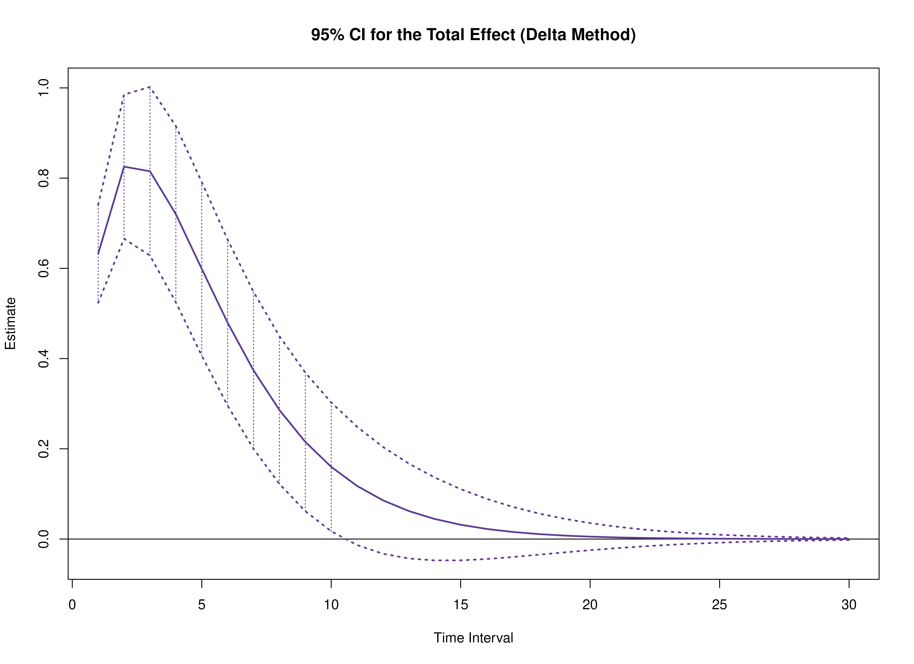

``` r
summary(delta)
#>      effect interval           est           se            z         p
#> 1     total        1 -1.254103e-02 4.832427e-02 -0.259518169 0.7952355
#> 2    direct        1 -1.255449e-02 4.821017e-02 -0.260411612 0.7945463
#> 3  indirect        1  1.346192e-05 3.116347e-04  0.043197753 0.9655439
#> 4     total        2 -1.528921e-02 5.910986e-02 -0.258657459 0.7958995
#> 5    direct        2 -1.524318e-02 5.842683e-02 -0.260893451 0.7941747
#> 6  indirect        2 -4.603022e-05 8.566661e-04 -0.053731816 0.9571488
#> 7     total        3 -1.421859e-02 5.524629e-02 -0.257367383 0.7968952
#> 8    direct        3 -1.408138e-02 5.399945e-02 -0.260769063 0.7942706
#> 9  indirect        3 -1.372084e-04 1.441861e-03 -0.095160635 0.9241872
#> 10    total        4 -1.191960e-02 4.652658e-02 -0.256189039 0.7978049
#> 11   direct        4 -1.172284e-02 4.507428e-02 -0.260078259 0.7948034
#> 12 indirect        4 -1.967589e-04 1.810541e-03 -0.108674074 0.9134610
#> 13    total        5 -9.474221e-03 3.707623e-02 -0.255533596 0.7983110
#> 14   direct        5 -9.268796e-03 3.580355e-02 -0.258879242 0.7957284
#> 15 indirect        5 -2.054251e-04 1.925042e-03 -0.106712057 0.9150174
#> 16    total        6 -7.293906e-03 2.852548e-02 -0.255697875 0.7981841
#> 17   direct        6 -7.120734e-03 2.768114e-02 -0.257241327 0.7969925
#> 18 indirect        6 -1.731721e-04 1.896262e-03 -0.091322904 0.9272360
#> 19    total        7 -5.496896e-03 2.139717e-02 -0.256898308 0.7972573
#> 20   direct        7 -5.377853e-03 2.106997e-02 -0.255237805 0.7985394
#> 21 indirect        7 -1.190433e-04 1.843620e-03 -0.064570381 0.9485161
#> 22    total        8 -4.079020e-03 1.573050e-02 -0.259306438 0.7953988
#> 23   direct        8 -4.019049e-03 1.588934e-02 -0.252940044 0.8003145
#> 24 indirect        8 -5.997041e-05 1.818060e-03 -0.032985929 0.9736858
#> 25    total        9 -2.990775e-03 1.136836e-02 -0.263078821 0.7924898
#> 26   direct        9 -2.983724e-03 1.191519e-02 -0.250413377 0.8022677
#> 27 indirect        9 -7.051455e-06 1.805661e-03 -0.003905193 0.9968841
#> 28    total       10 -2.171460e-03 8.090997e-03 -0.268379747 0.7884070
#> 29   direct       10 -2.205740e-03 8.904353e-03 -0.247714796 0.8043551
#> 30 indirect       10  3.428014e-05 1.774062e-03  0.019322972 0.9845835
#> 31    total       11 -1.563465e-03 5.677133e-03 -0.275396919 0.7830113
#> 32   direct       11 -1.626163e-03 6.640324e-03 -0.244892148 0.8065399
#> 33 indirect       11  6.269844e-05 1.703908e-03  0.036796853 0.9706470
#> 34    total       12 -1.117441e-03 3.929820e-03 -0.284349184 0.7761428
#> 35   direct       12 -1.196755e-03 4.945586e-03 -0.241984404 0.8087922
#> 36 indirect       12  7.931363e-05 1.593257e-03  0.049780824 0.9602970
#> 37    total       13 -7.933544e-04 2.684954e-03 -0.295481533 0.7676261
#> 38   direct       13 -8.797226e-04 3.680501e-03 -0.239022552 0.8110881
#> 39 indirect       13  8.636827e-05 1.450939e-03  0.059525790 0.9525333
#> 40    total       14 -5.598051e-04 1.811466e-03 -0.309034281 0.7572955
#> 41   direct       14 -6.461897e-04 2.737735e-03 -0.236030786 0.8134088
#> 42 indirect       14  8.638458e-05 1.289712e-03  0.066979744 0.9465978
#> 43    total       15 -3.927299e-04 1.207818e-03 -0.325156489 0.7450626
#> 44   direct       15 -4.744178e-04 2.035886e-03 -0.233027728 0.8157399
#> 45 indirect       15  8.168789e-05 1.121978e-03  0.072807024 0.9419597
#> 46    total       16 -2.740021e-04 7.972064e-04 -0.343702877 0.7310697
#> 47   direct       16 -3.481950e-04 1.513710e-03 -0.230027577 0.8180703
#> 48 indirect       16  7.419282e-05 9.577605e-04  0.077464892 0.9382537
#> 49    total       17 -1.901500e-04 5.226606e-04 -0.363811541 0.7159987
#> 50   direct       17 -2.555011e-04 1.125352e-03 -0.227041083 0.8203918
#> 51 indirect       17  6.535109e-05 8.041254e-04  0.081269774 0.9352274
#> 52    total       18 -1.312715e-04 3.425969e-04 -0.383166048 0.7015967
#> 53   direct       18 -1.874576e-04 8.365793e-04 -0.224076356 0.8226979
#> 54 indirect       18  5.618613e-05 6.653667e-04  0.084443854 0.9327035
#> 55    total       19 -9.015707e-05 2.270177e-04 -0.397136780 0.6912666
#> 56   direct       19 -1.375227e-04 6.218822e-04 -0.221139497 0.8249838
#> 57 indirect       19  4.736564e-05 5.435211e-04  0.087145922 0.9305555
#> 58    total       20 -6.160030e-05 1.544059e-04 -0.398950525 0.6899297
#> 59   direct       20 -1.008835e-04 4.622698e-04 -0.218235099 0.8272459
#> 60 indirect       20  3.928319e-05 4.389599e-04  0.089491520 0.9286913
#> 61    total       21 -4.186912e-05 1.093660e-04 -0.382834851 0.7018422
#> 62   direct       21 -7.400294e-05 3.436138e-04 -0.215366609 0.8294815
#> 63 indirect       21  3.213382e-05 3.509355e-04  0.091566171 0.9270427
#> 64    total       22 -2.830624e-05 8.108454e-05 -0.349095404 0.7270177
#> 65   direct       22 -5.428337e-05 2.554071e-04 -0.212536610 0.8316884
#> 66 indirect       22  2.597713e-05 2.780260e-04  0.093434173 0.9255586
#> 67    total       23 -1.903137e-05 6.242630e-05 -0.304861406 0.7604717
#> 68   direct       23 -3.981782e-05 1.898373e-04 -0.209747030 0.8338651
#> 69 indirect       23  2.078645e-05 2.184723e-04  0.095144543 0.9242000
#> 70    total       24 -1.272182e-05 4.915978e-05 -0.258785103 0.7958011
#> 71   direct       24 -2.920676e-05 1.410959e-04 -0.206999289 0.8360104
#> 72 indirect       24  1.648494e-05 1.704132e-04  0.096735096 0.9229368
#> 73    total       25 -8.452319e-06 3.904614e-05 -0.216470046 0.8286214
#> 74   direct       25 -2.142329e-05 1.048648e-04 -0.204294413 0.8381234
#> 75 indirect       25  1.297097e-05 1.320398e-04  0.098235298 0.9217455
#> 76    total       26 -5.579089e-06 3.098829e-05 -0.180038590 0.8571223
#> 77   direct       26 -1.571401e-05 7.793366e-05 -0.201633118 0.8402036
#> 78 indirect       26  1.013492e-05 1.016865e-04  0.099668280 0.9206077
#> 79    total       27 -3.656547e-06 2.444786e-05 -0.149565147 0.8811077
#> 80   direct       27 -1.152621e-05 5.791601e-05 -0.199015872 0.8422503
#> 81 indirect       27  7.869659e-06 7.787709e-05  0.101052296 0.9195089
#> 82    total       28 -2.377887e-06 1.912861e-05 -0.124310503 0.9010694
#> 83   direct       28 -8.454442e-06 4.303765e-05 -0.196442938 0.8442635
#> 84 indirect       28  6.076555e-06 5.934033e-05  0.102401774 0.9184378
#> 85    total       29 -1.532939e-06 1.483104e-05 -0.103360173 0.9176771
#> 86   direct       29 -6.201303e-06 3.197959e-05 -0.193914418 0.8462429
#> 87 indirect       29  4.668364e-06 4.500579e-05  0.103728092 0.9173851
#> 88    total       30 -9.784795e-07 1.139438e-05 -0.085873849 0.9315667
#> 89   direct       30 -4.548630e-06 2.376129e-05 -0.191430271 0.8481885
#> 90 indirect       30  3.570150e-06 3.398843e-05  0.105040150 0.9163439
#>             2.5%        97.5%
#> 1  -1.072549e-01 8.217281e-02
#> 2  -1.070447e-01 8.193572e-02
#> 3  -5.973308e-04 6.242547e-04
#> 4  -1.311424e-01 1.005640e-01
#> 5  -1.297577e-01 9.927130e-02
#> 6  -1.725065e-03 1.633004e-03
#> 7  -1.224993e-01 9.406215e-02
#> 8  -1.199184e-01 9.175558e-02
#> 9  -2.963204e-03 2.688787e-03
#> 10 -1.031100e-01 7.927082e-02
#> 11 -1.000668e-01 7.662113e-02
#> 12 -3.745354e-03 3.351836e-03
#> 13 -8.214229e-02 6.319385e-02
#> 14 -7.944247e-02 6.090487e-02
#> 15 -3.978437e-03 3.567587e-03
#> 16 -6.320283e-02 4.861502e-02
#> 17 -6.137477e-02 4.713331e-02
#> 18 -3.889777e-03 3.543433e-03
#> 19 -4.743457e-02 3.644078e-02
#> 20 -4.667423e-02 3.591853e-02
#> 21 -3.732473e-03 3.494386e-03
#> 22 -3.491023e-02 2.675219e-02
#> 23 -3.516157e-02 2.712348e-02
#> 24 -3.623303e-03 3.503363e-03
#> 25 -2.527235e-02 1.929080e-02
#> 26 -2.633707e-02 2.036962e-02
#> 27 -3.546082e-03 3.531979e-03
#> 28 -1.802952e-02 1.368660e-02
#> 29 -1.965795e-02 1.524647e-02
#> 30 -3.442817e-03 3.511377e-03
#> 31 -1.269044e-02 9.563511e-03
#> 32 -1.464096e-02 1.138863e-02
#> 33 -3.276899e-03 3.402296e-03
#> 34 -8.819746e-03 6.584864e-03
#> 35 -1.088993e-02 8.496416e-03
#> 36 -3.043412e-03 3.202039e-03
#> 37 -6.055768e-03 4.469059e-03
#> 38 -8.093371e-03 6.333926e-03
#> 39 -2.757419e-03 2.930156e-03
#> 40 -4.110213e-03 2.990603e-03
#> 41 -6.012051e-03 4.719672e-03
#> 42 -2.441405e-03 2.614174e-03
#> 43 -2.760010e-03 1.974550e-03
#> 44 -4.464680e-03 3.515845e-03
#> 45 -2.117349e-03 2.280725e-03
#> 46 -1.836498e-03 1.288494e-03
#> 47 -3.315011e-03 2.618621e-03
#> 48 -1.802983e-03 1.951369e-03
#> 49 -1.214546e-03 8.342460e-04
#> 50 -2.461150e-03 1.950148e-03
#> 51 -1.510706e-03 1.641408e-03
#> 52 -8.027491e-04 5.402061e-04
#> 53 -1.827123e-03 1.452208e-03
#> 54 -1.247909e-03 1.360281e-03
#> 55 -5.351036e-04 3.547894e-04
#> 56 -1.356389e-03 1.081344e-03
#> 57 -1.017916e-03 1.112647e-03
#> 58 -3.642302e-04 2.410296e-04
#> 59 -1.006916e-03 8.051486e-04
#> 60 -8.210625e-04 8.996288e-04
#> 61 -2.562226e-04 1.724843e-04
#> 62 -7.474736e-04 5.994677e-04
#> 63 -6.556870e-04 7.199547e-04
#> 64 -1.872290e-04 1.306165e-04
#> 65 -5.548722e-04 4.463054e-04
#> 66 -5.189438e-04 5.708981e-04
#> 67 -1.413847e-04 1.033219e-04
#> 68 -4.118921e-04 3.322565e-04
#> 69 -4.074114e-04 4.489843e-04
#> 70 -1.090732e-04 8.362958e-05
#> 71 -3.057497e-04 2.473362e-04
#> 72 -3.175188e-04 3.504887e-04
#> 73 -8.498134e-05 6.807670e-05
#> 74 -2.269545e-04 1.841079e-04
#> 75 -2.458223e-04 2.717642e-04
#> 76 -6.631503e-05 5.515685e-05
#> 77 -1.684612e-04 1.370332e-04
#> 78 -1.891669e-04 2.094368e-04
#> 79 -5.157347e-05 4.426037e-05
#> 80 -1.250395e-04 1.019871e-04
#> 81 -1.447666e-04 1.605059e-04
#> 82 -3.986927e-05 3.511349e-05
#> 83 -9.280668e-05 7.589780e-05
#> 84 -1.102284e-04 1.223815e-04
#> 85 -3.060124e-05 2.753536e-05
#> 86 -6.888014e-05 5.647754e-05
#> 87 -8.354135e-05 9.287808e-05
#> 88 -2.331106e-05 2.135410e-05
#> 89 -5.111990e-05 4.202264e-05
#> 90 -6.304596e-05 7.018626e-05
```

#### Monte Carlo Method


``` r
mc <- MCStdYMX(theta_hat = theta_hat, seed = seed)
plot(mc)
```

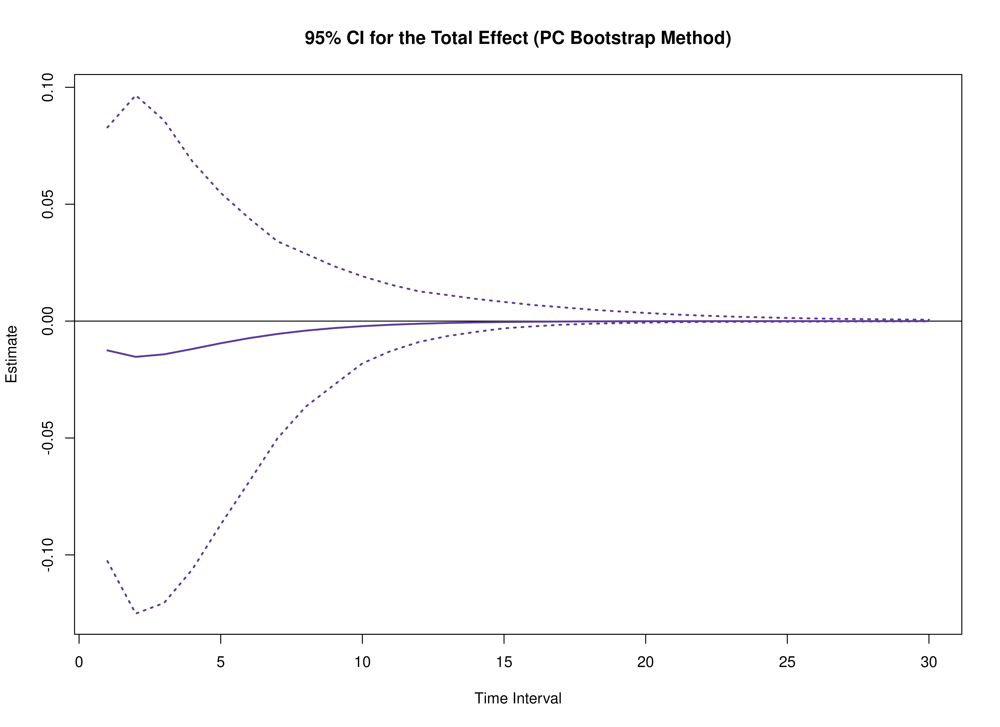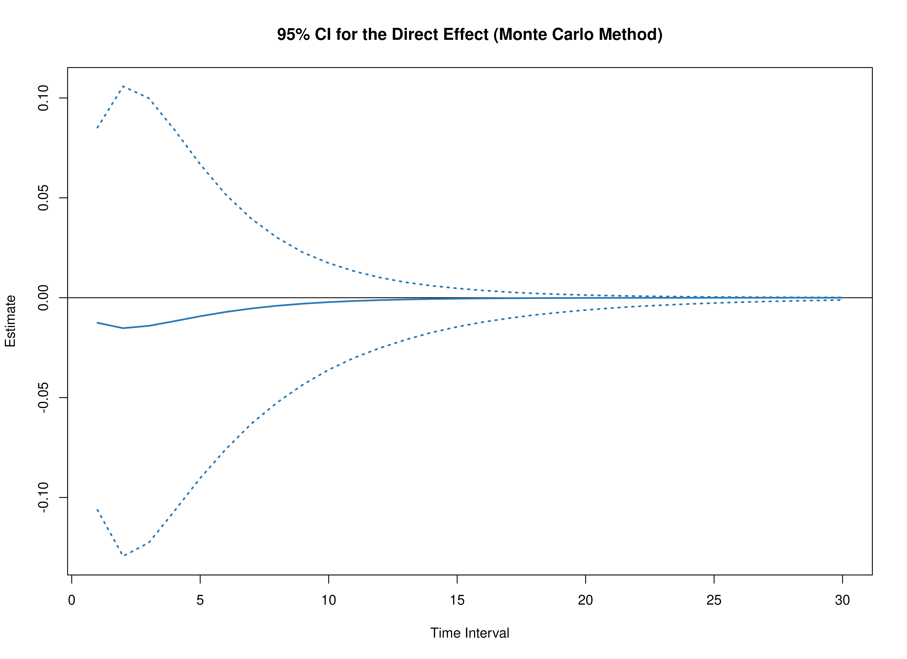

``` r
summary(mc)
#>      effect interval           est           se     R          2.5%
#> 1     total        1 -1.254103e-02 0.0486938443 20000 -0.1080794892
#> 2    direct        1 -1.255449e-02 0.0486179175 20000 -0.1061760935
#> 3  indirect        1  1.346192e-05 0.0015953465 20000 -0.0045800475
#> 4     total        2 -1.528921e-02 0.0599631241 20000 -0.1356552903
#> 5    direct        2 -1.524318e-02 0.0595569253 20000 -0.1293865168
#> 6  indirect        2 -4.603022e-05 0.0042470938 20000 -0.0126103286
#> 7     total        3 -1.421859e-02 0.0565317779 20000 -0.1313612673
#> 8    direct        3 -1.408138e-02 0.0559853318 20000 -0.1226427859
#> 9  indirect        3 -1.372084e-04 0.0066330932 20000 -0.0196780744
#> 10    total        4 -1.191960e-02 0.0481256292 20000 -0.1144577100
#> 11   direct        4 -1.172284e-02 0.0478501891 20000 -0.1067357931
#> 12 indirect        4 -1.967589e-04 0.0083331990 20000 -0.0232298832
#> 13    total        5 -9.474221e-03 0.0388550541 20000 -0.0939643899
#> 14   direct        5 -9.268796e-03 0.0392263458 20000 -0.0903275386
#> 15 indirect        5 -2.054251e-04 0.0094333098 20000 -0.0233562982
#> 16    total        6 -7.293906e-03 0.0303628910 20000 -0.0732791074
#> 17   direct        6 -7.120734e-03 0.0315976855 20000 -0.0757832195
#> 18 indirect        6 -1.731721e-04 0.0101655125 20000 -0.0213244653
#> 19    total        7 -5.496896e-03 0.0232183510 20000 -0.0549350405
#> 20   direct        7 -5.377853e-03 0.0253395593 20000 -0.0629770437
#> 21 indirect        7 -1.190433e-04 0.0106728797 20000 -0.0186515683
#> 22    total        8 -4.079020e-03 0.0175265828 20000 -0.0400933317
#> 23   direct        8 -4.019049e-03 0.0203880221 20000 -0.0523991468
#> 24 indirect        8 -5.997041e-05 0.0109774611 20000 -0.0158179081
#> 25    total        9 -2.990775e-03 0.0131890789 20000 -0.0286473869
#> 26   direct        9 -2.983724e-03 0.0165359430 20000 -0.0434988502
#> 27 indirect        9 -7.051455e-06 0.0110495189 20000 -0.0133374529
#> 28    total       10 -2.171460e-03 0.0100139352 20000 -0.0203155425
#> 29   direct       10 -2.205740e-03 0.0135572210 20000 -0.0360767586
#> 30 indirect       10  3.428014e-05 0.0108698464 20000 -0.0110596196
#> 31    total       11 -1.563465e-03 0.0077654935 20000 -0.0141686902
#> 32   direct       11 -1.626163e-03 0.0112527655 20000 -0.0300196740
#> 33 indirect       11  6.269844e-05 0.0104521285 20000 -0.0089821994
#> 34    total       12 -1.117441e-03 0.0061965164 20000 -0.0099778922
#> 35   direct       12 -1.196755e-03 0.0094622205 20000 -0.0251617048
#> 36 indirect       12  7.931363e-05 0.0098387293 20000 -0.0072392521
#> 37    total       13 -7.933544e-04 0.0050816633 20000 -0.0070400427
#> 38   direct       13 -8.797226e-04 0.0080619676 20000 -0.0210024370
#> 39 indirect       13  8.636827e-05 0.0090877540 20000 -0.0057667792
#> 40    total       14 -5.598051e-04 0.0042471991 20000 -0.0050631407
#> 41   direct       14 -6.461897e-04 0.0069587273 20000 -0.0174346433
#> 42 indirect       14  8.638458e-05 0.0082607814 20000 -0.0045854581
#> 43    total       15 -3.927299e-04 0.0035814989 20000 -0.0036609145
#> 44   direct       15 -4.744178e-04 0.0060827024 20000 -0.0145747963
#> 45 indirect       15  8.168789e-05 0.0074142285 20000 -0.0036921748
#> 46    total       16 -2.740021e-04 0.0030246704 20000 -0.0026972479
#> 47   direct       16 -3.481950e-04 0.0053816883 20000 -0.0122018187
#> 48 indirect       16  7.419282e-05 0.0065944246 20000 -0.0029904979
#> 49    total       17 -1.901500e-04 0.0025496296 20000 -0.0019983345
#> 50   direct       17 -2.555011e-04 0.0048164684 20000 -0.0102786881
#> 51 indirect       17  6.535109e-05 0.0058355644 20000 -0.0024349831
#> 52    total       18 -1.312715e-04 0.0021454956 20000 -0.0015023446
#> 53   direct       18 -1.874576e-04 0.0043573758 20000 -0.0086463582
#> 54 indirect       18  5.618613e-05 0.0051596096 20000 -0.0019723348
#> 55    total       19 -9.015707e-05 0.0018068690 20000 -0.0011327285
#> 56   direct       19 -1.375227e-04 0.0039817861 20000 -0.0073343470
#> 57 indirect       19  4.736564e-05 0.0045773870 20000 -0.0015813383
#> 58    total       20 -6.160030e-05 0.0015283198 20000 -0.0008686556
#> 59   direct       20 -1.008835e-04 0.0036723035 20000 -0.0061563532
#> 60 indirect       20  3.928319e-05 0.0040903808 20000 -0.0012774286
#> 61    total       21 -4.186912e-05 0.0013024504 20000 -0.0006853022
#> 62   direct       21 -7.400294e-05 0.0034154498 20000 -0.0051662762
#> 63 indirect       21  3.213382e-05 0.0036929253 20000 -0.0010312136
#> 64    total       22 -2.830624e-05 0.0011201380 20000 -0.0005669046
#> 65   direct       22 -5.428337e-05 0.0032007102 20000 -0.0043536459
#> 66 indirect       22  2.597713e-05 0.0033745963 20000 -0.0008292590
#> 67    total       23 -1.903137e-05 0.0009718352 20000 -0.0004719750
#> 68   direct       23 -3.981782e-05 0.0030198329 20000 -0.0037249472
#> 69 indirect       23  2.078645e-05 0.0031225715 20000 -0.0006742833
#> 70    total       24 -1.272182e-05 0.0008489885 20000 -0.0004070723
#> 71   direct       24 -2.920676e-05 0.0028663098 20000 -0.0031476446
#> 72 indirect       24  1.648494e-05 0.0029236685 20000 -0.0005441789
#> 73    total       25 -8.452319e-06 0.0007449298 20000 -0.0003533088
#> 74   direct       25 -2.142329e-05 0.0027349847 20000 -0.0026587310
#> 75 indirect       25  1.297097e-05 0.0027658054 20000 -0.0004440642
#> 76    total       26 -5.579089e-06 0.0006550565 20000 -0.0003095218
#> 77   direct       26 -1.571401e-05 0.0026217576 20000 -0.0022407918
#> 78 indirect       26  1.013492e-05 0.0026387927 20000 -0.0003610356
#> 79    total       27 -3.656547e-06 0.0005764868 20000 -0.0002697531
#> 80   direct       27 -1.152621e-05 0.0025233560 20000 -0.0018989832
#> 81 indirect       27  7.869659e-06 0.0025345549 20000 -0.0002933557
#> 82    total       28 -2.377887e-06 0.0005075030 20000 -0.0002325970
#> 83   direct       28 -8.454442e-06 0.0024371598 20000 -0.0016040979
#> 84 indirect       28  6.076555e-06 0.0024469819 20000 -0.0002440760
#> 85    total       29 -1.532939e-06 0.0004470231 20000 -0.0001955023
#> 86   direct       29 -6.201303e-06 0.0023610637 20000 -0.0013516894
#> 87 indirect       29  4.668364e-06 0.0023716091 20000 -0.0001990667
#> 88    total       30 -9.784795e-07 0.0003942195 20000 -0.0001655936
#> 89   direct       30 -4.548630e-06 0.0022933701 20000 -0.0011463964
#> 90 indirect       30  3.570150e-06 0.0023052624 20000 -0.0001638489
#>           97.5%
#> 1  0.0834429740
#> 2  0.0851618791
#> 3  0.0021800182
#> 4  0.1005770455
#> 5  0.1058153450
#> 6  0.0048588845
#> 7  0.0914286917
#> 8  0.0998719704
#> 9  0.0081704650
#> 10 0.0756174946
#> 11 0.0840496298
#> 12 0.0121307896
#> 13 0.0601148630
#> 14 0.0667949269
#> 15 0.0166469929
#> 16 0.0479051293
#> 17 0.0515626307
#> 18 0.0211822513
#> 19 0.0384716279
#> 20 0.0394359723
#> 21 0.0250441490
#> 22 0.0313613751
#> 23 0.0300416515
#> 24 0.0273833369
#> 25 0.0260762832
#> 26 0.0226456665
#> 27 0.0290675739
#> 28 0.0219347233
#> 29 0.0173263368
#> 30 0.0295881554
#> 31 0.0186516456
#> 32 0.0132389132
#> 33 0.0290194250
#> 34 0.0161074474
#> 35 0.0100738314
#> 36 0.0271844684
#> 37 0.0138956607
#> 38 0.0077061846
#> 39 0.0248134540
#> 40 0.0121351058
#> 41 0.0059958020
#> 42 0.0222888996
#> 43 0.0105073906
#> 44 0.0047015973
#> 45 0.0198493670
#> 46 0.0090440802
#> 47 0.0036424098
#> 48 0.0172260152
#> 49 0.0076414472
#> 50 0.0027952497
#> 51 0.0147343415
#> 52 0.0063468341
#> 53 0.0021688681
#> 54 0.0125835203
#> 55 0.0052815820
#> 56 0.0017011873
#> 57 0.0105212009
#> 58 0.0043868063
#> 59 0.0013436370
#> 60 0.0087810221
#> 61 0.0036932215
#> 62 0.0010434868
#> 63 0.0073293595
#> 64 0.0031101220
#> 65 0.0008248456
#> 66 0.0062143271
#> 67 0.0026231420
#> 68 0.0006468235
#> 69 0.0052096024
#> 70 0.0022198281
#> 71 0.0005087704
#> 72 0.0043781996
#> 73 0.0018680023
#> 74 0.0003986706
#> 75 0.0036400994
#> 76 0.0015787498
#> 77 0.0003151456
#> 78 0.0030431522
#> 79 0.0013382141
#> 80 0.0002511951
#> 81 0.0025707355
#> 82 0.0011352723
#> 83 0.0001969362
#> 84 0.0021984593
#> 85 0.0009595395
#> 86 0.0001552476
#> 87 0.0018952851
#> 88 0.0008151319
#> 89 0.0001229221
#> 90 0.0016304668
```

#### Parametric Bootstrap Method


``` r
pb <- BootParaStdYMX(boot = boot, theta_hat = theta_hat)
plot(pb)
```

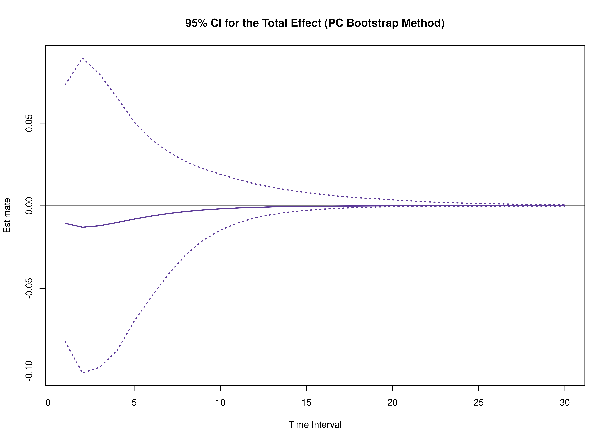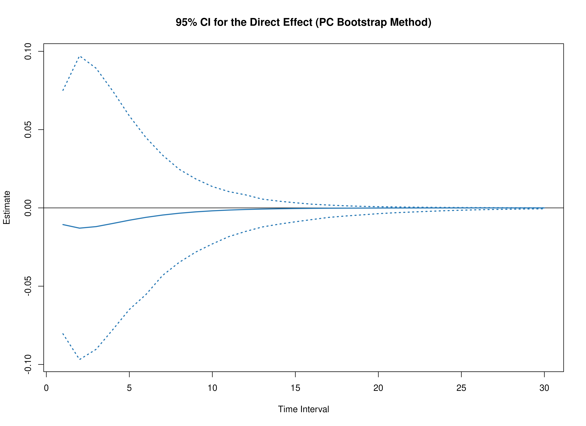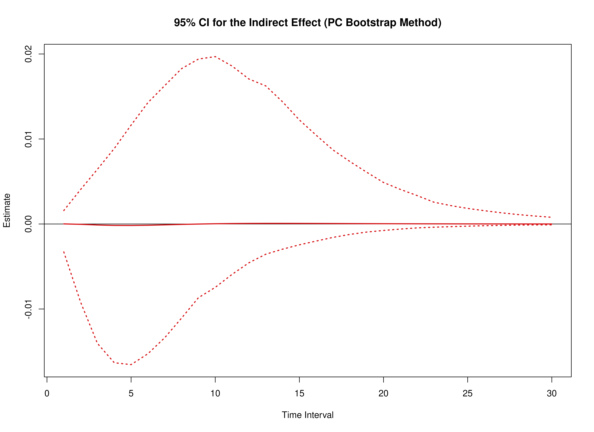

``` r
plot(pb, type = "bc")
```

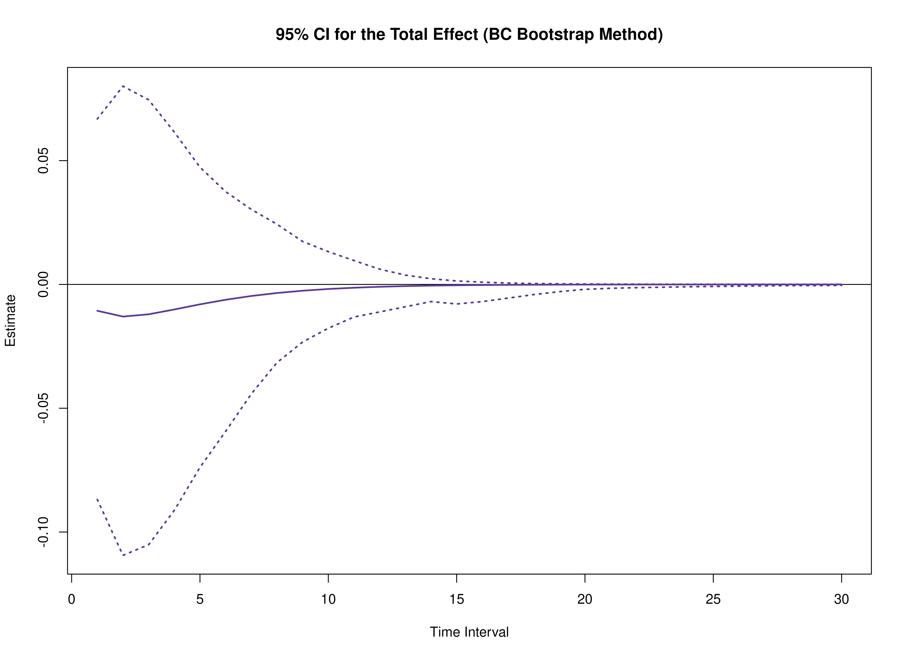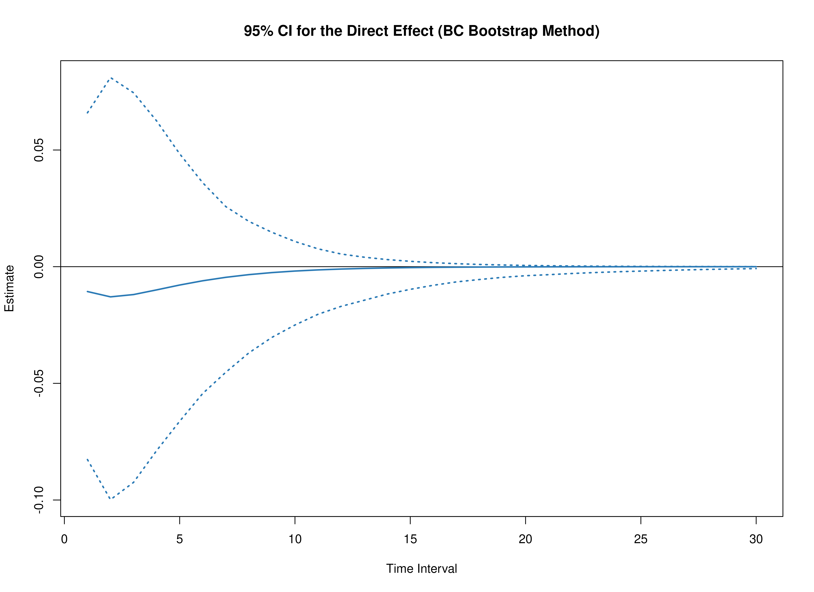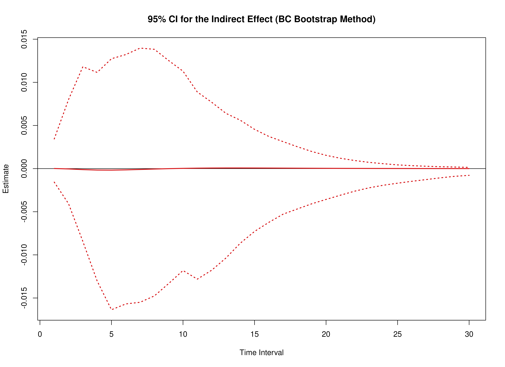

``` r
summary(pb)
#>      effect interval           est           se    R          2.5%        97.5%
#> 1     total        1 -1.254103e-02 0.0471921209 1000 -1.026603e-01 8.283463e-02
#> 2    direct        1 -1.255449e-02 0.0471367227 1000 -1.013706e-01 8.408017e-02
#> 3  indirect        1  1.346192e-05 0.0013756066 1000 -4.248741e-03 1.915874e-03
#> 4     total        2 -1.528921e-02 0.0573370272 1000 -1.251049e-01 9.660340e-02
#> 5    direct        2 -1.524318e-02 0.0569201013 1000 -1.209905e-01 1.035849e-01
#> 6  indirect        2 -4.603022e-05 0.0038006424 1000 -1.175111e-02 3.795634e-03
#> 7     total        3 -1.421859e-02 0.0533738094 1000 -1.205659e-01 8.579814e-02
#> 8    direct        3 -1.408138e-02 0.0526425052 1000 -1.124611e-01 9.704173e-02
#> 9  indirect        3 -1.372084e-04 0.0060490300 1000 -1.826791e-02 6.697446e-03
#> 10    total        4 -1.191960e-02 0.0449484197 1000 -1.061852e-01 6.830355e-02
#> 11   direct        4 -1.172284e-02 0.0441700177 1000 -9.635961e-02 8.028421e-02
#> 12 indirect        4 -1.967589e-04 0.0075711031 1000 -2.208863e-02 1.040405e-02
#> 13    total        5 -9.474221e-03 0.0359943725 1000 -8.699639e-02 5.483492e-02
#> 14   direct        5 -9.268796e-03 0.0354597602 1000 -7.951349e-02 6.349217e-02
#> 15 indirect        5 -2.054251e-04 0.0083693131 1000 -2.125551e-02 1.300111e-02
#> 16    total        6 -7.293906e-03 0.0279789760 1000 -6.874826e-02 4.397986e-02
#> 17   direct        6 -7.120734e-03 0.0278943421 1000 -6.424543e-02 4.744757e-02
#> 18 indirect        6 -1.731721e-04 0.0086724442 1000 -2.009466e-02 1.673447e-02
#> 19    total        7 -5.496896e-03 0.0213352541 1000 -5.021103e-02 3.412632e-02
#> 20   direct        7 -5.377853e-03 0.0217768819 1000 -5.138327e-02 3.538254e-02
#> 21 indirect        7 -1.190433e-04 0.0086873384 1000 -1.778682e-02 1.925770e-02
#> 22    total        8 -4.079020e-03 0.0160781108 1000 -3.662231e-02 2.884489e-02
#> 23   direct        8 -4.019049e-03 0.0169978214 1000 -4.155281e-02 2.602899e-02
#> 24 indirect        8 -5.997041e-05 0.0085230664 1000 -1.433610e-02 2.107078e-02
#> 25    total        9 -2.990775e-03 0.0120605321 1000 -2.729723e-02 2.348048e-02
#> 26   direct        9 -2.983724e-03 0.0133240339 1000 -3.251657e-02 2.071993e-02
#> 27 indirect        9 -7.051455e-06 0.0082173375 1000 -1.143785e-02 2.192466e-02
#> 28    total       10 -2.171460e-03 0.0090788430 1000 -1.808629e-02 1.916793e-02
#> 29   direct       10 -2.205740e-03 0.0105160082 1000 -2.639654e-02 1.541734e-02
#> 30 indirect       10  3.428014e-05 0.0077834331 1000 -9.060579e-03 2.244609e-02
#> 31    total       11 -1.563465e-03 0.0069176857 1000 -1.281371e-02 1.557543e-02
#> 32   direct       11 -1.626163e-03 0.0083684836 1000 -2.156827e-02 1.162402e-02
#> 33 indirect       11  6.269844e-05 0.0072382086 1000 -7.142647e-03 2.077221e-02
#> 34    total       12 -1.117441e-03 0.0053725726 1000 -8.930432e-03 1.271786e-02
#> 35   direct       12 -1.196755e-03 0.0067187507 1000 -1.745337e-02 8.927529e-03
#> 36 indirect       12  7.931363e-05 0.0066090692 1000 -5.624446e-03 1.899693e-02
#> 37    total       13 -7.933544e-04 0.0042650718 1000 -6.411025e-03 1.114206e-02
#> 38   direct       13 -8.797226e-04 0.0054427468 1000 -1.426537e-02 6.854510e-03
#> 39 indirect       13  8.636827e-05 0.0059302696 1000 -4.525497e-03 1.697459e-02
#> 40    total       14 -5.598051e-04 0.0034537183 1000 -4.630231e-03 9.507990e-03
#> 41   direct       14 -6.461897e-04 0.0044477065 1000 -1.163002e-02 5.172002e-03
#> 42 indirect       14  8.638458e-05 0.0052367756 1000 -3.548670e-03 1.548313e-02
#> 43    total       15 -3.927299e-04 0.0028378213 1000 -3.089217e-03 8.188186e-03
#> 44   direct       15 -4.744178e-04 0.0036648616 1000 -9.447188e-03 4.029552e-03
#> 45 indirect       15  8.168789e-05 0.0045593899 1000 -2.573913e-03 1.361691e-02
#> 46    total       16 -2.740021e-04 0.0023527775 1000 -2.282781e-03 6.912262e-03
#> 47   direct       16 -3.481950e-04 0.0030433371 1000 -7.777315e-03 3.047634e-03
#> 48 indirect       16  7.419282e-05 0.0039220363 1000 -1.894415e-03 1.183801e-02
#> 49    total       17 -1.901500e-04 0.0019602329 1000 -1.569369e-03 5.953516e-03
#> 50   direct       17 -2.555011e-04 0.0025454164 1000 -6.372687e-03 2.338941e-03
#> 51 indirect       17  6.535109e-05 0.0033409248 1000 -1.513453e-03 1.000243e-02
#> 52    total       18 -1.312715e-04 0.0016379667 1000 -1.151613e-03 4.968427e-03
#> 53   direct       18 -1.874576e-04 0.0021430074 1000 -5.157944e-03 1.719558e-03
#> 54 indirect       18  5.618613e-05 0.0028250057 1000 -1.224026e-03 8.371217e-03
#> 55    total       19 -9.015707e-05 0.0013723299 1000 -8.850241e-04 4.167896e-03
#> 56   direct       19 -1.375227e-04 0.0018150538 1000 -4.213843e-03 1.313378e-03
#> 57 indirect       19  4.736564e-05 0.0023771466 1000 -9.789674e-04 6.572099e-03
#> 58    total       20 -6.160030e-05 0.0011536906 1000 -6.379863e-04 3.494179e-03
#> 59   direct       20 -1.008835e-04 0.0015456579 1000 -3.462433e-03 1.003899e-03
#> 60 indirect       20  3.928319e-05 0.0019955970 1000 -8.062792e-04 5.365603e-03
#> 61    total       21 -4.186912e-05 0.0009741837 1000 -4.764286e-04 2.826146e-03
#> 62   direct       21 -7.400294e-05 0.0013227211 1000 -2.846332e-03 7.665836e-04
#> 63 indirect       21  3.213382e-05 0.0016754530 1000 -6.407464e-04 4.297519e-03
#> 64    total       22 -2.830624e-05 0.0008268714 1000 -3.678544e-04 2.345460e-03
#> 65   direct       22 -5.428337e-05 0.0011369602 1000 -2.336492e-03 5.747293e-04
#> 66 indirect       22  2.597713e-05 0.0014099539 1000 -5.145972e-04 3.488517e-03
#> 67    total       23 -1.903137e-05 0.0007056025 1000 -3.114509e-04 1.927362e-03
#> 68   direct       23 -3.981782e-05 0.0009811921 1000 -1.880374e-03 4.213369e-04
#> 69 indirect       23  2.078645e-05 0.0011915324 1000 -4.012498e-04 2.984642e-03
#> 70    total       24 -1.272182e-05 0.0006051071 1000 -2.823542e-04 1.628705e-03
#> 71   direct       24 -2.920676e-05 0.0008498118 1000 -1.534485e-03 3.273917e-04
#> 72 indirect       24  1.648494e-05 0.0010125993 1000 -3.280134e-04 2.485801e-03
#> 73    total       25 -8.452319e-06 0.0005210757 1000 -2.358176e-04 1.340605e-03
#> 74   direct       25 -2.142329e-05 0.0007384097 1000 -1.273013e-03 2.622385e-04
#> 75 indirect       25  1.297097e-05 0.0008660759 1000 -2.659511e-04 2.035563e-03
#> 76    total       26 -5.579089e-06 0.0004501344 1000 -2.002988e-04 1.114054e-03
#> 77   direct       26 -1.571401e-05 0.0006434876 1000 -1.043176e-03 2.082968e-04
#> 78 indirect       26  1.013492e-05 0.0007457084 1000 -2.176819e-04 1.640553e-03
#> 79    total       27 -3.656547e-06 0.0003897242 1000 -1.701036e-04 9.391357e-04
#> 80   direct       27 -1.152621e-05 0.0005622490 1000 -8.440480e-04 1.589403e-04
#> 81 indirect       27  7.869659e-06 0.0006462042 1000 -1.771311e-04 1.398918e-03
#> 82    total       28 -2.377887e-06 0.0003379326 1000 -1.380766e-04 8.041747e-04
#> 83   direct       28 -8.454442e-06 0.0004924408 1000 -6.797453e-04 1.250552e-04
#> 84 indirect       28  6.076555e-06 0.0005632378 1000 -1.445267e-04 1.191557e-03
#> 85    total       29 -1.532939e-06 0.0002933234 1000 -1.170191e-04 6.886103e-04
#> 86   direct       29 -6.201303e-06 0.0004322346 1000 -5.627115e-04 9.572694e-05
#> 87 indirect       29  4.668364e-06 0.0004933711 1000 -1.208768e-04 1.013995e-03
#> 88    total       30 -9.784795e-07 0.0002547944 1000 -9.948073e-05 5.839365e-04
#> 89   direct       30 -4.548630e-06 0.0003801366 1000 -4.664178e-04 7.327668e-05
#> 90 indirect       30  3.570150e-06 0.0004339284 1000 -1.041120e-04 8.123040e-04
summary(pb, type = "bc")
#>      effect interval           est           se    R          2.5%        97.5%
#> 1     total        1 -1.254103e-02 0.0471921209 1000 -0.0966808199 8.484400e-02
#> 2    direct        1 -1.255449e-02 0.0471367227 1000 -0.0957078778 8.648820e-02
#> 3  indirect        1  1.346192e-05 0.0013756066 1000 -0.0017939027 3.094214e-03
#> 4     total        2 -1.528921e-02 0.0573370272 1000 -0.1213927253 1.015720e-01
#> 5    direct        2 -1.524318e-02 0.0569201013 1000 -0.1139032007 1.065572e-01
#> 6  indirect        2 -4.603022e-05 0.0038006424 1000 -0.0052258996 7.730441e-03
#> 7     total        3 -1.421859e-02 0.0533738094 1000 -0.1163330989 8.916669e-02
#> 8    direct        3 -1.408138e-02 0.0526425052 1000 -0.1075877402 9.887602e-02
#> 9  indirect        3 -1.372084e-04 0.0060490300 1000 -0.0096513586 1.221767e-02
#> 10    total        4 -1.191960e-02 0.0449484197 1000 -0.1028003640 7.132231e-02
#> 11   direct        4 -1.172284e-02 0.0441700177 1000 -0.0935011243 8.136296e-02
#> 12 indirect        4 -1.967589e-04 0.0075711031 1000 -0.0132627949 1.634430e-02
#> 13    total        5 -9.474221e-03 0.0359943725 1000 -0.0823373180 5.830368e-02
#> 14   direct        5 -9.268796e-03 0.0354597602 1000 -0.0778938145 6.458702e-02
#> 15 indirect        5 -2.054251e-04 0.0083693131 1000 -0.0175615146 1.832641e-02
#> 16    total        6 -7.293906e-03 0.0279789760 1000 -0.0643135395 4.468431e-02
#> 17   direct        6 -7.120734e-03 0.0278943421 1000 -0.0625374437 4.951403e-02
#> 18 indirect        6 -1.731721e-04 0.0086724442 1000 -0.0182653793 1.898558e-02
#> 19    total        7 -5.496896e-03 0.0213352541 1000 -0.0491120469 3.604757e-02
#> 20   direct        7 -5.377853e-03 0.0217768819 1000 -0.0502937859 3.743877e-02
#> 21 indirect        7 -1.190433e-04 0.0086873384 1000 -0.0178403381 1.900924e-02
#> 22    total        8 -4.079020e-03 0.0160781108 1000 -0.0352532075 2.944537e-02
#> 23   direct        8 -4.019049e-03 0.0169978214 1000 -0.0405802081 2.754716e-02
#> 24 indirect        8 -5.997041e-05 0.0085230664 1000 -0.0180787400 1.667116e-02
#> 25    total        9 -2.990775e-03 0.0120605321 1000 -0.0272972257 2.348048e-02
#> 26   direct        9 -2.983724e-03 0.0133240339 1000 -0.0323064908 2.087140e-02
#> 27 indirect        9 -7.051455e-06 0.0082173375 1000 -0.0198665190 1.404881e-02
#> 28    total       10 -2.171460e-03 0.0090788430 1000 -0.0197475508 1.711279e-02
#> 29   direct       10 -2.205740e-03 0.0105160082 1000 -0.0261108212 1.609180e-02
#> 30 indirect       10  3.428014e-05 0.0077834331 1000 -0.0172149049 1.312170e-02
#> 31    total       11 -1.563465e-03 0.0069176857 1000 -0.0177530173 1.174884e-02
#> 32   direct       11 -1.626163e-03 0.0083684836 1000 -0.0214566363 1.193653e-02
#> 33 indirect       11  6.269844e-05 0.0072382086 1000 -0.0146938055 1.082432e-02
#> 34    total       12 -1.117441e-03 0.0053725726 1000 -0.0143561609 7.099822e-03
#> 35   direct       12 -1.196755e-03 0.0067187507 1000 -0.0173924360 8.951258e-03
#> 36 indirect       12  7.931363e-05 0.0066090692 1000 -0.0135388808 9.524605e-03
#> 37    total       13 -7.933544e-04 0.0042650718 1000 -0.0111767630 5.083257e-03
#> 38   direct       13 -8.797226e-04 0.0054427468 1000 -0.0142653699 6.854510e-03
#> 39 indirect       13  8.636827e-05 0.0059302696 1000 -0.0120417930 8.056347e-03
#> 40    total       14 -5.598051e-04 0.0034537183 1000 -0.0087235708 2.920358e-03
#> 41   direct       14 -6.461897e-04 0.0044477065 1000 -0.0119219658 5.037758e-03
#> 42 indirect       14  8.638458e-05 0.0052367756 1000 -0.0107879500 6.564479e-03
#> 43    total       15 -3.927299e-04 0.0028378213 1000 -0.0083189745 1.892859e-03
#> 44   direct       15 -4.744178e-04 0.0036648616 1000 -0.0101051819 3.612914e-03
#> 45 indirect       15  8.168789e-05 0.0045593899 1000 -0.0103062871 5.162633e-03
#> 46    total       16 -2.740021e-04 0.0023527775 1000 -0.0070226672 1.179176e-03
#> 47   direct       16 -3.481950e-04 0.0030433371 1000 -0.0085012940 2.533103e-03
#> 48 indirect       16  7.419282e-05 0.0039220363 1000 -0.0086512592 4.292368e-03
#> 49    total       17 -1.901500e-04 0.0019602329 1000 -0.0051397032 6.484670e-04
#> 50   direct       17 -2.555011e-04 0.0025454164 1000 -0.0070548741 1.887350e-03
#> 51 indirect       17  6.535109e-05 0.0033409248 1000 -0.0070926977 3.252757e-03
#> 52    total       18 -1.312715e-04 0.0016379667 1000 -0.0042588332 3.998657e-04
#> 53   direct       18 -1.874576e-04 0.0021430074 1000 -0.0056872884 1.405311e-03
#> 54 indirect       18  5.618613e-05 0.0028250057 1000 -0.0057987016 2.669753e-03
#> 55    total       19 -9.015707e-05 0.0013723299 1000 -0.0035972957 2.835835e-04
#> 56   direct       19 -1.375227e-04 0.0018150538 1000 -0.0047235995 1.020855e-03
#> 57 indirect       19  4.736564e-05 0.0023771466 1000 -0.0049372956 2.085107e-03
#> 58    total       20 -6.160030e-05 0.0011536906 1000 -0.0030344871 2.150136e-04
#> 59   direct       20 -1.008835e-04 0.0015456579 1000 -0.0038460684 7.494884e-04
#> 60 indirect       20  3.928319e-05 0.0019955970 1000 -0.0043243169 1.658948e-03
#> 61    total       21 -4.186912e-05 0.0009741837 1000 -0.0025633046 1.501643e-04
#> 62   direct       21 -7.400294e-05 0.0013227211 1000 -0.0032513160 5.638609e-04
#> 63 indirect       21  3.213382e-05 0.0016754530 1000 -0.0037044021 1.328141e-03
#> 64    total       22 -2.830624e-05 0.0008268714 1000 -0.0021593681 1.092697e-04
#> 65   direct       22 -5.428337e-05 0.0011369602 1000 -0.0028592449 4.175051e-04
#> 66 indirect       22  2.597713e-05 0.0014099539 1000 -0.0032366436 1.038353e-03
#> 67    total       23 -1.903137e-05 0.0007056025 1000 -0.0018129067 8.395229e-05
#> 68   direct       23 -3.981782e-05 0.0009811921 1000 -0.0024067339 3.089605e-04
#> 69 indirect       23  2.078645e-05 0.0011915324 1000 -0.0028322152 7.795695e-04
#> 70    total       24 -1.272182e-05 0.0006051071 1000 -0.0015187209 6.537164e-05
#> 71   direct       24 -2.920676e-05 0.0008498118 1000 -0.0020777150 2.330465e-04
#> 72 indirect       24  1.648494e-05 0.0010125993 1000 -0.0024322154 6.157236e-04
#> 73    total       25 -8.452319e-06 0.0005210757 1000 -0.0012611834 5.614782e-05
#> 74   direct       25 -2.142329e-05 0.0007384097 1000 -0.0017883912 1.771370e-04
#> 75 indirect       25  1.297097e-05 0.0008660759 1000 -0.0021350465 4.686564e-04
#> 76    total       26 -5.579089e-06 0.0004501344 1000 -0.0010263909 5.903010e-05
#> 77   direct       26 -1.571401e-05 0.0006434876 1000 -0.0014910109 1.351648e-04
#> 78 indirect       26  1.013492e-05 0.0007457084 1000 -0.0018001881 3.683432e-04
#> 79    total       27 -3.656547e-06 0.0003897242 1000 -0.0008288765 6.775671e-05
#> 80   direct       27 -1.152621e-05 0.0005622490 1000 -0.0012441933 1.027764e-04
#> 81 indirect       27  7.869659e-06 0.0006462042 1000 -0.0015005082 2.869876e-04
#> 82    total       28 -2.377887e-06 0.0003379326 1000 -0.0006693342 5.958973e-05
#> 83   direct       28 -8.454442e-06 0.0004924408 1000 -0.0010706422 7.795687e-05
#> 84 indirect       28  6.076555e-06 0.0005632378 1000 -0.0012199022 2.307348e-04
#> 85    total       29 -1.532939e-06 0.0002933234 1000 -0.0005674543 6.117985e-05
#> 86   direct       29 -6.201303e-06 0.0004322346 1000 -0.0008946752 5.770263e-05
#> 87 indirect       29  4.668364e-06 0.0004933711 1000 -0.0010110394 1.816446e-04
#> 88    total       30 -9.784795e-07 0.0002547944 1000 -0.0005193827 5.684617e-05
#> 89   direct       30 -4.548630e-06 0.0003801366 1000 -0.0007515207 4.294686e-05
#> 90 indirect       30  3.570150e-06 0.0004339284 1000 -0.0008686042 1.430046e-04
```
