``` r
library(manCTMed)
```

## Data Generation


``` r
seed <- 1
set.seed(seed)
taskid <- 1
sim <- GenData(taskid = taskid)
plot(sim)
```


``` r
data <- RandomMeasurement(sim)
str(data)
#> 'data.frame':	9000 obs. of  5 variables:
#>  $ id  : num  1 1 1 1 1 1 1 1 1 1 ...
#>  $ time: num  0 0.0333 0.0667 0.1 0.1333 ...
#>  $ x   : num  -1.427 -0.67 -2.044 -0.977 -0.604 ...
#>  $ m   : num  -0.972 -1.492 -1.343 -0.702 -0.842 ...
#>  $ y   : num  -0.0563 0.4158 0.1407 -0.1219 -0.119 ...
```

## Model Fitting


``` r
fit <- FitDynr(data = data, taskid = taskid)
#> [1] "Get ready!!!!"
#> using C compiler: ‘gcc (Ubuntu 13.3.0-6ubuntu2~24.04) 13.3.0’
#> Optimization function called.
#> Starting Hessian calculation ...
#> Finished Hessian calculation.
#> Original exit flag:  3 
#> Modified exit flag:  3 
#> Optimization terminated successfully: ftol_rel or ftol_abs was reached. 
#> Original fitted parameters:  -0.3346013 0.02166289 -0.01933279 0.7706831 
#> -0.5507161 0.008072293 -0.5077725 0.7861072 -0.7079146 -1.646831 0.1363935 
#> -0.1794374 -2.668642 0.1643978 -2.856534 -1.617031 -1.639487 -1.553734 
#> 0.1037222 -0.02241764 0.1438094 0.02120675 0.3877461 0.3593095 -0.4531352 
#> 0.1506019 -0.4459209 
#> 
#> Transformed fitted parameters:  -0.3346013 0.02166289 -0.01933279 0.7706831 
#> -0.5507161 0.008072293 -0.5077725 0.7861072 -0.7079146 0.1926596 0.02627752 
#> -0.03457033 0.07293042 0.006685215 0.06554499 0.198487 0.1940796 0.2114569 
#> 0.1037222 -0.02241764 0.1438094 1.021433 0.3960568 0.3670106 0.7892017 
#> 0.2380344 0.7865216 
#> 
#> Doing end processing
#> Successful trial
#> Total Time: 8.700608 
#> Backend Time: 8.689285
summary(fit)
#> Coefficients:
#>            Estimate Std. Error t value  ci.lower  ci.upper Pr(>|t|)    
#> phi_11    -0.334601   0.094078  -3.557 -0.518991 -0.150211   0.0002 ***
#> phi_12     0.021663   0.090875   0.238 -0.156448  0.199774   0.4058    
#> phi_13    -0.019333   0.074466  -0.260 -0.165283  0.126617   0.3976    
#> phi_21     0.770683   0.068892  11.187  0.635656  0.905710   <2e-16 ***
#> phi_22    -0.550716   0.067048  -8.214 -0.682128 -0.419305   <2e-16 ***
#> phi_23     0.008072   0.053580   0.151 -0.096942  0.113087   0.4401    
#> phi_31    -0.507772   0.068188  -7.447 -0.641419 -0.374126   <2e-16 ***
#> phi_32     0.786107   0.066051  11.902  0.656650  0.915565   <2e-16 ***
#> phi_33    -0.707915   0.053656 -13.194 -0.813078 -0.602751   <2e-16 ***
#> sigma_11   0.192660   0.019483   9.888  0.154473  0.230846   <2e-16 ***
#> sigma_12   0.026278   0.009713   2.705  0.007239  0.045316   0.0034 ** 
#> sigma_13  -0.034570   0.009843  -3.512 -0.053861 -0.015279   0.0002 ***
#> sigma_22   0.072930   0.009634   7.570  0.054048  0.091813   <2e-16 ***
#> sigma_23   0.006685   0.006742   0.992 -0.006529  0.019900   0.1607    
#> sigma_33   0.065545   0.009791   6.695  0.046356  0.084734   <2e-16 ***
#> theta_11   0.198487   0.004542  43.698  0.189584  0.207390   <2e-16 ***
#> theta_22   0.194080   0.004240  45.769  0.185769  0.202391   <2e-16 ***
#> theta_33   0.211457   0.004604  45.933  0.202434  0.220480   <2e-16 ***
#> mu0_1      0.103722   0.145704   0.712 -0.181853  0.389297   0.2383    
#> mu0_2     -0.022418   0.128088  -0.175 -0.273465  0.228630   0.4305    
#> mu0_3      0.143809   0.128032   1.123 -0.107129  0.394747   0.1307    
#> sigma0_11  1.021433   0.211348   4.833  0.607199  1.435667   <2e-16 ***
#> sigma0_12  0.396057   0.143821   2.754  0.114173  0.677940   0.0030 ** 
#> sigma0_13  0.367011   0.143034   2.566  0.086669  0.647353   0.0052 ** 
#> sigma0_22  0.789202   0.165089   4.780  0.465632  1.112771   <2e-16 ***
#> sigma0_23  0.238034   0.122124   1.949 -0.001324  0.477393   0.0257 *  
#> sigma0_33  0.786522   0.166425   4.726  0.460334  1.112709   <2e-16 ***
#> ---
#> Signif. codes:  0 '***' 0.001 '**' 0.01 '*' 0.05 '.' 0.1 ' ' 1
#> 
#> -2 log-likelihood value at convergence = 21100.40
#> AIC = 21154.40
#> BIC = 21346.24
phi_hat <- PhiHat(fit)
theta_hat <- ThetaHat(fit)
```

## Confidence Intervals (Unstandardized)

### Model $\eta_X \to \eta_M \to \eta_Y$

#### Delta Method


``` r
delta <- DeltaXMY(phi_hat = phi_hat)
plot(delta)
```

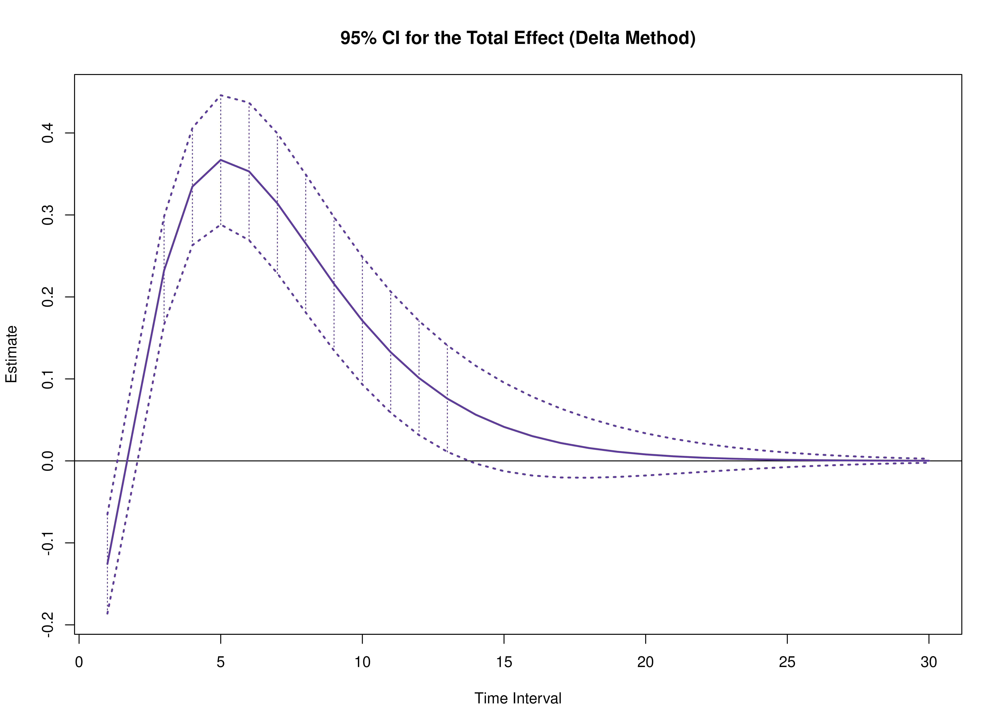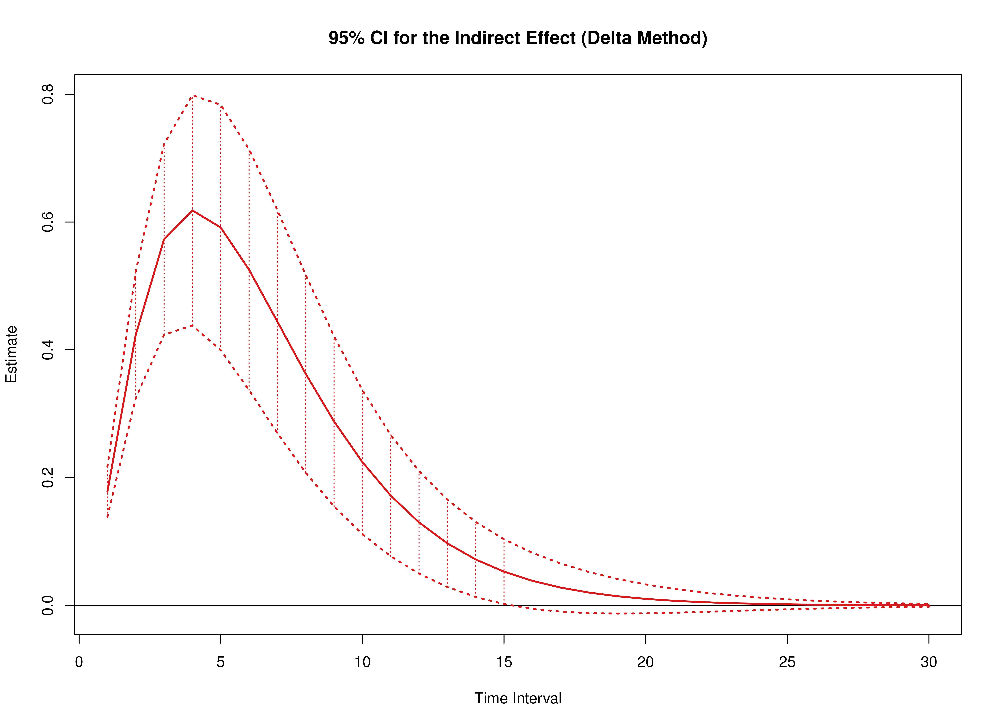

``` r
summary(delta)
#>      effect interval           est           se          z            p
#> 1     total        1 -0.1256906920 0.0308918759 -4.0687297 4.727015e-05
#> 2    direct        1 -0.3037507224 0.0419975788 -7.2325770 4.739138e-13
#> 3  indirect        1  0.1780600303 0.0200807224  8.8672124 7.499978e-19
#> 4     total        2  0.0547873238 0.0335737093  1.6318520 1.027107e-01
#> 5    direct        2 -0.3688024194 0.0596256657 -6.1852965 6.198587e-10
#> 6  indirect        2  0.4235897432 0.0505670167  8.3767992 5.438654e-17
#> 7     total        3  0.2322234227 0.0336008193  6.9112429 4.804257e-12
#> 8    direct        3 -0.3406933403 0.0677448446 -5.0290667 4.928730e-07
#> 9  indirect        3  0.5729167630 0.0760667805  7.5317604 5.006077e-14
#> 10    total        4  0.3345715006 0.0364851142  9.1700823 4.726579e-20
#> 11   direct        4 -0.2836293280 0.0696159090 -4.0742027 4.617224e-05
#> 12 indirect        4  0.6182008285 0.0919204611  6.7253887 1.751243e-11
#> 13    total        5  0.3671226357 0.0402454180  9.1220977 7.368405e-20
#> 14   direct        5 -0.2242547245 0.0670821528 -3.3429864 8.288196e-04
#> 15 indirect        5  0.5913773602 0.0979402040  6.0381471 1.558939e-09
#> 16    total        6  0.3530953009 0.0427896862  8.2518787 1.559236e-16
#> 17   direct        6 -0.1722832310 0.0617782365 -2.7887366 5.291408e-03
#> 18 indirect        6  0.5253785319 0.0960973509  5.4671490 4.573317e-08
#> 19    total        7  0.3140492805 0.0435718568  7.2076176 5.693927e-13
#> 20   direct        7 -0.1301149456 0.0550230922 -2.3647334 1.804305e-02
#> 21 indirect        7  0.4441642261 0.0889481801  4.9935167 5.928964e-07
#> 22    total        8  0.2652310175 0.0429392412  6.1768911 6.537613e-10
#> 23   direct        8 -0.0972392485 0.0477684656 -2.0356368 4.178684e-02
#> 24 indirect        8  0.3624702660 0.0789137467  4.5932462 4.364037e-06
#> 25    total        9  0.2159203686 0.0414880526  5.2043987 1.946257e-07
#> 26   direct        9 -0.0721899710 0.0406421182 -1.7762354 7.569412e-02
#> 27 indirect        9  0.2881103396 0.0679754135  4.2384492 2.250691e-05
#> 28    total       10  0.1710189987 0.0396745377  4.3105480 1.628505e-05
#> 29   direct       10 -0.0533669745 0.0340204734 -1.5686723 1.167243e-01
#> 30 indirect       10  0.2243859733 0.0575411679  3.8995728 9.636256e-05
#> 31    total       11  0.1325971732 0.0376886068  3.5182296 4.344363e-04
#> 32   direct       11 -0.0393443549 0.0280990247 -1.4002036 1.614524e-01
#> 33 indirect       11  0.1719415281 0.0484196097  3.5510722 3.836652e-04
#> 34    total       12  0.1010631543 0.0355250643  2.8448409 4.443362e-03
#> 35   direct       12 -0.0289549896 0.0229505143 -1.2616270 2.070830e-01
#> 36 indirect       12  0.1300181439 0.0408869663  3.1799411 1.473050e-03
#> 37    total       13  0.0759493417 0.0331202091  2.2931420 2.183983e-02
#> 38   direct       13 -0.0212845291 0.0185694334 -1.1462132 2.517070e-01
#> 39 indirect       13  0.0972338708 0.0348314757  2.7915519 5.245595e-03
#> 40    total       14  0.0564004968 0.0304478777  1.8523622 6.397383e-02
#> 41   direct       14 -0.0156342942 0.0149043087 -1.0489782 2.941882e-01
#> 42 indirect       14  0.0720347910 0.0299402769  2.4059494 1.613050e-02
#> 43    total       15  0.0414557535 0.0275480675  1.5048516 1.323622e-01
#> 44   direct       15 -0.0114783446 0.0118800638 -0.9661854 3.339514e-01
#> 45 indirect       15  0.0529340981 0.0258704656  2.0461208 4.074449e-02
#> 46    total       16  0.0301977504 0.0245117831  1.2319687 2.179608e-01
#> 47   direct       16 -0.0084244345 0.0094127759 -0.8950000 3.707871e-01
#> 48 indirect       16  0.0386221849 0.0223531169  1.7278210 8.402032e-02
#> 49    total       17  0.0218209161 0.0214519774  1.0171984 3.090591e-01
#> 50   direct       17 -0.0061817434 0.0074188690 -0.8332461 4.047060e-01
#> 51 indirect       17  0.0280026595 0.0192220522  1.4567986 1.451720e-01
#> 52    total       18  0.0156533681 0.0184781162  0.8471301 3.969226e-01
#> 53   direct       18 -0.0045354608 0.0058204007 -0.7792352 4.358412e-01
#> 54 indirect       18  0.0201888288 0.0163955957  1.2313568 2.181894e-01
#> 55    total       19  0.0111541299 0.0156802289  0.7113499 4.768674e-01
#> 56   direct       19 -0.0033273058 0.0045477173 -0.7316431 4.643865e-01
#> 57 indirect       19  0.0144814357 0.0138439814  1.0460456 2.955400e-01
#> 58    total       20  0.0078987343 0.0131220554  0.6019434 5.472118e-01
#> 59   direct       20 -0.0024408347 0.0035404148 -0.6894206 4.905587e-01
#> 60 indirect       20  0.0103395690 0.0115611877  0.8943345 3.711429e-01
#> 61    total       21  0.0055606962 0.0108407123  0.5129456 6.079893e-01
#> 62   direct       21 -0.0017904707 0.0027472658 -0.6517282 5.145765e-01
#> 63 indirect       21  0.0073511669 0.0095467789  0.7700154 4.412907e-01
#> 64    total       22  0.0038928671 0.0088501452  0.4398648 6.600351e-01
#> 65   direct       22 -0.0013133639 0.0021255685 -0.6178883 5.366490e-01
#> 66 indirect       22  0.0052062310 0.0077966995  0.6677481 5.042944e-01
#> 67    total       23  0.0027106046 0.0071462364  0.3793052 7.044612e-01
#> 68   direct       23 -0.0009633757 0.0016402113 -0.5873485 5.569697e-01
#> 69 indirect       23  0.0036739804 0.0063001179  0.5831606 5.597852e-01
#> 70    total       24  0.0018774952 0.0057121589  0.3286840 7.423946e-01
#> 71   direct       24 -0.0007066455 0.0012626439 -0.5596554 5.757145e-01
#> 72 indirect       24  0.0025841407 0.0050396514  0.5127618 6.081180e-01
#> 73    total       25  0.0012937263 0.0045231842  0.2860211 7.748619e-01
#> 74   direct       25 -0.0005183277 0.0009698639 -0.5344334 5.930417e-01
#> 75 indirect       25  0.0018120540 0.0039931039  0.4537959 6.499758e-01
#> 76    total       26  0.0008868868 0.0035505859  0.2497860 8.027528e-01
#> 77   direct       26 -0.0003801939 0.0007434821 -0.5113693 6.090925e-01
#> 78 indirect       26  0.0012670807 0.0031355954  0.4040957 6.861423e-01
#> 79    total       27  0.0006048452 0.0027645621  0.2187852 8.268174e-01
#> 80   direct       27 -0.0002788718 0.0005688940 -0.4902000 6.239924e-01
#> 81 indirect       27  0.0008837170 0.0024415006  0.3619565 7.173845e-01
#> 82    total       28  0.0004103317 0.0021362558  0.1920799 8.476797e-01
#> 83   direct       28 -0.0002045518 0.0004345666 -0.4707029 6.378529e-01
#> 84 indirect       28  0.0006148835 0.0018859565  0.3260327 7.443996e-01
#> 85    total       29  0.0002768726 0.0016390223  0.1689255 8.658553e-01
#> 86   direct       29 -0.0001500380 0.0003314373 -0.4526889 6.507728e-01
#> 87 indirect       29  0.0004269106 0.0014458914  0.2952577 7.677970e-01
#> 88    total       30  0.0001857764 0.0012491141  0.1487265 8.817694e-01
#> 89   direct       30 -0.0001100522 0.0002524158 -0.4359959 6.628397e-01
#> 90 indirect       30  0.0002958286 0.0011006275  0.2687818 7.880976e-01
#>             2.5%         97.5%
#> 1  -0.1862376561 -0.0651437279
#> 2  -0.3860644642 -0.2214369806
#> 3   0.1387025376  0.2174175231
#> 4  -0.0110159372  0.1205905847
#> 5  -0.4856665768 -0.2519382620
#> 6   0.3244802116  0.5226992748
#> 7   0.1663670270  0.2980798183
#> 8  -0.4734707959 -0.2079158848
#> 9   0.4238286128  0.7220049132
#> 10  0.2630619908  0.4060810103
#> 11 -0.4200740024 -0.1471846535
#> 12  0.4380400353  0.7983616218
#> 13  0.2882430658  0.4460022056
#> 14 -0.3557333280 -0.0927761209
#> 15  0.3994180877  0.7833366326
#> 16  0.2692290571  0.4369615447
#> 17 -0.2933663496 -0.0512001125
#> 18  0.3370311851  0.7137258787
#> 19  0.2286500105  0.3994485506
#> 20 -0.2379582246 -0.0222716666
#> 21  0.2698289966  0.6184994556
#> 22  0.1810716513  0.3493903837
#> 23 -0.1908637207 -0.0036147763
#> 24  0.2078021645  0.5171383675
#> 25  0.1346052798  0.2972354575
#> 26 -0.1518470588  0.0074671169
#> 27  0.1548809773  0.4213397018
#> 28  0.0932583337  0.2487796638
#> 29 -0.1200458770  0.0133119280
#> 30  0.1116073566  0.3371645899
#> 31  0.0587288612  0.2064654852
#> 32 -0.0944174314  0.0157287215
#> 33  0.0770408370  0.2668422193
#> 34  0.0314353077  0.1706910009
#> 35 -0.0739371711  0.0160271920
#> 36  0.0498811626  0.2101551252
#> 37  0.0110349248  0.1408637586
#> 38 -0.0576799497  0.0151108916
#> 39  0.0289654329  0.1655023086
#> 40 -0.0032762469  0.1160772405
#> 41 -0.0448462024  0.0135776140
#> 42  0.0133529265  0.1307166555
#> 43 -0.0125374666  0.0954489737
#> 44 -0.0347628417  0.0118061525
#> 45  0.0022289173  0.1036392789
#> 46 -0.0178444617  0.0782399625
#> 47 -0.0268731363  0.0100242673
#> 48 -0.0051891191  0.0824334889
#> 49 -0.0202241871  0.0638660192
#> 50 -0.0207224595  0.0083589727
#> 51 -0.0096718705  0.0656771894
#> 52 -0.0205630742  0.0518698103
#> 53 -0.0159432365  0.0068723149
#> 54 -0.0119459483  0.0523236060
#> 55 -0.0195785539  0.0418868137
#> 56 -0.0122406680  0.0055860564
#> 57 -0.0126522692  0.0416151406
#> 58 -0.0178200217  0.0336174903
#> 59 -0.0093799202  0.0044982507
#> 60 -0.0123199425  0.0329990806
#> 61 -0.0156867095  0.0268081019
#> 62 -0.0071750128  0.0035940714
#> 63 -0.0113601758  0.0260625096
#> 64 -0.0134530989  0.0212388330
#> 65 -0.0054794016  0.0028526739
#> 66 -0.0100750192  0.0204874811
#> 67 -0.0112957613  0.0167169706
#> 68 -0.0041781309  0.0022513794
#> 69 -0.0086740239  0.0160219846
#> 70 -0.0093181305  0.0130731209
#> 71 -0.0031813821  0.0017680911
#> 72 -0.0072933946  0.0124616760
#> 73 -0.0075715518  0.0101590045
#> 74 -0.0024192260  0.0013825706
#> 75 -0.0060142858  0.0096383939
#> 76 -0.0060721337  0.0078459072
#> 77 -0.0018373921  0.0010770042
#> 78 -0.0048785733  0.0074127347
#> 79 -0.0048135969  0.0060232874
#> 80 -0.0013938836  0.0008361399
#> 81 -0.0039015362  0.0056689703
#> 82 -0.0037766528  0.0045973162
#> 83 -0.0010562866  0.0006471831
#> 84 -0.0030815232  0.0043112902
#> 85 -0.0029355520  0.0034892973
#> 86 -0.0007996432  0.0004995672
#> 87 -0.0024069844  0.0032608057
#> 88 -0.0022624422  0.0026339950
#> 89 -0.0006047780  0.0003846736
#> 90 -0.0018613617  0.0024530190
```

#### Monte Carlo Method


``` r
mc <- MCXMY(phi_hat = phi_hat, seed = seed)
plot(mc)
```


``` r
summary(mc)
#>      effect interval           est          se     R          2.5%
#> 1     total        1 -0.1256906920 0.030918568 20000 -0.1869791011
#> 2    direct        1 -0.3037507224 0.041980003 20000 -0.3886010498
#> 3  indirect        1  0.1780600303 0.020059379 20000  0.1408047197
#> 4     total        2  0.0547873238 0.033876655 20000 -0.0142993962
#> 5    direct        2 -0.3688024194 0.060525370 20000 -0.4985977091
#> 6  indirect        2  0.4235897432 0.051025024 20000  0.3329876718
#> 7     total        3  0.2322234227 0.033838788 20000  0.1655282635
#> 8    direct        3 -0.3406933403 0.070165575 20000 -0.5008906509
#> 9  indirect        3  0.5729167630 0.077894454 20000  0.4426513533
#> 10    total        4  0.3345715006 0.036692167 20000  0.2663046973
#> 11   direct        4 -0.2836293280 0.073990654 20000 -0.4616496790
#> 12 indirect        4  0.6182008285 0.095851715 20000  0.4669791212
#> 13    total        5  0.3671226357 0.040667760 20000  0.2953307719
#> 14   direct        5 -0.2242547245 0.073644527 20000 -0.4096828571
#> 15 indirect        5  0.5913773602 0.104307653 20000  0.4363696913
#> 16    total        6  0.3530953009 0.043558468 20000  0.2796447652
#> 17   direct        6 -0.1722832310 0.070550034 20000 -0.3558646636
#> 18 indirect        6  0.5253785319 0.104828572 20000  0.3770350042
#> 19    total        7  0.3140492805 0.044699280 20000  0.2403623115
#> 20   direct        7 -0.1301149456 0.065853809 20000 -0.3067056768
#> 21 indirect        7  0.4441642261 0.099677470 20000  0.3107140101
#> 22    total        8  0.2652310175 0.044383404 20000  0.1943364233
#> 23   direct        8 -0.0972392485 0.060393567 20000 -0.2652269090
#> 24 indirect        8  0.3624702660 0.091106681 20000  0.2471933304
#> 25    total        9  0.2159203686 0.043196687 20000  0.1477593900
#> 26   direct        9 -0.0721899710 0.054737440 20000 -0.2280769702
#> 27 indirect        9  0.2881103396 0.081028641 20000  0.1900110111
#> 28    total       10  0.1710189987 0.041607039 20000  0.1060752703
#> 29   direct       10 -0.0533669745 0.049244682 20000 -0.1941477460
#> 30 indirect       10  0.2243859733 0.070859302 20000  0.1424503771
#> 31    total       11  0.1325971732 0.039820924 20000  0.0703529005
#> 32   direct       11 -0.0393443549 0.044123282 20000 -0.1650168399
#> 33 indirect       11  0.1719415281 0.061482017 20000  0.1033058716
#> 34    total       12  0.1010631543 0.037843040 20000  0.0407332048
#> 35   direct       12 -0.0289549896 0.039477163 20000 -0.1415685108
#> 36 indirect       12  0.1300181439 0.053309608 20000  0.0720594168
#> 37    total       13  0.0759493417 0.035609784 20000  0.0197460764
#> 38   direct       13 -0.0212845291 0.035342138 20000 -0.1212438690
#> 39 indirect       13  0.0972338708 0.046411235 20000  0.0477917921
#> 40    total       14  0.0564004968 0.033088958 20000  0.0045043655
#> 41   direct       14 -0.0156342942 0.031712003 20000 -0.1042632568
#> 42 indirect       14  0.0720347910 0.040660294 20000  0.0302870787
#> 43    total       15  0.0414557535 0.030313856 20000 -0.0055767877
#> 44   direct       15 -0.0114783446 0.028556633 20000 -0.0893071096
#> 45 indirect       15  0.0529340981 0.035861114 20000  0.0177769254
#> 46    total       16  0.0301977504 0.027371757 20000 -0.0117410907
#> 47   direct       16 -0.0084244345 0.025834034 20000 -0.0768759588
#> 48 indirect       16  0.0386221849 0.031828950 20000  0.0092249428
#> 49    total       17  0.0218209161 0.024375851 20000 -0.0143911975
#> 50   direct       17 -0.0061817434 0.023497967 20000 -0.0659026462
#> 51 indirect       17  0.0280026595 0.028421910 20000  0.0036407020
#> 52    total       18  0.0156533681 0.021438886 20000 -0.0147688384
#> 53   direct       18 -0.0045354608 0.021502508 20000 -0.0567494811
#> 54 indirect       18  0.0201888288 0.025540439 20000  0.0002997946
#> 55    total       19  0.0111541299 0.018655516 20000 -0.0140381821
#> 56   direct       19 -0.0033273058 0.019804554 20000 -0.0485077374
#> 57 indirect       19  0.0144814357 0.023113174 20000 -0.0015950536
#> 58    total       20  0.0078987343 0.016093820 20000 -0.0123533113
#> 59   direct       20 -0.0024408347 0.018365011 20000 -0.0417012187
#> 60 indirect       20  0.0103395690 0.021082378 20000 -0.0025279416
#> 61    total       21  0.0055606962 0.013793897 20000 -0.0104138547
#> 62   direct       21 -0.0017904707 0.017149186 20000 -0.0356180805
#> 63 indirect       21  0.0073511669 0.019394842 20000 -0.0027764958
#> 64    total       22  0.0038928671 0.011770954 20000 -0.0086014033
#> 65   direct       22 -0.0013133639 0.016126716 20000 -0.0305485402
#> 66 indirect       22  0.0052062310 0.017998912 20000 -0.0026262933
#> 67    total       23  0.0027106046 0.010020667 20000 -0.0069171159
#> 68   direct       23 -0.0009633757 0.015271258 20000 -0.0260906142
#> 69 indirect       23  0.0036739804 0.016845602 20000 -0.0022990453
#> 70    total       24  0.0018774952 0.008525186 20000 -0.0053513231
#> 71   direct       24 -0.0007066455 0.014560084 20000 -0.0224467596
#> 72 indirect       24  0.0025841407 0.015891172 20000 -0.0019372122
#> 73    total       25  0.0012937263 0.007258729 20000 -0.0041484145
#> 74   direct       25 -0.0005183277 0.013973644 20000 -0.0193071134
#> 75 indirect       25  0.0018120540 0.015099174 20000 -0.0016187147
#> 76    total       26  0.0008868868 0.006192160 20000 -0.0031654324
#> 77   direct       26 -0.0003801939 0.013495153 20000 -0.0165773195
#> 78 indirect       26  0.0012670807 0.014441113 20000 -0.0012513974
#> 79    total       27  0.0006048452 0.005296305 20000 -0.0023506567
#> 80   direct       27 -0.0002788718 0.013110213 20000 -0.0142498758
#> 81 indirect       27  0.0008837170 0.013895784 20000 -0.0009730558
#> 82    total       28  0.0004103317 0.004544056 20000 -0.0017255010
#> 83   direct       28 -0.0002045518 0.012806482 20000 -0.0122217295
#> 84 indirect       28  0.0006148835 0.013447819 20000 -0.0007458488
#> 85    total       29  0.0002768726 0.003911442 20000 -0.0012501279
#> 86   direct       29 -0.0001500380 0.012573387 20000 -0.0105101985
#> 87 indirect       29  0.0004269106 0.013085977 20000 -0.0005607599
#> 88    total       30  0.0001857764 0.003377964 20000 -0.0009091101
#> 89   direct       30 -0.0001100522 0.012401875 20000 -0.0090545986
#> 90 indirect       30  0.0002958286 0.012801618 20000 -0.0004141329
#>            97.5%
#> 1  -6.646446e-02
#> 2  -2.233577e-01
#> 3   2.199914e-01
#> 4   1.176580e-01
#> 5  -2.614643e-01
#> 6   5.333207e-01
#> 7   2.986343e-01
#> 8  -2.272604e-01
#> 9   7.478701e-01
#> 10  4.109161e-01
#> 11 -1.743764e-01
#> 12  8.395155e-01
#> 13  4.544647e-01
#> 14 -1.247865e-01
#> 15  8.428931e-01
#> 16  4.497320e-01
#> 17 -8.609432e-02
#> 18  7.846319e-01
#> 19  4.149341e-01
#> 20 -5.700074e-02
#> 21  6.964449e-01
#> 22  3.674155e-01
#> 23 -3.720898e-02
#> 24  5.988217e-01
#> 25  3.170367e-01
#> 26 -2.374214e-02
#> 27  5.010845e-01
#> 28  2.686865e-01
#> 29 -1.482227e-02
#> 30  4.118206e-01
#> 31  2.259415e-01
#> 32 -9.171390e-03
#> 33  3.354873e-01
#> 34  1.895172e-01
#> 35 -5.625974e-03
#> 36  2.720115e-01
#> 37  1.594271e-01
#> 38 -3.377325e-03
#> 39  2.209714e-01
#> 40  1.342035e-01
#> 41 -1.990189e-03
#> 42  1.806128e-01
#> 43  1.136657e-01
#> 44 -1.167150e-03
#> 45  1.481355e-01
#> 46  9.625064e-02
#> 47 -6.656567e-04
#> 48  1.227296e-01
#> 49  8.211953e-02
#> 50 -3.831208e-04
#> 51  1.024684e-01
#> 52  6.989265e-02
#> 53 -2.094467e-04
#> 54  8.650737e-02
#> 55  5.939192e-02
#> 56 -1.122974e-04
#> 57  7.354663e-02
#> 58  5.070657e-02
#> 59 -6.050309e-05
#> 60  6.317263e-02
#> 61  4.330184e-02
#> 62 -3.144843e-05
#> 63  5.404042e-02
#> 64  3.702237e-02
#> 65 -1.555783e-05
#> 66  4.669262e-02
#> 67  3.160801e-02
#> 68 -6.704140e-06
#> 69  4.051071e-02
#> 70  2.686572e-02
#> 71 -2.943748e-06
#> 72  3.532881e-02
#> 73  2.302549e-02
#> 74 -1.112480e-06
#> 75  3.081770e-02
#> 76  1.963603e-02
#> 77 -2.234064e-07
#> 78  2.673677e-02
#> 79  1.678864e-02
#> 80  9.555190e-08
#> 81  2.332481e-02
#> 82  1.438135e-02
#> 83  1.382529e-07
#> 84  2.041860e-02
#> 85  1.232948e-02
#> 86  1.276054e-07
#> 87  1.788115e-02
#> 88  1.055287e-02
#> 89  9.798301e-08
#> 90  1.550820e-02
```

#### Parametric Bootstrap Method


``` r
B <- 1000L
path <- root$find_file(
  ".setup",
  "data-raw"
)
prefix <- "pb_replication"
```


``` r
boot <- BootPara(
  fit = fit,
  path = path,
  prefix = prefix,
  taskid = taskid,
  B = B,
  ncores = parallel::detectCores(),
  seed = seed,
  clean = FALSE
)
```


``` r
pb <- BootParaXMY(boot = boot, phi_hat = phi_hat)
plot(pb)
```

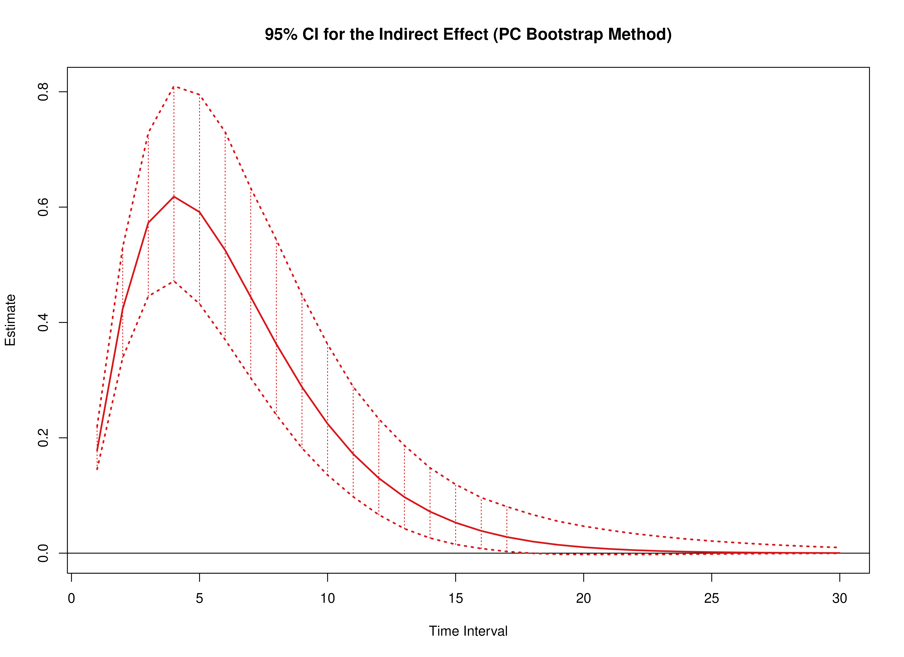

``` r
plot(pb, type = "bc")
```


``` r
summary(pb)
#>      effect interval           est          se    R          2.5%         97.5%
#> 1     total        1 -0.1256906920 0.028140428 1000 -0.1801518388 -7.113363e-02
#> 2    direct        1 -0.3037507224 0.038127386 1000 -0.3774063192 -2.270368e-01
#> 3  indirect        1  0.1780600303 0.018536089 1000  0.1432523109  2.145974e-01
#> 4     total        2  0.0547873238 0.031061060 1000 -0.0074557617  1.132866e-01
#> 5    direct        2 -0.3688024194 0.054268641 1000 -0.4796141745 -2.663988e-01
#> 6  indirect        2  0.4235897432 0.047104291 1000  0.3370437710  5.194298e-01
#> 7     total        3  0.2322234227 0.031797368 1000  0.1679861999  2.955050e-01
#> 8    direct        3 -0.3406933403 0.061989795 1000 -0.4767504375 -2.308756e-01
#> 9  indirect        3  0.5729167630 0.070818567 1000  0.4421212961  7.179463e-01
#> 10    total        4  0.3345715006 0.034351762 1000  0.2670805364  3.987628e-01
#> 11   direct        4 -0.2836293280 0.064290479 1000 -0.4326945137 -1.768477e-01
#> 12 indirect        4  0.6182008285 0.085363838 1000  0.4638388896  8.078558e-01
#> 13    total        5  0.3671226357 0.037264369 1000  0.2908503240  4.400036e-01
#> 14   direct        5 -0.2242547245 0.062782195 1000 -0.3749368475 -1.244992e-01
#> 15 indirect        5  0.5913773602 0.090881958 1000  0.4301184004  7.925432e-01
#> 16    total        6  0.3530953009 0.039295168 1000  0.2745499729  4.309851e-01
#> 17   direct        6 -0.1722832310 0.058829338 1000 -0.3105442987 -8.678018e-02
#> 18 indirect        6  0.5253785319 0.089362322 1000  0.3719031106  7.222961e-01
#> 19    total        7  0.3140492805 0.040163803 1000  0.2382158799  3.973580e-01
#> 20   direct        7 -0.1301149456 0.053524474 1000 -0.2644227596 -5.846438e-02
#> 21 indirect        7  0.4441642261 0.083184795 1000  0.3061711259  6.287706e-01
#> 22    total        8  0.2652310175 0.040107314 1000  0.1912283471  3.472919e-01
#> 23   direct        8 -0.0972392485 0.047663596 1000 -0.2173325537 -3.662553e-02
#> 24 indirect        8  0.3624702660 0.074526633 1000  0.2445676317  5.314584e-01
#> 25    total        9  0.2159203686 0.039477300 1000  0.1435903527  2.968170e-01
#> 26   direct        9 -0.0721899710 0.041780536 1000 -0.1783859972 -2.246511e-02
#> 27 indirect        9  0.2881103396 0.065121832 1000  0.1859548478  4.364725e-01
#> 28    total       10  0.1710189987 0.038495304 1000  0.1023168358  2.531248e-01
#> 29   direct       10 -0.0533669745 0.036203083 1000 -0.1480878786 -1.425802e-02
#> 30 indirect       10  0.2243859733 0.056159939 1000  0.1396677445  3.589176e-01
#> 31    total       11  0.1325971732 0.037204828 1000  0.0657924667  2.120627e-01
#> 32   direct       11 -0.0393443549 0.031109219 1000 -0.1223145494 -8.239408e-03
#> 33 indirect       11  0.1719415281 0.048284207 1000  0.0991528266  2.926096e-01
#> 34    total       12  0.1010631543 0.035556191 1000  0.0390171952  1.775650e-01
#> 35   direct       12 -0.0289549896 0.026574883 1000 -0.1018015376 -4.816476e-03
#> 36 indirect       12  0.1300181439 0.041680090 1000  0.0685814504  2.351002e-01
#> 37    total       13  0.0759493417 0.033509075 1000  0.0173517789  1.485470e-01
#> 38   direct       13 -0.0212845291 0.022610923 1000 -0.0855511895 -2.856751e-03
#> 39 indirect       13  0.0972338708 0.036229283 1000  0.0468619202  1.877012e-01
#> 40    total       14  0.0564004968 0.031085191 1000  0.0036354466  1.257965e-01
#> 41   direct       14 -0.0156342942 0.019189836 1000 -0.0713197195 -1.582171e-03
#> 42 indirect       14  0.0720347910 0.031680613 1000  0.0280827368  1.522959e-01
#> 43    total       15  0.0414557535 0.028369196 1000 -0.0058474198  1.059694e-01
#> 44   direct       15 -0.0114783446 0.016264030 1000 -0.0595755381 -8.942103e-04
#> 45 indirect       15  0.0529340981 0.027782839 1000  0.0158046628  1.225164e-01
#> 46    total       16  0.0301977504 0.025483453 1000 -0.0115322341  8.994859e-02
#> 47   direct       16 -0.0084244345 0.013777630 1000 -0.0492606524 -4.972274e-04
#> 48 indirect       16  0.0386221849 0.024351108 1000  0.0079988330  9.997888e-02
#> 49    total       17  0.0218209161 0.022558871 1000 -0.0123592438  7.617211e-02
#> 50   direct       17 -0.0061817434 0.011673676 1000 -0.0404620454 -2.430859e-04
#> 51 indirect       17  0.0280026595 0.021276618 1000  0.0026025313  8.385564e-02
#> 52    total       18  0.0156533681 0.019712812 1000 -0.0125407878  6.399652e-02
#> 53   direct       18 -0.0045354608 0.009898176 1000 -0.0337476681 -1.235968e-04
#> 54 indirect       18  0.0201888288 0.018507164 1000 -0.0006723774  6.996216e-02
#> 55    total       19  0.0111541299 0.017036693 1000 -0.0116523544  5.461324e-02
#> 56   direct       19 -0.0033273058 0.008402140 1000 -0.0282566038 -6.220678e-05
#> 57 indirect       19  0.0144814357 0.016021820 1000 -0.0024048322  5.931796e-02
#> 58    total       20  0.0078987343 0.014591906 1000 -0.0104716580  4.699150e-02
#> 59   direct       20 -0.0024408347 0.007142347 1000 -0.0236704352 -2.817096e-05
#> 60 indirect       20  0.0103395690 0.013811179 1000 -0.0027977275  5.041667e-02
#> 61    total       21  0.0055606962 0.012411423 1000 -0.0086293492  3.995258e-02
#> 62   direct       21 -0.0017904707 0.006081385 1000 -0.0195796976 -1.078980e-05
#> 63 indirect       21  0.0073511669 0.011865779 1000 -0.0030611248  4.210101e-02
#> 64    total       22  0.0038928671 0.010504584 1000 -0.0072193665  3.443445e-02
#> 65   direct       22 -0.0013133639 0.005187297 1000 -0.0161959031 -2.834903e-06
#> 66 indirect       22  0.0052062310 0.010171274 1000 -0.0029690461  3.667949e-02
#> 67    total       23  0.0027106046 0.008863117 1000 -0.0055118572  2.901394e-02
#> 68   direct       23 -0.0009633757 0.004433031 1000 -0.0133969233  1.312225e-07
#> 69 indirect       23  0.0036739804 0.008707912 1000 -0.0023696510  3.140637e-02
#> 70    total       24  0.0018774952 0.007467128 1000 -0.0043846209  2.468811e-02
#> 71   direct       24 -0.0007066455 0.003795836 1000 -0.0110817021  1.636465e-07
#> 72 indirect       24  0.0025841407 0.007452150 1000 -0.0019830281  2.646052e-02
#> 73    total       25  0.0012937263 0.006290276 1000 -0.0035140989  2.108045e-02
#> 74   direct       25 -0.0005183277 0.003256660 1000 -0.0091666334  1.393575e-07
#> 75 indirect       25  0.0018120540 0.006378909 1000 -0.0015070542  2.295002e-02
#> 76    total       26  0.0008868868 0.005303838 1000 -0.0026243453  1.800730e-02
#> 77   direct       26 -0.0003801939 0.002799595 1000 -0.0075825549  2.021467e-07
#> 78 indirect       26  0.0012670807 0.005463579 1000 -0.0012448802  1.986893e-02
#> 79    total       27  0.0006048452 0.004479547 1000 -0.0020319496  1.538333e-02
#> 80   direct       27 -0.0002788718 0.002411383 1000 -0.0062701237  6.110354e-08
#> 81 indirect       27  0.0008837170 0.004683416 1000 -0.0009833785  1.719634e-02
#> 82    total       28  0.0004103317 0.003791366 1000 -0.0015792069  1.314177e-02
#> 83   direct       28 -0.0002045518 0.002080978 1000 -0.0051948672  8.127685e-08
#> 84 indirect       28  0.0006148835 0.004018269 1000 -0.0008091148  1.483286e-02
#> 85    total       29  0.0002768726 0.003216374 1000 -0.0011483920  1.122687e-02
#> 86   direct       29 -0.0001500380 0.001799187 1000 -0.0043149343  4.381302e-08
#> 87 indirect       29  0.0004269106 0.003450771 1000 -0.0006007826  1.274706e-02
#> 88    total       30  0.0001857764 0.002735026 1000 -0.0007931109  9.591042e-03
#> 89   direct       30 -0.0001100522 0.001558350 1000 -0.0035840535  4.682694e-08
#> 90 indirect       30  0.0002958286 0.002966194 1000 -0.0004477588  1.100317e-02
summary(pb, type = "bc")
#>      effect interval           est          se    R          2.5%         97.5%
#> 1     total        1 -0.1256906920 0.028140428 1000 -0.1814599905 -7.151951e-02
#> 2    direct        1 -0.3037507224 0.038127386 1000 -0.3813371771 -2.325644e-01
#> 3  indirect        1  0.1780600303 0.018536089 1000  0.1453868485  2.187506e-01
#> 4     total        2  0.0547873238 0.031061060 1000 -0.0139373893  1.116715e-01
#> 5    direct        2 -0.3688024194 0.054268641 1000 -0.4866814098 -2.702842e-01
#> 6  indirect        2  0.4235897432 0.047104291 1000  0.3423304298  5.256379e-01
#> 7     total        3  0.2322234227 0.031797368 1000  0.1707784066  2.967301e-01
#> 8    direct        3 -0.3406933403 0.061989795 1000 -0.4794279812 -2.342282e-01
#> 9  indirect        3  0.5729167630 0.070818567 1000  0.4530095492  7.402893e-01
#> 10    total        4  0.3345715006 0.034351762 1000  0.2668532006  3.977780e-01
#> 11   direct        4 -0.2836293280 0.064290479 1000 -0.4329764877 -1.774383e-01
#> 12 indirect        4  0.6182008285 0.085363838 1000  0.4673864946  8.180845e-01
#> 13    total        5  0.3671226357 0.037264369 1000  0.2916452701  4.402615e-01
#> 14   direct        5 -0.2242547245 0.062782195 1000 -0.3769380265 -1.304044e-01
#> 15 indirect        5  0.5913773602 0.090881958 1000  0.4386605723  8.032064e-01
#> 16    total        6  0.3530953009 0.039295168 1000  0.2785690822  4.347666e-01
#> 17   direct        6 -0.1722832310 0.058829338 1000 -0.3207210092 -9.043152e-02
#> 18 indirect        6  0.5253785319 0.089362322 1000  0.3762738805  7.300857e-01
#> 19    total        7  0.3140492805 0.040163803 1000  0.2441782453  4.017077e-01
#> 20   direct        7 -0.1301149456 0.053524474 1000 -0.2659468815 -6.043015e-02
#> 21 indirect        7  0.4441642261 0.083184795 1000  0.3115394005  6.365029e-01
#> 22    total        8  0.2652310175 0.040107314 1000  0.1982054204  3.565706e-01
#> 23   direct        8 -0.0972392485 0.047663596 1000 -0.2233070278 -3.992589e-02
#> 24 indirect        8  0.3624702660 0.074526633 1000  0.2489449160  5.418970e-01
#> 25    total        9  0.2159203686 0.039477300 1000  0.1482079622  3.032903e-01
#> 26   direct        9 -0.0721899710 0.041780536 1000 -0.1878429423 -2.655563e-02
#> 27 indirect        9  0.2881103396 0.065121832 1000  0.1876035033  4.393566e-01
#> 28    total       10  0.1710189987 0.038495304 1000  0.1048109787  2.568623e-01
#> 29   direct       10 -0.0533669745 0.036203083 1000 -0.1533705576 -1.581243e-02
#> 30 indirect       10  0.2243859733 0.056159939 1000  0.1396677445  3.589176e-01
#> 31    total       11  0.1325971732 0.037204828 1000  0.0693853621  2.162886e-01
#> 32   direct       11 -0.0393443549 0.031109219 1000 -0.1272167410 -9.298232e-03
#> 33 indirect       11  0.1719415281 0.048284207 1000  0.0985798453  2.889314e-01
#> 34    total       12  0.1010631543 0.035556191 1000  0.0420442755  1.794261e-01
#> 35   direct       12 -0.0289549896 0.026574883 1000 -0.1053929857 -5.684812e-03
#> 36 indirect       12  0.1300181439 0.041680090 1000  0.0662281560  2.215512e-01
#> 37    total       13  0.0759493417 0.033509075 1000  0.0197644360  1.494953e-01
#> 38   direct       13 -0.0212845291 0.022610923 1000 -0.0871251196 -3.551074e-03
#> 39 indirect       13  0.0972338708 0.036229283 1000  0.0417642441  1.758146e-01
#> 40    total       14  0.0564004968 0.031085191 1000  0.0047291413  1.259267e-01
#> 41   direct       14 -0.0156342942 0.019189836 1000 -0.0726320284 -1.989618e-03
#> 42 indirect       14  0.0720347910 0.031680613 1000  0.0236955198  1.422786e-01
#> 43    total       15  0.0414557535 0.028369196 1000 -0.0037699249  1.078099e-01
#> 44   direct       15 -0.0114783446 0.016264030 1000 -0.0602892024 -1.011646e-03
#> 45 indirect       15  0.0529340981 0.027782839 1000  0.0117995103  1.129773e-01
#> 46    total       16  0.0301977504 0.025483453 1000 -0.0107100044  9.200866e-02
#> 47   direct       16 -0.0084244345 0.013777630 1000 -0.0506201120 -5.709341e-04
#> 48 indirect       16  0.0386221849 0.024351108 1000  0.0041338013  9.292931e-02
#> 49    total       17  0.0218209161 0.022558871 1000 -0.0120014960  7.770371e-02
#> 50   direct       17 -0.0061817434 0.011673676 1000 -0.0420899345 -3.316283e-04
#> 51 indirect       17  0.0280026595 0.021276618 1000 -0.0006589442  7.813042e-02
#> 52    total       18  0.0156533681 0.019712812 1000 -0.0120647254  6.650612e-02
#> 53   direct       18 -0.0045354608 0.009898176 1000 -0.0352743484 -1.866667e-04
#> 54 indirect       18  0.0201888288 0.018507164 1000 -0.0034257327  6.280757e-02
#> 55    total       19  0.0111541299 0.017036693 1000 -0.0111627149  5.683681e-02
#> 56   direct       19 -0.0033273058 0.008402140 1000 -0.0295901727 -8.492474e-05
#> 57 indirect       19  0.0144814357 0.016021820 1000 -0.0046055235  5.115376e-02
#> 58    total       20  0.0078987343 0.014591906 1000 -0.0098654414  4.872760e-02
#> 59   direct       20 -0.0024408347 0.007142347 1000 -0.0247519124 -4.471864e-05
#> 60 indirect       20  0.0103395690 0.013811179 1000 -0.0047740469  4.329921e-02
#> 61    total       21  0.0055606962 0.012411423 1000 -0.0085257024  4.087048e-02
#> 62   direct       21 -0.0017904707 0.006081385 1000 -0.0206655977 -2.316224e-05
#> 63 indirect       21  0.0073511669 0.011865779 1000 -0.0045989517  3.349045e-02
#> 64    total       22  0.0038928671 0.010504584 1000 -0.0072090179  3.450909e-02
#> 65   direct       22 -0.0013133639 0.005187297 1000 -0.0172810722 -9.176416e-06
#> 66 indirect       22  0.0052062310 0.010171274 1000 -0.0041089585  2.800167e-02
#> 67    total       23  0.0027106046 0.008863117 1000 -0.0055011557  2.925787e-02
#> 68   direct       23 -0.0009633757 0.004433031 1000 -0.0144689960 -4.917629e-06
#> 69 indirect       23  0.0036739804 0.008707912 1000 -0.0035159701  2.254842e-02
#> 70    total       24  0.0018774952 0.007467128 1000 -0.0043846209  2.468811e-02
#> 71   direct       24 -0.0007066455 0.003795836 1000 -0.0121507113 -2.618100e-06
#> 72 indirect       24  0.0025841407 0.007452150 1000 -0.0030455155  1.770163e-02
#> 73    total       25  0.0012937263 0.006290276 1000 -0.0035140989  2.108045e-02
#> 74   direct       25 -0.0005183277 0.003256660 1000 -0.0101198520 -1.010880e-06
#> 75 indirect       25  0.0018120540 0.006378909 1000 -0.0027179526  1.347722e-02
#> 76    total       26  0.0008868868 0.005303838 1000 -0.0026482069  1.794008e-02
#> 77   direct       26 -0.0003801939 0.002799595 1000 -0.0084380553 -7.210076e-07
#> 78 indirect       26  0.0012670807 0.005463579 1000 -0.0023340976  1.064455e-02
#> 79    total       27  0.0006048452 0.004479547 1000 -0.0020675646  1.516038e-02
#> 80   direct       27 -0.0002788718 0.002411383 1000 -0.0070356160 -2.949717e-07
#> 81 indirect       27  0.0008837170 0.004683416 1000 -0.0020007390  8.243638e-03
#> 82    total       28  0.0004103317 0.003791366 1000 -0.0016950636  1.253184e-02
#> 83   direct       28 -0.0002045518 0.002080978 1000 -0.0058893897 -4.726554e-08
#> 84 indirect       28  0.0006148835 0.004018269 1000 -0.0017039022  6.569737e-03
#> 85    total       29  0.0002768726 0.003216374 1000 -0.0012496205  1.011981e-02
#> 86   direct       29 -0.0001500380 0.001799187 1000 -0.0049290109  1.830303e-08
#> 87 indirect       29  0.0004269106 0.003450771 1000 -0.0014674992  5.093280e-03
#> 88    total       30  0.0001857764 0.002735026 1000 -0.0010159000  7.604678e-03
#> 89   direct       30 -0.0001100522 0.001558350 1000 -0.0041274689  1.189684e-08
#> 90 indirect       30  0.0002958286 0.002966194 1000 -0.0011892121  3.625347e-03
```

### Model $\eta_Y \to \eta_M \to \eta_M$

#### Delta Method


``` r
delta <- DeltaYMX(phi_hat = phi_hat)
plot(delta)
```

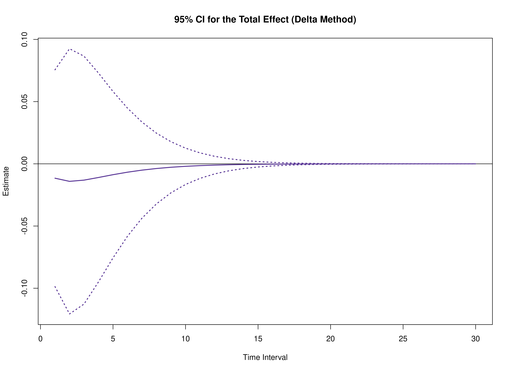

``` r
summary(delta)
#>      effect interval           est           se            z         p
#> 1     total        1 -1.155252e-02 4.446122e-02 -0.259833651 0.7949921
#> 2    direct        1 -1.156492e-02 4.435617e-02 -0.260728628 0.7943018
#> 3  indirect        1  1.240083e-05 2.871105e-04  0.043191826 0.9655486
#> 4     total        2 -1.408408e-02 5.438427e-02 -0.258973520 0.7956557
#> 5    direct        2 -1.404168e-02 5.375525e-02 -0.261215083 0.7939266
#> 6  indirect        2 -4.240204e-05 7.889860e-04 -0.053742453 0.9571404
#> 7     total        3 -1.309786e-02 5.082946e-02 -0.257682407 0.7966520
#> 8    direct        3 -1.297147e-02 4.968110e-02 -0.261094556 0.7940196
#> 9  indirect        3 -1.263934e-04 1.327836e-03 -0.095187493 0.9241659
#> 10    total        4 -1.098008e-02 4.280684e-02 -0.256502815 0.7975626
#> 11   direct        4 -1.079883e-02 4.146906e-02 -0.260406798 0.7945500
#> 12 indirect        4 -1.812500e-04 1.667480e-03 -0.108696964 0.9134428
#> 13    total        5 -8.727446e-03 3.411197e-02 -0.255847029 0.7980690
#> 14   direct        5 -8.538213e-03 3.293937e-02 -0.259209979 0.7954732
#> 15 indirect        5 -1.892332e-04 1.773180e-03 -0.106719681 0.9150114
#> 16    total        6 -6.718987e-03 2.624474e-02 -0.256012706 0.7979410
#> 17   direct        6 -6.559465e-03 2.546639e-02 -0.257573412 0.7967362
#> 18 indirect        6 -1.595224e-04 1.746925e-03 -0.091316124 0.9272414
#> 19    total        7 -5.063621e-03 1.968619e-02 -0.257216918 0.7970113
#> 20   direct        7 -4.953961e-03 1.938394e-02 -0.255570410 0.7982826
#> 21 indirect        7 -1.096601e-04 1.698556e-03 -0.064560757 0.9485237
#> 22    total        8 -3.757504e-03 1.447244e-02 -0.259631752 0.7951478
#> 23   direct        8 -3.702261e-03 1.461770e-02 -0.253272389 0.8000577
#> 24 indirect        8 -5.524344e-05 1.674953e-03 -0.032982092 0.9736889
#> 25    total        9 -2.755037e-03 1.045895e-02 -0.263414298 0.7922313
#> 26   direct        9 -2.748541e-03 1.096151e-02 -0.250744746 0.8020115
#> 27 indirect        9 -6.495647e-06 1.663364e-03 -0.003905127 0.9968842
#> 28    total       10 -2.000302e-03 7.443552e-03 -0.268729438 0.7881379
#> 29   direct       10 -2.031880e-03 8.191592e-03 -0.248044544 0.8040999
#> 30 indirect       10  3.157812e-05 1.634075e-03  0.019324772 0.9845820
#> 31    total       11 -1.440230e-03 5.222660e-03 -0.275765575 0.7827281
#> 32   direct       11 -1.497986e-03 6.108752e-03 -0.245219704 0.8062863
#> 33 indirect       11  5.775644e-05 1.569309e-03  0.036803733 0.9706415
#> 34    total       12 -1.029362e-03 3.615066e-03 -0.284742376 0.7758415
#> 35   direct       12 -1.102424e-03 4.549658e-03 -0.242309272 0.8085405
#> 36 indirect       12  7.306199e-05 1.467292e-03  0.049793757 0.9602867
#> 37    total       13 -7.308208e-04 2.469776e-03 -0.295905717 0.7673021
#> 38   direct       13 -8.103814e-04 3.385839e-03 -0.239344304 0.8108386
#> 39 indirect       13  7.956057e-05 1.336152e-03  0.059544528 0.9525184
#> 40    total       14 -5.156803e-04 1.666190e-03 -0.309496631 0.7569438
#> 41   direct       14 -5.952559e-04 2.518546e-03 -0.236349055 0.8131618
#> 42 indirect       14  7.957560e-05 1.187631e-03  0.067003615 0.9465788
#> 43    total       15 -3.617743e-04 1.110882e-03 -0.325664112 0.7446785
#> 44   direct       15 -4.370234e-04 1.872886e-03 -0.233342207 0.8154957
#> 45 indirect       15  7.524910e-05 1.033141e-03  0.072835299 0.9419372
#> 46    total       16 -2.524048e-04 7.331796e-04 -0.344260550 0.7306503
#> 47   direct       16 -3.207496e-04 1.392517e-03 -0.230338007 0.8178291
#> 48 indirect       16  6.834481e-05 8.819036e-04  0.077496918 0.9382282
#> 49    total       17 -1.751620e-04 4.806644e-04 -0.364416483 0.7155470
#> 50   direct       17 -2.353620e-04 1.035253e-03 -0.227347248 0.8201537
#> 51 indirect       17  6.020000e-05 7.404217e-04  0.081305013 0.9351994
#> 52    total       18 -1.209245e-04 3.150730e-04 -0.383798166 0.7011280
#> 53   direct       18 -1.726819e-04 7.696024e-04 -0.224378080 0.8224631
#> 54 indirect       18  5.175744e-05 6.126455e-04  0.084481879 0.9326733
#> 55    total       19 -8.305073e-05 2.088029e-04 -0.397746957 0.6908167
#> 56   direct       19 -1.266829e-04 5.720956e-04 -0.221436639 0.8247525
#> 57 indirect       19  4.363220e-05 5.004473e-04  0.087186399 0.9305234
#> 58    total       20 -5.674485e-05 1.420531e-04 -0.399462326 0.6895526
#> 59   direct       20 -9.293168e-05 4.252630e-04 -0.218527546 0.8270181
#> 60 indirect       20  3.618682e-05 4.041676e-04  0.089534194 0.9286574
#> 61    total       21 -3.856892e-05 1.006545e-04 -0.383181121 0.7015855
#> 62   direct       21 -6.816989e-05 3.161073e-04 -0.215654274 0.8292572
#> 63 indirect       21  2.960097e-05 3.231164e-04  0.091610852 0.9270072
#> 64    total       22 -2.607509e-05 7.465646e-05 -0.349267707 0.7268883
#> 65   direct       22 -5.000466e-05 2.349628e-04 -0.212819432 0.8314678
#> 66 indirect       22  2.392957e-05 2.559840e-04  0.093480722 0.9255217
#> 67    total       23 -1.753128e-05 5.749686e-05 -0.304908540 0.7604358
#> 68   direct       23 -3.667930e-05 1.746426e-04 -0.210024965 0.8336482
#> 69 indirect       23  1.914802e-05 2.011498e-04  0.095192864 0.9241616
#> 70    total       24 -1.171906e-05 4.528805e-05 -0.258767237 0.7958148
#> 71   direct       24 -2.690463e-05 1.298033e-04 -0.207272313 0.8357972
#> 72 indirect       24  1.518557e-05 1.568998e-04  0.096785125 0.9228970
#> 73    total       25 -7.786092e-06 3.597534e-05 -0.216428584 0.8286537
#> 74   direct       25 -1.973467e-05 9.647255e-05 -0.204562516 0.8379139
#> 75 indirect       25  1.194857e-05 1.215682e-04  0.098287000 0.9217044
#> 76    total       26 -5.139335e-06 2.855275e-05 -0.179994379 0.8571570
#> 77   direct       26 -1.447540e-05 7.169720e-05 -0.201896306 0.8399978
#> 78 indirect       26  9.336065e-06 9.362126e-05  0.099721642 0.9205653
#> 79    total       27 -3.368332e-06 2.252667e-05 -0.149526383 0.8811383
#> 80   direct       27 -1.061769e-05 5.328182e-05 -0.199274161 0.8420483
#> 81 indirect       27  7.249358e-06 7.169963e-05  0.101107326 0.9194653
#> 82    total       28 -2.190458e-06 1.762528e-05 -0.124279314 0.9010941
#> 83   direct       28 -7.788048e-06 3.959427e-05 -0.196696358 0.8440652
#> 84 indirect       28  5.597590e-06 5.463276e-05  0.102458493 0.9183928
#> 85    total       29 -1.412110e-06 1.366520e-05 -0.103336224 0.9176961
#> 86   direct       29 -5.712505e-06 2.942118e-05 -0.194163005 0.8460482
#> 87 indirect       29  4.300396e-06 4.143500e-05  0.103786537 0.9173388
#> 88    total       30 -9.013541e-07 1.049844e-05 -0.085856014 0.9315809
#> 89   direct       30 -4.190099e-06 2.186054e-05 -0.191674070 0.8479975
#> 90 indirect       30  3.288745e-06 3.129147e-05  0.105100370 0.9162962
#>             2.5%        97.5%
#> 1  -9.869491e-02 7.558987e-02
#> 2  -9.850141e-02 7.537156e-02
#> 3  -5.503254e-04 5.751270e-04
#> 4  -1.206753e-01 9.250712e-02
#> 5  -1.194000e-01 9.131668e-02
#> 6  -1.588786e-03 1.503982e-03
#> 7  -1.127218e-01 8.652606e-02
#> 8  -1.103446e-01 8.440171e-02
#> 9  -2.728905e-03 2.476118e-03
#> 10 -9.487995e-02 7.291979e-02
#> 11 -9.207669e-02 7.047904e-02
#> 12 -3.449450e-03 3.086950e-03
#> 13 -7.558568e-02 5.813079e-02
#> 14 -7.309819e-02 5.602176e-02
#> 15 -3.664602e-03 3.286135e-03
#> 16 -5.815773e-02 4.471976e-02
#> 17 -5.647267e-02 4.335374e-02
#> 18 -3.583432e-03 3.264387e-03
#> 19 -4.364784e-02 3.352060e-02
#> 20 -4.294578e-02 3.303786e-02
#> 21 -3.438769e-03 3.219449e-03
#> 22 -3.212296e-02 2.460795e-02
#> 23 -3.235243e-02 2.494791e-02
#> 24 -3.338090e-03 3.227603e-03
#> 25 -2.325420e-02 1.774413e-02
#> 26 -2.423271e-02 1.873563e-02
#> 27 -3.266629e-03 3.253638e-03
#> 28 -1.658940e-02 1.258879e-02
#> 29 -1.808710e-02 1.402335e-02
#> 30 -3.171150e-03 3.234306e-03
#> 31 -1.167646e-02 8.795995e-03
#> 32 -1.347092e-02 1.047495e-02
#> 33 -3.018033e-03 3.133546e-03
#> 34 -8.114761e-03 6.056036e-03
#> 35 -1.001959e-02 7.814742e-03
#> 36 -2.802778e-03 2.948902e-03
#> 37 -5.571492e-03 4.109851e-03
#> 38 -7.446504e-03 5.825742e-03
#> 39 -2.539250e-03 2.698371e-03
#> 40 -3.781353e-03 2.749993e-03
#> 41 -5.531514e-03 4.341003e-03
#> 42 -2.248139e-03 2.407290e-03
#> 43 -2.539062e-03 1.815514e-03
#> 44 -4.107813e-03 3.233766e-03
#> 45 -1.949669e-03 2.100167e-03
#> 46 -1.689410e-03 1.184601e-03
#> 47 -3.050033e-03 2.408534e-03
#> 48 -1.660154e-03 1.796844e-03
#> 49 -1.117247e-03 7.669228e-04
#> 50 -2.264421e-03 1.793697e-03
#> 51 -1.391000e-03 1.511400e-03
#> 52 -7.384563e-04 4.966074e-04
#> 53 -1.681075e-03 1.335711e-03
#> 54 -1.149006e-03 1.252521e-03
#> 55 -4.922970e-04 3.261955e-04
#> 56 -1.247970e-03 9.946039e-04
#> 57 -9.372265e-04 1.024491e-03
#> 58 -3.351638e-04 2.216741e-04
#> 59 -9.264318e-04 7.405684e-04
#> 60 -7.559671e-04 8.283408e-04
#> 61 -2.358482e-04 1.587104e-04
#> 62 -6.877288e-04 5.513891e-04
#> 63 -6.036956e-04 6.628975e-04
#> 64 -1.723991e-04 1.202489e-04
#> 65 -5.105234e-04 4.105140e-04
#> 66 -4.777898e-04 5.256490e-04
#> 67 -1.302231e-04 9.516049e-05
#> 68 -3.789725e-04 3.056139e-04
#> 69 -3.750983e-04 4.133943e-04
#> 70 -1.004820e-04 7.704388e-05
#> 71 -2.813144e-04 2.275051e-04
#> 72 -2.923324e-04 3.227035e-04
#> 73 -7.829647e-05 6.272428e-05
#> 74 -2.088174e-04 1.693481e-04
#> 75 -2.263207e-04 2.502179e-04
#> 76 -6.110170e-05 5.082303e-05
#> 77 -1.549993e-04 1.260485e-04
#> 78 -1.741582e-04 1.928304e-04
#> 79 -4.751980e-05 4.078313e-05
#> 80 -1.150481e-04 9.381276e-05
#> 81 -1.332793e-04 1.477781e-04
#> 82 -3.673537e-05 3.235445e-05
#> 83 -8.539138e-05 6.981529e-05
#> 84 -1.014807e-04 1.126758e-04
#> 85 -2.819540e-05 2.537118e-05
#> 86 -6.337697e-05 5.195195e-05
#> 87 -7.691072e-05 8.551151e-05
#> 88 -2.147791e-05 1.967521e-05
#> 89 -4.703597e-05 3.865577e-05
#> 90 -5.804140e-05 6.461889e-05
```

#### Monte Carlo Method


``` r
mc <- MCYMX(phi_hat = phi_hat, seed = seed)
plot(mc)
```


``` r
summary(mc)
#>      effect interval           est           se     R          2.5%
#> 1     total        1 -1.155252e-02 0.0450766621 20000 -0.0990919232
#> 2    direct        1 -1.156492e-02 0.0450087668 20000 -0.0972223947
#> 3  indirect        1  1.240083e-05 0.0014748635 20000 -0.0042250411
#> 4     total        2 -1.408408e-02 0.0554497249 20000 -0.1241844354
#> 5    direct        2 -1.404168e-02 0.0550795218 20000 -0.1180626904
#> 6  indirect        2 -4.240204e-05 0.0039405798 20000 -0.0118030092
#> 7     total        3 -1.309786e-02 0.0522240796 20000 -0.1202685772
#> 8    direct        3 -1.297147e-02 0.0517111445 20000 -0.1110756690
#> 9  indirect        3 -1.263934e-04 0.0061702704 20000 -0.0181241553
#> 10    total        4 -1.098008e-02 0.0444284706 20000 -0.1049248448
#> 11   direct        4 -1.079883e-02 0.0441313064 20000 -0.0969840784
#> 12 indirect        4 -1.812500e-04 0.0077625855 20000 -0.0212186277
#> 13    total        5 -8.727446e-03 0.0358651653 20000 -0.0856074927
#> 14   direct        5 -8.538213e-03 0.0361202221 20000 -0.0819461944
#> 15 indirect        5 -1.892332e-04 0.0087953252 20000 -0.0216337222
#> 16    total        6 -6.718987e-03 0.0280409654 20000 -0.0671326945
#> 17   direct        6 -6.559465e-03 0.0290529289 20000 -0.0682705760
#> 18 indirect        6 -1.595224e-04 0.0094852651 20000 -0.0198583996
#> 19    total        7 -5.063621e-03 0.0214687115 20000 -0.0503872324
#> 20   direct        7 -4.953961e-03 0.0232740415 20000 -0.0563467590
#> 21 indirect        7 -1.096601e-04 0.0099649702 20000 -0.0175140456
#> 22    total        8 -3.757504e-03 0.0162356052 20000 -0.0369771850
#> 23   direct        8 -3.702261e-03 0.0187195519 20000 -0.0469574072
#> 24 indirect        8 -5.524344e-05 0.0102546375 20000 -0.0150727514
#> 25    total        9 -2.755037e-03 0.0122447184 20000 -0.0263868686
#> 26   direct        9 -2.748541e-03 0.0151928219 20000 -0.0392840681
#> 27 indirect        9 -6.495647e-06 0.0103282732 20000 -0.0127701980
#> 28    total       10 -2.000302e-03 0.0093166897 20000 -0.0185455029
#> 29   direct       10 -2.031880e-03 0.0124807056 20000 -0.0327304252
#> 30 indirect       10  3.157812e-05 0.0101708508 20000 -0.0104025083
#> 31    total       11 -1.440230e-03 0.0072353332 20000 -0.0128948430
#> 32   direct       11 -1.497986e-03 0.0103964829 20000 -0.0273130747
#> 33 indirect       11  5.775644e-05 0.0097974716 20000 -0.0083829738
#> 34    total       12 -1.029362e-03 0.0057765204 20000 -0.0092412725
#> 35   direct       12 -1.102424e-03 0.0087905443 20000 -0.0227660937
#> 36 indirect       12  7.306199e-05 0.0092486001 20000 -0.0067880541
#> 37    total       13 -7.308208e-04 0.0047370087 20000 -0.0065721557
#> 38   direct       13 -8.103814e-04 0.0075481347 20000 -0.0191675413
#> 39 indirect       13  7.956057e-05 0.0085781132 20000 -0.0054257856
#> 40    total       14 -5.156803e-04 0.0039595266 20000 -0.0047768709
#> 41   direct       14 -5.952559e-04 0.0065830100 20000 -0.0161094720
#> 42 indirect       14  7.957560e-05 0.0078424310 20000 -0.0044426408
#> 43    total       15 -3.617743e-04 0.0033416507 20000 -0.0034921450
#> 44   direct       15 -4.370234e-04 0.0058307720 20000 -0.0134223334
#> 45 indirect       15  7.524910e-05 0.0070930749 20000 -0.0035742017
#> 46    total       16 -2.524048e-04 0.0028269755 20000 -0.0025637145
#> 47   direct       16 -3.207496e-04 0.0052432269 20000 -0.0113344913
#> 48 indirect       16  6.834481e-05 0.0063725246 20000 -0.0028811297
#> 49    total       17 -1.751620e-04 0.0023887627 20000 -0.0018800630
#> 50   direct       17 -2.353620e-04 0.0047840422 20000 -0.0095094545
#> 51 indirect       17  6.020000e-05 0.0057125325 20000 -0.0023315354
#> 52    total       18 -1.209245e-04 0.0020153851 20000 -0.0014105919
#> 53   direct       18 -1.726819e-04 0.0044255601 20000 -0.0080434717
#> 54 indirect       18  5.175744e-05 0.0051340204 20000 -0.0018930980
#> 55    total       19 -8.305073e-05 0.0017008255 20000 -0.0010579172
#> 56   direct       19 -1.266829e-04 0.0041465177 20000 -0.0068076944
#> 57 indirect       19  4.363220e-05 0.0046478780 20000 -0.0015452118
#> 58    total       20 -5.674485e-05 0.0014397439 20000 -0.0008172077
#> 59   direct       20 -9.293168e-05 0.0039304279 20000 -0.0057692385
#> 60 indirect       20  3.618682e-05 0.0042562636 20000 -0.0012565600
#> 61    total       21 -3.856892e-05 0.0012256634 20000 -0.0006459969
#> 62   direct       21 -6.816989e-05 0.0037644241 20000 -0.0048783215
#> 63 indirect       21  2.960097e-05 0.0039542656 20000 -0.0010291880
#> 64    total       22 -2.607509e-05 0.0010509857 20000 -0.0005237013
#> 65   direct       22 -5.000466e-05 0.0036384236 20000 -0.0041143651
#> 66 indirect       22  2.392957e-05 0.0037319004 20000 -0.0008331698
#> 67    total       23 -1.753128e-05 0.0009078544 20000 -0.0004306387
#> 68   direct       23 -3.667930e-05 0.0035445070 20000 -0.0034576963
#> 69 indirect       23  1.914802e-05 0.0035763224 20000 -0.0006658227
#> 70    total       24 -1.171906e-05 0.0007891357 20000 -0.0003690701
#> 71   direct       24 -2.690463e-05 0.0034764487 20000 -0.0029511770
#> 72 indirect       24  1.518557e-05 0.0034739374 20000 -0.0005438558
#> 73    total       25 -7.786092e-06 0.0006890611 20000 -0.0003209581
#> 74   direct       25 -1.973467e-05 0.0034293530 20000 -0.0024954583
#> 75 indirect       25  1.194857e-05 0.0034120502 20000 -0.0004439975
#> 76    total       26 -5.139335e-06 0.0006033943 20000 -0.0002881791
#> 77   direct       26 -1.447540e-05 0.0033993696 20000 -0.0021049203
#> 78 indirect       26  9.336065e-06 0.0033798471 20000 -0.0003639180
#> 79    total       27 -3.368332e-06 0.0005292303 20000 -0.0002547013
#> 80   direct       27 -1.061769e-05 0.0033834699 20000 -0.0017748022
#> 81 indirect       27  7.249358e-06 0.0033687536 20000 -0.0002975633
#> 82    total       28 -2.190458e-06 0.0004646283 20000 -0.0002170266
#> 83   direct       28 -7.788048e-06 0.0033792697 20000 -0.0015091745
#> 84 indirect       28  5.597590e-06 0.0033723593 20000 -0.0002436937
#> 85    total       29 -1.412110e-06 0.0004082454 20000 -0.0001834578
#> 86   direct       29 -5.712505e-06 0.0033848902 20000 -0.0012811507
#> 87 indirect       29  4.300396e-06 0.0033861192 20000 -0.0002009515
#> 88    total       30 -9.013541e-07 0.0003590597 20000 -0.0001521658
#> 89   direct       30 -4.190099e-06 0.0033988487 20000 -0.0010833878
#> 90 indirect       30  3.288745e-06 0.0034069817 20000 -0.0001663632
#>           97.5%
#> 1  0.0781222619
#> 2  0.0792662806
#> 3  0.0020032310
#> 4  0.0935027598
#> 5  0.0988202133
#> 6  0.0044038829
#> 7  0.0851064892
#> 8  0.0932953589
#> 9  0.0074423653
#> 10 0.0702879215
#> 11 0.0780846237
#> 12 0.0112608150
#> 13 0.0558335100
#> 14 0.0622351221
#> 15 0.0156243688
#> 16 0.0446650471
#> 17 0.0483389167
#> 18 0.0197675729
#> 19 0.0361614651
#> 20 0.0368825424
#> 21 0.0233798935
#> 22 0.0296534937
#> 23 0.0281567512
#> 24 0.0259947236
#> 25 0.0248617014
#> 26 0.0214321751
#> 27 0.0271836759
#> 28 0.0209040548
#> 29 0.0162568638
#> 30 0.0272756323
#> 31 0.0177299868
#> 32 0.0122934400
#> 33 0.0265848171
#> 34 0.0152823455
#> 35 0.0094009156
#> 36 0.0250429032
#> 37 0.0132099375
#> 38 0.0071365593
#> 39 0.0230729814
#> 40 0.0115810109
#> 41 0.0055340868
#> 42 0.0209143961
#> 43 0.0100240967
#> 44 0.0042938045
#> 45 0.0183039579
#> 46 0.0086229910
#> 47 0.0033747394
#> 48 0.0159047147
#> 49 0.0073369732
#> 50 0.0026024189
#> 51 0.0135570373
#> 52 0.0062047950
#> 53 0.0020602735
#> 54 0.0114081591
#> 55 0.0052249292
#> 56 0.0016315341
#> 57 0.0096441589
#> 58 0.0044055635
#> 59 0.0012972294
#> 60 0.0080979347
#> 61 0.0037098481
#> 62 0.0010180311
#> 63 0.0067877136
#> 64 0.0031044754
#> 65 0.0007992242
#> 66 0.0057146570
#> 67 0.0026008702
#> 68 0.0006361584
#> 69 0.0047989242
#> 70 0.0021906199
#> 71 0.0005016164
#> 72 0.0040748018
#> 73 0.0018568413
#> 74 0.0003975743
#> 75 0.0034172942
#> 76 0.0015695605
#> 77 0.0003136096
#> 78 0.0028906852
#> 79 0.0013335047
#> 80 0.0002482165
#> 81 0.0024810970
#> 82 0.0011336929
#> 83 0.0001970045
#> 84 0.0021199181
#> 85 0.0009619083
#> 86 0.0001590837
#> 87 0.0018210976
#> 88 0.0008282391
#> 89 0.0001267157
#> 90 0.0015695901
```

#### Parametric Bootstrap Method


``` r
pb <- BootParaYMX(boot = boot, phi_hat = phi_hat)
plot(pb)
```

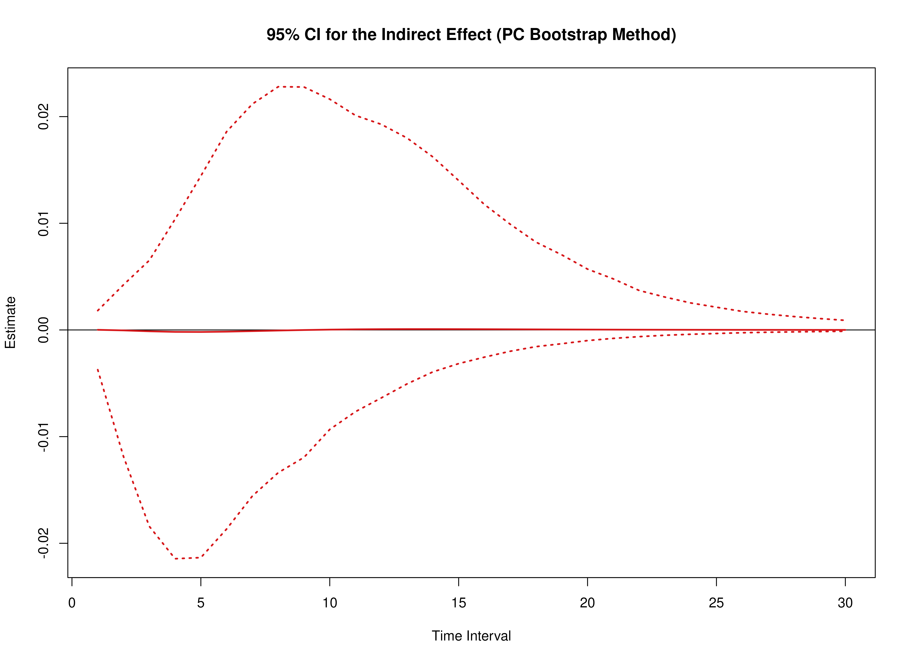

``` r
plot(pb, type = "bc")
```

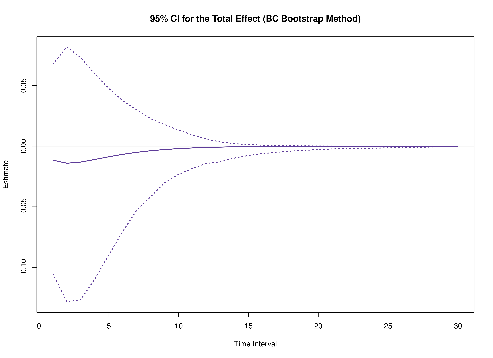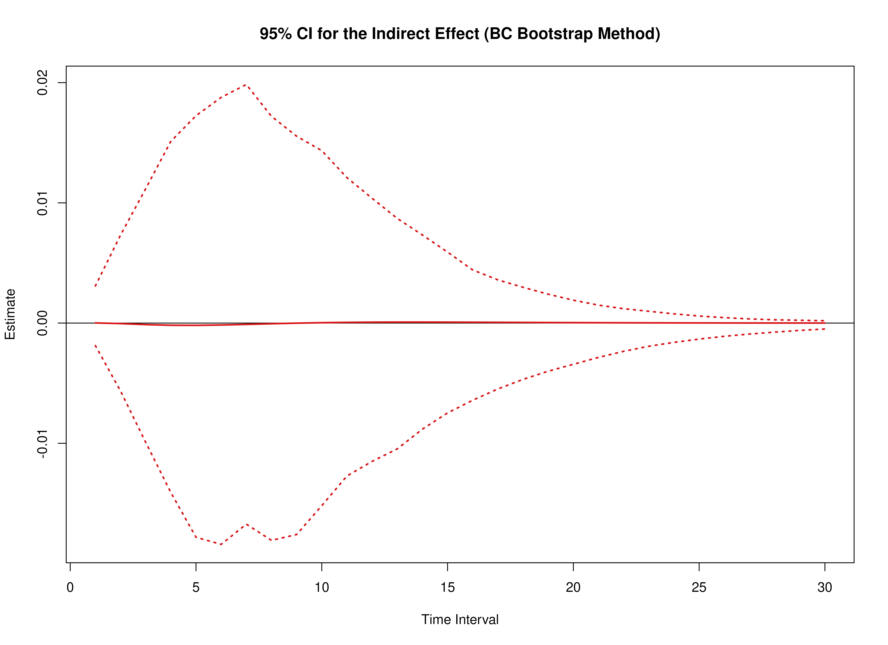

``` r
summary(pb)
#>      effect interval           est           se    R          2.5%        97.5%
#> 1     total        1 -1.155252e-02 0.0445824051 1000 -9.738771e-02 7.072135e-02
#> 2    direct        1 -1.156492e-02 0.0443222752 1000 -9.627175e-02 7.141051e-02
#> 3  indirect        1  1.240083e-05 0.0013747809 1000 -3.969434e-03 1.426370e-03
#> 4     total        2 -1.408408e-02 0.0544542070 1000 -1.176172e-01 8.649042e-02
#> 5    direct        2 -1.404168e-02 0.0534959143 1000 -1.138061e-01 8.982630e-02
#> 6  indirect        2 -4.240204e-05 0.0037029743 1000 -1.127422e-02 3.713671e-03
#> 7     total        3 -1.309786e-02 0.0509941672 1000 -1.154584e-01 7.879059e-02
#> 8    direct        3 -1.297147e-02 0.0495448833 1000 -1.046437e-01 8.045465e-02
#> 9  indirect        3 -1.263934e-04 0.0057274179 1000 -1.694243e-02 7.071401e-03
#> 10    total        4 -1.098008e-02 0.0431264787 1000 -1.017409e-01 6.503397e-02
#> 11   direct        4 -1.079883e-02 0.0417062093 1000 -9.192120e-02 6.930617e-02
#> 12 indirect        4 -1.812500e-04 0.0070966979 1000 -1.997301e-02 1.104477e-02
#> 13    total        5 -8.727446e-03 0.0345635326 1000 -8.218903e-02 5.101705e-02
#> 14   direct        5 -8.538213e-03 0.0336460050 1000 -7.666827e-02 5.514509e-02
#> 15 indirect        5 -1.892332e-04 0.0079305614 1000 -1.905763e-02 1.481966e-02
#> 16    total        6 -6.718987e-03 0.0267817685 1000 -6.379334e-02 4.042843e-02
#> 17   direct        6 -6.559465e-03 0.0266306590 1000 -6.458353e-02 4.186309e-02
#> 18 indirect        6 -1.595224e-04 0.0084338722 1000 -1.820100e-02 1.744994e-02
#> 19    total        7 -5.063621e-03 0.0202874485 1000 -4.827552e-02 3.263739e-02
#> 20   direct        7 -4.953961e-03 0.0209333194 1000 -5.262181e-02 3.157541e-02
#> 21 indirect        7 -1.096601e-04 0.0087149807 1000 -1.584019e-02 2.037936e-02
#> 22    total        8 -3.757504e-03 0.0151596055 1000 -3.538929e-02 2.658603e-02
#> 23   direct        8 -3.702261e-03 0.0164532848 1000 -4.190078e-02 2.479693e-02
#> 24 indirect        8 -5.524344e-05 0.0087893165 1000 -1.261585e-02 2.255604e-02
#> 25    total        9 -2.755037e-03 0.0112859448 1000 -2.450046e-02 2.265837e-02
#> 26   direct        9 -2.748541e-03 0.0129804424 1000 -3.403700e-02 1.823763e-02
#> 27 indirect        9 -6.495647e-06 0.0086439554 1000 -1.030263e-02 2.415758e-02
#> 28    total       10 -2.000302e-03 0.0084689416 1000 -1.739862e-02 1.961673e-02
#> 29   direct       10 -2.031880e-03 0.0103003665 1000 -2.711101e-02 1.437695e-02
#> 30 indirect       10  3.157812e-05 0.0082817592 1000 -8.579064e-03 2.320459e-02
#> 31    total       11 -1.440230e-03 0.0064784456 1000 -1.163994e-02 1.701935e-02
#> 32   direct       11 -1.497986e-03 0.0082297340 1000 -2.168725e-02 1.086762e-02
#> 33 indirect       11  5.775644e-05 0.0077322567 1000 -7.041960e-03 2.238001e-02
#> 34    total       12 -1.029362e-03 0.0050859005 1000 -8.456399e-03 1.435995e-02
#> 35   direct       12 -1.102424e-03 0.0066230065 1000 -1.726625e-02 8.426687e-03
#> 36 indirect       12  7.306199e-05 0.0070443566 1000 -5.418614e-03 2.055291e-02
#> 37    total       13 -7.308208e-04 0.0040934841 1000 -5.635440e-03 1.240835e-02
#> 38   direct       13 -8.103814e-04 0.0053686317 1000 -1.422280e-02 6.522516e-03
#> 39 indirect       13  7.956057e-05 0.0062745093 1000 -4.526693e-03 1.872072e-02
#> 40    total       14 -5.156803e-04 0.0033541642 1000 -4.154295e-03 1.075871e-02
#> 41   direct       14 -5.952559e-04 0.0043824844 1000 -1.180393e-02 4.951860e-03
#> 42 indirect       14  7.957560e-05 0.0054767429 1000 -3.557184e-03 1.660975e-02
#> 43    total       15 -3.617743e-04 0.0027744595 1000 -2.937686e-03 9.148875e-03
#> 44   direct       15 -4.370234e-04 0.0036015007 1000 -9.710695e-03 3.713797e-03
#> 45 indirect       15  7.524910e-05 0.0046963682 1000 -2.772931e-03 1.453190e-02
#> 46    total       16 -2.524048e-04 0.0023024769 1000 -1.926803e-03 7.771080e-03
#> 47   direct       16 -3.207496e-04 0.0029784124 1000 -7.804010e-03 2.884270e-03
#> 48 indirect       16  6.834481e-05 0.0039671152 1000 -2.171622e-03 1.207067e-02
#> 49    total       17 -1.751620e-04 0.0019116473 1000 -1.507496e-03 6.615041e-03
#> 50   direct       17 -2.353620e-04 0.0024776766 1000 -6.466617e-03 2.242927e-03
#> 51 indirect       17  6.020000e-05 0.0033108121 1000 -1.660524e-03 9.821579e-03
#> 52    total       18 -1.209245e-04 0.0015877729 1000 -1.060483e-03 5.627042e-03
#> 53   direct       18 -1.726819e-04 0.0020724310 1000 -5.277639e-03 1.742743e-03
#> 54 indirect       18  5.175744e-05 0.0027386509 1000 -1.336298e-03 8.062798e-03
#> 55    total       19 -8.305073e-05 0.0013213171 1000 -7.932805e-04 4.564393e-03
#> 56   direct       19 -1.266829e-04 0.0017422491 1000 -4.308419e-03 1.352643e-03
#> 57 indirect       19  4.363220e-05 0.0022532464 1000 -1.104986e-03 6.645996e-03
#> 58    total       20 -5.674485e-05 0.0011038788 1000 -6.174872e-04 3.768135e-03
#> 59   direct       20 -9.293168e-05 0.0014714960 1000 -3.526227e-03 1.052320e-03
#> 60 indirect       20  3.618682e-05 0.0018509154 1000 -8.866800e-04 5.533796e-03
#> 61    total       21 -3.856892e-05 0.0009272077 1000 -4.860035e-04 3.211610e-03
#> 62   direct       21 -6.816989e-05 0.0012481222 1000 -2.957247e-03 8.203744e-04
#> 63 indirect       21  2.960097e-05 0.0015238201 1000 -7.205114e-04 4.379220e-03
#> 64    total       22 -2.607509e-05 0.0007834214 1000 -4.079938e-04 2.749022e-03
#> 65   direct       22 -5.000466e-05 0.0010627784 1000 -2.472437e-03 6.357690e-04
#> 66 indirect       22  2.392957e-05 0.0012618005 1000 -5.828929e-04 3.659165e-03
#> 67    total       23 -1.753128e-05 0.0006655383 1000 -3.013356e-04 2.334560e-03
#> 68   direct       23 -3.667930e-05 0.0009081614 1000 -2.045878e-03 5.070896e-04
#> 69 indirect       23  1.914802e-05 0.0010538438 1000 -4.654134e-04 3.055074e-03
#> 70    total       24 -1.171906e-05 0.0005678472 1000 -2.710406e-04 1.991185e-03
#> 71   direct       24 -2.690463e-05 0.0007785283 1000 -1.691244e-03 4.130040e-04
#> 72 indirect       24  1.518557e-05 0.0008892048 1000 -3.713144e-04 2.586612e-03
#> 73    total       25 -7.786092e-06 0.0004859723 1000 -2.213824e-04 1.650601e-03
#> 74   direct       25 -1.973467e-05 0.0006693341 1000 -1.378222e-03 3.193496e-04
#> 75 indirect       25  1.194857e-05 0.0007581959 1000 -2.959783e-04 2.198936e-03
#> 76    total       26 -5.139335e-06 0.0004166980 1000 -2.117991e-04 1.416871e-03
#> 77   direct       26 -1.447540e-05 0.0005769585 1000 -1.111346e-03 2.368748e-04
#> 78 indirect       26  9.336065e-06 0.0006526574 1000 -2.380264e-04 1.841709e-03
#> 79    total       27 -3.368332e-06 0.0003576905 1000 -1.831743e-04 1.216241e-03
#> 80   direct       27 -1.061769e-05 0.0004985000 1000 -9.102438e-04 1.909439e-04
#> 81 indirect       27  7.249358e-06 0.0005661252 1000 -1.914313e-04 1.554598e-03
#> 82    total       28 -2.190458e-06 0.0003072272 1000 -1.606779e-04 1.044022e-03
#> 83   direct       28 -7.788048e-06 0.0004316186 1000 -7.401825e-04 1.474771e-04
#> 84 indirect       28  5.597590e-06 0.0004937511 1000 -1.517888e-04 1.289784e-03
#> 85    total       29 -1.412110e-06 0.0002639868 1000 -1.440958e-04 8.961904e-04
#> 86   direct       29 -5.712505e-06 0.0003744164 1000 -6.104133e-04 1.152738e-04
#> 87 indirect       29  4.300396e-06 0.0004320638 1000 -1.186129e-04 1.086323e-03
#> 88    total       30 -9.013541e-07 0.0002269102 1000 -1.216375e-04 7.643236e-04
#> 89   direct       30 -4.190099e-06 0.0003253442 1000 -5.060931e-04 8.889581e-05
#> 90 indirect       30  3.288745e-06 0.0003786650 1000 -9.416464e-05 9.294907e-04
summary(pb, type = "bc")
#>      effect interval           est           se    R          2.5%        97.5%
#> 1     total        1 -1.155252e-02 0.0445824051 1000 -0.0999087580 6.618261e-02
#> 2    direct        1 -1.156492e-02 0.0443222752 1000 -0.0978284768 6.705343e-02
#> 3  indirect        1  1.240083e-05 0.0013747809 1000 -0.0022404258 2.646603e-03
#> 4     total        2 -1.408408e-02 0.0544542070 1000 -0.1225651631 8.190680e-02
#> 5    direct        2 -1.404168e-02 0.0534959143 1000 -0.1164523202 8.686033e-02
#> 6  indirect        2 -4.240204e-05 0.0037029743 1000 -0.0049388253 7.586736e-03
#> 7     total        3 -1.309786e-02 0.0509941672 1000 -0.1185407183 7.498268e-02
#> 8    direct        3 -1.297147e-02 0.0495448833 1000 -0.1124202214 7.870790e-02
#> 9  indirect        3 -1.263934e-04 0.0057274179 1000 -0.0087767509 1.223843e-02
#> 10    total        4 -1.098008e-02 0.0431264787 1000 -0.1038742528 6.226974e-02
#> 11   direct        4 -1.079883e-02 0.0417062093 1000 -0.0941335013 6.555385e-02
#> 12 indirect        4 -1.812500e-04 0.0070966979 1000 -0.0133459916 1.464262e-02
#> 13    total        5 -8.727446e-03 0.0345635326 1000 -0.0869485566 4.882062e-02
#> 14   direct        5 -8.538213e-03 0.0336460050 1000 -0.0801979998 5.215784e-02
#> 15 indirect        5 -1.892332e-04 0.0079305614 1000 -0.0160454812 1.674664e-02
#> 16    total        6 -6.718987e-03 0.0267817685 1000 -0.0671726502 3.907999e-02
#> 17   direct        6 -6.559465e-03 0.0266306590 1000 -0.0662386071 3.934890e-02
#> 18 indirect        6 -1.595224e-04 0.0084338722 1000 -0.0166972998 1.767928e-02
#> 19    total        7 -5.063621e-03 0.0202874485 1000 -0.0511107711 3.124843e-02
#> 20   direct        7 -4.953961e-03 0.0209333194 1000 -0.0535450961 2.965634e-02
#> 21 indirect        7 -1.096601e-04 0.0087149807 1000 -0.0177032837 1.793236e-02
#> 22    total        8 -3.757504e-03 0.0151596055 1000 -0.0374618191 2.428046e-02
#> 23   direct        8 -3.702261e-03 0.0164532848 1000 -0.0429228840 2.202364e-02
#> 24 indirect        8 -5.524344e-05 0.0087893165 1000 -0.0183627888 1.763576e-02
#> 25    total        9 -2.755037e-03 0.0112859448 1000 -0.0281507488 1.904430e-02
#> 26   direct        9 -2.748541e-03 0.0129804424 1000 -0.0346371151 1.657671e-02
#> 27 indirect        9 -6.495647e-06 0.0086439554 1000 -0.0155962086 1.462638e-02
#> 28    total       10 -2.000302e-03 0.0084689416 1000 -0.0218748739 1.371520e-02
#> 29   direct       10 -2.031880e-03 0.0103003665 1000 -0.0288228289 1.251794e-02
#> 30 indirect       10  3.157812e-05 0.0082817592 1000 -0.0142054575 1.267984e-02
#> 31    total       11 -1.440230e-03 0.0064784456 1000 -0.0165084399 9.642492e-03
#> 32   direct       11 -1.497986e-03 0.0082297340 1000 -0.0235426787 9.500413e-03
#> 33 indirect       11  5.775644e-05 0.0077322567 1000 -0.0119499305 1.128122e-02
#> 34    total       12 -1.029362e-03 0.0050859005 1000 -0.0125265761 5.971452e-03
#> 35   direct       12 -1.102424e-03 0.0066230065 1000 -0.0191158368 6.885036e-03
#> 36 indirect       12  7.306199e-05 0.0070443566 1000 -0.0103292609 9.930104e-03
#> 37    total       13 -7.308208e-04 0.0040934841 1000 -0.0115025933 3.790282e-03
#> 38   direct       13 -8.103814e-04 0.0053686317 1000 -0.0161723441 5.259553e-03
#> 39 indirect       13  7.956057e-05 0.0062745093 1000 -0.0089827706 8.166289e-03
#> 40    total       14 -5.156803e-04 0.0033541642 1000 -0.0098013250 2.392641e-03
#> 41   direct       14 -5.952559e-04 0.0043824844 1000 -0.0133875881 3.863562e-03
#> 42 indirect       14  7.957560e-05 0.0054767429 1000 -0.0077830531 6.364346e-03
#> 43    total       15 -3.617743e-04 0.0027744595 1000 -0.0083240415 1.286718e-03
#> 44   direct       15 -4.370234e-04 0.0036015007 1000 -0.0109922134 2.843629e-03
#> 45 indirect       15  7.524910e-05 0.0046963682 1000 -0.0062775194 5.430323e-03
#> 46    total       16 -2.524048e-04 0.0023024769 1000 -0.0067380015 9.122924e-04
#> 47   direct       16 -3.207496e-04 0.0029784124 1000 -0.0090439417 2.157506e-03
#> 48 indirect       16  6.834481e-05 0.0039671152 1000 -0.0054662259 4.464661e-03
#> 49    total       17 -1.751620e-04 0.0019116473 1000 -0.0053760214 5.772666e-04
#> 50   direct       17 -2.353620e-04 0.0024776766 1000 -0.0075385292 1.746965e-03
#> 51 indirect       17  6.020000e-05 0.0033108121 1000 -0.0045016760 3.632382e-03
#> 52    total       18 -1.209245e-04 0.0015877729 1000 -0.0042254323 3.225853e-04
#> 53   direct       18 -1.726819e-04 0.0020724310 1000 -0.0062389799 1.319057e-03
#> 54 indirect       18  5.175744e-05 0.0027386509 1000 -0.0036819587 2.931819e-03
#> 55    total       19 -8.305073e-05 0.0013213171 1000 -0.0032604289 2.278190e-04
#> 56   direct       19 -1.266829e-04 0.0017422491 1000 -0.0051958907 1.018908e-03
#> 57 indirect       19  4.363220e-05 0.0022532464 1000 -0.0029921982 2.477338e-03
#> 58    total       20 -5.674485e-05 0.0011038788 1000 -0.0024962293 1.819898e-04
#> 59   direct       20 -9.293168e-05 0.0014714960 1000 -0.0043032188 7.023962e-04
#> 60 indirect       20  3.618682e-05 0.0018509154 1000 -0.0024886364 1.966769e-03
#> 61    total       21 -3.856892e-05 0.0009272077 1000 -0.0022852735 1.519104e-04
#> 62   direct       21 -6.816989e-05 0.0012481222 1000 -0.0035578734 5.025677e-04
#> 63 indirect       21  2.960097e-05 0.0015238201 1000 -0.0021158996 1.580183e-03
#> 64    total       22 -2.607509e-05 0.0007834214 1000 -0.0023162853 1.112196e-04
#> 65   direct       22 -5.000466e-05 0.0010627784 1000 -0.0029328380 3.897490e-04
#> 66 indirect       22  2.392957e-05 0.0012618005 1000 -0.0018291508 1.174020e-03
#> 67    total       23 -1.753128e-05 0.0006655383 1000 -0.0020516773 9.152435e-05
#> 68   direct       23 -3.667930e-05 0.0009081614 1000 -0.0024982596 2.785609e-04
#> 69 indirect       23  1.914802e-05 0.0010538438 1000 -0.0015510621 9.183721e-04
#> 70    total       24 -1.171906e-05 0.0005678472 1000 -0.0016699313 7.594249e-05
#> 71   direct       24 -2.690463e-05 0.0007785283 1000 -0.0021099256 2.067356e-04
#> 72 indirect       24  1.518557e-05 0.0008892048 1000 -0.0012823779 7.461129e-04
#> 73    total       25 -7.786092e-06 0.0004859723 1000 -0.0013810979 6.911151e-05
#> 74   direct       25 -1.973467e-05 0.0006693341 1000 -0.0017688626 1.668357e-04
#> 75 indirect       25  1.194857e-05 0.0007581959 1000 -0.0010853859 5.829457e-04
#> 76    total       26 -5.139335e-06 0.0004166980 1000 -0.0012189132 5.837568e-05
#> 77   direct       26 -1.447540e-05 0.0005769585 1000 -0.0014803785 1.189813e-04
#> 78 indirect       26  9.336065e-06 0.0006526574 1000 -0.0008877666 4.737638e-04
#> 79    total       27 -3.368332e-06 0.0003576905 1000 -0.0010393511 5.258272e-05
#> 80   direct       27 -1.061769e-05 0.0004985000 1000 -0.0013388598 8.169718e-05
#> 81 indirect       27  7.249358e-06 0.0005661252 1000 -0.0007522673 3.741201e-04
#> 82    total       28 -2.190458e-06 0.0003072272 1000 -0.0008308187 4.723625e-05
#> 83   direct       28 -7.788048e-06 0.0004316186 1000 -0.0011644737 5.929446e-05
#> 84 indirect       28  5.597590e-06 0.0004937511 1000 -0.0006286337 2.944235e-04
#> 85    total       29 -1.412110e-06 0.0002639868 1000 -0.0006325191 5.827662e-05
#> 86   direct       29 -5.712505e-06 0.0003744164 1000 -0.0010077790 4.445774e-05
#> 87 indirect       29  4.300396e-06 0.0004320638 1000 -0.0005294222 2.320452e-04
#> 88    total       30 -9.013541e-07 0.0002269102 1000 -0.0004244293 5.684449e-05
#> 89   direct       30 -4.190099e-06 0.0003253442 1000 -0.0008681979 3.441238e-05
#> 90 indirect       30  3.288745e-06 0.0003786650 1000 -0.0004305308 1.964835e-04
```

## Confidence Intervals (Standardized)

### Model $\eta_X \to \eta_M \to \eta_Y$

#### Delta Method


``` r
delta <- DeltaStdXMY(theta_hat = theta_hat)
plot(delta)
```

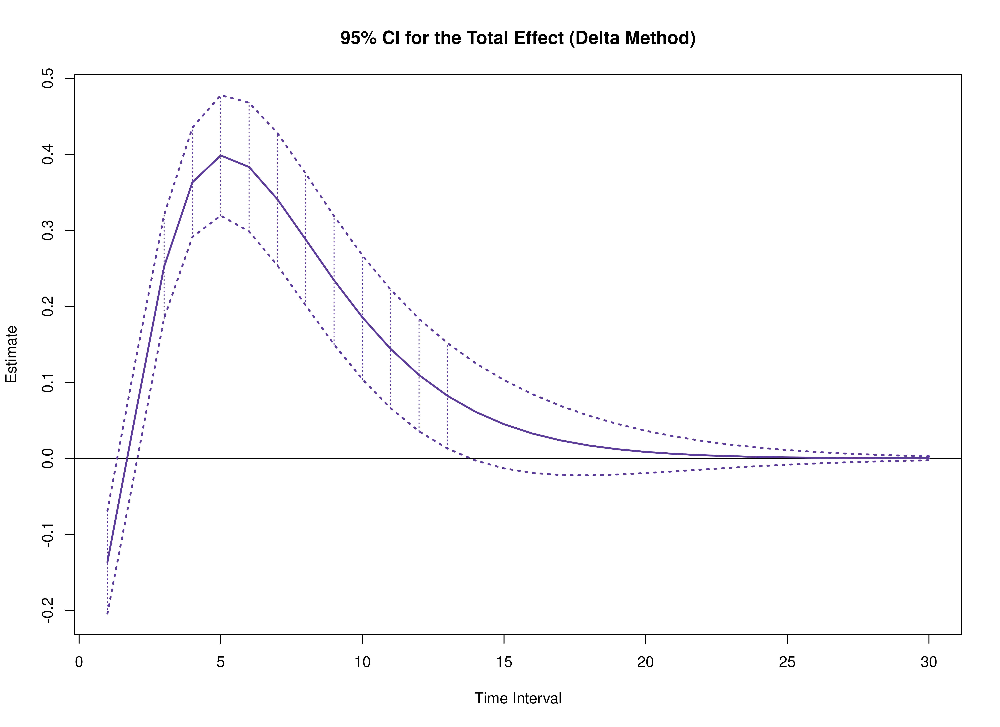

``` r
summary(delta)
#>      effect interval           est           se          z            p
#> 1     total        1 -0.1364455732 0.0344870006 -3.9564349 7.607661e-05
#> 2    direct        1 -0.3297415327 0.0484631056 -6.8039703 1.017745e-11
#> 3  indirect        1  0.1932959594 0.0232769906  8.3041645 1.005243e-16
#> 4     total        2  0.0594752696 0.0360580517  1.6494310 9.905936e-02
#> 5    direct        2 -0.4003594595 0.0681111976 -5.8780270 4.151852e-09
#> 6  indirect        2  0.4598347291 0.0575485228  7.9903828 1.345204e-15
#> 7     total        3  0.2520939102 0.0346405996  7.2774118 3.402852e-13
#> 8    direct        3 -0.3698451919 0.0765398379 -4.8320613 1.351266e-06
#> 9  indirect        3  0.6219391021 0.0851670460  7.3025792 2.823029e-13
#> 10    total        4  0.3631995292 0.0367070364  9.8945479 4.395921e-23
#> 11   direct        4 -0.3078984260 0.0779971204 -3.9475615 7.895126e-05
#> 12 indirect        4  0.6710979552 0.1017830464  6.5934159 4.298203e-11
#> 13    total        5  0.3985359430 0.0403896602  9.8672765 5.771027e-23
#> 14   direct        5 -0.2434433603 0.0747101015 -3.2585066 1.120003e-03
#> 15 indirect        5  0.6419793033 0.1076648874  5.9627546 2.480208e-09
#> 16    total        6  0.3833083417 0.0432383710  8.8650042 7.650117e-19
#> 17   direct        6 -0.1870248610 0.0685062714 -2.7300400 6.332664e-03
#> 18 indirect        6  0.5703332028 0.1051192355  5.4255836 5.776548e-08
#> 19    total        7  0.3409212998 0.0444314312  7.6729759 1.680511e-14
#> 20   direct        7 -0.1412483935 0.0608193039 -2.3224270 2.020995e-02
#> 21 indirect        7  0.4821696934 0.0969497603  4.9733975 6.578957e-07
#> 22    total        8  0.2879258411 0.0441985492  6.5143731 7.299385e-11
#> 23   direct        8 -0.1055596464 0.0526702795 -2.0041596 4.505297e-02
#> 24 indirect        8  0.3934854874 0.0857689935  4.5877359 4.480791e-06
#> 25    total        9  0.2343958649 0.0431007993  5.4383183 5.378583e-08
#> 26   direct        9 -0.0783669961 0.0447258418 -1.7521637 7.974566e-02
#> 27 indirect        9  0.3127628609 0.0737042989  4.2434819 2.200781e-05
#> 28    total       10  0.1856524532 0.0415794961  4.4650001 8.006873e-06
#> 29   direct       10 -0.0579333864 0.0373807283 -1.5498196 1.211848e-01
#> 30 indirect       10  0.2435858396 0.0622635259  3.9121755 9.146841e-05
#> 31    total       11  0.1439430161 0.0398077916  3.6159508 2.992472e-04
#> 32   direct       11 -0.0427109039 0.0308353509 -1.3851279 1.660134e-01
#> 33 indirect       11  0.1866539200 0.0523077123  3.5683824 3.591920e-04
#> 34    total       12  0.1097107495 0.0377664676  2.9049778 3.672792e-03
#> 35   direct       12 -0.0314325594 0.0251591354 -1.2493497 2.115372e-01
#> 36 indirect       12  0.1411433089 0.0441217139  3.1989535 1.379274e-03
#> 37    total       13  0.0824480421 0.0353888033  2.3297776 1.981791e-02
#> 38   direct       13 -0.0231057664 0.0203386285 -1.1360533 2.559343e-01
#> 39 indirect       13  0.1055538085 0.0375692693  2.8095784 4.960643e-03
#> 40    total       14  0.0612264758 0.0326578636  1.8747851 6.082229e-02
#> 41   direct       14 -0.0169720621 0.0163122160 -1.0404510 2.981304e-01
#> 42 indirect       14  0.0781985380 0.0322964873  2.4212707 1.546636e-02
#> 43    total       15  0.0450029669 0.0296310645  1.5187766 1.288187e-01
#> 44   direct       15 -0.0124605035 0.0129940534 -0.9589389 3.375895e-01
#> 45 indirect       15  0.0574634704 0.0279196916  2.0581700 3.957382e-02
#> 46    total       16  0.0327816587 0.0264199814  1.2407904 2.146832e-01
#> 47   direct       16 -0.0091452818 0.0102897788 -0.8887734 3.741249e-01
#> 48 indirect       16  0.0419269404 0.0241397628  1.7368414 8.241516e-02
#> 49    total       17  0.0236880501 0.0231574722  1.0229117 3.063496e-01
#> 50   direct       17 -0.0067106920 0.0081062363 -0.8278431 4.077593e-01
#> 51 indirect       17  0.0303987420 0.0207730349  1.4633751 1.433648e-01
#> 52    total       18  0.0169927681 0.0199700303  0.8509135 3.948174e-01
#> 53   direct       18 -0.0049235432 0.0063570128 -0.7745058 4.386317e-01
#> 54 indirect       18  0.0219163112 0.0177301749  1.2361024 2.164205e-01
#> 55    total       19  0.0121085470 0.0169609111  0.7139090 4.752835e-01
#> 56   direct       19 -0.0036120109 0.0049651626 -0.7274708 4.669376e-01
#> 57 indirect       19  0.0157205578 0.0149795125  1.0494706 2.939616e-01
#> 58    total       20  0.0085745994 0.0142032098  0.6037086 5.460374e-01
#> 59   direct       20 -0.0026496878 0.0038641302 -0.6857139 4.928935e-01
#> 60 indirect       20  0.0112242872 0.0125156183  0.8968224 3.698137e-01
#> 61    total       21  0.0060365041 0.0117399440  0.5141851 6.071226e-01
#> 62   direct       21 -0.0019436746 0.0029975812 -0.6484143 5.167170e-01
#> 63 indirect       21  0.0079801787 0.0103391536  0.7718406 4.402088e-01
#> 64    total       22  0.0042259651 0.0095881447  0.4407490 6.593947e-01
#> 65   direct       22 -0.0014257435 0.0023186269 -0.6149085 5.386151e-01
#> 66 indirect       22  0.0056517086 0.0084466991  0.6691026 5.034300e-01
#> 67    total       23  0.0029425409 0.0077446509  0.3799449 7.039863e-01
#> 68   direct       23 -0.0010458082 0.0017887602 -0.5846553 5.587795e-01
#> 69 indirect       23  0.0039883491 0.0068272821  0.5841782 5.591005e-01
#> 70    total       24  0.0020381454 0.0061920995  0.3291526 7.420404e-01
#> 71   direct       24 -0.0007671105 0.0013766999 -0.5572097 5.773842e-01
#> 72 indirect       24  0.0028052560 0.0054626322  0.5135356 6.075767e-01
#> 73    total       25  0.0014044256 0.0049042685  0.2863680 7.745963e-01
#> 74   direct       25 -0.0005626791 0.0010572644 -0.5322028 5.945855e-01
#> 75 indirect       25  0.0019671047 0.0043290993  0.4543912 6.495473e-01
#> 76    total       26  0.0009627744 0.0038504020  0.2500452 8.025524e-01
#> 77   direct       26 -0.0004127257 0.0008103357 -0.5093268 6.105232e-01
#> 78 indirect       26  0.0013755001 0.0033999988  0.4045590 6.858017e-01
#> 79    total       27  0.0006565995 0.0029984424  0.2189802 8.266655e-01
#> 80   direct       27 -0.0003027338 0.0006199460 -0.4883229 6.253211e-01
#> 81 indirect       27  0.0009593334 0.0026477455  0.3623208 7.171123e-01
#> 82    total       28  0.0004454423 0.0023172654  0.1922276 8.475640e-01
#> 83   direct       28 -0.0002220545 0.0004734919 -0.4689721 6.390896e-01
#> 84 indirect       28  0.0006674968 0.0020455148  0.3263221 7.441806e-01
#> 85    total       29  0.0003005636 0.0017780844  0.1690379 8.657669e-01
#> 86   direct       29 -0.0001628762 0.0003610741 -0.4510879 6.519262e-01
#> 87 indirect       29  0.0004634398 0.0015683779  0.2954899 7.676197e-01
#> 88    total       30  0.0002016726 0.0013552143  0.1488123 8.817017e-01
#> 89   direct       30 -0.0001194690 0.0002749506 -0.4345108 6.639176e-01
#> 90 indirect       30  0.0003211416 0.0011939697  0.2689696 7.879531e-01
#>             2.5%         97.5%
#> 1  -0.2040388524 -0.0688522940
#> 2  -0.4247274742 -0.2347555911
#> 3   0.1476738961  0.2389180227
#> 4  -0.0111972131  0.1301477524
#> 5  -0.5338549537 -0.2668639653
#> 6   0.3470416970  0.5726277612
#> 7   0.1841995825  0.3199882379
#> 8  -0.5198605175 -0.2198298663
#> 9   0.4550147593  0.7888634449
#> 10  0.2912550600  0.4351439985
#> 11 -0.4607699729 -0.1550268791
#> 12  0.4716068501  0.8705890603
#> 13  0.3193736637  0.4776982223
#> 14 -0.3898724686 -0.0970142520
#> 15  0.4309600015  0.8529986051
#> 16  0.2985626918  0.4680539917
#> 17 -0.3212946857 -0.0527550364
#> 18  0.3643032870  0.7763631185
#> 19  0.2538372949  0.4280053048
#> 20 -0.2604520388 -0.0220447483
#> 21  0.2921516549  0.6721877318
#> 22  0.2012982765  0.3745534057
#> 23 -0.2087914972 -0.0023277955
#> 24  0.2253813491  0.5615896258
#> 25  0.1499198505  0.3188718793
#> 26 -0.1660280351  0.0092940430
#> 27  0.1683050896  0.4572206323
#> 28  0.1041581383  0.2671467681
#> 29 -0.1311982676  0.0153314948
#> 30  0.1215515712  0.3656201080
#> 31  0.0659211782  0.2219648540
#> 32 -0.1031470812  0.0177252734
#> 33  0.0841326877  0.2891751522
#> 34  0.0356898332  0.1837316658
#> 35 -0.0807435588  0.0178784399
#> 36  0.0546663388  0.2276202790
#> 37  0.0130872622  0.1518088219
#> 38 -0.0629687458  0.0167572130
#> 39  0.0319193937  0.1791882232
#> 40 -0.0027817606  0.1252347123
#> 41 -0.0489434179  0.0149992937
#> 42  0.0148985861  0.1414984898
#> 43 -0.0130728524  0.1030787862
#> 44 -0.0379283802  0.0130073733
#> 45  0.0027418805  0.1121850603
#> 46 -0.0190005533  0.0845638707
#> 47 -0.0293128776  0.0110223141
#> 48 -0.0053861252  0.0892400061
#> 49 -0.0216997615  0.0690758616
#> 50 -0.0225986232  0.0091772392
#> 51 -0.0103156582  0.0711131423
#> 52 -0.0221477722  0.0561333083
#> 53 -0.0173830592  0.0075359729
#> 54 -0.0128341930  0.0566668154
#> 55 -0.0211342280  0.0453513219
#> 56 -0.0133435508  0.0061195290
#> 57 -0.0136387472  0.0450798628
#> 58 -0.0192631802  0.0364123790
#> 59 -0.0102232438  0.0049238683
#> 60 -0.0133058739  0.0357544483
#> 61 -0.0169733632  0.0290463714
#> 62 -0.0078188257  0.0039314765
#> 63 -0.0122841900  0.0282445473
#> 64 -0.0145664532  0.0230183835
#> 65 -0.0059701687  0.0031186817
#> 66 -0.0109035173  0.0222069346
#> 67 -0.0122366960  0.0181217778
#> 68 -0.0045517137  0.0024600973
#> 69 -0.0093928779  0.0173695760
#> 70 -0.0100981465  0.0141744374
#> 71 -0.0034653928  0.0019311717
#> 72 -0.0079013064  0.0135118183
#> 73 -0.0082077640  0.0110166153
#> 74 -0.0026348791  0.0015095210
#> 75 -0.0065177741  0.0104519835
#> 76 -0.0065838749  0.0085094236
#> 77 -0.0020009546  0.0011755031
#> 78 -0.0052883750  0.0080393752
#> 79 -0.0052202397  0.0065334388
#> 80 -0.0015178057  0.0009123381
#> 81 -0.0042301525  0.0061488193
#> 82 -0.0040963145  0.0049871990
#> 83 -0.0011500816  0.0007059726
#> 84 -0.0033416385  0.0046766321
#> 85 -0.0031844177  0.0037855449
#> 86 -0.0008705684  0.0005448161
#> 87 -0.0026105244  0.0035374039
#> 88 -0.0024544986  0.0028578438
#> 89 -0.0006583622  0.0004194242
#> 90 -0.0020189961  0.0026612792
```

#### Monte Carlo Method


``` r
mc <- MCStdXMY(theta_hat = theta_hat, seed = seed)
plot(mc)
```


``` r
summary(mc)
#>      effect interval           est          se     R          2.5%
#> 1     total        1 -0.1364455732 0.034991098 20000 -0.2078373529
#> 2    direct        1 -0.3297415327 0.049422454 20000 -0.4315346086
#> 3  indirect        1  0.1932959594 0.023566517 20000  0.1493138688
#> 4     total        2  0.0594752696 0.036488158 20000 -0.0153256108
#> 5    direct        2 -0.4003594595 0.070137974 20000 -0.5525144959
#> 6  indirect        2  0.4598347291 0.058698512 20000  0.3551175854
#> 7     total        3  0.2520939102 0.034864640 20000  0.1822741532
#> 8    direct        3 -0.3698451919 0.080015618 20000 -0.5540782771
#> 9  indirect        3  0.6219391021 0.087834889 20000  0.4742520519
#> 10    total        4  0.3631995292 0.036849678 20000  0.2924783162
#> 11   direct        4 -0.3078984260 0.083406346 20000 -0.5108772738
#> 12 indirect        4  0.6710979552 0.106589297 20000  0.5024493987
#> 13    total        5  0.3985359430 0.040652282 20000  0.3247080507
#> 14   direct        5 -0.2434433603 0.082374417 20000 -0.4536821951
#> 15 indirect        5  0.6419793033 0.114947664 20000  0.4702363144
#> 16    total        6  0.3833083417 0.043754650 20000  0.3070340142
#> 17   direct        6 -0.1870248610 0.078504778 20000 -0.3954255311
#> 18 indirect        6  0.5703332028 0.114848328 20000  0.4095235989
#> 19    total        7  0.3409212998 0.045252584 20000  0.2648408177
#> 20   direct        7 -0.1412483935 0.073025383 20000 -0.3407462892
#> 21 indirect        7  0.4821696934 0.108788088 20000  0.3394230846
#> 22    total        8  0.2879258411 0.045315000 20000  0.2142290317
#> 23   direct        8 -0.1055596464 0.066820704 20000 -0.2931256135
#> 24 indirect        8  0.3934854874 0.099179019 20000  0.2690709067
#> 25    total        9  0.2343958649 0.044471555 20000  0.1625752809
#> 26   direct        9 -0.0783669961 0.060485100 20000 -0.2510833388
#> 27 indirect        9  0.3127628609 0.088048927 20000  0.2079578166
#> 28    total       10  0.1856524532 0.043162042 20000  0.1162086466
#> 29   direct       10 -0.0579333864 0.054390154 20000 -0.2153625086
#> 30 indirect       10  0.2435858396 0.076894558 20000  0.1556326919
#> 31    total       11  0.1439430161 0.041576146 20000  0.0770384052
#> 32   direct       11 -0.0427109039 0.048746778 20000 -0.1838620074
#> 33 indirect       11  0.1866539200 0.066649100 20000  0.1130759641
#> 34    total       12  0.1097107495 0.039711641 20000  0.0452800874
#> 35   direct       12 -0.0314325594 0.043655742 20000 -0.1566442465
#> 36 indirect       12  0.1411433089 0.057748028 20000  0.0788667560
#> 37    total       13  0.0824480421 0.037508416 20000  0.0219176985
#> 38   direct       13 -0.0231057664 0.039146047 20000 -0.1345384480
#> 39 indirect       13  0.1055538085 0.050261409 20000  0.0524446228
#> 40    total       14  0.0612264758 0.034945748 20000  0.0056040374
#> 41   direct       14 -0.0169720621 0.035202665 20000 -0.1150580032
#> 42 indirect       14  0.0781985380 0.044048621 20000  0.0327609539
#> 43    total       15  0.0450029669 0.032072607 20000 -0.0058788156
#> 44   direct       15 -0.0124605035 0.031785753 20000 -0.0982194090
#> 45 indirect       15  0.0574634704 0.038892270 20000  0.0190239591
#> 46    total       16  0.0327816587 0.028993027 20000 -0.0120634312
#> 47   direct       16 -0.0091452818 0.028843412 20000 -0.0841504476
#> 48 indirect       16  0.0419269404 0.034584302 20000  0.0097667293
#> 49    total       17  0.0236880501 0.025836064 20000 -0.0148009847
#> 50   direct       17 -0.0067106920 0.026319797 20000 -0.0722251981
#> 51 indirect       17  0.0303987420 0.030961751 20000  0.0036101288
#> 52    total       18  0.0169927681 0.022728366 20000 -0.0154860134
#> 53   direct       18 -0.0049235432 0.024159997 20000 -0.0620420696
#> 54 indirect       18  0.0219163112 0.027907637 20000 -0.0001943472
#> 55    total       19  0.0121085470 0.019775979 20000 -0.0146231162
#> 56   direct       19 -0.0036120109 0.022312757 20000 -0.0532257463
#> 57 indirect       19  0.0157205578 0.025336669 20000 -0.0020962834
#> 58    total       20  0.0085745994 0.017055638 20000 -0.0133194565
#> 59   direct       20 -0.0026496878 0.020731814 20000 -0.0455406810
#> 60 indirect       20  0.0112242872 0.023179959 20000 -0.0029276890
#> 61    total       21  0.0060365041 0.014613316 20000 -0.0113574615
#> 62   direct       21 -0.0019436746 0.019376365 20000 -0.0390713256
#> 63 indirect       21  0.0079801787 0.021375283 20000 -0.0030459149
#> 64    total       22  0.0042259651 0.012467437 20000 -0.0093618627
#> 65   direct       22 -0.0014257435 0.018211019 20000 -0.0335902220
#> 66 indirect       22  0.0056517086 0.019863724 20000 -0.0028534100
#> 67    total       23  0.0029425409 0.010614515 20000 -0.0074313849
#> 68   direct       23 -0.0010458082 0.017205466 20000 -0.0288661941
#> 69 indirect       23  0.0039883491 0.018590563 20000 -0.0025035814
#> 70    total       24  0.0020381454 0.009035612 20000 -0.0057934226
#> 71   direct       24 -0.0007671105 0.016333991 20000 -0.0245503216
#> 72 indirect       24  0.0028052560 0.017507676 20000 -0.0020929306
#> 73    total       25  0.0014044256 0.007702525 20000 -0.0044948837
#> 74   direct       25 -0.0005626791 0.015574944 20000 -0.0210464235
#> 75 indirect       25  0.0019671047 0.016575358 20000 -0.0017225641
#> 76    total       26  0.0009627744 0.006583013 20000 -0.0033840531
#> 77   direct       26 -0.0004127257 0.014910197 20000 -0.0179831388
#> 78 indirect       26  0.0013755001 0.015762759 20000 -0.0013477127
#> 79    total       27  0.0006565995 0.005644745 20000 -0.0025487413
#> 80   direct       27 -0.0003027338 0.014324638 20000 -0.0154060886
#> 81 indirect       27  0.0009593334 0.015047022 20000 -0.0010834225
#> 82    total       28  0.0004454423 0.004857855 20000 -0.0019041610
#> 83   direct       28 -0.0002220545 0.013805703 20000 -0.0131734129
#> 84 indirect       28  0.0006674968 0.014411665 20000 -0.0008264481
#> 85    total       29  0.0003005636 0.004196261 20000 -0.0013960430
#> 86   direct       29 -0.0001628762 0.013342970 20000 -0.0113119172
#> 87 indirect       29  0.0004634398 0.013844790 20000 -0.0006215314
#> 88    total       30  0.0002016726 0.003638034 20000 -0.0010159622
#> 89   direct       30 -0.0001194690 0.012927801 20000 -0.0096748257
#> 90 indirect       30  0.0003211416 0.013337503 20000 -0.0004614661
#>            97.5%
#> 1  -7.022729e-02
#> 2  -2.367113e-01
#> 3   2.418280e-01
#> 4   1.267040e-01
#> 5  -2.770975e-01
#> 6   5.854145e-01
#> 7   3.185299e-01
#> 8  -2.412815e-01
#> 9   8.195278e-01
#> 10  4.373799e-01
#> 11 -1.850781e-01
#> 12  9.181567e-01
#> 13  4.843004e-01
#> 14 -1.329373e-01
#> 15  9.205153e-01
#> 16  4.784531e-01
#> 17 -9.125614e-02
#> 18  8.588052e-01
#> 19  4.415058e-01
#> 20 -6.090528e-02
#> 21  7.654345e-01
#> 22  3.909504e-01
#> 23 -3.962517e-02
#> 24  6.551271e-01
#> 25  3.373563e-01
#> 26 -2.523033e-02
#> 27  5.468551e-01
#> 28  2.866119e-01
#> 29 -1.595525e-02
#> 30  4.494650e-01
#> 31  2.410517e-01
#> 32 -9.917266e-03
#> 33  3.661131e-01
#> 34  2.012933e-01
#> 35 -6.114857e-03
#> 36  2.960791e-01
#> 37  1.692625e-01
#> 38 -3.657192e-03
#> 39  2.394135e-01
#> 40  1.427016e-01
#> 41 -2.167826e-03
#> 42  1.953933e-01
#> 43  1.198719e-01
#> 44 -1.267497e-03
#> 45  1.597108e-01
#> 46  1.017272e-01
#> 47 -7.194679e-04
#> 48  1.325475e-01
#> 49  8.645041e-02
#> 50 -4.046531e-04
#> 51  1.101881e-01
#> 52  7.351062e-02
#> 53 -2.214863e-04
#> 54  9.311858e-02
#> 55  6.228402e-02
#> 56 -1.205276e-04
#> 57  7.896397e-02
#> 58  5.288233e-02
#> 59 -6.364049e-05
#> 60  6.724753e-02
#> 61  4.505398e-02
#> 62 -3.232021e-05
#> 63  5.782323e-02
#> 64  3.825172e-02
#> 65 -1.643241e-05
#> 66  4.980618e-02
#> 67  3.265107e-02
#> 68 -8.024309e-06
#> 69  4.328525e-02
#> 70  2.783807e-02
#> 71 -3.361541e-06
#> 72  3.744309e-02
#> 73  2.363482e-02
#> 74 -1.307609e-06
#> 75  3.257179e-02
#> 76  2.024984e-02
#> 77 -4.019225e-07
#> 78  2.849622e-02
#> 79  1.727727e-02
#> 80  3.986087e-09
#> 81  2.495068e-02
#> 82  1.472298e-02
#> 83  1.247700e-07
#> 84  2.178099e-02
#> 85  1.250671e-02
#> 86  1.059859e-07
#> 87  1.890333e-02
#> 88  1.065633e-02
#> 89  8.426307e-08
#> 90  1.652079e-02
```

#### Parametric Bootstrap Method


``` r
pb <- BootParaStdXMY(boot = boot, theta_hat = theta_hat)
plot(pb)
```

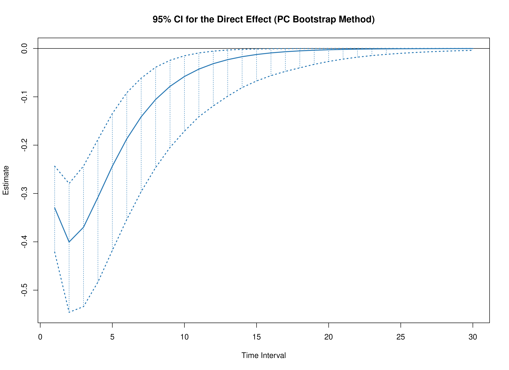

``` r
plot(pb, type = "bc")
```

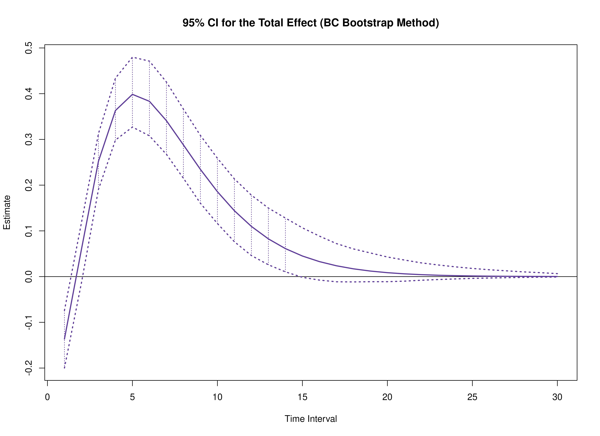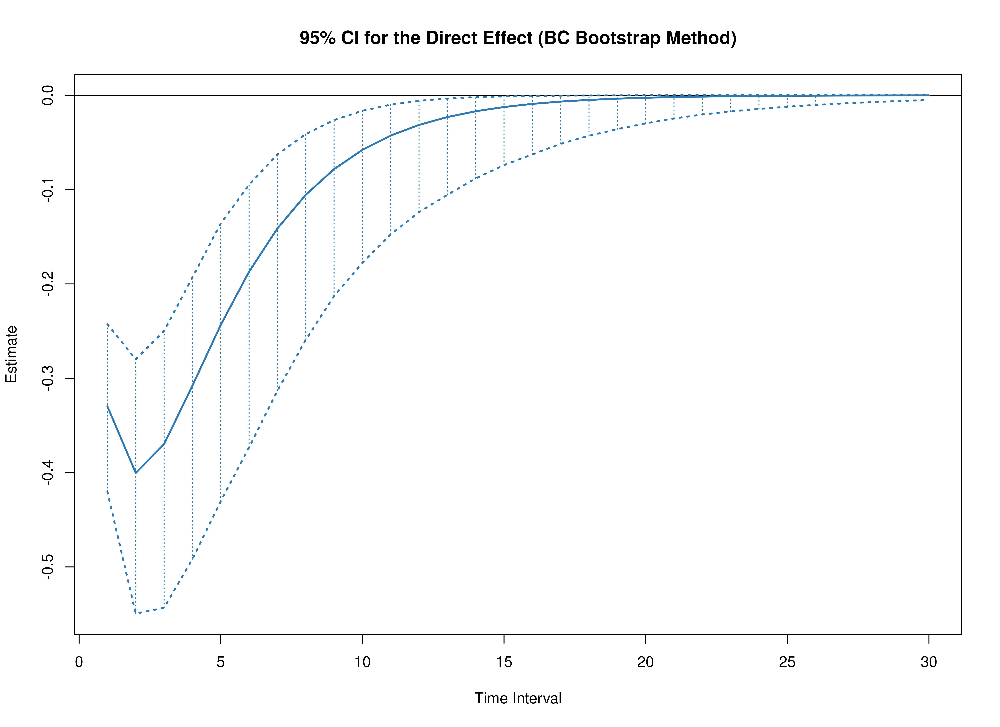

``` r
summary(pb)
#>      effect interval           est          se    R          2.5%         97.5%
#> 1     total        1 -0.1364455732 0.031613257 1000 -0.1977676066 -7.537341e-02
#> 2    direct        1 -0.3297415327 0.044684406 1000 -0.4182927355 -2.422726e-01
#> 3  indirect        1  0.1932959594 0.021826767 1000  0.1541691346  2.364506e-01
#> 4     total        2  0.0594752696 0.033227945 1000 -0.0086963975  1.216218e-01
#> 5    direct        2 -0.4003594595 0.062970846 1000 -0.5371775375 -2.825513e-01
#> 6  indirect        2  0.4598347291 0.054464928 1000  0.3592812182  5.668669e-01
#> 7     total        3  0.2520939102 0.032716953 1000  0.1864159913  3.164689e-01
#> 8    direct        3 -0.3698451919 0.071118290 1000 -0.5293022571 -2.436000e-01
#> 9  indirect        3  0.6219391021 0.080698163 1000  0.4780733643  7.959047e-01
#> 10    total        4  0.3631995292 0.034840650 1000  0.2927501510  4.277173e-01
#> 11   direct        4 -0.3078984260 0.073091261 1000 -0.4797078876 -1.876850e-01
#> 12 indirect        4  0.6710979552 0.096301477 1000  0.5054918779  8.885594e-01
#> 13    total        5  0.3985359430 0.037798856 1000  0.3212078443  4.677103e-01
#> 14   direct        5 -0.2434433603 0.070899691 1000 -0.4140882830 -1.322607e-01
#> 15 indirect        5  0.6419793033 0.101776166 1000  0.4683899223  8.693775e-01
#> 16    total        6  0.3833083417 0.040003145 1000  0.3044861843  4.582549e-01
#> 17   direct        6 -0.1870248610 0.066112039 1000 -0.3447315505 -9.143329e-02
#> 18 indirect        6  0.5703332028 0.099477224 1000  0.4004610456  7.912027e-01
#> 19    total        7  0.3409212998 0.041063156 1000  0.2589550423  4.191655e-01
#> 20   direct        7 -0.1412483935 0.059937035 1000 -0.2873499293 -6.003420e-02
#> 21 indirect        7  0.4821696934 0.092108648 1000  0.3313214316  6.827326e-01
#> 22    total        8  0.2879258411 0.041218845 1000  0.2091503625  3.676071e-01
#> 23   direct        8 -0.1055596464 0.053236511 1000 -0.2390926751 -3.962398e-02
#> 24 indirect        8  0.3934854874 0.082107571 1000  0.2613870729  5.769672e-01
#> 25    total        9  0.2343958649 0.040832715 1000  0.1565001791  3.124363e-01
#> 26   direct        9 -0.0783669961 0.046579022 1000 -0.1993514895 -2.583786e-02
#> 27 indirect        9  0.3127628609 0.071395343 1000  0.1998329125  4.802457e-01
#> 28    total       10  0.1856524532 0.040105058 1000  0.1112106319  2.652165e-01
#> 29   direct       10 -0.0579333864 0.040307822 1000 -0.1653496787 -1.542484e-02
#> 30 indirect       10  0.2435858396 0.061277886 1000  0.1506732293  3.872106e-01
#> 31    total       11  0.1439430161 0.039035744 1000  0.0732290844  2.238285e-01
#> 32   direct       11 -0.0427109039 0.034604737 1000 -0.1357253696 -8.873435e-03
#> 33 indirect       11  0.1866539200 0.052451587 1000  0.1053689378  3.095128e-01
#> 34    total       12  0.1097107495 0.037535919 1000  0.0422969545  1.886026e-01
#> 35   direct       12 -0.0314325594 0.029542847 1000 -0.1126441386 -5.125057e-03
#> 36 indirect       12  0.1411433089 0.045104481 1000  0.0747810999  2.506167e-01
#> 37    total       13  0.0824480421 0.035546748 1000  0.0188589173  1.599596e-01
#> 38   direct       13 -0.0231057664 0.025126586 1000 -0.0937794980 -2.990111e-03
#> 39 indirect       13  0.1055538085 0.039087630 1000  0.0501879420  2.002382e-01
#> 40    total       14  0.0612264758 0.033092499 1000  0.0042476275  1.355098e-01
#> 41   direct       14 -0.0169720621 0.021320447 1000 -0.0779740497 -1.675171e-03
#> 42 indirect       14  0.0781985380 0.034105615 1000  0.0302815686  1.605563e-01
#> 43    total       15  0.0450029669 0.030274047 1000 -0.0063452611  1.140388e-01
#> 44   direct       15 -0.0124605035 0.018068440 1000 -0.0645101858 -9.771463e-04
#> 45 indirect       15  0.0574634704 0.029865579 1000  0.0168188860  1.311993e-01
#> 46    total       16  0.0327816587 0.027235589 1000 -0.0125923956  9.675443e-02
#> 47   direct       16 -0.0091452818 0.015306588 1000 -0.0538159311 -5.070569e-04
#> 48 indirect       16  0.0419269404 0.026152037 1000  0.0085187552  1.078845e-01
#> 49    total       17  0.0236880501 0.024129731 1000 -0.0139496547  8.165902e-02
#> 50   direct       17 -0.0067106920 0.012970487 1000 -0.0447100067 -2.545197e-04
#> 51 indirect       17  0.0303987420 0.022837347 1000  0.0030392905  9.119656e-02
#> 52    total       18  0.0169927681 0.021092178 1000 -0.0142175539  6.969521e-02
#> 53   direct       18 -0.0049235432 0.010999522 1000 -0.0371721271 -1.333860e-04
#> 54 indirect       18  0.0219163112 0.019859131 1000 -0.0007243982  7.598148e-02
#> 55    total       19  0.0121085470 0.018228061 1000 -0.0128782717  5.919297e-02
#> 56   direct       19 -0.0036120109 0.009338930 1000 -0.0312064240 -6.869803e-05
#> 57 indirect       19  0.0157205578 0.017191219 1000 -0.0026893564  6.411282e-02
#> 58    total       20  0.0085745994 0.015607832 1000 -0.0113075008  5.046315e-02
#> 59   direct       20 -0.0026496878 0.007940535 1000 -0.0259538155 -2.966035e-05
#> 60 indirect       20  0.0112242872 0.014821136 1000 -0.0030612804  5.401984e-02
#> 61    total       21  0.0060365041 0.013269525 1000 -0.0094463523  4.315195e-02
#> 62   direct       21 -0.0019436746 0.006762722 1000 -0.0218213999 -1.162964e-05
#> 63 indirect       21  0.0079801787 0.012737003 1000 -0.0032732648  4.589907e-02
#> 64    total       22  0.0042259651 0.011224481 1000 -0.0075631820  3.677724e-02
#> 65   direct       22 -0.0014257435 0.005769988 1000 -0.0183827884 -2.999051e-06
#> 66 indirect       22  0.0056517086 0.010922126 1000 -0.0030355400  3.866869e-02
#> 67    total       23  0.0029425409 0.009464341 1000 -0.0060456065  3.158667e-02
#> 68   direct       23 -0.0010458082 0.004932310 1000 -0.0154860300  1.271205e-07
#> 69 indirect       23  0.0039883491 0.009354413 1000 -0.0025809570  3.324842e-02
#> 70    total       24  0.0020381454 0.007967856 1000 -0.0049728990  2.715595e-02
#> 71   direct       24 -0.0007671105 0.004224457 1000 -0.0128848834  1.574606e-07
#> 72 indirect       24  0.0028052560 0.008008125 1000 -0.0020554735  2.903781e-02
#> 73    total       25  0.0014044256 0.006706720 1000 -0.0038325439  2.331218e-02
#> 74   direct       25 -0.0005626791 0.003625309 1000 -0.0106547518  1.361406e-07
#> 75 indirect       25  0.0019671047 0.006856265 1000 -0.0015550411  2.507919e-02
#> 76    total       26  0.0009627744 0.005650046 1000 -0.0028723747  1.978127e-02
#> 77   direct       26 -0.0004127257 0.003117237 1000 -0.0088106083  1.970488e-07
#> 78 indirect       26  0.0013755001 0.005872643 1000 -0.0013378340  2.167666e-02
#> 79    total       27  0.0006565995 0.004767474 1000 -0.0022746889  1.684499e-02
#> 80   direct       27 -0.0003027338 0.002685551 1000 -0.0072856505  5.860288e-08
#> 81 indirect       27  0.0009593334 0.005033242 1000 -0.0010497487  1.848758e-02
#> 82    total       28  0.0004454423 0.004031060 1000 -0.0017464381  1.438738e-02
#> 83   direct       28 -0.0002220545 0.002318017 1000 -0.0060246351  8.372113e-08
#> 84 indirect       28  0.0006674968 0.004316874 1000 -0.0008614393  1.569272e-02
#> 85    total       29  0.0003005636 0.003416205 1000 -0.0012079512  1.228988e-02
#> 86   direct       29 -0.0001628762 0.002004448 1000 -0.0050260221  4.527545e-08
#> 87 indirect       29  0.0004634398 0.003705289 1000 -0.0006228146  1.367484e-02
#> 88    total       30  0.0002016726 0.002901919 1000 -0.0008787175  1.050387e-02
#> 89   direct       30 -0.0001194690 0.001736356 1000 -0.0042031655  5.078379e-08
#> 90 indirect       30  0.0003211416 0.003182961 1000 -0.0005090919  1.186423e-02
summary(pb, type = "bc")
#>      effect interval           est          se    R          2.5%         97.5%
#> 1     total        1 -0.1364455732 0.031613257 1000 -0.2055373750 -7.903363e-02
#> 2    direct        1 -0.3297415327 0.044684406 1000 -0.4240316465 -2.483171e-01
#> 3  indirect        1  0.1932959594 0.021826767 1000  0.1563906875  2.389411e-01
#> 4     total        2  0.0594752696 0.033227945 1000 -0.0160797477  1.182056e-01
#> 5    direct        2 -0.4003594595 0.062970846 1000 -0.5464743707 -2.856238e-01
#> 6  indirect        2  0.4598347291 0.054464928 1000  0.3709975587  5.784152e-01
#> 7     total        3  0.2520939102 0.032716953 1000  0.1887555827  3.185015e-01
#> 8    direct        3 -0.3698451919 0.071118290 1000 -0.5364998886 -2.495275e-01
#> 9  indirect        3  0.6219391021 0.080698163 1000  0.4895963348  8.105453e-01
#> 10    total        4  0.3631995292 0.034840650 1000  0.3022660506  4.357652e-01
#> 11   direct        4 -0.3078984260 0.073091261 1000 -0.4891803148 -1.945282e-01
#> 12 indirect        4  0.6710979552 0.096301477 1000  0.5170007949  9.061836e-01
#> 13    total        5  0.3985359430 0.037798856 1000  0.3277149309  4.723926e-01
#> 14   direct        5 -0.2434433603 0.070899691 1000 -0.4205944623 -1.387024e-01
#> 15 indirect        5  0.6419793033 0.101776166 1000  0.4778335017  8.808462e-01
#> 16    total        6  0.3833083417 0.040003145 1000  0.3092109985  4.633757e-01
#> 17   direct        6 -0.1870248610 0.066112039 1000 -0.3565076280 -9.513054e-02
#> 18 indirect        6  0.5703332028 0.099477224 1000  0.4072926850  7.961046e-01
#> 19    total        7  0.3409212998 0.041063156 1000  0.2683086755  4.268680e-01
#> 20   direct        7 -0.1412483935 0.059937035 1000 -0.2965977670 -6.399619e-02
#> 21 indirect        7  0.4821696934 0.092108648 1000  0.3360525019  6.891935e-01
#> 22    total        8  0.2879258411 0.041218845 1000  0.2140609882  3.748942e-01
#> 23   direct        8 -0.1055596464 0.053236511 1000 -0.2423979854 -4.233370e-02
#> 24 indirect        8  0.3934854874 0.082107571 1000  0.2641739420  5.840610e-01
#> 25    total        9  0.2343958649 0.040832715 1000  0.1622750978  3.171432e-01
#> 26   direct        9 -0.0783669961 0.046579022 1000 -0.2048413698 -2.712622e-02
#> 27 indirect        9  0.3127628609 0.071395343 1000  0.1998049690  4.792589e-01
#> 28    total       10  0.1856524532 0.040105058 1000  0.1162187168  2.683440e-01
#> 29   direct       10 -0.0579333864 0.040307822 1000 -0.1701464971 -1.688164e-02
#> 30 indirect       10  0.2435858396 0.061277886 1000  0.1467306098  3.859325e-01
#> 31    total       11  0.1439430161 0.039035744 1000  0.0769374462  2.282907e-01
#> 32   direct       11 -0.0427109039 0.034604737 1000 -0.1399554329 -1.042907e-02
#> 33 indirect       11  0.1866539200 0.052451587 1000  0.1048320902  3.065777e-01
#> 34    total       12  0.1097107495 0.037535919 1000  0.0467859189  1.915920e-01
#> 35   direct       12 -0.0314325594 0.029542847 1000 -0.1159126758 -6.153374e-03
#> 36 indirect       12  0.1411433089 0.045104481 1000  0.0699701113  2.388094e-01
#> 37    total       13  0.0824480421 0.035546748 1000  0.0210883376  1.603885e-01
#> 38   direct       13 -0.0231057664 0.025126586 1000 -0.0949589703 -3.602706e-03
#> 39 indirect       13  0.1055538085 0.039087630 1000  0.0437942557  1.890208e-01
#> 40    total       14  0.0612264758 0.033092499 1000  0.0059910969  1.384182e-01
#> 41   direct       14 -0.0169720621 0.021320447 1000 -0.0790065087 -2.010655e-03
#> 42 indirect       14  0.0781985380 0.034105615 1000  0.0251660339  1.521796e-01
#> 43    total       15  0.0450029669 0.030274047 1000 -0.0041480108  1.176979e-01
#> 44   direct       15 -0.0124605035 0.018068440 1000 -0.0662999022 -1.056653e-03
#> 45 indirect       15  0.0574634704 0.029865579 1000  0.0124225083  1.234173e-01
#> 46    total       16  0.0327816587 0.027235589 1000 -0.0115254413  9.885153e-02
#> 47   direct       16 -0.0091452818 0.015306588 1000 -0.0556591977 -6.108882e-04
#> 48 indirect       16  0.0419269404 0.026152037 1000  0.0041871145  1.009059e-01
#> 49    total       17  0.0236880501 0.024129731 1000 -0.0135631052  8.308297e-02
#> 50   direct       17 -0.0067106920 0.012970487 1000 -0.0467252536 -3.574910e-04
#> 51 indirect       17  0.0303987420 0.022837347 1000 -0.0005215904  8.339176e-02
#> 52    total       18  0.0169927681 0.021092178 1000 -0.0131579736  7.023146e-02
#> 53   direct       18 -0.0049235432 0.010999522 1000 -0.0392248528 -2.012628e-04
#> 54 indirect       18  0.0219163112 0.019859131 1000 -0.0035275080  6.770451e-02
#> 55    total       19  0.0121085470 0.018228061 1000 -0.0124169928  5.983927e-02
#> 56   direct       19 -0.0036120109 0.009338930 1000 -0.0327853822 -9.304087e-05
#> 57 indirect       19  0.0157205578 0.017191219 1000 -0.0047965767  5.615045e-02
#> 58    total       20  0.0085745994 0.015607832 1000 -0.0109150262  5.176687e-02
#> 59   direct       20 -0.0026496878 0.007940535 1000 -0.0272968997 -4.801397e-05
#> 60 indirect       20  0.0112242872 0.014821136 1000 -0.0051400092  4.585079e-02
#> 61    total       21  0.0060365041 0.013269525 1000 -0.0092732345  4.347655e-02
#> 62   direct       21 -0.0019436746 0.006762722 1000 -0.0227723455 -2.509204e-05
#> 63 indirect       21  0.0079801787 0.012737003 1000 -0.0048382727  3.740506e-02
#> 64    total       22  0.0042259651 0.011224481 1000 -0.0074813191  3.708579e-02
#> 65   direct       22 -0.0014257435 0.005769988 1000 -0.0188959647 -1.164964e-05
#> 66 indirect       22  0.0056517086 0.010922126 1000 -0.0043476483  3.108454e-02
#> 67    total       23  0.0029425409 0.009464341 1000 -0.0059796700  3.166773e-02
#> 68   direct       23 -0.0010458082 0.004932310 1000 -0.0158097339 -6.444940e-06
#> 69 indirect       23  0.0039883491 0.009354413 1000 -0.0037474297  2.531214e-02
#> 70    total       24  0.0020381454 0.007967856 1000 -0.0050220739  2.709104e-02
#> 71   direct       24 -0.0007671105 0.004224457 1000 -0.0131673146 -3.233090e-06
#> 72 indirect       24  0.0028052560 0.008008125 1000 -0.0034061883  1.920795e-02
#> 73    total       25  0.0014044256 0.006706720 1000 -0.0039219848  2.312504e-02
#> 74   direct       25 -0.0005626791 0.003625309 1000 -0.0110280862 -1.675151e-06
#> 75 indirect       25  0.0019671047 0.006856265 1000 -0.0030625413  1.437649e-02
#> 76    total       26  0.0009627744 0.005650046 1000 -0.0029464288  1.974854e-02
#> 77   direct       26 -0.0004127257 0.003117237 1000 -0.0092258037 -8.522042e-07
#> 78 indirect       26  0.0013755001 0.005872643 1000 -0.0026022866  1.118122e-02
#> 79    total       27  0.0006565995 0.004767474 1000 -0.0022915211  1.676558e-02
#> 80   direct       27 -0.0003027338 0.002685551 1000 -0.0077232096 -3.243720e-07
#> 81 indirect       27  0.0009593334 0.005033242 1000 -0.0021371797  8.814096e-03
#> 82    total       28  0.0004454423 0.004031060 1000 -0.0018347950  1.416383e-02
#> 83   direct       28 -0.0002220545 0.002318017 1000 -0.0064768096 -1.006843e-07
#> 84 indirect       28  0.0006674968 0.004316874 1000 -0.0017527889  7.053579e-03
#> 85    total       29  0.0003005636 0.003416205 1000 -0.0013530926  1.088361e-02
#> 86   direct       29 -0.0001628762 0.002004448 1000 -0.0054273108  1.774893e-08
#> 87 indirect       29  0.0004634398 0.003705289 1000 -0.0015214921  5.516800e-03
#> 88    total       30  0.0002016726 0.002901919 1000 -0.0011348896  8.229086e-03
#> 89   direct       30 -0.0001194690 0.001736356 1000 -0.0045261442  1.202977e-08
#> 90 indirect       30  0.0003211416 0.003182961 1000 -0.0012705489  3.926598e-03
```

### Model $\eta_Y \to \eta_M \to \eta_M$

#### Delta Method


``` r
delta <- DeltaStdYMX(theta_hat = theta_hat)
plot(delta)
```


``` r
summary(delta)
#>      effect interval           est           se           z            p
#> 1     total        1  3.909316e-01 0.0301423089 12.96952993 1.821439e-38
#> 2    direct        1  3.910746e-01 0.0318130176 12.29291079 9.888030e-35
#> 3  indirect        1 -1.430098e-04 0.0043397564 -0.03295341 9.737117e-01
#> 4     total        2  5.103374e-01 0.0403560142 12.64588097 1.178956e-36
#> 5    direct        2  5.095388e-01 0.0412695904 12.34659237 5.081871e-35
#> 6  indirect        2  7.985419e-04 0.0062991797  0.12676919 8.991231e-01
#> 7     total        3  5.040020e-01 0.0449964720 11.20092190 4.035123e-29
#> 8    direct        3  5.025374e-01 0.0450474596 11.15573193 6.713803e-29
#> 9  indirect        3  1.464586e-03 0.0045528069  0.32168852 7.476887e-01
#> 10    total        4  4.452000e-01 0.0462614445  9.62356431 6.358868e-22
#> 11   direct        4  4.445387e-01 0.0491049274  9.05283363 1.393054e-19
#> 12 indirect        4  6.612487e-04 0.0123124680  0.05370562 9.571697e-01
#> 13    total        5  3.702766e-01 0.0458508047  8.07568317 6.709990e-16
#> 14   direct        5  3.718598e-01 0.0552352316  6.73229415 1.670086e-11
#> 15 indirect        5 -1.583255e-03 0.0258309865 -0.06129288 9.511260e-01
#> 16    total        6  2.964921e-01 0.0450235860  6.58526094 4.540872e-11
#> 17   direct        6  3.010943e-01 0.0616475611  4.88412354 1.038899e-06
#> 18 indirect        6 -4.602242e-03 0.0398509218 -0.11548646 9.080596e-01
#> 19    total        7  2.312213e-01 0.0443158266  5.21757945 1.812765e-07
#> 20   direct        7  2.388786e-01 0.0661984874  3.60852057 3.079481e-04
#> 21 indirect        7 -7.657257e-03 0.0518503297 -0.14768001 8.825953e-01
#> 22    total        8  1.768004e-01 0.0436268372  4.05256013 5.066020e-05
#> 23   direct        8  1.870132e-01 0.0679235731  2.75328865 5.899985e-03
#> 24 indirect        8 -1.021282e-02 0.0604819729 -0.16885729 8.659089e-01
#> 25    total        9  1.331107e-01 0.0425855439  3.12572592 1.773668e-03
#> 26   direct        9  1.451059e-01 0.0668570618  2.17039003 2.997731e-02
#> 27 indirect        9 -1.199516e-02 0.0653408771 -0.18357822 8.543444e-01
#> 28    total       10  9.895651e-02 0.0408921644  2.41993810 1.552315e-02
#> 29   direct       10  1.119028e-01 0.0635407232  1.76112002 7.821809e-02
#> 30 indirect       10 -1.294633e-02 0.0666768162 -0.19416544 8.460463e-01
#> 31    total       11  7.278402e-02 0.0384544412  1.89273378 5.839328e-02
#> 32   direct       11  8.593217e-02 0.0586709527  1.46464582 1.430176e-01
#> 33 indirect       11 -1.314815e-02 0.0651056435 -0.20195094 8.399551e-01
#> 34    total       12  5.304095e-02 0.0353645644  1.49983331 1.336576e-01
#> 35   direct       12  6.579349e-02 0.0529069663  1.24356942 2.136581e-01
#> 36 indirect       12 -1.275253e-02 0.0613812738 -0.20775935 8.354169e-01
#> 37    total       13  3.833844e-02 0.0318201245  1.20484876 2.282617e-01
#> 38   direct       13  5.026946e-02 0.0467880151  1.07440901 2.826394e-01
#> 39 indirect       13 -1.193103e-02 0.0562441758 -0.21212912 8.320063e-01
#> 40    total       14  2.750793e-02 0.0280502897  0.98066458 3.267582e-01
#> 41   direct       14  3.835179e-02 0.0407129157  0.94200555 3.461898e-01
#> 42 indirect       14 -1.084387e-02 0.0503369598 -0.21542555 8.294356e-01
#> 43    total       15  1.960435e-02 0.0242666300  0.80787293 4.191637e-01
#> 44   direct       15  2.922897e-02 0.0349506911  0.83629168 4.029908e-01
#> 45 indirect       15 -9.624619e-03 0.0441691930 -0.21790343 8.275044e-01
#> 46    total       16  1.388442e-02 0.0206380241  0.67275906 5.011006e-01
#> 47   direct       16  2.225970e-02 0.0296637718  0.75040019 4.530137e-01
#> 48 indirect       16 -8.375283e-03 0.0381138236 -0.21974396 8.260706e-01
#> 49    total       17  9.775619e-03 0.0172829780  0.56562120 5.716513e-01
#> 50   direct       17  1.694322e-02 0.0249337092  0.67953069 4.968017e-01
#> 51 indirect       17 -7.167602e-03 0.0324212072 -0.22107757 8.250320e-01
#> 52    total       18  6.844225e-03 0.0142724461  0.47954114 6.315537e-01
#> 53   direct       18  1.289168e-02 0.0207845734  0.62025226 5.350917e-01
#> 54 indirect       18 -6.047454e-03 0.0272409363 -0.22199874 8.243149e-01
#> 55    total       19  4.766034e-03 0.0116378395  0.40952912 6.821514e-01
#> 56   direct       19  9.806335e-03 0.0172021853  0.57006331 5.686348e-01
#> 57 indirect       19 -5.040301e-03 0.0226453118 -0.22257590 8.238656e-01
#> 58    total       20  3.301445e-03 0.0093807066  0.35193986 7.248834e-01
#> 59   direct       20  7.457977e-03 0.0141488971  0.52710662 5.981195e-01
#> 60 indirect       20 -4.156533e-03 0.0186510096 -0.22285833 8.236458e-01
#> 61    total       21  2.275101e-03 0.0074820391  0.30407494 7.610708e-01
#> 62   direct       21  5.671217e-03 0.0115743694  0.48998066 6.241476e-01
#> 63 indirect       21 -3.396117e-03 0.0152373467 -0.22288110 8.236280e-01
#> 64    total       22  1.559764e-03 0.0059101963  0.26391068 7.918487e-01
#> 65   direct       22  4.312105e-03 0.0094230587  0.45761201 6.472312e-01
#> 66 indirect       22 -2.752341e-03 0.0123606989 -0.22266871 8.237934e-01
#> 67    total       23  1.063818e-03 0.0046271022  0.22991026 8.181615e-01
#> 68   direct       23  3.278478e-03 0.0076391595  0.42916732 6.678015e-01
#> 69 indirect       23 -2.214659e-03 0.0099652651 -0.22223788 8.241287e-01
#> 70    total       24  7.217575e-04 0.0035927523  0.20089263 8.407825e-01
#> 71   direct       24  2.492491e-03 0.0061696609  0.40399162 6.862189e-01
#> 72 indirect       24 -1.770734e-03 0.0079906878 -0.22159968 8.246255e-01
#> 73    total       25  4.870462e-04 0.0027682541  0.17593983 8.603412e-01
#> 74   direct       25  1.894871e-03 0.0049660618  0.38156421 7.027846e-01
#> 75 indirect       25 -1.407825e-03 0.0063771379 -0.22076130 8.252783e-01
#> 76    total       26  3.268255e-04 0.0021176940  0.15433083 8.773489e-01
#> 77   direct       26  1.440505e-03 0.0039851668  0.36146677 7.177505e-01
#> 78 indirect       26 -1.113680e-03 0.0050684617 -0.21972740 8.260835e-01
#> 79    total       27  2.180262e-04 0.0016091255  0.13549360 8.922216e-01
#> 80   direct       27  1.095071e-03 0.0031892790  0.34335999 7.313277e-01
#> 81 indirect       27 -8.770446e-04 0.0040139109 -0.21850127 8.270386e-01
#> 82    total       28  1.445409e-04 0.0012149357  0.11897003 9.052991e-01
#> 83   direct       28  8.324611e-04 0.0025460163  0.32696613 7.436935e-01
#> 84 indirect       28 -6.879202e-04 0.0031688870 -0.21708574 8.281415e-01
#> 85    total       29  9.518284e-05 0.0009118003  0.10439001 9.168599e-01
#> 86   direct       29  6.328222e-04 0.0020279126  0.31205595 7.549980e-01
#> 87 indirect       29 -5.376394e-04 0.0024950322 -0.21548394 8.293900e-01
#> 88    total       30  6.222295e-05 0.0006803892  0.09145200 9.271334e-01
#> 89   direct       30  4.810571e-04 0.0016119123  0.29843875 7.653683e-01
#> 90 indirect       30 -4.188341e-04 0.0019599180 -0.21369984 8.307811e-01
#>            2.5%       97.5%
#> 1   0.331853738 0.450009417
#> 2   0.328722218 0.453426956
#> 3  -0.008648776 0.008362756
#> 4   0.431241018 0.589433686
#> 5   0.428651899 0.590425721
#> 6  -0.011547623 0.013144707
#> 7   0.415810504 0.592193434
#> 8   0.414245985 0.590828782
#> 9  -0.007458752 0.010387923
#> 10  0.354529221 0.535870752
#> 11  0.348294849 0.540782627
#> 12 -0.023470745 0.024793243
#> 13  0.280410646 0.460142497
#> 14  0.263600762 0.480118892
#> 15 -0.052211059 0.049044548
#> 16  0.208247455 0.384736670
#> 17  0.180267305 0.421921304
#> 18 -0.082708613 0.073504130
#> 19  0.144363922 0.318078770
#> 20  0.109131952 0.368625255
#> 21 -0.109282036 0.093967522
#> 22  0.091293351 0.262307411
#> 23  0.053885446 0.320140960
#> 24 -0.128755311 0.108329667
#> 25  0.049644606 0.216576871
#> 26  0.014068467 0.276143333
#> 27 -0.140060927 0.116070604
#> 28  0.018809337 0.179103676
#> 29 -0.012634689 0.236440369
#> 30 -0.143630492 0.117737825
#> 31 -0.002585300 0.148153340
#> 32 -0.029060789 0.200925120
#> 33 -0.140752862 0.114456571
#> 34 -0.016272321 0.122354224
#> 35 -0.037902263 0.169489234
#> 36 -0.133057620 0.107552552
#> 37 -0.024027861 0.100704735
#> 38 -0.041433360 0.141972289
#> 39 -0.122167586 0.098305532
#> 40 -0.027469632 0.082485483
#> 41 -0.041444056 0.118147641
#> 42 -0.109502495 0.087814761
#> 43 -0.027957367 0.067166074
#> 44 -0.039273124 0.097731068
#> 45 -0.096194646 0.076945409
#> 46 -0.026565366 0.054334202
#> 47 -0.035880224 0.080399625
#> 48 -0.083077004 0.066326439
#> 49 -0.024098396 0.043649633
#> 50 -0.031925951 0.065812393
#> 51 -0.070712000 0.056376797
#> 52 -0.021129255 0.034817705
#> 53 -0.027845337 0.053628694
#> 54 -0.059438707 0.047343800
#> 55 -0.018043712 0.027575780
#> 56 -0.023909329 0.043521998
#> 57 -0.049424296 0.039343695
#> 58 -0.015084403 0.021687292
#> 59 -0.020273351 0.035189306
#> 60 -0.040711840 0.032398774
#> 61 -0.012389427 0.016939628
#> 62 -0.017014130 0.028356564
#> 63 -0.033260767 0.026468534
#> 64 -0.010024008 0.013143536
#> 65 -0.014156751 0.022780960
#> 66 -0.026978866 0.021474184
#> 67 -0.008005135 0.010132772
#> 68 -0.011694000 0.018250955
#> 69 -0.021746220 0.017316901
#> 70 -0.006319908 0.007763423
#> 71 -0.009599822 0.014584805
#> 72 -0.017432194 0.013890726
#> 73 -0.004938632 0.005912724
#> 74 -0.007838431 0.011628174
#> 75 -0.013906786 0.011091135
#> 76 -0.003823778 0.004477429
#> 77 -0.006370278 0.009251289
#> 78 -0.011047682 0.008820322
#> 79 -0.002935802 0.003371854
#> 80 -0.005155801 0.007345943
#> 81 -0.008744165 0.006990076
#> 82 -0.002236689 0.002525771
#> 83 -0.004157639 0.005822561
#> 84 -0.006898825 0.005522984
#> 85 -0.001691913 0.001882279
#> 86 -0.003341814 0.004607458
#> 87 -0.005427813 0.004352534
#> 88 -0.001271315 0.001395761
#> 89 -0.002678233 0.003640347
#> 90 -0.004260203 0.003422534
```

#### Monte Carlo Method


``` r
mc <- MCStdYMX(theta_hat = theta_hat, seed = seed)
plot(mc)
```

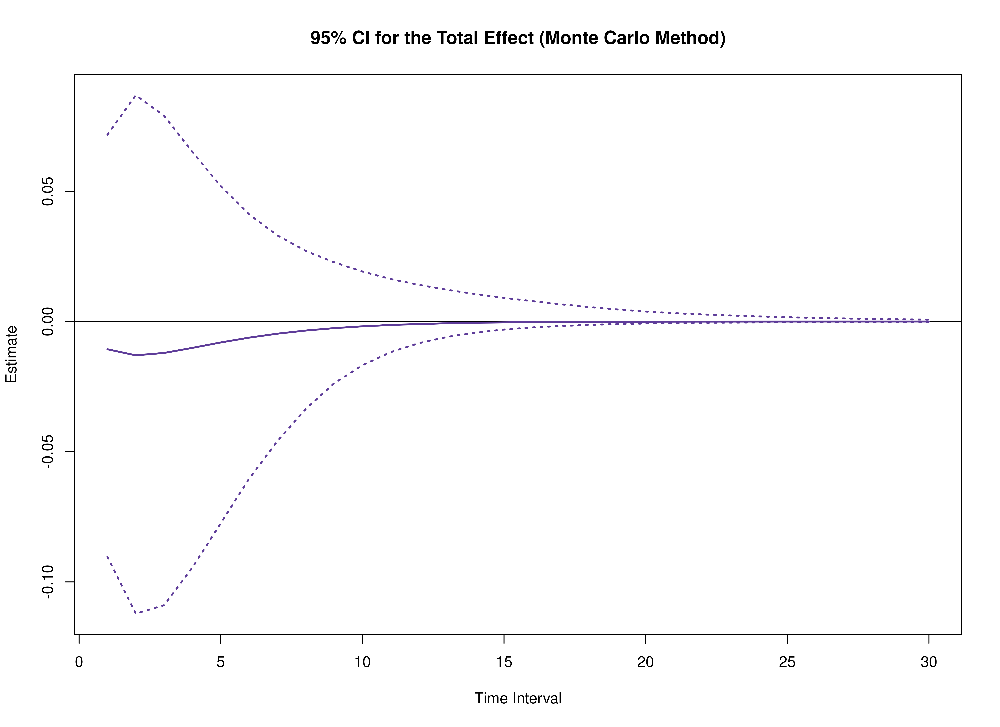

``` r
summary(mc)
#>      effect interval           est           se     R          2.5%
#> 1     total        1 -1.064193e-02 0.0412137844 20000 -0.0903676659
#> 2    direct        1 -1.065335e-02 0.0411676271 20000 -0.0886639271
#> 3  indirect        1  1.142337e-05 0.0013552845 20000 -0.0038547767
#> 4     total        2 -1.297395e-02 0.0506955441 20000 -0.1121523880
#> 5    direct        2 -1.293489e-02 0.0503988964 20000 -0.1069204842
#> 6  indirect        2 -3.905984e-05 0.0036015956 20000 -0.0106742220
#> 7     total        3 -1.206546e-02 0.0477294762 20000 -0.1089461488
#> 8    direct        3 -1.194903e-02 0.0473168354 20000 -0.1011747434
#> 9  indirect        3 -1.164308e-04 0.0056226255 20000 -0.0164375096
#> 10    total        4 -1.011461e-02 0.0405829646 20000 -0.0944772416
#> 11   direct        4 -9.947643e-03 0.0403656546 20000 -0.0890951901
#> 12 indirect        4 -1.669635e-04 0.0070611404 20000 -0.0195525770
#> 13    total        5 -8.039534e-03 0.0327413523 20000 -0.0774853334
#> 14   direct        5 -7.865216e-03 0.0330106571 20000 -0.0748434397
#> 15 indirect        5 -1.743175e-04 0.0079835555 20000 -0.0199958362
#> 16    total        6 -6.189385e-03 0.0255856629 20000 -0.0603950764
#> 17   direct        6 -6.042436e-03 0.0265146119 20000 -0.0621751947
#> 18 indirect        6 -1.469486e-04 0.0085841696 20000 -0.0183318432
#> 19    total        7 -4.664497e-03 0.0195843461 20000 -0.0459345077
#> 20   direct        7 -4.563481e-03 0.0211957578 20000 -0.0516036859
#> 21 indirect        7 -1.010165e-04 0.0089872904 20000 -0.0159089006
#> 22    total        8 -3.461331e-03 0.0148148513 20000 -0.0335972130
#> 23   direct        8 -3.410442e-03 0.0169973413 20000 -0.0427460222
#> 24 indirect        8 -5.088905e-05 0.0092168553 20000 -0.0137015807
#> 25    total        9 -2.537880e-03 0.0111853811 20000 -0.0237539629
#> 26   direct        9 -2.531896e-03 0.0137403338 20000 -0.0354016089
#> 27 indirect        9 -5.983648e-06 0.0092521121 20000 -0.0112892474
#> 28    total       10 -1.842634e-03 0.0085280660 20000 -0.0168116371
#> 29   direct       10 -1.871723e-03 0.0112297523 20000 -0.0294640367
#> 30 indirect       10  2.908908e-05 0.0090794736 20000 -0.0093091299
#> 31    total       11 -1.326708e-03 0.0066410874 20000 -0.0117506764
#> 32   direct       11 -1.379912e-03 0.0092941227 20000 -0.0246439930
#> 33 indirect       11  5.320397e-05 0.0087116678 20000 -0.0075873777
#> 34    total       12 -9.482262e-04 0.0053163947 20000 -0.0082978141
#> 35   direct       12 -1.015529e-03 0.0077955442 20000 -0.0205115596
#> 36 indirect       12  6.730311e-05 0.0081846080 20000 -0.0061212314
#> 37    total       13 -6.732162e-04 0.0043675009 20000 -0.0059045950
#> 38   direct       13 -7.465057e-04 0.0066279241 20000 -0.0172132410
#> 39 indirect       13  7.328946e-05 0.0075468245 20000 -0.0049032742
#> 40    total       14 -4.750334e-04 0.0036524313 20000 -0.0042613667
#> 41   direct       14 -5.483367e-04 0.0057114007 20000 -0.0142678921
#> 42 indirect       14  7.330331e-05 0.0068493957 20000 -0.0039145875
#> 43    total       15 -3.332586e-04 0.0030804456 20000 -0.0030808573
#> 44   direct       15 -4.025764e-04 0.0049863730 20000 -0.0120290643
#> 45 indirect       15  6.931784e-05 0.0061388844 20000 -0.0031270968
#> 46    total       16 -2.325098e-04 0.0026026091 20000 -0.0022727717
#> 47   direct       16 -2.954676e-04 0.0044083816 20000 -0.0100134115
#> 48 indirect       16  6.295775e-05 0.0054533451 20000 -0.0025492219
#> 49    total       17 -1.613554e-04 0.0021962623 20000 -0.0017078171
#> 50   direct       17 -2.168104e-04 0.0039441154 20000 -0.0083397222
#> 51 indirect       17  5.545493e-05 0.0048207016 20000 -0.0020566611
#> 52    total       18 -1.113930e-04 0.0018516713 20000 -0.0012870824
#> 53   direct       18 -1.590708e-04 0.0035684405 20000 -0.0070420534
#> 54 indirect       18  4.767783e-05 0.0042587200 20000 -0.0016658853
#> 55    total       19 -7.650453e-05 0.0015634709 20000 -0.0009790171
#> 56   direct       19 -1.166976e-04 0.0032622395 20000 -0.0060311066
#> 57 indirect       19  4.019303e-05 0.0037759560 20000 -0.0013472070
#> 58    total       20 -5.227212e-05 0.0013263176 20000 -0.0007464966
#> 59   direct       20 -8.560664e-05 0.0030108529 20000 -0.0050952335
#> 60 indirect       20  3.333451e-05 0.0033732619 20000 -0.0010870276
#> 61    total       21 -3.552885e-05 0.0011334368 20000 -0.0005847391
#> 62   direct       21 -6.279662e-05 0.0028029550 20000 -0.0042973714
#> 63 indirect       21  2.726777e-05 0.0030456143 20000 -0.0008798495
#> 64    total       22 -2.401981e-05 0.0009769039 20000 -0.0004787708
#> 65   direct       22 -4.606320e-05 0.0026297365 20000 -0.0036119949
#> 66 indirect       22  2.204340e-05 0.0027841007 20000 -0.0007013338
#> 67    total       23 -1.614944e-05 0.0008487117 20000 -0.0004033328
#> 68   direct       23 -3.378818e-05 0.0024843063 20000 -0.0030373359
#> 69 indirect       23  1.763874e-05 0.0025778753 20000 -0.0005659080
#> 70    total       24 -1.079535e-05 0.0007418526 20000 -0.0003437172
#> 71   direct       24 -2.478396e-05 0.0023612465 20000 -0.0025618773
#> 72 indirect       24  1.398861e-05 0.0024158437 20000 -0.0004591081
#> 73    total       25 -7.172379e-06 0.0006509408 20000 -0.0002972903
#> 74   direct       25 -1.817915e-05 0.0022562795 20000 -0.0021516428
#> 75 indirect       25  1.100677e-05 0.0022878664 20000 -0.0003754139
#> 76    total       26 -4.734244e-06 0.0005722740 20000 -0.0002621608
#> 77   direct       26 -1.333442e-05 0.0021660150 20000 -0.0018099702
#> 78 indirect       26  8.600180e-06 0.0021854063 20000 -0.0003045437
#> 79    total       27 -3.102834e-06 0.0005035115 20000 -0.0002304673
#> 80   direct       27 -9.780785e-06 0.0020877564 20000 -0.0015395206
#> 81 indirect       27  6.677951e-06 0.0021017049 20000 -0.0002481945
#> 82    total       28 -2.017802e-06 0.0004432130 20000 -0.0001965841
#> 83   direct       28 -7.174180e-06 0.0020193513 20000 -0.0013085775
#> 84 indirect       28  5.156378e-06 0.0020316545 20000 -0.0002023299
#> 85    total       29 -1.300805e-06 0.0003904205 20000 -0.0001654409
#> 86   direct       29 -5.262236e-06 0.0019590761 20000 -0.0011067193
#> 87 indirect       29  3.961431e-06 0.0019715300 20000 -0.0001660443
#> 88    total       30 -8.303077e-07 0.0003443666 20000 -0.0001374621
#> 89   direct       30 -3.859828e-06 0.0019055453 20000 -0.0009356131
#> 90 indirect       30  3.029520e-06 0.0019186925 20000 -0.0001364863
#>           97.5%
#> 1  0.0716936576
#> 2  0.0725556062
#> 3  0.0018833820
#> 4  0.0868975506
#> 5  0.0914420726
#> 6  0.0041574414
#> 7  0.0790351637
#> 8  0.0862204337
#> 9  0.0069647533
#> 10 0.0651437649
#> 11 0.0725500321
#> 12 0.0105079074
#> 13 0.0520155584
#> 14 0.0581300647
#> 15 0.0142524015
#> 16 0.0411661842
#> 17 0.0448837448
#> 18 0.0178502886
#> 19 0.0330759397
#> 20 0.0338430776
#> 21 0.0210506262
#> 22 0.0271153845
#> 23 0.0258851313
#> 24 0.0230923656
#> 25 0.0227584355
#> 26 0.0193633096
#> 27 0.0243335374
#> 28 0.0192129880
#> 29 0.0146499461
#> 30 0.0249381998
#> 31 0.0163012096
#> 32 0.0112807826
#> 33 0.0240962714
#> 34 0.0140818491
#> 35 0.0086048229
#> 36 0.0227460115
#> 37 0.0121531258
#> 38 0.0065638815
#> 39 0.0209823728
#> 40 0.0105563145
#> 41 0.0050700600
#> 42 0.0188747317
#> 43 0.0091099995
#> 44 0.0039208683
#> 45 0.0166912393
#> 46 0.0078141701
#> 47 0.0030378293
#> 48 0.0144978438
#> 49 0.0066197523
#> 50 0.0023531274
#> 51 0.0124115825
#> 52 0.0055655390
#> 53 0.0018227801
#> 54 0.0105730424
#> 55 0.0046348005
#> 56 0.0014347368
#> 57 0.0089327377
#> 58 0.0038418634
#> 59 0.0011201634
#> 60 0.0074776630
#> 61 0.0032244350
#> 62 0.0008699452
#> 63 0.0061766235
#> 64 0.0027305025
#> 65 0.0006798552
#> 66 0.0051462621
#> 67 0.0023223153
#> 68 0.0005324945
#> 69 0.0043672076
#> 70 0.0019589586
#> 71 0.0004251609
#> 72 0.0036608553
#> 73 0.0016517524
#> 74 0.0003361540
#> 75 0.0030707785
#> 76 0.0013927032
#> 77 0.0002702123
#> 78 0.0025989900
#> 79 0.0011803600
#> 80 0.0002109471
#> 81 0.0022160093
#> 82 0.0010027695
#> 83 0.0001636514
#> 84 0.0019064453
#> 85 0.0008542762
#> 86 0.0001296969
#> 87 0.0016490144
#> 88 0.0007243895
#> 89 0.0001032633
#> 90 0.0014177742
```

#### Parametric Bootstrap Method


``` r
pb <- BootParaStdYMX(boot = boot, theta_hat = theta_hat)
plot(pb)
```

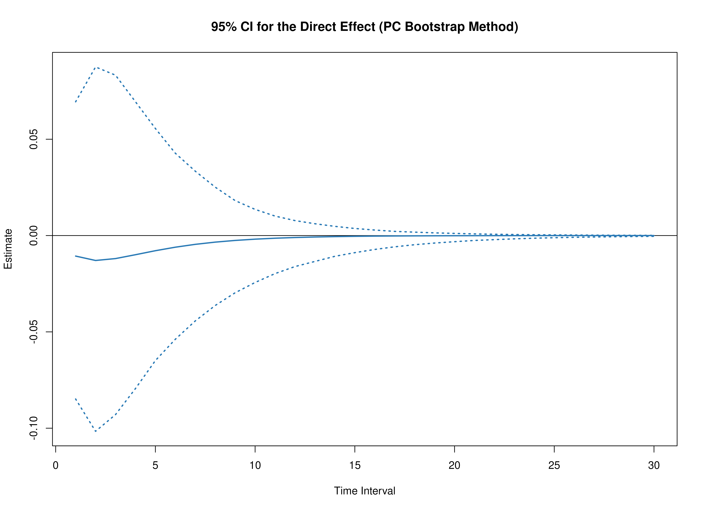

``` r
plot(pb, type = "bc")
```

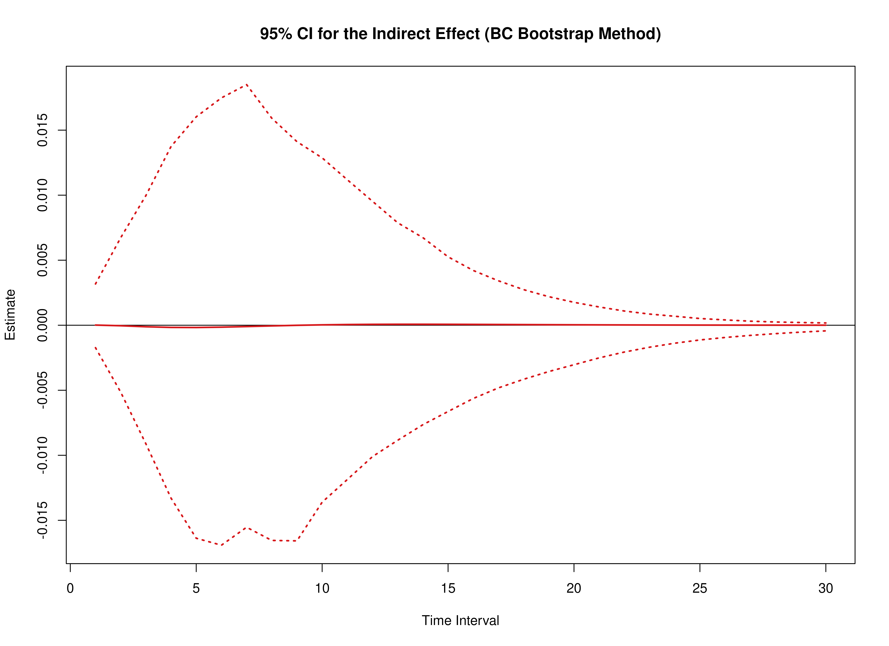

``` r
summary(pb)
#>      effect interval           est           se    R          2.5%        97.5%
#> 1     total        1 -1.064193e-02 0.0410195745 1000 -0.0877127323 6.295941e-02
#> 2    direct        1 -1.065335e-02 0.0407918478 1000 -0.0864062234 6.505093e-02
#> 3  indirect        1  1.142337e-05 0.0012668406 1000 -0.0037256823 1.348758e-03
#> 4     total        2 -1.297395e-02 0.0500643745 1000 -0.1089397785 8.032964e-02
#> 5    direct        2 -1.293489e-02 0.0492060929 1000 -0.1037131090 8.299229e-02
#> 6  indirect        2 -3.905984e-05 0.0034109932 1000 -0.0104038635 3.474976e-03
#> 7     total        3 -1.206546e-02 0.0468473148 1000 -0.1056173361 7.322246e-02
#> 8    direct        3 -1.194903e-02 0.0455230743 1000 -0.0971280916 7.825758e-02
#> 9  indirect        3 -1.164308e-04 0.0052680579 1000 -0.0163462919 6.379727e-03
#> 10    total        4 -1.011461e-02 0.0396004902 1000 -0.0916966596 5.973591e-02
#> 11   direct        4 -9.947643e-03 0.0382634906 1000 -0.0841326759 6.431461e-02
#> 12 indirect        4 -1.669635e-04 0.0065090662 1000 -0.0187114054 9.968047e-03
#> 13    total        5 -8.039534e-03 0.0317368254 1000 -0.0775101701 4.820578e-02
#> 14   direct        5 -7.865216e-03 0.0308114046 1000 -0.0702477439 5.273480e-02
#> 15 indirect        5 -1.743175e-04 0.0072411598 1000 -0.0179840415 1.354659e-02
#> 16    total        6 -6.189385e-03 0.0246033412 1000 -0.0590472519 3.808467e-02
#> 17   direct        6 -6.042436e-03 0.0243342617 1000 -0.0575643875 3.887808e-02
#> 18 indirect        6 -1.469486e-04 0.0076572762 1000 -0.0165733956 1.602860e-02
#> 19    total        7 -4.664497e-03 0.0186551160 1000 -0.0446487817 3.064439e-02
#> 20   direct        7 -4.563481e-03 0.0190814451 1000 -0.0466659460 2.994583e-02
#> 21 indirect        7 -1.010165e-04 0.0078680425 1000 -0.0146905449 1.849898e-02
#> 22    total        8 -3.461331e-03 0.0139581667 1000 -0.0327046024 2.517355e-02
#> 23   direct        8 -3.410442e-03 0.0149571774 1000 -0.0378647541 2.276851e-02
#> 24 indirect        8 -5.088905e-05 0.0078984298 1000 -0.0118574808 2.125802e-02
#> 25    total        9 -2.537880e-03 0.0104067097 1000 -0.0219166064 2.090020e-02
#> 26   direct        9 -2.531896e-03 0.0117652582 1000 -0.0309269483 1.761044e-02
#> 27 indirect        9 -5.983648e-06 0.0077423516 1000 -0.0092585843 2.190479e-02
#> 28    total       10 -1.842634e-03 0.0078198188 1000 -0.0160769657 1.782704e-02
#> 29   direct       10 -1.871723e-03 0.0093062170 1000 -0.0244835139 1.309025e-02
#> 30 indirect       10  2.908908e-05 0.0074030165 1000 -0.0076443113 2.100114e-02
#> 31    total       11 -1.326708e-03 0.0059884919 1000 -0.0109423127 1.542350e-02
#> 32   direct       11 -1.379912e-03 0.0074098891 1000 -0.0199286355 9.737982e-03
#> 33 indirect       11  5.320397e-05 0.0069048902 1000 -0.0063061308 1.983542e-02
#> 34    total       12 -9.482262e-04 0.0047055998 1000 -0.0075986789 1.343190e-02
#> 35   direct       12 -1.015529e-03 0.0059414039 1000 -0.0163224846 7.672073e-03
#> 36 indirect       12  6.730311e-05 0.0062889556 1000 -0.0049240606 1.877590e-02
#> 37    total       13 -6.732162e-04 0.0037913033 1000 -0.0053341511 1.139739e-02
#> 38   direct       13 -7.465057e-04 0.0047975210 1000 -0.0134386506 5.984159e-03
#> 39 indirect       13  7.328946e-05 0.0056031092 1000 -0.0039698820 1.712367e-02
#> 40    total       14 -4.750334e-04 0.0031109520 1000 -0.0038451341 1.005846e-02
#> 41   direct       14 -5.483367e-04 0.0039004646 1000 -0.0109728854 4.536475e-03
#> 42 indirect       14  7.330331e-05 0.0048936593 1000 -0.0032271211 1.507815e-02
#> 43    total       15 -3.332586e-04 0.0025780866 1000 -0.0027034403 8.618523e-03
#> 44   direct       15 -4.025764e-04 0.0031919799 1000 -0.0090120691 3.511794e-03
#> 45 indirect       15  6.931784e-05 0.0041997762 1000 -0.0025094997 1.310964e-02
#> 46    total       16 -2.325098e-04 0.0021442292 1000 -0.0017722012 7.362017e-03
#> 47   direct       16 -2.954676e-04 0.0026284323 1000 -0.0073364005 2.719042e-03
#> 48 indirect       16  6.295775e-05 0.0035508523 1000 -0.0019771115 1.133794e-02
#> 49    total       17 -1.613554e-04 0.0017844332 1000 -0.0013462245 6.353797e-03
#> 50   direct       17 -2.168104e-04 0.0021770304 1000 -0.0060141171 2.089431e-03
#> 51 indirect       17  5.545493e-05 0.0029660726 1000 -0.0015919695 9.161991e-03
#> 52    total       18 -1.113930e-04 0.0014855034 1000 -0.0010291525 5.426211e-03
#> 53   direct       18 -1.590708e-04 0.0018130038 1000 -0.0049307296 1.623511e-03
#> 54 indirect       18  4.767783e-05 0.0024553977 1000 -0.0012775412 7.491949e-03
#> 55    total       19 -7.650453e-05 0.0012388178 1000 -0.0007298075 4.273105e-03
#> 56   direct       19 -1.166976e-04 0.0015175272 1000 -0.0040505333 1.251880e-03
#> 57 indirect       19  4.019303e-05 0.0020212785 1000 -0.0010246612 6.320068e-03
#> 58    total       20 -5.227212e-05 0.0010369281 1000 -0.0005744862 3.587062e-03
#> 59   direct       20 -8.560664e-05 0.0012761993 1000 -0.0033174477 9.803617e-04
#> 60 indirect       20  3.333451e-05 0.0016606042 1000 -0.0008138484 5.252224e-03
#> 61    total       21 -3.552885e-05 0.0008725106 1000 -0.0004700552 3.019467e-03
#> 62   direct       21 -6.279662e-05 0.0010779296 1000 -0.0027226674 7.457919e-04
#> 63 indirect       21  2.726777e-05 0.0013665696 1000 -0.0006400391 4.025007e-03
#> 64    total       22 -2.401981e-05 0.0007384818 1000 -0.0003672731 2.541520e-03
#> 65   direct       22 -4.606320e-05 0.0009141207 1000 -0.0022672240 5.973463e-04
#> 66 indirect       22  2.204340e-05 0.0011302955 1000 -0.0005250586 3.325410e-03
#> 67    total       23 -1.614944e-05 0.0006284722 1000 -0.0002816781 2.139230e-03
#> 68   direct       23 -3.378818e-05 0.0007780645 1000 -0.0018500460 4.724196e-04
#> 69 indirect       23  1.763874e-05 0.0009421418 1000 -0.0004190588 2.763511e-03
#> 70    total       24 -1.079535e-05 0.0005372018 1000 -0.0002467445 1.823967e-03
#> 71   direct       24 -2.478396e-05 0.0006644942 1000 -0.0015085887 3.679392e-04
#> 72 indirect       24  1.398861e-05 0.0007927073 1000 -0.0003344989 2.373847e-03
#> 73    total       25 -7.172379e-06 0.0004605896 1000 -0.0002037391 1.513739e-03
#> 74   direct       25 -1.817915e-05 0.0005692488 1000 -0.0012298502 2.804784e-04
#> 75 indirect       25  1.100677e-05 0.0006735229 1000 -0.0002666115 2.007963e-03
#> 76    total       26 -4.734244e-06 0.0003956324 1000 -0.0001961264 1.293117e-03
#> 77   direct       26 -1.333442e-05 0.0004890215 1000 -0.0009993402 2.156098e-04
#> 78 indirect       26  8.600180e-06 0.0005774491 1000 -0.0002138253 1.695421e-03
#> 79    total       27 -3.102834e-06 0.0003401647 1000 -0.0001692027 1.110200e-03
#> 80   direct       27 -9.780785e-06 0.0004211688 1000 -0.0008176353 1.700837e-04
#> 81 indirect       27  6.677951e-06 0.0004988062 1000 -0.0001715150 1.414854e-03
#> 82    total       28 -2.017802e-06 0.0002926069 1000 -0.0001509371 9.526813e-04
#> 83   direct       28 -7.174180e-06 0.0003635653 1000 -0.0006700798 1.327853e-04
#> 84 indirect       28  5.156378e-06 0.0004332948 1000 -0.0001362331 1.167354e-03
#> 85    total       29 -1.300805e-06 0.0002517614 1000 -0.0001261040 8.175201e-04
#> 86   direct       29 -5.262236e-06 0.0003144926 1000 -0.0005485577 1.046578e-04
#> 87 indirect       29  3.961431e-06 0.0003777887 1000 -0.0001068439 9.844260e-04
#> 88    total       30 -8.303077e-07 0.0002166720 1000 -0.0001090813 6.986235e-04
#> 89   direct       30 -3.859828e-06 0.0002725537 1000 -0.0004492209 8.379375e-05
#> 90 indirect       30  3.029520e-06 0.0003300792 1000 -0.0000847791 8.559675e-04
summary(pb, type = "bc")
#>      effect interval           est           se    R          2.5%        97.5%
#> 1     total        1 -1.064193e-02 0.0410195745 1000 -0.0893415324 6.160858e-02
#> 2    direct        1 -1.065335e-02 0.0407918478 1000 -0.0878433513 6.282035e-02
#> 3  indirect        1  1.142337e-05 0.0012668406 1000 -0.0020954006 2.497065e-03
#> 4     total        2 -1.297395e-02 0.0500643745 1000 -0.1117167283 7.638767e-02
#> 5    direct        2 -1.293489e-02 0.0492060929 1000 -0.1054770659 8.111103e-02
#> 6  indirect        2 -3.905984e-05 0.0034109932 1000 -0.0045215690 7.058358e-03
#> 7     total        3 -1.206546e-02 0.0468473148 1000 -0.1073963170 7.053666e-02
#> 8    direct        3 -1.194903e-02 0.0455230743 1000 -0.0996664120 7.408289e-02
#> 9  indirect        3 -1.164308e-04 0.0052680579 1000 -0.0080111732 1.179187e-02
#> 10    total        4 -1.011461e-02 0.0396004902 1000 -0.0949667592 5.809085e-02
#> 11   direct        4 -9.947643e-03 0.0382634906 1000 -0.0865707826 6.082345e-02
#> 12 indirect        4 -1.669635e-04 0.0065090662 1000 -0.0121881084 1.429634e-02
#> 13    total        5 -8.039534e-03 0.0317368254 1000 -0.0787558784 4.583715e-02
#> 14   direct        5 -7.865216e-03 0.0308114046 1000 -0.0715031677 4.961082e-02
#> 15 indirect        5 -1.743175e-04 0.0072411598 1000 -0.0146414968 1.595201e-02
#> 16    total        6 -6.189385e-03 0.0246033412 1000 -0.0605029317 3.552962e-02
#> 17   direct        6 -6.042436e-03 0.0243342617 1000 -0.0584474636 3.662328e-02
#> 18 indirect        6 -1.469486e-04 0.0076572762 1000 -0.0153994100 1.636218e-02
#> 19    total        7 -4.664497e-03 0.0186551160 1000 -0.0478098842 2.817528e-02
#> 20   direct        7 -4.563481e-03 0.0190814451 1000 -0.0475915874 2.771798e-02
#> 21 indirect        7 -1.010165e-04 0.0078680425 1000 -0.0167121604 1.683421e-02
#> 22    total        8 -3.461331e-03 0.0139581667 1000 -0.0351342862 2.282554e-02
#> 23   direct        8 -3.410442e-03 0.0149571774 1000 -0.0392338152 2.014095e-02
#> 24 indirect        8 -5.088905e-05 0.0078984298 1000 -0.0162774172 1.665999e-02
#> 25    total        9 -2.537880e-03 0.0104067097 1000 -0.0251997379 1.784984e-02
#> 26   direct        9 -2.531896e-03 0.0117652582 1000 -0.0323684299 1.557068e-02
#> 27 indirect        9 -5.983648e-06 0.0077423516 1000 -0.0146677926 1.366164e-02
#> 28    total       10 -1.842634e-03 0.0078198188 1000 -0.0190769655 1.258502e-02
#> 29   direct       10 -1.871723e-03 0.0093062170 1000 -0.0266469239 1.203698e-02
#> 30 indirect       10  2.908908e-05 0.0074030165 1000 -0.0126510590 1.192388e-02
#> 31    total       11 -1.326708e-03 0.0059884919 1000 -0.0150868677 8.961506e-03
#> 32   direct       11 -1.379912e-03 0.0074098891 1000 -0.0220893655 8.854134e-03
#> 33 indirect       11  5.320397e-05 0.0069048902 1000 -0.0112428582 1.060693e-02
#> 34    total       12 -9.482262e-04 0.0047055998 1000 -0.0118320937 5.596235e-03
#> 35   direct       12 -1.015529e-03 0.0059414039 1000 -0.0180284273 6.593251e-03
#> 36 indirect       12  6.730311e-05 0.0062889556 1000 -0.0098066953 9.210722e-03
#> 37    total       13 -6.732162e-04 0.0037913033 1000 -0.0094887212 3.494286e-03
#> 38   direct       13 -7.465057e-04 0.0047975210 1000 -0.0146332264 4.755412e-03
#> 39 indirect       13  7.328946e-05 0.0056031092 1000 -0.0084176798 7.580324e-03
#> 40    total       14 -4.750334e-04 0.0031109520 1000 -0.0085039800 2.086860e-03
#> 41   direct       14 -5.483367e-04 0.0039004646 1000 -0.0121632728 3.589162e-03
#> 42 indirect       14  7.330331e-05 0.0048936593 1000 -0.0071068315 5.820819e-03
#> 43    total       15 -3.332586e-04 0.0025780866 1000 -0.0076878945 1.154446e-03
#> 44   direct       15 -4.025764e-04 0.0031919799 1000 -0.0099497358 2.641029e-03
#> 45 indirect       15  6.931784e-05 0.0041997762 1000 -0.0058342813 4.952487e-03
#> 46    total       16 -2.325098e-04 0.0021442292 1000 -0.0062083349 8.266346e-04
#> 47   direct       16 -2.954676e-04 0.0026284323 1000 -0.0081915615 2.009871e-03
#> 48 indirect       16  6.295775e-05 0.0035508523 1000 -0.0050901194 3.905862e-03
#> 49    total       17 -1.613554e-04 0.0017844332 1000 -0.0049451392 5.098419e-04
#> 50   direct       17 -2.168104e-04 0.0021770304 1000 -0.0066788800 1.603441e-03
#> 51 indirect       17  5.545493e-05 0.0029660726 1000 -0.0041603183 3.276759e-03
#> 52    total       18 -1.113930e-04 0.0014855034 1000 -0.0038657558 3.096389e-04
#> 53   direct       18 -1.590708e-04 0.0018130038 1000 -0.0054981821 1.245954e-03
#> 54 indirect       18  4.767783e-05 0.0024553977 1000 -0.0034160818 2.631215e-03
#> 55    total       19 -7.650453e-05 0.0012388178 1000 -0.0029869017 2.206767e-04
#> 56   direct       19 -1.166976e-04 0.0015175272 1000 -0.0045537568 9.441486e-04
#> 57 indirect       19  4.019303e-05 0.0020212785 1000 -0.0027898371 2.169299e-03
#> 58    total       20 -5.227212e-05 0.0010369281 1000 -0.0022855293 1.814895e-04
#> 59   direct       20 -8.560664e-05 0.0012761993 1000 -0.0038105207 7.260551e-04
#> 60 indirect       20  3.333451e-05 0.0016606042 1000 -0.0023450279 1.768734e-03
#> 61    total       21 -3.552885e-05 0.0008725106 1000 -0.0017973132 1.399616e-04
#> 62   direct       21 -6.279662e-05 0.0010779296 1000 -0.0031840554 5.202805e-04
#> 63 indirect       21  2.726777e-05 0.0013665696 1000 -0.0019792265 1.428349e-03
#> 64    total       22 -2.401981e-05 0.0007384818 1000 -0.0018112955 1.014106e-04
#> 65   direct       22 -4.606320e-05 0.0009141207 1000 -0.0027079506 3.890746e-04
#> 66 indirect       22  2.204340e-05 0.0011302955 1000 -0.0016929284 1.092934e-03
#> 67    total       23 -1.614944e-05 0.0006284722 1000 -0.0016041076 8.641714e-05
#> 68   direct       23 -3.378818e-05 0.0007780645 1000 -0.0022740689 2.599094e-04
#> 69 indirect       23  1.763874e-05 0.0009421418 1000 -0.0014306189 8.526830e-04
#> 70    total       24 -1.079535e-05 0.0005372018 1000 -0.0013200868 6.832852e-05
#> 71   direct       24 -2.478396e-05 0.0006644942 1000 -0.0018868272 2.181793e-04
#> 72 indirect       24  1.398861e-05 0.0007927073 1000 -0.0011636997 6.960383e-04
#> 73    total       25 -7.172379e-06 0.0004605896 1000 -0.0012169353 6.369257e-05
#> 74   direct       25 -1.817915e-05 0.0005692488 1000 -0.0015812641 1.603838e-04
#> 75 indirect       25  1.100677e-05 0.0006735229 1000 -0.0010055242 5.318118e-04
#> 76    total       26 -4.734244e-06 0.0003956324 1000 -0.0010794633 5.219761e-05
#> 77   direct       26 -1.333442e-05 0.0004890215 1000 -0.0013319962 1.174280e-04
#> 78 indirect       26  8.600180e-06 0.0005774491 1000 -0.0008190483 4.315865e-04
#> 79    total       27 -3.102834e-06 0.0003401647 1000 -0.0009123517 4.711795e-05
#> 80   direct       27 -9.780785e-06 0.0004211688 1000 -0.0011640481 8.096263e-05
#> 81 indirect       27  6.677951e-06 0.0004988062 1000 -0.0006883842 3.416911e-04
#> 82    total       28 -2.017802e-06 0.0002926069 1000 -0.0007157228 4.428141e-05
#> 83   direct       28 -7.174180e-06 0.0003635653 1000 -0.0009968319 6.062519e-05
#> 84 indirect       28  5.156378e-06 0.0004332948 1000 -0.0005869975 2.634637e-04
#> 85    total       29 -1.300805e-06 0.0002517614 1000 -0.0005375916 5.168156e-05
#> 86   direct       29 -5.262236e-06 0.0003144926 1000 -0.0008558151 4.529023e-05
#> 87 indirect       29  3.961431e-06 0.0003777887 1000 -0.0004905077 2.091673e-04
#> 88    total       30 -8.303077e-07 0.0002166720 1000 -0.0003994388 4.999946e-05
#> 89   direct       30 -3.859828e-06 0.0002725537 1000 -0.0007491148 3.183865e-05
#> 90 indirect       30  3.029520e-06 0.0003300792 1000 -0.0004054852 1.711869e-04
```
